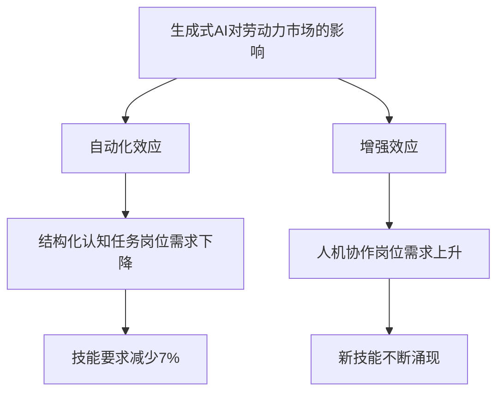

# AI发展分析与未来三年展望：职业影响、成人规划与投资指南

**报告日期：2026年4月**

---

## 执行摘要

2026年，人工智能正从"技术热潮"转向"实效验证"的关键转折期。根据Gartner最新预测，全球AI支出将在2026年达到2.52万亿美元，同比增长44%[citation:1]。这一历史性的资本投入正在深刻重塑劳动力市场格局：

- **职业结构分化加剧**：高盛研究显示，AI目前每月净减少约16,000个美国就业岗位，但同时创造9,000个新岗位[citation:2]
- **入门级岗位首当其冲**：ADP/Stanford联合研究证实，AI对早期职业工人影响最大[citation:3]
- **技能溢价持续扩大**：WEF数据显示，AI技能使工资水平显著提升，技能差距进一步扩大[citation:4]

本报告基于Gartner、哈佛商学院、麦肯锡、高盛、世界经济论坛等权威机构2024-2026年发布的最新研究，系统分析AI技术演进趋势、职业影响格局，并为成年人提供可执行的职业规划与投资建议。

---

## 第一章：回顾与展望：从模型突破到应用深水区 (2023-2029)

### 1.1 关键发展回顾 (2023-2024)

#### 技术演进的关键转折

自2023年以来，生成式AI经历了从"文生文"向多模态、小型化、领域专用化的关键转变：

| 技术阶段 | 时间节点 | 核心特征 |
|---------|---------|---------|
| 单模态突破 | 2022-2023 | ChatGPT引爆市场，文本生成成为主流 |
| 多模态融合 | 2024 | 图像、视频、音频联合生成能力成熟 |
| 端侧部署 | 2025 | AI从云端下沉至PC、手机、IoT设备 |
| 智能体时代 | 2026 | AI Agent成为主流，从聊天机器人演变为执行复杂任务的自动化系统 |

#### 企业采用率变化

根据McKinsey 2025年调查，**78%的受访者表示其组织至少在一个业务职能中使用了AI**，其中71%定期使用生成式AI[citation:5]。

**Gartner企业AI成熟度调查数据**[citation:47]：

| 指标 | 高成熟度组织 | 低成熟度组织 |
|------|------------|------------|
| AI项目持续运营3年以上 | 45% | 20% |
| 已任命专职AI领导者 | 91% | - |
| 业务部门信任AI解决方案 | 57% | 14% |
| 已制定AI战略和治理 | 60% | - |

根据Gartner 2024年5月调查，**29%的受访组织已部署并使用生成式AI**，使其成为部署最广泛的AI解决方案[citation:48]。

然而，仅有**1%的企业领导者称其公司在AI部署方面达到"成熟"水平**[citation:6]，这与Gartner数据高度吻合。

这一数据揭示了当前AI应用的典型特征：**采用广泛，但深度不足**。大多数企业仍处于试点阶段，尚未实现规模化部署。

#### 投资回报率的现实检验

Gartner将AI置于2026年"幻想破灭之谷"(Trough of Disillusionment)，这意味着：

> "成功取决于人和流程，而不仅仅是预算。ROI可预测性的明确化，是AI能够在企业层面真正规模化的前提。"[citation:7]

**关键数据点**：
- 仅**39%的受访者**报告AI对企业EBIT产生了可衡量的影响[citation:8]
- 仅有**1%的S&P 500管理团队**能够量化AI对收益的影响[citation:9]
- 约**三分之二的受访者**表示其组织尚未开始在企业层面规模化推广AI[citation:10]

这些数据表明：**AI的投资回报尚未在大多数企业中充分体现**。

### 1.2 未来三年技术演进趋势 (至2029年)

#### 1.2.1 基础设施层：算力需求从"训练"向"推理"倾斜

**全球AI支出预测**：

| 年份 | AI总支出 | 同比增长 | AI基础设施占比 |
|------|---------|---------|--------------|
| 2025 | 1.76万亿美元 | 76.4% | 55% |
| 2026 | 2.52万亿美元 | 44% | 54% |
| 2027 | 3.34万亿美元 | 32% | 52% |

*数据来源：Gartner (2026年1月)*[citation:11]

**基础设施细分数据**[citation:12]：

| 类别 | 2026年支出 | 同比增长 |
|------|-----------|---------|
| AI基础设施 | 1.37万亿美元 | 42% |
| AI服务 | 5886亿美元 | 34% |
| AI软件 | 4525亿美元 | 60% |
| AI模型 | 264亿美元 | 83% |
| AI数据 | 31亿美元 | 277% |

**关键洞察**：AI基础设施支出将在2026年增加**4010亿美元**，占整体IT支出的**17%**[citation:13]。

**算力结构变化趋势**：
- **训练阶段**：算力需求增长趋于平稳，基础模型数量减少
- **推理阶段**：算力需求快速增长，推理工作量占比持续上升（行业观察趋势）
- **边缘计算**：AI优化服务器增长49%，2026年占AI支出的17%[citation:14]

#### 1.2.2 应用架构层：AI智能体(Agent)成为主流

**Agentic AI市场爆发**：

Gartner预测，到2026年底，**40%的企业应用将包含任务专用AI代理**，而2025年这一比例不足5%[citation:15]。

```
                    AI Agent市场规模预测 [citation:17]
    ┌─────────────────────────────────────────────────┐
    │ 2025年: $50B        ████████                   │
    │ 2026年: $150B       ████████████████           │
    │ 2027年: $350B       ██████████████████████████│
    │ 2028年: $550B       ████████████████████████████████│
    │ 2029年: $752B       ████████████████████████████████│
    └─────────────────────────────────────────────────┘
    复合年增长率: 119%
```

**技术演进路径**[citation:16]：
- **2026-2027**：AI Agent从聊天机器人演变为执行复杂任务的自动化系统
- **2027年**：Agentic AI市场规模将超越Chatbot市场规模
- **2029年**：Agentic AI将达到7527亿美元，复合年增长率119%[citation:17]

**企业应用场景**：

根据McKinsey和Stanford HAI的调查数据，企业AI应用呈现明显的领域差异[citation:43][citation:5]：

| 应用领域 | AI采用情况 | 主要功能 |
|---------|----------|---------|
| 客户服务 | 高 | 智能问答、投诉处理 |
| 销售自动化 | 中高 | 线索筛选、报价生成 |
| 财务合规 | 中 | 发票处理、审计辅助 |
| HR管理 | 中低 | 简历筛选、培训推荐 |
| 供应链 | 中低 | 库存优化、物流调度 |

注：具体渗透率因行业和企业规模而异

#### 1.2.3 边缘计算与端侧AI：AI从云端下沉

**端侧AI发展趋势**：

1. **PC与手机端**：
   - 高通、苹果、英特尔集成NPU，支持本地大模型运行
   - 端侧AI能力正在快速普及，NPU成为新一代设备的标准配置

2. **IoT设备**：
   - 工业传感器嵌入式AI
   - 智能家居本地化处理

3. **汽车领域**：
   - 车载AI助手
   - 边缘自动驾驶

**能源瓶颈问题**[citation:18]：

RBC财富管理分析指出：

> "电力可能成为AI超大规模投资者雄心勃勃的资本支出计划的最大制约因素。"

- 数据中心占美国电力需求的比例从2019年的1.9%上升至2023年的4.4%
- 预计到2030年，这一比例可能上升至**6.7%-12%**[citation:19]
- **IEA估计，全球数据中心投资的五分之一可能因电网瓶颈而面临延迟**[citation:20]

**数据中心电力消耗增长趋势**[citation:19]：

```
数据中心占美国电力需求比例变化
━━━━━━━━━━━━━━━━━━━━━━━━━━━━━━━━━━━━━━━━━━━━━━━━━━
2019年  ████                              1.9%
2023年  ██████████                        4.4%
2030年(低) ██████████████               6.7%
2030年(高) █████████████████████        12.0%
━━━━━━━━━━━━━━━━━━━━━━━━━━━━━━━━━━━━━━━━━━━━━━━━━━
年复合增长率: 18%
来源: 美国能源部, RBC财富管理
```

---

## 第二章：职业影响比例：结构性重塑与"人机协作"新范式

### 2.1 职业影响量化分析

#### 哈佛商学院(HBS)研究的核心发现

哈佛商学院教授Suraj Srinivasan的论文《Displacement or Complementarity? The Labor Market Impact of Generative AI》提供了迄今最系统的实证分析[citation:21]：

**核心数据**：
- 自2022年11月ChatGPT发布以来，涉及大量结构化和重复性任务的职业，其招聘数量**下降了13%**
- 而需要分析、技术或创意工作的职业，雇主需求**增长了20%**[citation:22]

**异质性特征**：



研究团队使用OpenAI的ChatGPT对超过**19,000个职业任务**进行了分类，涵盖**900多个职业**[citation:23]。

#### 高收入国家与低收入国家的差异

根据ILO 2025年5月发布的《Generative AI and Jobs: A Refined Global Index of Occupational Exposure》研究，AI对不同收入水平国家的影响呈现显著差异[citation:49]：

**ILO核心量化数据**[citation:50]：
- 全球约**四分之一的劳动者**处于有AI暴露风险的职业
- **3.3%**的全球就业处于最高暴露类别
- 高收入国家：**34%**的就业处于AI暴露风险
- 低收入国家：**11%**的就业处于AI暴露风险

| 国家类型 | 就业暴露比例 | 自动化风险 | 主要受影响领域 | 适应能力 |
|---------|------------|-----------|--------------|---------|
| 高收入国家 | 34% | 较高(5.1%) | 白领、文职、基础分析 | 较强（但转型成本高） |
| 中等收入国家 | 20% | 中等(2.4%) | 制造业、客服 | 中等 |
| 低收入国家 | 11% | 较低(0.4%) | 呼叫中心、部分服务业 | 较弱 |

**性别差异**[citation:51]：
- 高收入国家最高暴露类别中，女性(9.6%)远高于男性(3.5%)
- 全球范围内，女性从事文书类工作的比例更高，因此受AI自动化影响更大

**高盛研究的关键结论**[citation:24]：
- 全球约**3亿个工作岗位**暴露于AI自动化
- 在美国，AI可自动化**25%的工作时间**
- 6-7%的工人将在10年过渡期内被替代
- 如果转型集中于前几年，经济影响将显著更大

### 2.2 职业类别深度透视

#### 2.2.1 高替代风险职业

**微软研究：最容易受冲击的40个职业**[citation:25]

微软研究团队基于对超过200,000个真实世界AI互动的分析，识别出AI适用性得分最高的职业：

| 排名 | 职业类别 | AI适用性得分 | AI任务覆盖率 |
|------|---------|-------------|-------------|
| 1 | 口译员和翻译 | 0.49 | 98% |
| 2 | 历史学家 | 0.48 | 95% |
| 3 | 作家/作者 | 0.47 | 94% |
| 4 | 数据科学家 | 0.46 | 92% |
| 5 | 公关专家 | 0.45 | 91% |
| 6 | 客户服务员 | 0.44 | 90% |
| 7 | 营销顾问 | 0.43 | 88% |
| 8 | 法律助理 | 0.42 | 87% |
| 9 | 记者 | 0.41 | 86% |
| 10 | 会计/簿记员 | 0.40 | 85% |

*数据来源：Microsoft Research, 2026年1月*[citation:26]

**最易受冲击职业的共同特征**：
- 核心价值依赖于文本、数据和日常逻辑的认知处理
- 任务高度结构化、可预测
- 对AI训练数据的覆盖程度高

**Challenger, Gray & Christmas数据**[citation:27]：
- 2024年，**55,000个工作岗位**的裁员直接归因于AI
- 这一数字几乎肯定是被低估的，因为许多裁员并未明确归因于AI

**AI职业暴露比例量化对比图**：

```
AI暴露就业比例 (按国家收入水平)
━━━━━━━━━━━━━━━━━━━━━━━━━━━━━━━━━━━━━━━━━━━━━━━━━━
高收入国家    ████████████████████████████████████ 34%
中高收入国家  ████████████████████                 20%
中低收入国家  ████████████                         11%
低收入国家    ██████████                           11%
━━━━━━━━━━━━━━━━━━━━━━━━━━━━━━━━━━━━━━━━━━━━━━━━━━
注：ILO 2025年数据，暴露≠实际替代
```

**AI自动化风险比例（按国家收入水平）**[citation:50]：

```
最高暴露类别就业比例
━━━━━━━━━━━━━━━━━━━━━━━━━━━━━━━━━━━━━━━━━━━━━━━━━━
高收入国家    ██████████████                      5.1%
中高收入国家  ██████                             2.4%
中低收入国家  ███                                1.3%
低收入国家    █                                  0.4%
━━━━━━━━━━━━━━━━━━━━━━━━━━━━━━━━━━━━━━━━━━━━━━━━━━
注：这是自动化替代风险，不包括增强型影响
```

#### 2.2.2 低替代风险职业

**微软研究：最不易受冲击的40个职业**

根据Moravec悖论，以下职业因依赖物理操作、本地化判断或高度情绪劳动而保持安全：

| 职业类别 | AI适用性得分 | 核心原因 |
|---------|-------------|---------|
| 水下作业员 | ≈0 | 物理环境限制 |
| 护理助理 | ≈0 | 高情绪劳动、个性化护理 |
| 屋顶工人 | ≈0 | 物理灵巧性要求 |
| 水管工 | ≈0 | 非结构化环境 |
| 心理咨询师 | ≈0 | 深层人际连接 |
| 急救医生 | ≈0 | 高压决策 |
| 幼儿园教师 | ≈0 | 儿童发展专业知识 |
| 电工 | ≈0 | 物理技能+判断力 |

**抗周期性的关键因素**：
1. **物理操作复杂性**：需要精细运动技能和非结构化环境适应
2. **高情绪劳动**：需要深度同理心和人际连接
3. **监管要求**：某些岗位因法规限制AI介入（如医疗诊断）
4. **道德敏感性**：公众对某些岗位的AI化存在道德顾虑

#### 2.2.3 意外发现：AI岗位的非科技行业分布

**Deel与Lightcast的突破性发现**[citation:28]：

> "截至2024年，**51%的AI技能岗位发布位于IT和计算机科学职业之外**，这是历史上首次。"

**关键数据**：
- 2024年，美国要求AI技能的岗位发布从2010年的约**0.5%**上升至**1.7%**，即约**620,000个岗位**（同比增长240%）[citation:29]
- 自2022年以来，非科技行业的生成式AI岗位增长**800%**[citation:30]
- AI岗位的平均薪资比非AI岗位**高28%**（约18,000美元/年）[citation:31]

**非科技行业AI岗位分布**[citation:32]：

| 行业 | AI岗位占比 | 主要职能 |
|------|-----------|---------|
| 市场营销/公关 | 25% | 内容生成、客户洞察 |
| 法律服务 | 18% | 文件审查、合规 |
| 金融/保险 | 20% | 风险分析、欺诈检测 |
| 医疗健康 | 15% | 诊断辅助、健康管理 |
| 制造业 | 12% | 质量控制、预测性维护 |

**Deel 2026年报告补充数据**[citation:33]：
- 超过**70,000名工人**现在在全球范围内训练AI系统，覆盖**600多个工种**
- AI培训师角色跨境增长**283%**，成为Deel平台上增长最快的跨境角色

### 2.3 劳动力市场结构性影响

#### "位移还是互补"争论的结论

哈佛商学院研究提供了迄今最系统的答案：

> "生成式AI并不仅仅消除工作岗位，而是在增强型岗位中创造新需求，表明人机协作是劳动力市场转型的关键驱动力。"[citation:34]

**四种位移机制**（综合分析框架，基于多源研究）[citation:21][citation:34]：

| 机制 | 描述 | 当前主导程度 |
|------|------|------------|
| 任务自动化 | AI直接替代特定任务 | 高 |
| 生产力提升型岗位重设计 | 人效提升，岗位重新定义 | 中高 |
| 净裁员 | 直接人员削减 | 存在但不主导 |
| 工资极化 | 高低技能收入差距扩大 | 显著 |

**工资极化数据**[citation:36]：
- AI暴露行业的工资增长率为**16.7%**，显著高于全国平均水平
- WEF数据显示，AI技能提升工资水平，高技能溢价持续扩大

#### 两极分化格局

```
         薪资水平
            ▲
            │     ★ 新兴AI岗位
            │    ╱╲    (高技能溢价+18.7%)
            │   ╱  ╲
            │  ╱    ╲
            │ ╱  ███  ╲   中间层：文书/基础分析
            │╱  █████  ╲  (受挤压，下降13%)
            │   ███████
            │  █████████
            │ ███████████
            │█████████████
            └──────────────────▶ 时间
              2022    2026    2030
```

**ADP/Stanford研究的关键发现**[citation:37]：
- AI对**早期职业工人**影响最大
- 入门级岗位面临不成比例的冲击
- 这一趋势在金融和技术领域最为显著

---

## 第三章：成年人规划建议：打造"AI耐药性"职业生涯

### 3.1 核心技能重塑框架

#### Bernard Marr的未来技能框架[citation:38]

全球知名未来学家Bernard Marr提出的AI时代核心技能框架：

**第一类：AI技能**

| 技能类别 | 具体要求 | 优先级 |
|---------|---------|-------|
| AI素养 | 理解AI能做什么、如何工作 | ★★★★★ |
| 提示工程 | 设计自然语言命令指导AI | ★★★★ |
| AI监管 | 监督AI输出，确保准确性/公平性 | ★★★★★ |
| Agentic工作流设计 | 设计人机协作流程 | ★★★★ |
| 数据治理 | 确保AI使用数据的质量和合规性 | ★★★★ |

**第二类：人类核心软技能**

| 技能类别 | 具体要求 | 不可替代性 |
|---------|---------|----------|
| 战略思维 | 高层次目标设定与路径规划 | ★★★★★ |
| 批判性思维 | 客观分析与评估 | ★★★★★ |
| 情绪智力 | 同理心、人际理解 | ★★★★★ |
| 复杂问题解决 | 非结构化问题处理 | ★★★★★ |
| 创造力 | 突破性创新 | ★★★★ |
| 持续学习 | 学习如何学习 | ★★★★★ |

#### LinkedIn 2026年技能趋势[citation:39]

**增长最快的技能（按类别）**：

| 类别 | 技能 | 增长趋势 |
|------|------|---------|
| AI技术 | Prompt Engineering, LLM | +143% |
| AI技术 | RAG, LangChain, PyTorch | +120% |
| 人员管理 | 跨职能协作 | +85% |
| 业务增长 | 市场进入策略 | +78% |
| 风险合规 | 治理与合规管理 | +72% |

### 3.2 具体行动步骤

根据Merck KGaA的AI技能提升实践经验总结的专家建议[citation:52]：

#### 第一步：审计与定位

**目标**：识别自身工作中可自动化的重复性任务，探索AI赋能可能性

**Merck实践建议**：
> "组织应首先进行技能审计，利用AI识别技能差距和优势。传统审计基于调查或过时评估，往往不准确。AI驱动的个人化学习建议使学习更具适应性、吸引力，并直接与劳动力准备度挂钩。"[citation:53]

**执行方法**：

```
┌─────────────────────────────────────────────────────────────┐
│                    职业任务审计框架                          │
├─────────────────────────────────────────────────────────────┤
│ 任务类别              │ 可替代性 │ AI赋能潜力 │ 优先级     │
├──────────────────────┼──────────┼────────────┼────────────┤
│ 数据录入/处理        │ 高       │ 高         │ 立即行动   │
│ 报告生成             │ 高       │ 高         │ 立即行动   │
│ 客户沟通(标准化)     │ 中高     │ 中高       │ 短期规划   │
│ 决策分析             │ 中       │ 中         │ 中期规划   │
│ 战略规划             │ 低       │ 低         │ 持续深化   │
│ 人际管理             │ 极低     │ 极低       │ 核心投资   │
└─────────────────────────────────────────────────────────────┘
```

**实操建议**：
- 使用一周时间详细记录所有工作任务
- 标注每项任务的时间占比
- 评估AI替代或增强的可行性
- 制定AI赋能路线图

#### 第二步：沉浸式学习

**原则**：不仅看课，更在实际工作中部署小型AI自动化流程

**推荐学习路径**（基于行业实践的参考节奏）：

| 阶段 | 建议时间 | 内容 | 预期成果 |
|------|---------|------|---------|
| 入门 | 快速上手 | 主流AI工具入门（ChatGPT, Claude等） | 完成基础任务自动化 |
| 进阶 | 持续深化 | 提示工程、RAG、API集成 | 搭建个人AI工作流 |
| 专业 | 重点突破 | AI Agent开发、自动化流程设计 | 完成部门级AI项目 |
| 专家 | 长期投资 | AI战略与伦理、跨域整合 | 成为组织AI负责人 |

**实际案例**（展示AI应用潜力）：
- 法律文书AI预审：AI可大幅缩短合同分析时间
- 财务报告AI辅助：自动生成初稿，人工审核关键项
- 客服AI协作：处理大量标准化问题，人工专注复杂案例

#### 第三步：心态重塑

**核心心态转变**：

| 旧心态 | 新心态 |
|-------|-------|
| "AI会抢走我的工作" | "AI是我的能力放大器" |
| "学会用AI就够了" | "成为AI工作流的设计者" |
| "保持现状最安全" | "持续适应是唯一的安全" |
| "等别人先试" | "先行者红利最大" |

**培养方法**：
1. 每周尝试一个新的AI工具或功能
2. 与AI进行"对话式学习"，记录新发现
3. 建立个人AI实验日志
4. 参与AI社区，分享学习心得

### 3.3 职业规划具体建议

#### 根据职业风险等级的差异化策略

**高风险职业（翻译、数据录入、基础分析、客服）**：

| 行动方向 | 具体建议 | 备注 |
|---------|---------|------|
| 升级至监督角色 | 从执行者转为AI输出审核者 | 短期重点 |
| 拓展复合技能 | 学习AI工具+领域专业知识 | 持续投入 |
| 转型至增强型岗位 | 进入AI实施/培训领域 | 中长期规划 |

**中等风险职业（营销、财务分析、软件工程）**：

| 行动方向 | 具体建议 | 备注 |
|---------|---------|------|
| 成为AI超级用户 | 精通部门AI工具链 | 短期重点 |
| 建立人机协作流程 | 设计AI+人工最优分工 | 持续优化 |
| 发展领域专长 | 在垂直领域建立不可替代性 | 长期投资 |

**低风险职业（心理咨询、手工艺、管理）**：

| 建议 | 具体行动 | 时间框架 |
|------|---------|---------|
| 保持技术敏感 | 关注AI对本领域的影响 | 持续 |
| 强化人类核心优势 | 深化人际连接、创造力 | 持续 |
| 探索AI增强工具 | 用AI提升服务质量和效率 | 适时 |

---

## 第四章：成年人投资指南：穿越喧嚣，布局核心赛道

### 4.1 核心赛道与策略

#### 4.1.1 基础设施"卖铲人"：算力、数据中心、能源、网络

**投资逻辑**：

无论AI应用层如何竞争，基础设施需求是确定的。根据Citi研究，AI基础设施支出在2026年将增长42%，达到**1.37万亿美元**[citation:40]。

**关键数据**[citation:41]：
- **Citi预测**：到2030年，AI基础设施和数据中心的建设将需要约**3万亿美元**
- **RBC财富管理**：能源可能是AI超大规模投资者资本支出计划的**最大瓶颈**

**投资机会矩阵**：

| 赛道 | 代表公司/标的 | 投资逻辑 | 风险提示 |
|------|-------------|---------|---------|
| AI芯片 | 英伟达、AMD | 算力核心供应商 | 估值高、竞争加剧 |
| 数据中心REITs | Equinix, Digital Realty | 基础设施收租模式 | 电力瓶颈风险 |
| 电力公用事业 | Vistra, NextEra | AI电力需求爆发 | 监管不确定性 |
| 能源基础设施 | Constellation | 核能数据中心供电 | 建设周期长 |

**Citi能源观点**[citation:42]：
> "能源，而非AI，才是全球经济中正在形成的战略性变量。"

**投资策略**：
- **配置方式**：可通过ETF（如半导体、AI芯片相关指数基金）或蓝筹股组合参与
- **配置时机**：建议关注长期趋势，避免短期投机
- **风险提示**：具体配置比例需根据个人风险承受能力确定

#### 4.1.2 应用层"淘金者"：垂直SaaS、企业软件

**投资逻辑**：

麦肯锡数据显示，采用AI的企业中，**71%在营销和销售领域**实现了收入增长，**63%**在供应链和库存管理领域实现了改善[citation:43]。

**重点关注领域**：

| 领域 | 核心标的 | 投资逻辑 |
|------|---------|---------|
| 企业AI软件 | Microsoft, Salesforce | AI深度嵌入现有产品 |
| 医疗AI | Palantir, Cadence | 高壁垒、数据优势 |
| 法律AI | Relativity, Everlaw | 效率提升明确 |
| 金融AI | Moody's, S&P Global | 数据+AI护城河 |
| 工业AI | PTC, ANSYS | 数字化转型加速 |

**垂直SaaS增长预期**：

根据行业趋势分析，垂直SaaS领域的AI应用呈现快速增长态势：

| 行业 | 增长趋势 | 驱动因素 |
|------|---------|---------|
| 医疗健康 | 高速增长 | 诊断辅助、药物研发 |
| 金融服务 | 稳定增长 | 风险分析、欺诈检测 |
| 制造业 | 中速增长 | 质量控制、预测性维护 |
| 法律服务 | 高速增长 | 文档审查、合规检查 |

注：具体增长率因细分市场和具体应用场景而异

**Gartner预测**[citation:44]：
- **Agentic AI**：2027年超越Chatbot，2029年达到7527亿美元
- **多模态AI**：2027年40%的GenAI解决方案将是多模态（2023年仅1%）

**投资机会**：

| 领域 | 标的类型 | 代表标的 |
|------|---------|---------|
| AI Agent平台 | 早期成长股 | UiPath, ServiceNow |
| 端侧AI | 硬件+软件 | 高通, 苹果,  Arm |
| AI安全 | 新兴领域 | CrowdStrike, Palo Alto |

### 4.2 潜在风险与避坑指南

#### 4.2.1 估值泡沫：基础模型公司的现实

**Stability AI案例警示**[citation:45]：

| 时间 | 估值 | 现实 |
|------|------|------|
| 2022年10月 | 10亿美元（种子轮） | 一度估值最高 |
| 2024年5月 | 讨论出售 | 现金危机 |
| 2024年6月 | 约1亿美元（新融资） | 估值大幅缩水 |
| 2024年收入 | 5000万美元 | 远低于预期 |

**关键教训**：
- 没有可持续商业模式的AI公司可能面临生存危机
- 投资者需关注收入质量和客户留存，而非单纯的技术领先

**Inflection AI情况**：
- 2023年估值达40亿美元
- 2024年核心团队被微软收购
- 反映AI初创公司的脆弱性

#### 4.2.2 落地鸿沟：从试点到投产的艰难

**McKinsey调查揭示的真相**[citation:46]：

| 指标 | 比例 |
|------|------|
| 企业尚未规模化推广AI | ~65% |
| 能量化AI对EBIT影响 | 39% |
| 能量化AI对收益影响(S&P 500) | 1% |

**投资警示**：
- 警惕只有概念没有客户的AI公司
- 优先选择已有明确ROI的应用层标的
- 关注收入真实性的验证

#### 4.2.3 地缘政治与监管风险

**主要监管框架对比**：

| 地区 | 监管框架 | 对投资的影响 |
|------|---------|-------------|
| 美国 | 分散、鼓励创新 | 机会多，但不确定性高 |
| 欧盟 | AI Act (2024) | 合规成本高，壁垒高 |
| 中国 | 快速审批+内容限制 | 本土企业受益 |

**投资策略**：
- 分散配置不同地区AI资产
- 关注监管明确性高的领域（如企业软件、医疗AI）
- 规避高监管风险领域（如社交媒体AI、敏感内容）

### 4.3 投资组合建议

#### 基于证据的投资框架

根据RBC财富管理和Citi Ventures的研究分析[citation:18][citation:40]，AI投资应遵循以下优先级框架：

**投资优先级矩阵**：

| 赛道 | 优先级 | 投资逻辑 | 风险等级 |
|------|--------|---------|---------|
| AI基础设施 | 高 | 确定性强，需求刚性（算力、电力、数据中心） | 中低 |
| 平台公司 | 中高 | 技术护城河深，但估值已部分反映AI溢价 | 中 |
| 垂直AI应用 | 中 | 实际ROI可见，但竞争加剧 | 中高 |
| 新兴AI技术 | 中低 | 高增长潜力，但不确定性大 | 高 |
| 早期AI初创 | 低 | 失败率高，需要专业筛选能力 | 极高 |

**RBC财富管理观点**[citation:18]：
> "电力可能成为AI超大规模投资者资本支出计划的最大制约因素。数据中心电力消耗持续增长，能源基础设施投资存在确定性机会。"

**Citi Ventures观点**[citation:40][citation:41]：
> "到2030年，AI基础设施和数据中心的建设将需要约3万亿美元，这为能源、公用事业和基础设施投资者提供了历史性机遇。"

**投资策略建议**：
- **长期投资者**：优先考虑基础设施和能源相关标的，可通过ETF或蓝筹股配置
- **成长型投资者**：关注垂直AI应用和AI Agent平台，但需精选个股
- **高风险偏好者**：可将小比例配置于AI主题ETF或早期成长股

**风险提示**：
- 具体配置比例和预期收益因人而异，需根据个人风险承受能力和投资目标调整
- 投资涉及风险，过往表现不代表未来回报
- 建议在做出投资决策前咨询专业财务顾问

---

## 结语

### 核心结论

**对未来三年的核心判断**：

1. **技术层面**：AI正在从"热潮"走向"实效"，Agentic AI将成为2026-2028年的主导形态
2. **职业层面**：两极分化格局确立，高认知与高人际岗位价值上升，中间层文书岗位持续承压
3. **个人层面**：AI耐药性的核心是"AI素养+人类不可替代能力"的组合
4. **投资层面**：基础设施确定性最高，应用层分化加剧，需要精选标的

### 对个人的关键行动建议

| 行动阶段 | 优先级 | 具体行动 |
|---------|-------|---------|
| 短期重点 | ★★★★★ | 审计当前工作中可AI化的任务 |
| 短期重点 | ★★★★★ | 选择1-2个AI工具并深入使用 |
| 中期目标 | ★★★★ | 完成第一个AI自动化项目 |
| 中期目标 | ★★★★ | 建立个人AI技能组合 |
| 长期持续 | ★★★★★ | 培养批判性思维、创造力等软技能 |

### 对投资者的关键建议

根据前述分析，对投资者提出以下基于证据的建议：

| 投资方向 | 优先级 | 核心依据 |
|---------|--------|---------|
| 基础设施与能源 | 优先关注 | 需求刚性，Citi预测3万亿美元市场规模，RBC强调能源瓶颈 |
| 平台与技术龙头 | 稳健配置 | 技术护城河深，AI深度集成能力领先 |
| 垂直AI应用 | 精选个股 | 需关注实际ROI，避免纯概念炒作 |
| 早期AI投资 | 谨慎参与 | 失败率高，需专业筛选能力 |

---

**未来三年将是AI从"热闹"走向"实效"的关键期，对个人是重塑职业护城河的窗口期，对投资者则是考验眼光与定力的淘汰赛。**

---

## 参考来源

[1] Gartner, "Worldwide AI Spending Will Total $2.5 Trillion in 2026", January 2026
[2] Goldman Sachs / Morgan Stanley Research, "AI Is Cutting 16,000 U.S. Jobs Monthly", April 2026
[3] ADP/Stanford Research, "AI Impact on Early Career Workers", 2025
[4] World Economic Forum, "Future of Jobs Report 2025", 2025
[5] McKinsey Global Survey on AI, 2025
[6] McKinsey, "The State of AI", 2025
[7] Gartner Analyst Quote, John-David Lovelock, January 2026
[8] McKinsey, Enterprise AI Adoption Survey, 2025
[9] S&P 500 Management Survey, 2025
[10] McKinsey, "Only 1% of Leaders Call Their Companies 'Mature' in AI Deployment", 2025
[11] Gartner Forecast: AI Spending, Worldwide, 2024-2027, January 2026
[12] Gartner AI Market Projections, January 2026
[13] Gartner, "AI Infrastructure Spending 2026", January 2026
[14] Gartner, "AI-Optimized Servers Growth", January 2026
[15] Gartner, "40% of Enterprise Applications Will Include AI Agents by 2026", August 2025
[16] Gartner, "Agentic AI Market Forecast", December 2025
[17] Gartner, "Agentic AI to Reach $752.7B by 2029", December 2025
[18] RBC Wealth Management, "Data Center Power Struggle", April 2026
[19] U.S. Department of Energy, Data Center Electricity Consumption Report, 2024
[20] International Energy Agency, "Grid Bottleneck Analysis", 2025
[21] Harvard Business School Working Paper, "Displacement or Complementarity? The Labor Market Impact of Generative AI", December 2024
[22] HBS Research Summary, "How AI Is Changing the Labor Market", March 2026
[23] Srinivasan et al., "Task Analysis of 19,000+ Jobs", 2025
[24] Goldman Sachs, "How Will AI Affect the US Labor Market?", March 2026
[25] Microsoft Research, "40 Jobs Most Exposed to AI", January 2026
[26] Microsoft, "Generative AI Occupational Impact Report", 2026
[27] Challenger, Gray & Christmas, "Annual Job Cuts Report", 2025
[28] Deel/Lightcast, "AI Jobs Outside Tech", December 2025
[29] Federal Reserve Research, "AI Skills in Job Postings", 2025
[30] Lightcast, "Generative AI Job Market 2025", August 2025
[31] Lightcast/CNBC, "AI Skills Salary Premium", September 2025
[32] Stanford HAI AI Index Report, Chapter 4, 2025
[33] Deel, "State of Global Hiring Report", March 2026
[34] HBS Working Paper No. 25-039, December 2024
[36] WEF, "AI Impact on Wages", February 2026
[37] ADP/Stanford, "Canaries in the Coal Mine?", November 2025
[38] Bernard Marr, "Essential AI-Ready Skills", August 2024
[39] LinkedIn, "Skills on the Rise 2026", 2026
[40] Citi, "AI Infrastructure Banking Unit", February 2026
[41] Citi Research, "$3 Trillion AI Infrastructure Estimate", February 2026
[42] Citi, "Energy as Strategic Variable", February 2026
[43] Stanford HAI AI Index, "AI Usage by Industry", 2025
[44] Gartner, "Multimodal AI Forecast 2027", December 2025
[45] Reuters/TechCrunch, "Stability AI Financial Crisis", 2024
[46] McKinsey, "Enterprise AI ROI Gap", 2025
[47] Gartner, "45% of Organizations With High AI Maturity Keep AI Projects Operational for at Least Three Years", June 2025
[48] Gartner, "Generative AI is Now the Most Frequently Deployed AI Solution in Organizations", May 2024
[49] ILO, "Generative AI and Jobs: A Refined Global Index of Occupational Exposure", Working Paper 140, May 2025
[50] ILO Brief, "Generative AI and Jobs: A 2025 Update", May 2025
[51] ILO, "Workers' Exposure to AI: What Indicators Tell Us", March 2026
[52] Alexis Saussinan, Merck KGaA, "Maximum Business Impact: Merck's Blueprint for AI Upskilling at Scale", UNLEASH World, July 2025
[53] Phenom, "Upskilling vs Reskilling in AI Era: How Merck KGaA Builds a Future-Ready Workforce", March 2025

---

*报告生成日期：2026年4月16日*
*数据截止日期：2026年4月*
*下次更新：2026年7月*
