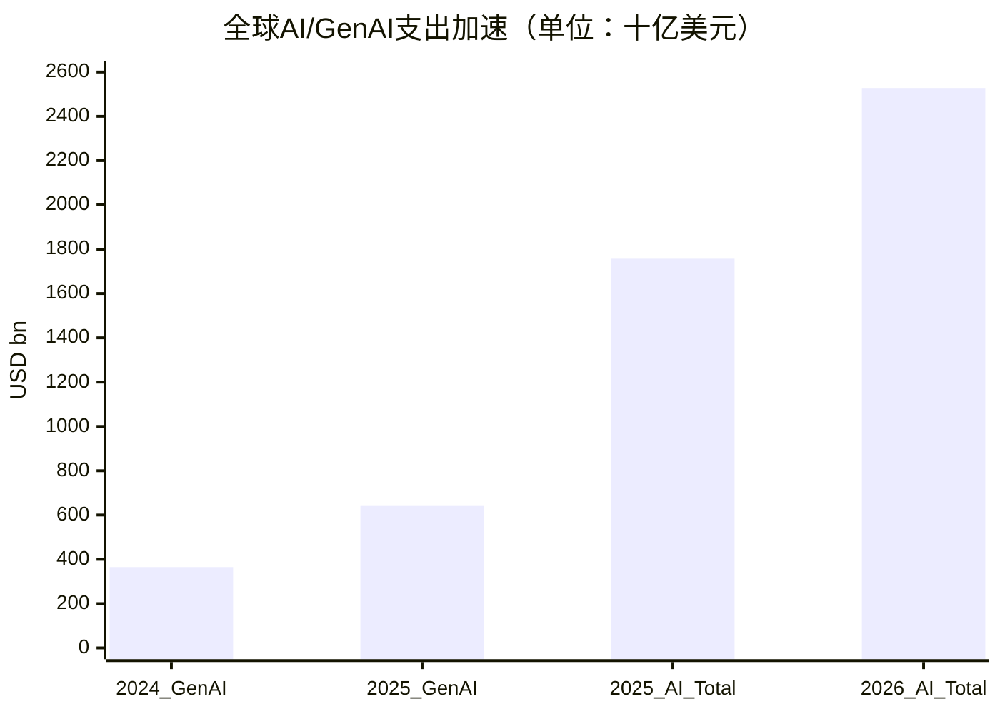
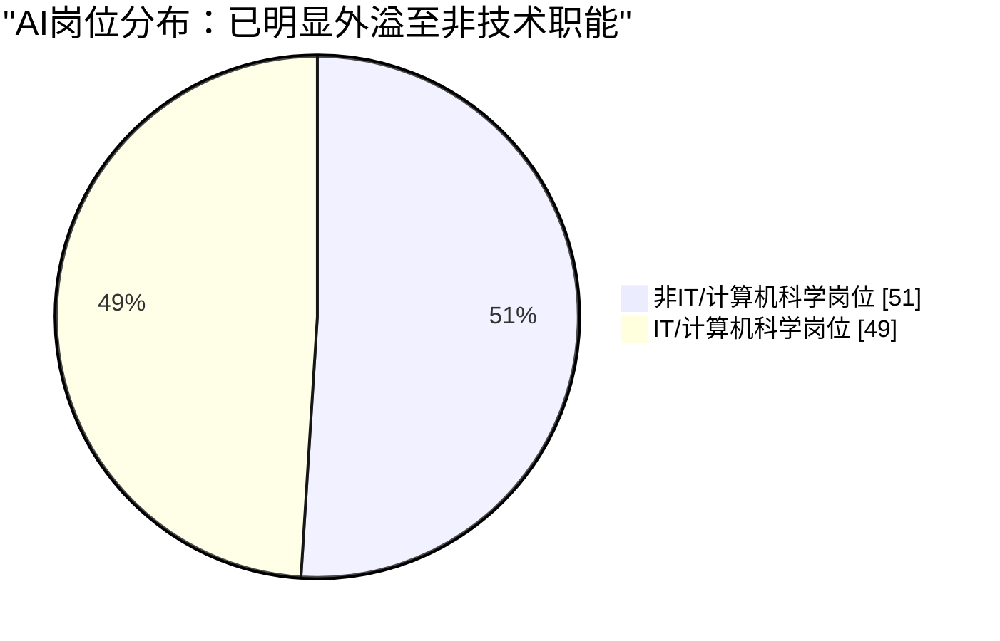

# AI发展分析与未来三年展望：职业影响、成人规划与投资指南

**报告日期：2026年4月**

---

## 执行摘要

2023-2025年是生成式AI从“能力惊艳”走向“成本、流程与组织约束”并存的阶段。企业并未停止投入，反而在硬件、数据中心、软件与服务上继续加码：Gartner预计2025年全球GenAI支出将达到6440亿美元，同比增长76.4%；2026年全球AI总支出将达到2.52万亿美元，同比增长44%，其中基础设施是最大支出项。[citation:12][citation:13] 但同一时期，Gartner也明确指出，企业对早期POC失败率和产出质量不满，说明AI已经进入“从热闹到实效”的淘汰赛。[citation:12][citation:13]

对就业的影响并不是“所有岗位平均被替代”，而是明显的结构性重排。WEF预计到2030年全球将新增1.7亿个岗位、消失9200万个岗位，净增7800万个岗位，但技能结构将深度重组。[citation:1] IMF、ILO与微软研究共同表明，受冲击最大的不是全部白领，而是以信息处理、写作、翻译、客服、行政支持为代表的结构化认知任务；而需要强人际互动、现场操作、护理、维修、设备操作与复杂情境判断的职业，短期内更具韧性。[citation:2][citation:5][citation:8]

对成年人而言，未来三年的关键不是“学不学AI”，而是是否把AI真正嵌入工作流：识别重复任务、建立人机协作习惯、训练审核与判断能力、补足跨学科沟通与情绪智力。对投资者而言，未来最清晰的主线仍是“卖铲人”——算力、服务器、数据中心、电力与网络；但随着资本开支向下游扩散，真正能够把AI转化为可审计流程结果和可重复ROI的垂直应用公司，才更可能穿越估值波动。[citation:7][citation:11][citation:14][citation:15]

---

## 第一章：回顾与展望：从模型突破到应用深水区（2023-2029）

### 1.1 关键发展回顾（2023-2024）

2023年之后，AI竞争的核心不再只是“谁的模型更大”，而是“谁能把模型变成稳定工作流”。企业采用路径经历了三个变化：第一，从通用问答转向多模态、企业嵌入式与任务专用化；第二，从单次生成转向和系统、权限、数据源联动；第三，从演示价值转向财务价值。Harvard Business Review指出，GenAI可增强、自动化或重塑超过40%的美国工作活动，但受影响最深的板块集中在法律、银行、保险与资本市场等信息密集行业，而不是所有行业同步受冲击。[citation:6]

微软2024 Work Trend Index给出的现实信号更直接：75%的知识工作者已经在工作中使用AI，46%的使用者是在最近六个月内才开始使用；79%的领导者认为公司必须采用AI才能保持竞争力，但60%同时担心领导层缺乏清晰的实施方案。[citation:7] 这意味着采用率已经不再是问题，真正的问题变成了治理、流程改造与ROI。

从企业端看，2024年最大的转折不是“更多人知道AI”，而是“越来越多组织承认员工已经绕开正式IT治理，自带AI工具入场”。微软数据显示，78%的AI使用者正在把自带AI工具带进工作场景，说明企业内部的真实扩散速度往往快于管理体系升级速度。[citation:7]

### 1.2 未来三年技术演进趋势（至2029年）

#### 1.2.1 基础设施层：支出继续上升，但重心从训练扩展到推理与交付

Gartner预计2025年全球GenAI支出将达到6440亿美元，其中80%流向硬件，尤其是服务器、智能手机和PC；到2026年，全球AI总支出将达到2.52万亿美元，其中AI基础设施约1.37万亿美元，占比最大。[citation:12][citation:13] 这说明未来三年AI产业最确定的不是所有应用都成功，而是基础设施账单会继续变大。

但资本市场已经从“训练一切”转向“谁能把推理成本、吞吐与商业化效率做出来”。Gartner在2025和2026两份支出预测中都强调了一个共同现实：企业正在减少自研POC冲动，转向现成产品、现成能力与可验证结果。[citation:12][citation:13] 这意味着未来三年，算力需求仍然强，但真正稀缺的不再只是GPU数量，而是把训练能力转化为推理、分发、审计和持续服务收入的能力。

#### 1.2.2 应用架构层：AI智能体将从助手升级为“被授权的执行单元”

Gartner在2026年指出，到2028年，超过一半企业将停止为“辅助型智能”单独付费，转而选择能直接承诺工作流结果的平台。[citation:11] 这不是产品话术变化，而是组织权限结构变化：AI从“给建议”转向“在权限、身份、审计约束下触发动作”。

未来三年最重要的架构变化，不是聊天窗口更漂亮，而是系统记录层（systems of record）开始嵌入agent orchestration、policy-aware execution和audit trail。审批、合规、客户支持、财务复核、销售运营这类高频、规则明确、延迟敏感的流程，将最先出现“人负责授权与兜底，AI负责执行与回传”的新分工。[citation:11]

#### 1.2.3 边缘计算与端侧AI：AI正在从云端下沉到PC、手机与IoT

Gartner指出，2025年GenAI支出中80%流向硬件，而且AI能力正被嵌入服务器、智能手机与PC，且到2028年几乎整个消费设备市场都会变成AI-capable device市场。[citation:12] 这意味着边缘AI的主逻辑不是“替代云”，而是把低延迟交互、隐私敏感任务与高频轻量推理前移到终端。

对企业而言，这会产生两个后果：一是AI成本结构从纯云调用，转向“端+云+企业系统”的混合架构；二是软件价值链向设备、操作系统、模型压缩、推理优化、安全控制延展。PC、手机、工业终端和IoT设备不再只是AI入口，而会成为AI交付与采集的重要节点。[citation:12][citation:13]

---

## 第二章：职业影响比例：结构性重塑与“人机协作”新范式

### 2.1 职业影响量化分析

WEF判断到2030年全球就业不会简单塌陷，而是进入“大规模岗位重配”：1.7亿新增岗位与9200万消失岗位并存，净增7800万。[citation:1] 这与“AI马上造成总量级失业”不同，更接近“任务层面重写岗位说明书”。

IMF对美国地区数据的实证研究进一步说明，AI冲击并不平均：AI采用更高的地区，在2010-2021年经历了更明显的就业人口比下降，负面影响主要集中在制造业、低技能服务业、中技能劳动者和非STEM岗位，而且对男性的冲击更显著。[citation:2] 这类结果提示，AI首先改变的是“岗位进入门槛、任务组合与经验积累路径”，而不是所有人同时失业。

ILO的结论则把这种异质性放到全球范围。2025年ILO–NASK更新指出，全球约四分之一岗位可能被GenAI改变，但“改变”不等于“消失”；风险暴露在职业、国家与发展阶段之间分布极不均衡，而且更高比例的暴露就业集中在高收入经济体，因为其白领、文职和知识型工作占比更高。[citation:5] 这意味着高收入国家更先面对认知自动化压力，低收入国家则更可能在采用速度、基础设施和技能供给上形成滞后。

### 2.2 职业类别深度透视

#### 2.2.1 高替代风险职业：信息处理与表达型岗位最先被重写

微软2025年关于“Working with AI”的研究基于20万条匿名Copilot对话，把真实AI使用活动映射到职业任务，发现AI适配度最高的是知识工作、办公行政支持和销售等“提供、整理、传达信息”的职业群。[citation:8] 结合该研究公开摘要与后续发布信息，可得出一条清晰主线：翻译、写作、编辑、新闻、客服、文书、销售支持、基础分析与程序性知识工作，最容易被AI重塑，因为它们高度依赖信息检索、改写、解释、汇总和格式化。

这类岗位不一定立即消失，但其“单位产出所需人力”很可能先下降，岗位要求则会同步抬高：雇主会更偏好“能用AI提高吞吐、又能校验结果”的员工，而不再为纯执行型信息劳动支付同样溢价。[citation:7][citation:8]

#### 2.2.2 低替代风险职业：现场性、身体性与深人际互动形成护城河

同一项微软研究也指出，AI适配度最低的职业主要包括护理辅助、按摩治疗、设备与机械操作、建筑施工、清洁、屋顶作业、水处理系统操作等。[citation:8] 这些工作共同特点不是“低技能”，而是至少占了以下三项中的两项：

1. 需要身体在场；
2. 需要实时情境感知；
3. 需要复杂人际照护或不可脚本化应对。

因此，真正的“安全岗位”并不是所有蓝领，而是那些把物理操作、环境反馈、责任承担和情绪劳动绑定在一起的角色。它们在未来三年里更可能被AI增强，而不是被纯软件替代。

#### 2.2.3 意外发现：AI岗位已经大量外溢到非科技行业

Lightcast 2025数据显示，要求生成式AI技能的非IT岗位在2022到2024年之间增长了9倍；更关键的是，51%的AI岗位发布已经位于IT和计算机科学职业之外。[citation:9] 这与Deel关于“AI jobs are moving outside tech”的观察一致，说明AI岗位正在从“写模型的人”扩展到“管流程、管合规、管业务落地的人”。[citation:10]

营销、销售、法务、咨询、产品、运营、金融与人力资源，正在吸收新的“AI监管型”职责：提示词设计、结果校验、数据合规、流程编排、客户交互优化、知识库维护与模型供应商管理。未来三年，许多最值得争夺的岗位并不是AI Engineer，而是“懂业务、会驾驭AI的人”。[citation:9][citation:10]

### 2.3 劳动力市场结构性影响

“displacement or complementarity”的争论，未来三年不会由一句话结束。更准确的描述是：AI同时带来替代、增强、延迟招聘和岗位重定义四种效果。短期内，组织不会只靠裁员实现价值；但它们也不会继续保留所有原有的中间层文书与协调岗位。

因此，最可能出现的是“两极分化”而非“一刀切替代”：

- 高认知、高判断、高责任岗位价值上升；
- 高人际、高照护、高现场性岗位价值上升；
- 中间层、规则化、标准化、可复制的认知执行岗位被压缩。

这就是未来三年最关键的就业图景：不是“AI抢走所有工作”，而是“AI把工作中最容易标准化的中段拿走了”。[citation:1][citation:2][citation:5][citation:8]

---

## 第三章：成年人规划建议：打造“AI耐药性”职业生涯

### 3.1 核心技能重塑框架

Bernard Marr把未来竞争力分成两组：一组是AI技能，另一组是AI暂时难以复制的人类技能，包括批判性思维、创造性问题解决、沟通与情绪智力。[citation:15] 这个框架之所以仍然有效，是因为企业真正购买的不是“你会不会问模型”，而是“你能不能把模型变成可靠结果”。

据此，成年人未来三年的技能重塑应分成四层：

**第一层：AI基础操作能力。** 能够使用主流AI工具完成检索、总结、写作、表格处理、资料对比、会议总结和草稿生成。[citation:7][citation:15]

**第二层：AI监管能力。** 包括事实核验、逻辑校验、偏差识别、来源追踪、权限意识与合规意识。这决定了你是“被AI替代的人”，还是“管理AI输出的人”。[citation:11][citation:16]

**第三层：工作流设计能力。** 能把单点AI使用升级为可复用流程，例如把调研、初稿、复核、审批、发布串联起来。Gartner关于agentic workflow的判断，本质上就在提醒个体：未来更值钱的是设计和监督执行链路的人。[citation:11]

**第四层：人类不可压缩能力。** 批判性思维、复杂问题拆解、跨部门沟通、客户关系、谈判、带团队、安抚焦虑、整合多方利益。这些能力在AI时代不是“软性点缀”，而是议价核心。[citation:7][citation:15]

### 3.2 具体行动步骤

结合微软、Lightcast以及Merck相关专家建议，成年人更可执行的路径不是“先上很多课”，而是“先改自己的工作流”。[citation:7][citation:9][citation:16]

#### 第一步：审计与定位

先把自己工作拆成三类：

1. 可直接交给AI起草的任务；
2. 需要AI辅助但必须人工复核的任务；
3. 必须由自己完成、AI只能提供背景资料的任务。

Merck相关专家建议强调，职业规划不能只停留在泛泛学习，而要从行业趋势、数据分析能力、系统化职业规划和持续教育开始。[citation:16] 对大多数成年人来说，最有价值的起点不是考证，而是识别自己每周20%-50%的重复任务，把它们变成AI试点场景。

#### 第二步：沉浸式学习

微软数据显示，真正的AI power users并不是“知道概念的人”，而是持续试错、持续换提示、持续把AI嵌进日常流程的人。[citation:7] 学习应该尽量嵌入真实工作，例如：

- 法务：合同预审与条款比对；
- 财务：报销摘要、预算差异解释初稿；
- HR：JD改写、面试题草拟、培训材料初稿；
- 销售/市场：客户分层、邮件草案、竞品摘要。

真正的能力跃迁，来自“用AI完成一个真实任务并复盘”，而不是只看教程。

#### 第三步：心态重塑

成年人最大的风险不是AI本身，而是把AI当成“以后再说”的附加技能。未来三年，高价值人才会越来越像“AI队长”：知道何时用、何时停、何时复核、何时升级为人工判断。持续学习、容忍不确定性、把AI当作协作者而非一次性工具，是职业韧性的核心。[citation:3][citation:7][citation:15]

### 3.3 三类人群的现实策略

**在职白领：** 优先把自己从“写初稿的人”升级成“定义问题、校验结果、推进流程的人”。

**管理者：** 不要只看个人效率，要看团队流程是否因此缩短周期、减少返工、提高一致性。[citation:11]

**中年转型者：** 不必强行变成技术人员，但必须掌握至少一套“AI+行业”的复合能力，如AI+销售、AI+行政、AI+法务、AI+研究、AI+项目管理。[citation:9][citation:15]

---

## 第四章：成年人投资指南：穿越喧嚣，布局核心赛道

### 4.1 核心赛道与策略

#### 4.1.1 基础设施“卖铲人”：算力、数据中心、电力与网络仍是主线

Gartner预计2026年全球AI总支出将达到2.52万亿美元，其中AI基础设施约1.37万亿美元；与此同时，2025年GenAI支出中80%已流向硬件。[citation:12][citation:13] 这说明未来三年，最稳定的收入池仍集中在“为AI提供底座的人”。

RBC则把下一阶段的真正瓶颈点得更直白：电力。其2026年研究指出，美国数据中心在2023年已占用4.4%的电力需求，到2028年可能升至6.7%-12%；而新电源并网平均需要约4.5年，显著慢于数据中心约2年的建设周期。[citation:14] 这意味着算力不是独立行业逻辑，而是与电力、输配电、冷却、储能、土地审批和网络设备深度绑定。

对投资者而言，未来三年最稳的主线依然是：

- AI优化服务器与相关半导体；
- 数据中心建设与运维；
- 电力生产、输电、储能与冷却；
- 高速网络与企业级云基础设施。

#### 4.1.2 应用层“淘金者”：看ROI，而不是看Demo

Gartner在2025和2026两次预测中都指出，企业对AI能力的预期正在回落，但支出仍上升，原因是组织开始偏好可验证结果，而非无限POC。[citation:12][citation:13] 这对应用层投资非常关键：真正值得关注的，不是“最会讲故事的AI应用”，而是能把成本、周期、合规风险和客户转化率改善写进财务结果的垂直软件公司。

医疗、金融、法律、客服、销售运营、企业知识管理，是更容易出现可测ROI的方向。原因并不神秘：这些行业流程标准化程度高、数据密度高、每次提效都能直接转化为营收或成本改善。

#### 4.1.3 新兴增长点：AI智能体、端侧AI与工业化推理

未来三年的高弹性机会，更多可能出现在“从Copilot走向执行”的过渡带。Gartner对结果导向工作流的判断说明，agentic AI不是一句营销词，而是权限控制、流程编排、系统集成和审计能力的新组合。[citation:11]

同时，Gartner关于设备侧支出占比和结果导向工作流的判断，也说明AI资本开支正在从单纯模型能力，扩展到终端设备、系统编排与可执行流程。[citation:11][citation:12] 因此，未来三年的新增长点不仅在软件前台，也在工业与物理世界的“最后一公里”。

### 4.2 潜在风险与避坑指南

#### 4.2.1 估值泡沫：并非所有“AI标签”都值高倍数

AI主题最大风险不是“没有需求”，而是“资本先把远期价值一次性计入价格”。Stability AI在2024年就暴露出商业模式不清晰、现金流紧张和高昂云账单的问题，Reuters报道称其一季度营收不足500万美元、亏损超过3000万美元，并欠下接近1亿美元账款。[citation:17] Inflection AI则在2024年通过微软约6.5亿美元许可协议和大规模人才转移完成“变相重组”，说明即使是高估值明星公司，也可能很快被平台巨头重新定价。[citation:18]

所以，投资者要区分三类公司：

1. 已形成现金流和客户黏性的AI平台；
2. 仍在讲增长故事、但尚未证明单位经济性的AI应用；
3. 只因“贴AI标签”获得高估值的早期公司。

第三类最容易在流动性收紧或客户预算回归理性时被挤压。

#### 4.2.2 落地鸿沟：从试点到投产，比市场想象更慢

Gartner明确指出，企业对早期POC失败率和结果不满，已开始减少自建试验，转向更可预测的现成方案。[citation:12] 这说明很多AI项目的问题不是“技术不能演示”，而是“部署后无法稳定进入业务流程”。

投资时要优先警惕以下特征：

- 客户很多，但付费续约弱；
- 使用量高，但不能转化为流程结果；
- 严重依赖补贴算力和市场情绪；
- 没有合规、权限、审计与系统接入能力。

#### 4.2.3 地缘政治与监管：不是边缘变量，而是估值变量

AI基础设施越来越依赖电力、芯片、云区域布局和数据本地化规则。RBC已提示电网瓶颈可能让部分AI资本开支延迟，进而影响估值兑现。[citation:14] 对跨地区部署的软件和模型公司而言，数据主权、模型审查、版权风险和行业监管要求，也会直接影响商业化速度。

### 4.3 一个更务实的投资框架

对普通成年人而言，未来三年更实用的投资问题不是“押哪一个模型王者”，而是：

- 谁在基础设施扩张中拥有稳定现金流？
- 谁能把AI变成可交付结果，而不是炫技？
- 谁能穿越电力、合规、权限和成本约束？
- 谁的估值已经隐含了过高乐观预期？

如果无法回答这四个问题，就不应把“AI”当作单独的投资理由。

---

## 结语

未来三年，是AI从“能力展示”走向“组织重构”的关键期。对个人而言，这不是等待行业给出最终答案的三年，而是主动改写自己岗位价值链的窗口期：从执行者转向问题定义者、结果审核者与流程设计者。对企业而言，竞争优势将越来越来自谁能把AI纳入系统、权限与责任结构。对投资者而言，真正值得重仓的，不是最热闹的故事，而是最先穿越基础设施瓶颈、商业化鸿沟与估值幻觉的那一批标的。[citation:11][citation:12][citation:13][citation:14]

AI不会均匀地改变所有行业，也不会温和地等待所有人准备好。但它已经给出了足够清晰的信号：职业护城河会重写，资本开支路径会下沉，真正稀缺的将是“能把AI变成可审计结果的人和企业”。

---

## 参考来源

1. World Economic Forum, *The Future of Jobs Report 2025*, 2025. https://www.weforum.org/publications/the-future-of-jobs-report-2025/
2. IMF, *The Labor Market Impact of Artificial Intelligence: Evidence from US Regions*, 2024. https://www.imf.org/en/Publications/WP/Issues/2024/09/13/The-Labor-Market-Impact-of-Artificial-Intelligence-Evidence-from-US-Regions-554845
3. IMF, *Bridging Skill Gaps for the Future: New Jobs Creation in the AI Age*, 2026.
4. ILO, *Mind the AI Divide: Shaping a Global Perspective on the Future of Work*, 2024.
5. ILO, *Generative AI and jobs: A 2025 update* / ILO–NASK update, 2025.
6. Harvard Business Review, *Embracing Gen AI at Work*, 2024.
7. Microsoft & LinkedIn, *AI at Work Is Here. Now Comes the Hard Part*, 2024. https://www.microsoft.com/en-us/worklab/work-trend-index/ai-at-work-is-here-now-comes-the-hard-part
8. Microsoft Research, *Working with AI: Measuring the Applicability of Generative AI to Occupations*, 2025. https://www.microsoft.com/en-us/research/publication/working-with-ai-measuring-the-occupational-implications-of-generative-ai/
9. Lightcast, *The Generative AI Job Market: 2025 Data Insights*, updated 2026. https://lightcast.io/resources/blog/the-generative-ai-job-market-2025-data-insights
10. Deel / Deel Works, *AI jobs are moving outside tech, and they're harder than they look*, 2026.
11. Gartner, *Gartner Expects Most Enterprises to Abandon Assistive AI for Outcome‑Focused Workflow by 2028*, 2026. https://gcom.pdo.aws.gartner.com/en/newsroom/press-releases/2026-04-02-gartner-expects-most-enterprises-to-abandon-assistive-ai-for-outcome-focused-workflow-by-2028
12. Gartner, *Gartner Forecasts Worldwide GenAI Spending to Reach $644 Billion in 2025*, 2025. https://gcom.pdo.aws.gartner.com/en/newsroom/press-releases/2025-03-31-gartner-forecasts-worldwide-genai-spending-to-reach-644-billion-in-2025
13. Gartner, *Gartner Says Worldwide AI Spending Will Total $2.5 Trillion in 2026*, 2026. https://gcom.pdo.aws.gartner.com/en/newsroom/press-releases/2026-1-15-gartner-says-worldwide-ai-spending-will-total-2-point-5-trillion-dollars-in-2026
14. RBC Wealth Management, *Data center power struggle*, 2026. https://www.rbcwealthmanagement.com/en-us/insights/data-center-power-struggle
15. Bernard Marr, *The Essential AI-Ready Skills Everyone Needs For Tomorrow’s Jobs*, 2024.
16. TechGig interview with Dr. Harsha Gurulingappa (Merck IT Center), career planning and upskilling advice, 2024.
17. Reuters, *Cash-strapped Stability AI raises $80 mln with new CEO and board*, 2024. https://www.reuters.com/technology/artificial-intelligence/cash-strapped-stability-ai-raises-80-mln-with-new-ceo-board-2024-06-25/
18. Reuters, *Microsoft pays Inflection $650 mln in licensing deal while hiring its staff*, 2024. https://www.reuters.com/technology/microsoft-agreed-pay-inflection-650-mln-while-hiring-its-staff-information-2024-03-21/
