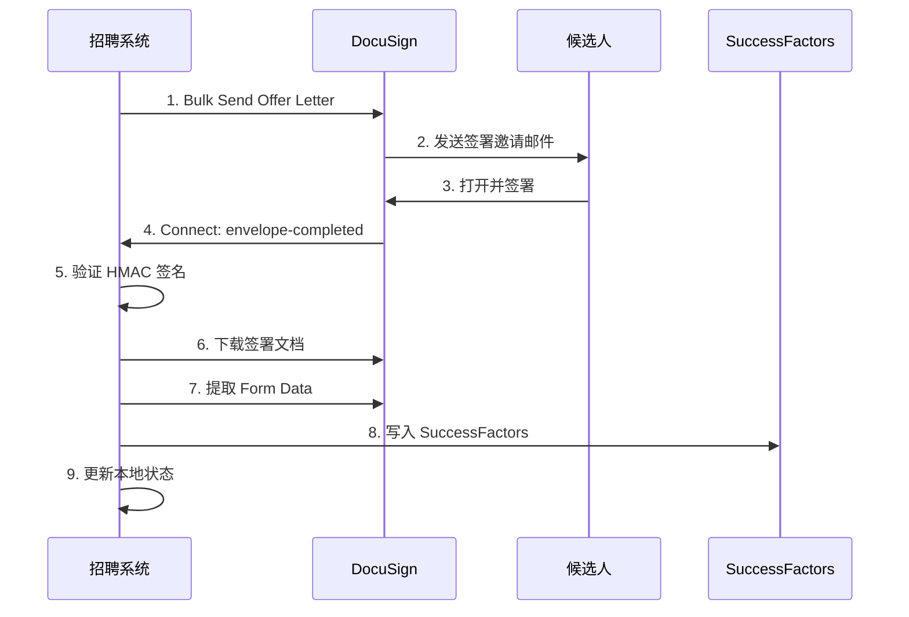
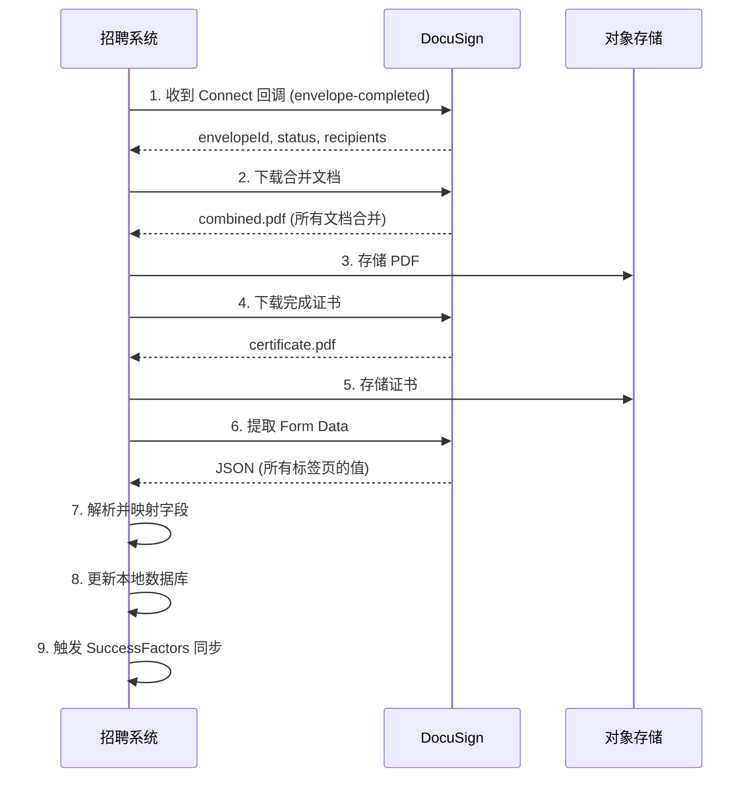
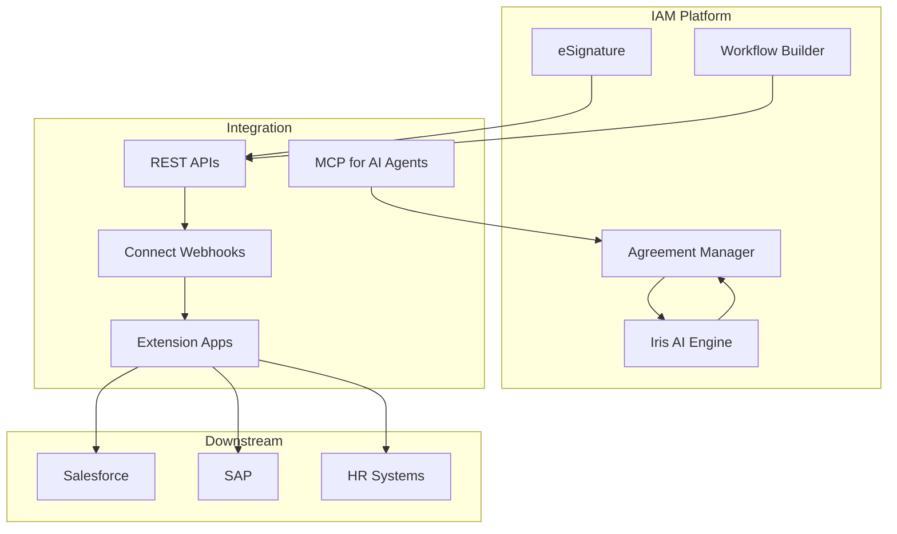
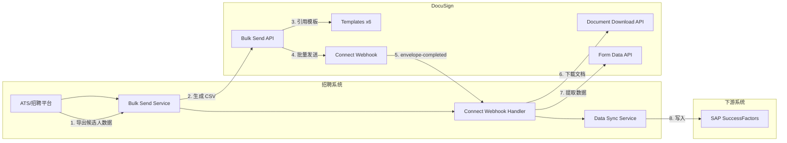
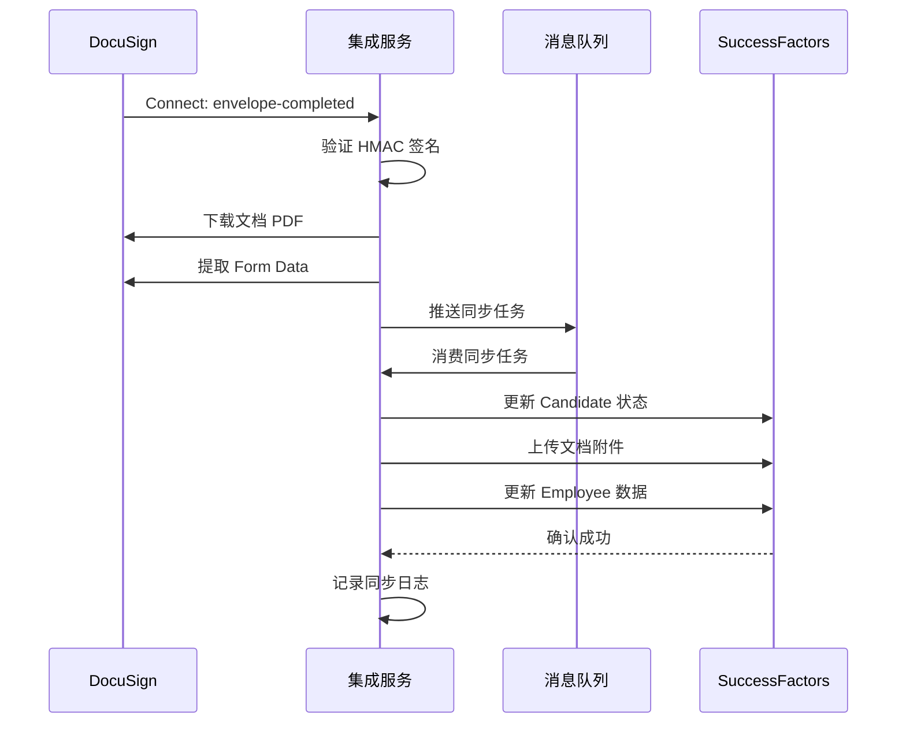
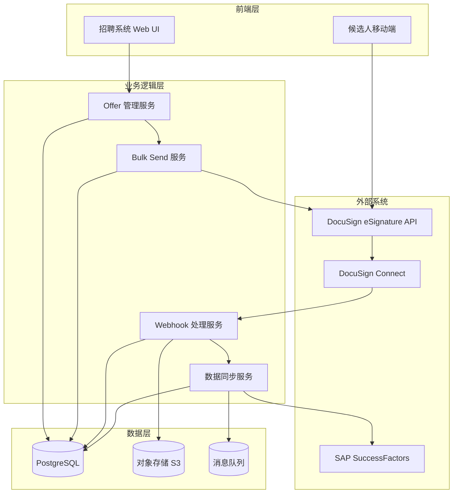

# DocuSign 学习报告：蓝领招聘场景下的电子签名与智能协议管理

**报告日期：2026年06月06日**

---

## 执行摘要

本报告系统梳理 DocuSign 平台的核心能力，重点聚焦 eSignature REST API、模板系统、批量发送（Bulk Send）、Connect Webhook 通知、数据回采以及 IAM 2026 智能协议管理平台。报告基于蓝领招聘公司的实际业务需求——批量发送 Offer Letter、个人信息授权书、NDA 等 6 类标准模板，并与 SAP SuccessFactors 下游系统集成。

DocuSign 是全球电子签名市场的领导者，服务超过 180 个国家、近 180 万客户和超过 10 亿用户[citation:11]。其 eSignature REST API 提供完整的模板管理、批量发送、Webhook 通知和数据提取能力，完全能够支撑蓝领招聘场景下的大规模签约需求。推荐方案采用 JWT Grant 服务端认证 + 模板驱动的 Bulk Send + Connect Webhook 实时回调 + 数据回采写入 SuccessFactors 的架构。

本报告涵盖 DocuSign 平台概览、eSignature REST API 核心能力（认证、资源、速率限制）、模板系统（结构、角色、锚点字符串、版本管理）、批量发送机制（CSV 格式、三步流程、限制、对比）、Connect Webhook（事件类型、HMAC 验证、重试机制）、数据回采（文档下载、Form Data 提取、审计跟踪）、IAM 2026 平台（Workflow Builder、Agreement Manager、Iris AI）、蓝领招聘场景落地分析（6 类模板、推荐架构、SuccessFactors 集成、ROI 评估）、实施路线图（4 阶段 8 周计划）、最佳实践、风险与限制，以及完整的 API 端点速查。

---

## 1. DocuSign 平台概览

### 1.1 公司与市场地位

DocuSign（纳斯达克代码：DOCU）成立于 2003 年，总部位于美国旧金山，是全球电子签名和协议管理领域的绝对领导者。截至 2026 年，DocuSign 服务超过 180 个国家，拥有近 180 万客户，超过 10 亿人使用过 DocuSign 完成签署[citation:11]。公司于 2024 年 4 月推出 Intelligent Agreement Management（IAM）平台，标志着从单一电子签名工具向全生命周期协议管理平台的战略转型[citation:8]。

### 1.2 产品矩阵

DocuSign 的产品体系分为以下几个层次：

| 产品/平台 | 定位 | 核心能力 |
|-----------|------|----------|
| **eSignature** | 电子签名基础层 | 模板发送、批量发送、实时签名、身份验证、移动端签署 |
| **CLM** (Contract Lifecycle Management) | 合同生命周期管理 | 合同起草、谈判、审批、签署、存储、分析全流程 |
| **IAM** (Intelligent Agreement Management) | 智能协议管理平台 | eSignature + CLM + Workflow Builder + Agreement Manager + Iris AI |
| **Iris AI** | 协议 AI 引擎 | AI 合同审查、数据提取、条款分析、智能问答 |

IAM 平台包含以下核心组件[citation:8]：

- **eSignature**：数字签名捕获、模板管理、发送工作流、AI 辅助签署体验
- **Workflow Builder**：无代码工作流编排引擎，支持条件逻辑、审批、表单和第三方系统交互[citation:9]
- **Agreement Manager**：AI 驱动的智能协议仓库，支持搜索、分析和洞察
- **Iris AI**：协议 AI 引擎，驱动数据提取、自动字段检测、AI 辅助审查
- **Extension Apps & APIs**：连接 Salesforce、SAP、Procore 等企业系统的连接器和开发工具

### 1.3 2026 年最新动态

2026 年 3 月，DocuSign 发布了 AI Contract Review Assistant（AI 合同审查助手），基于 Iris 引擎构建，能够[citation:6][citation:11]：

- 分析合同并高亮关键条款、风险和偏差
- 回答合同相关问题（如"这份合同是否自动续约？"）
- 建议修改措辞、生成编辑和起草新合同语言
- 自动将合同与公司标准手册（Playbook）对比
- 上传模板或参考文档后自动起草结构化 Playbook

该功能面向 CLM 和 IAM Enterprise 客户，支持英语、法语、德语、西班牙语和巴西葡萄牙语[citation:11]。

---

## 2. eSignature REST API 核心能力

### 2.1 认证机制

DocuSign eSignature REST API 支持三种 OAuth 2.0 认证流程[citation:5]。选择合适的认证方式对系统架构有重要影响。

#### 2.1.1 JWT Grant（推荐用于服务端集成）

JWT Grant 是蓝领招聘场景下的推荐认证方式，适用于后端服务与 DocuSign 的服务器到服务器集成，无需用户交互即可获取访问令牌。这是后台服务集成的首选方案，因为整个流程可以完全自动化，不需要人工干预。

**配置步骤**：
1. 在 DocuSign Admin 中创建 Integration Key（应用集成密钥）
2. 生成 RSA 密钥对（2048-bit 或更高），将公钥配置到 Integration Key
3. 获取 API Account ID（即 Account ID，可在 Admin > API and Keys 页面找到）
4. 构建 JWT 断言，包含以下声明：
   - `iss`（Issuer）：Integration Key 的 Client ID
   - `sub`（Subject）：被模拟用户的 User ID（通常是 API 专用用户）
   - `aud`（Audience）：`account-d.docusign.com`（Demo）或 `account.docusign.com`（生产）
   - `scope`：如 `signature`、`impersonation`，多个 scope 用空格分隔
   - `exp`（Expiration）：当前时间 + 1 小时（Unix 时间戳）
   - `iat`（Issued At）：当前时间（Unix 时间戳）
5. 使用 RSA 私钥对 JWT 进行签名（RS256 算法）
6. 调用 `POST /oauth/token` 获取 access_token
7. 在后续 API 请求的 Authorization 头中使用 `Bearer {accessToken}`

**JWT 断言示例**：
```json
{
  "iss": "YOUR_INTEGRATION_KEY",
  "sub": "YOUR_USER_ID",
  "aud": "account-d.docusign.com",
  "scope": "signature impersonation",
  "exp": 1718000000,
  "iat": 1717996400
}
```

**Token 请求示例**：
```
POST https://account-d.docusign.com/oauth/token
Content-Type: application/x-www-form-urlencoded

grant_type=urn:ietf:params:oauth:grant-type:jwt-bearer&assertion=YOUR_JWT
```

**关键参数**：
- Demo 环境 base URL：`https://demo.docusign.net/restapi/v2.1/accounts/{accountId}/`
- 生产环境 base URL：`https://www.docusign.net/restapi/v2.1/accounts/{accountId}/`
- 认证端点：`https://account-d.docusign.com/oauth/token`（Demo）
- 认证端点：`https://account.docusign.com/oauth/token`（生产）
- Token 有效期：通常为 8 小时，需要实现刷新机制
- 推荐做法：提前刷新（如每 6 小时刷新一次），避免 Token 过期导致 API 调用失败

#### 2.1.2 Authorization Code Grant

适用于需要用户交互的应用（如 Web 应用），用户通过浏览器登录 DocuSign 授权后获取 code，再换取 token。这种方式的优点是用户可以明确授权，但需要浏览器交互，不适合纯后端服务。

**流程**：
1. 用户浏览器重定向到 DocuSign 授权页面
2. 用户登录并授权应用
3. DocuSign 回调应用的重定向 URL，附带 authorization code
4. 应用使用 code 换取 access_token 和 refresh_token
5. 使用 refresh_token 获取新的 access_token

#### 2.1.3 Implicit Grant

适用于纯前端应用（SPA），直接返回 access_token，不适用于需要刷新令牌的场景。由于安全性较低，DocuSign 建议仅在无法使用 Authorization Code Grant 的情况下使用。

#### 2.1.4 三种认证方式对比

| 特性 | JWT Grant | Authorization Code | Implicit |
|------|-----------|-------------------|----------|
| **用户交互** | 无需 | 需要 | 需要 |
| **适用场景** | 后端服务 | Web 应用 | SPA |
| **Token 刷新** | 重新签名 JWT | Refresh Token | 不支持 |
| **安全性** | 高（私钥保护） | 高 | 中 |
| **蓝领招聘适用性** | **推荐** | 不推荐 | 不推荐 |

### 2.2 核心资源

eSignature REST API 的核心资源包括[citation:5]：

| 资源类别 | 主要端点 | 用途 |
|----------|----------|------|
| **Envelopes** | `/envelopes` | 创建、发送、查询信封 |
| **Templates** | `/templates` | 管理模板 |
| **BulkEnvelopes** | `/bulk_send_lists` | 批量发送 |
| **Connect** | `/connect` | Webhook 配置 |
| **Users** | `/users` | 用户管理 |
| **Accounts** | `/accounts` | 账户管理 |
| **EnvelopeDocuments** | `/envelopes/{id}/documents` | 文档下载 |
| **EnvelopeFormData** | `/envelopes/{id}/form_data` | 表单数据提取 |

### 2.3 速率限制与配额

DocuSign API 的速率限制因账户类型和计划而异。Demo 环境通常有较低的配额限制，生产环境根据订阅计划提供更高的配额。关键限制包括：

- **Demo 环境**：每日信封发送数量有限（通常 50-100 封），API 调用频率受限
- **生产环境**：根据计划不同，从数百到数万封/天不等
- **Bulk Send**：每个批量列表最多 999 个收件人[citation:3]
- **文档大小**：单个文档通常限制在 25MB 以内
- **模板数量**：根据计划不同，从数十到数千个不等

### 2.4 API 请求与响应格式

所有 eSignature REST API 请求和响应均使用 JSON 格式（Connect 除外，支持 XML 和 JSON）。

**通用请求头**：
```
Authorization: Bearer {accessToken}
Content-Type: application/json
Accept: application/json
```

**通用响应格式**：
```json
{
  "envelopeId": "abc-123-def-456",
  "uri": "/restapi/v2.1/accounts/44406721/envelopes/abc-123-def-456",
  "statusDateTime": "2026-06-06T10:30:00.000Z",
  "status": "sent"
}
```

**错误响应格式**：
```json
{
  "errorCode": "ENVELOPE_ALREADY_COMPLETED",
  "message": "The envelope has already been completed and cannot be modified."
}
```

### 2.5 常用 SDK

DocuSign 为多种编程语言提供了官方 SDK，可以简化 API 调用[citation:12]：

| 语言 | SDK 包名 | 安装方式 |
|------|----------|----------|
| Python | docusign-esign | `pip install docusign-esign` |
| Java | docusign-esign-java | Maven 依赖 |
| Node.js | docusign-esign | `npm install docusign-esign` |
| .NET | DocuSign.eSign.dll | NuGet |
| PHP | docusign/esign-client | Composer |
| Ruby | docusign_esign | Gem |
| Go | docusign-esign-golang | Go modules |

使用 SDK 可以显著减少开发工作量，SDK 封装了认证、请求签名、错误处理等通用逻辑。

---

## 3. 模板系统深度剖析

### 3.1 模板结构

DocuSign 模板是批量发送和标准化签约流程的核心。一个完整的模板包含以下要素：

- **Documents（文档）**：需要签署的 PDF/Word 文件，可以包含多个文档
- **Recipients/Roles（收件人/角色）**：定义签署流程中的角色（如候选人、HR、见证人）
- **Tabs/Fields（标签页/字段）**：放置在文档上的交互元素（签名、日期、文本输入、复选框等）
- **Email Subject/Message**：发送通知的邮件主题和正文
- **Notification Settings**：提醒和截止日期设置
- **Branding**：品牌标识、颜色、Logo 等

#### 3.1.1 模板的两种创建方式

**方式一：通过 Web UI 创建**
1. 登录 DocuSign Admin
2. 进入 Templates 管理页面
3. 上传文档（PDF、Word、PPT 等格式）
4. 拖拽放置标签页（签名、日期、文本等）
5. 定义收件人角色和签署顺序
6. 保存模板

**方式二：通过 REST API 创建**
```
POST /restapi/v2.1/accounts/{accountId}/templates
```
请求体包含完整的模板定义，包括文档内容（Base64 编码）、收件人角色、标签页位置等。这种方式适合程序化批量创建模板。

#### 3.1.2 模板的组成部分详解

**文档层**：
- 支持 PDF、DOCX、PPTX、HTML、TXT 等格式
- 每个模板可以包含多个文档
- 文档上传后自动转换为 PDF 格式
- 文档大小限制通常为 25MB

**收件人层**：
- 每个模板可以定义多个收件人角色
- 每个角色可以设置签署顺序（Routing Order）
- 支持并行签署（相同 Routing Order 的收件人同时收到邀请）
- 支持顺序签署（不同 Routing Order 的收件人依次签署）
- 每个角色可以设置权限（签名、编辑、查看等）

**标签页层**：
- 标签页是放置在文档上的交互元素
- 每个标签页绑定到特定的收件人角色
- 标签页可以通过绝对坐标或锚点字符串定位
- 支持条件逻辑（Conditional Fields），根据其他字段的值显示/隐藏

### 3.2 角色与标签页

#### 3.2.1 角色映射（Role Mapping）

模板中的角色是抽象的（如 "Candidate"、"HR Manager"），在发送时映射到具体人员。对于蓝领招聘场景，建议定义以下角色：

| 角色名称 | 签署顺序 | 权限 | 说明 |
|----------|----------|------|------|
| Candidate | 1 | 签名、填写字段 | 候选人签署 Offer Letter 等 |
| HR Manager | 2 | 签名 | HR 确认签署 |
| Witness | 3 | 签名 | 见证人（可选） |

#### 3.2.2 预填字段（Pre-fill Tabs）

通过 API 发送时，可以在模板中定义预填字段，在创建信封时传入数据。字段类型包括：

- **Text Tab**：文本输入框
- **Date Signed Tab**：自动填充签署日期
- **Checkbox Tab**：复选框
- **List Tab**：下拉列表
- **Radio Group Tab**：单选按钮组
- **Email Tab**：邮箱地址
- **Full Name Tab**：全名
- **Initial Here Tab**：缩写签名
- **Sign Here Tab**：正式签名

#### 3.2.3 锚点字符串（Anchor Strings）

锚点字符串是一种将标签页自动定位到文档特定位置的机制。在文档中插入特定文本（如 `\\*CandidateName*`），DocuSign 会自动在该位置放置对应的标签页。这种方式比绝对坐标定位更可靠，尤其适用于动态生成的文档。

### 3.3 模板创建与版本管理

模板可以通过以下方式创建：

1. **DocuSign Web UI**：通过 Admin 控制台手动创建，适合非技术人员
2. **REST API**：通过 `POST /templates` 端点编程创建，适合自动化部署
3. **从现有信封创建**：发送后保存为模板，适合快速复用

**通过 API 创建模板示例**：
```json
POST /restapi/v2.1/accounts/{accountId}/templates
{
  "name": "HR-OfferLetter-v1",
  "emailSubject": "请签署您的录用通知书",
  "emailBlurb": "尊敬的{候选人姓名}，请查阅并签署您的录用通知书。",
  "documents": [
    {
      "documentId": "1",
      "name": "Offer_Letter.pdf",
      "documentBase64": "JVBERi0xLjQK...（Base64 编码的 PDF 内容）"
    }
  ],
  "recipients": {
    "signers": [
      {
        "roleName": "Candidate",
        "routingOrder": "1",
        "tabs": {
          "signHereTabs": [
            { "anchorString": "\\*Signature*", "anchorUnits": "pixels" }
          ],
          "textTabs": [
            { "anchorString": "\\*CandidateName*", "tabLabel": "candidateName" },
            { "anchorString": "\\*Position*", "tabLabel": "position" },
            { "anchorString": "\\*Salary*", "tabLabel": "offerSalary" }
          ]
        }
      },
      {
        "roleName": "HR_Manager",
        "routingOrder": "2",
        "tabs": {
          "signHereTabs": [
            { "anchorString": "\\*HR_Signature*", "anchorUnits": "pixels" }
          ]
        }
      }
    ]
  }
}
```

**版本管理建议**：
- 使用命名约定：`{Department}-{AgreementType}-v{Major}.{Minor}`
- 模板更新后，旧版本仍可用于已发送的信封
- 建议在模板名称中包含版本号以便追踪
- 重大变更（如新增字段、修改签署顺序）建议升级主版本号
- 微小变更（如修改邮件文案、调整字段位置）建议升级次版本号
- 定期清理不再使用的旧版本模板

### 3.4 模板与信封的关系

理解模板与信封的关系对系统设计至关重要：

```
模板 (Template)         信封 (Envelope)
    |                        |
    |-- 文档定义             |-- 具体文档内容
    |-- 角色定义             |-- 具体收件人
    |-- 标签页定义           |-- 预填字段值
    |-- 邮件模板             |-- 个性化邮件内容
    |-- 通知设置             |-- 具体通知配置
    |                        |
    |  抽象模板              |  具体实例
    |  可复用                |  一次性使用
    |  不可修改              |  可修改（更正）
```

模板是"蓝图"，信封是"实例"。每次发送时，DocuSign 根据模板创建信封，并用实际数据填充模板中的占位符。

---

## 4. 批量发送（Bulk Send）机制详解

### 4.1 Bulk Send 概念与适用场景

Bulk Send（批量发送）是 DocuSign 的核心功能之一，允许一次操作向大量收件人发送个性化信封[citation:1]。每个收件人收到独立的信封，可以有不同的预填字段值。Bulk Send 的核心思想是"一次定义，多次发送"——你只需要定义一次信封模板和收件人列表，DocuSign 会自动为每个收件人生成独立的信封。

**工作原理**：
Bulk Send 不是将多个收件人放在同一个信封中，而是为 CSV 中的每一行创建一个独立的信封。每个信封都是独立的，有自己的 Envelope ID、独立的签署流程和独立的审计跟踪。这意味着：
- 每个候选人收到的是自己的 Offer Letter，看不到其他人的信息
- 每个信封的签署状态独立追踪
- 一个候选人拒绝签署不影响其他人的流程

**适用场景**：
- 批量发送 Offer Letter 给候选人（蓝领招聘核心场景）
- 批量发送 NDA 给新供应商
- 批量发送年度合同更新
- 批量发送员工政策确认书
- 批量发送个人信息授权书
- 批量发送银行账户采集表

**不适用场景**：
- 需要收件人之间互动的流程（如多方谈判、合同会签）
- 需要实时审批的工作流（需要 Workflow Builder）
- 需要动态文档生成的场景（文档内容因收件人而异，不仅仅是字段值不同）
- 需要收件人填写后触发后续流程的场景（需要 Connect + 自定义逻辑）

### 4.2 Bulk Send List（CSV）格式

Bulk Send 使用 CSV 文件定义收件人列表和个性化数据[citation:3][citation:4]。CSV 的列结构如下：

```
email, name, role, templateId, field:FullName, field:Position, field:Salary
candidate1@email.com, 张三, Candidate, 52e32294-..., 张三, 焊工, 8000
candidate2@email.com, 李四, Candidate, 52e32294-..., 李四, 电工, 9000
```

**关键列说明**：
- `email`：收件人邮箱（必填）
- `name`：收件人姓名（必填）
- `role`：模板中的角色名称（必填）
- `templateId`：模板 ID（可选，可在信封定义中指定）
- `field:{fieldName}`：预填字段值，`{fieldName}` 为模板中定义的标签名称

CSV 文件可以通过 DocuSign Web UI 生成模板，也可以手动构建[citation:4]。

### 4.3 三步流程

Bulk Send 的核心流程分为三步[citation:2]：

```mermaid
graph TD
    A[Step 1: 创建 Bulk Send List] --> B[Step 2: 创建信封模板]
    B --> C[Step 3: 组合并发送]
    C --> D[监控发送状态]
    
    subgraph Step1
        A1[POST /bulk_send_lists] --> A2[上传 CSV]
        A2 --> A3[获取 bulkSendListId]
    end
    
    subgraph Step2
        B1[创建/使用模板] --> B2[定义收件人角色]
        B2 --> B3[定义标签字段]
    end
    
    subgraph Step3
        C1[POST /envelopes] --> C2[引用模板 + bulkSendListId]
        C2 --> C3[PUT /bulk_send_lists/{id} 触发发送]
    end
```

**Step 1：创建 Bulk Send List**
```
POST /restapi/v2.1/accounts/{accountId}/bulk_send_lists
```
请求体包含 CSV 文件内容（Base64 编码）或 CSV 文件 URL。返回 `bulkSendListId`。

**Step 2：创建信封定义**
```
POST /restapi/v2.1/accounts/{accountId}/envelopes
```
请求体引用模板 ID，并指定 `bulkSendListId`。此时信封尚未发送，只是定义了发送参数。

**Step 3：触发发送**
```
PUT /restapi/v2.1/accounts/{accountId}/bulk_send_lists/{bulkSendListId}
```
将状态从 `created` 更新为 `processing`，触发批量发送。

### 4.4 限制

- **收件人数量**：每个 Bulk Send List 最多 999 个收件人[citation:3]
- **CSV 大小**：受 API 请求体大小限制（建议不超过 10MB）
- **发送频率**：受账户速率限制（Demo 环境通常更低）
- **模板要求**：必须使用预定义模板，不支持动态文档生成
- **角色限制**：每个信封最多支持 10 个收件人角色[citation:3]
- **文档限制**：每个信封最多支持 25 个文档
- **标签页限制**：每个信封最多支持 500 个标签页

### 4.6 批量发送状态监控

Bulk Send 提交后，可以通过以下方式监控发送状态：

**获取批量发送状态**：
```
GET /restapi/v2.1/accounts/{accountId}/bulk_envelopes/{batchId}
```

**返回状态说明**：

| 状态 | 说明 | 后续操作 |
|------|------|----------|
| `created` | 已创建，尚未发送 | 调用 PUT 触发发送 |
| `processing` | 正在发送中 | 等待完成 |
| `sent` | 所有信封已发送 | 等待收件人签署 |
| `completed` | 所有信封已完成 | 检查是否有失败的 |
| `failed` | 发送失败 | 查看错误信息 |

**获取单个信封的批量发送状态**：
```
GET /restapi/v2.1/accounts/{accountId}/bulk_envelopes/{batchId}/envelopes
```
返回每个信封的独立状态，包括 `envelopeId`、`status`、`errorDetails` 等。

### 4.7 批量发送错误处理

Bulk Send 过程中可能出现的错误及处理方式：

| 错误类型 | 原因 | 处理方式 |
|----------|------|----------|
| CSV 格式错误 | 列名不匹配、缺少必填列 | 验证 CSV 格式后重新提交 |
| 收件人邮箱无效 | 邮箱格式错误 | 修正邮箱后重新提交 |
| 模板 ID 无效 | 模板不存在或已删除 | 检查模板 ID |
| 字段映射错误 | CSV 中的字段名与模板不匹配 | 检查字段命名一致性 |
| 配额超限 | 超出账户发送配额 | 等待配额重置或升级计划 |
| 速率限制 | API 调用过于频繁 | 实现指数退避重试 |

### 4.5 Bulk Send vs PowerForm vs Web Forms

| 特性 | Bulk Send | PowerForm | Web Forms |
|------|-----------|-----------|-----------|
| **触发方式** | API 触发 | 公开 URL | 嵌入网页/公开 URL |
| **收件人认证** | 邮件验证 | 可选（邮件/访问码） | 可选 |
| **个性化** | 高（CSV 预填字段） | 低（所有收件人相同） | 中（表单输入） |
| **批量能力** | 强（999 人/批） | 中（逐个填写） | 中 |
| **适用场景** | 批量发送已知收件人 | 自助申请 | 客户自助填写 |
| **API 集成** | 完整 | 有限 | 有限 |
| **模板依赖** | 必须 | 必须 | 可选 |

**蓝领招聘推荐**：Bulk Send 是最适合的方案。原因如下：
- 候选人信息已知（姓名、邮箱、职位、薪资）
- 需要批量发送（每天数十到数百人）
- 需要个性化预填字段（每个候选人的 Offer 内容不同）
- 需要 API 集成（与招聘系统对接）

---

## 5. Connect（Webhook）事件通知

### 5.1 Connect 概述

DocuSign Connect 是平台的事件通知服务，当信封状态发生变化时，主动向配置的 Webhook URL 发送通知[citation:5]。Connect 支持 XML 和 JSON 两种格式的负载，推荐使用 JSON 格式以便于程序化处理。

**Connect 的核心价值**：
- **实时性**：事件发生后立即通知，无需轮询 API
- **可靠性**：内置重试机制，确保通知送达
- **安全性**：支持 HMAC 签名验证，防止伪造回调
- **灵活性**：可以订阅特定事件类型，减少不必要的通知

**Connect 的两种模式**：
1. **Connect 配置（推荐）**：在 DocuSign Admin 或通过 API 配置，全局生效
2. **Event Notification（信封级别）**：在创建信封时指定通知配置，仅对该信封生效

### 5.2 事件类型

Connect 支持以下关键事件类型：

| 事件名称 | 触发时机 | 蓝领招聘场景用途 |
|----------|----------|------------------|
| `envelope-sent` | 信封已发送给收件人 | 记录发送状态 |
| `envelope-delivered` | 收件人已收到邮件 | 追踪候选人是否查看 |
| `envelope-completed` | 所有收件人已完成签署 | **触发 SuccessFactors 写入** |
| `envelope-declined` | 收件人拒绝签署 | 触发重新发送或人工跟进 |
| `envelope-voided` | 信封被作废 | 记录作废原因 |
| `envelope-created` | 信封已创建 | 记录创建日志 |
| `envelope-expired` | 信封过期未完成 | 触发提醒或重新发送 |

### 5.3 配置流程

Connect 可以通过两种方式配置：

**方式一：DocuSign Admin UI**
1. 登录 DocuSign Admin
2. 进入 Connect 配置页面
3. 添加新的 Webhook 配置
4. 输入回调 URL（如 `https://api.recruitment.com/docusign/webhook`）
5. 选择订阅的事件类型
6. 配置 HMAC 密钥（可选但推荐）
7. 保存并测试

**方式二：Connect API**
```
POST /restapi/v2.1/accounts/{accountId}/connect
```
请求体包含 Webhook URL、事件类型列表、HMAC 密钥等配置。

### 5.4 HMAC 签名验证

HMAC（Hash-based Message Authentication Code）签名验证是确保 Webhook 回调安全性的关键机制。

**配置步骤**：
1. 在 Connect 配置中设置 HMAC 密钥（Secret Key）
2. DocuSign 使用该密钥对每个 Webhook 请求体计算 HMAC-SHA256 签名
3. 签名放在 HTTP Header `X-DocuSign-Signature-1` 中
4. 接收端使用相同的密钥重新计算签名并比对

**验证示例（Python）**：
```python
import hmac
import hashlib

def verify_docusign_webhook(payload: bytes, signature: str, secret: str) -> bool:
    expected = hmac.new(
        secret.encode('utf-8'),
        payload,
        hashlib.sha256
    ).digest()
    # DocuSign 使用 Base64 编码的签名
    expected_b64 = base64.b64encode(expected).decode('utf-8')
    return hmac.compare_digest(expected_b64, signature)
```

### 5.5 Connect 负载格式

Connect 支持 XML 和 JSON 两种格式。推荐使用 JSON 格式。

**JSON 负载示例（envelope-completed 事件）**：
```json
{
  "event": "envelope-completed",
  "apiVersion": "v2.1",
  "uri": "/restapi/v2.1/accounts/44406721/envelopes/abc123",
  "envelopeId": "abc-123-def-456",
  "email": "candidate@email.com",
  "userName": "张三",
  "status": "completed",
  "createdDateTime": "2026-06-06T10:30:00.000Z",
  "sentDateTime": "2026-06-06T10:31:00.000Z",
  "completedDateTime": "2026-06-06T10:35:00.000Z",
  "emailSubject": "请签署您的 Offer Letter",
  "recipients": {
    "signers": [
      {
        "email": "candidate@email.com",
        "name": "张三",
        "recipientId": "1",
        "routingOrder": "1",
        "status": "completed",
        "signedDateTime": "2026-06-06T10:35:00.000Z"
      }
    ]
  }
}
```

### 5.6 Connect 重试机制

Connect 具有内置的重试机制，确保通知可靠送达：

- **初始尝试**：事件发生后立即发送
- **重试间隔**：指数退避（5 分钟、10 分钟、20 分钟...）
- **最大重试时间**：24 小时
- **重试条件**：接收端未返回 HTTP 200/201
- **最终失败**：24 小时后停止重试，可在 Connect 日志中查看

**接收端最佳实践**：
1. 尽快返回 HTTP 200（建议在 5 秒内）
2. 异步处理业务逻辑（将任务放入消息队列）
3. 实现幂等处理（同一事件可能多次送达）
4. 记录所有接收到的 Webhook 请求

### 5.7 Connect 配置最佳实践

1. **使用专用 Webhook 端点**：为 DocuSign Connect 创建独立的 Webhook 端点，与其他 Webhook 隔离
2. **HTTPS 强制**：Connect 要求 Webhook URL 使用 HTTPS
3. **快速响应**：Webhook 处理器应在 5 秒内返回 HTTP 200，复杂逻辑异步处理
4. **幂等设计**：同一事件可能多次送达，接收端需要幂等处理
5. **日志记录**：记录所有 Webhook 请求的完整负载，用于调试和审计
6. **监控告警**：监控 Webhook 失败率和处理延迟，设置告警阈值
7. **IP 白名单**：限制 DocuSign Connect 的 IP 范围（可在 DocuSign 文档中查询）

### 5.8 关键事件处理流程



---

## 6. 数据回采

### 6.1 Envelope Document 下载

签署完成后，可以通过 API 下载签署后的文档。这是将签署文件归档到 SuccessFactors 或其他文档管理系统的关键步骤。

```
GET /restapi/v2.1/accounts/{accountId}/envelopes/{envelopeId}/documents/{documentId}
```

**参数说明**：
- `documentId` 为 `"combined"` 时下载所有文档合并的 PDF（最常用）
- `documentId` 为具体数字时下载单个文档（如 `0`、`1`、`2`）
- `documentId` 为 `"certificate"` 时下载完成证书
- 响应为 PDF 文件流（Content-Type: application/pdf）

**下载流程**：
1. 收到 Connect `envelope-completed` 回调
2. 从回调中获取 `envelopeId`
3. 调用 Document Download API 获取 PDF
4. 将 PDF 存储到文件系统或对象存储（如 S3、MinIO）
5. 将文档链接写入 SuccessFactors 的 Document 对象

**代码示例（Python）**：
```python
import requests

def download_envelope_document(account_id, envelope_id, access_token, document_id="combined"):
    url = f"https://demo.docusign.net/restapi/v2.1/accounts/{account_id}/envelopes/{envelope_id}/documents/{document_id}"
    headers = {"Authorization": f"Bearer {access_token}"}
    response = requests.get(url, headers=headers)
    response.raise_for_status()
    return response.content  # PDF bytes
```

### 6.2 Tab Values（Form Data）提取

提取签署者在表单字段中填写的数据，这是将签署数据写入 SuccessFactors 的关键接口。

```
GET /restapi/v2.1/accounts/{accountId}/envelopes/{envelopeId}/form_data
```

**返回数据示例**：
```json
{
  "formData": [
    {
      "tabId": "123456",
      "tabLabel": "bankName",
      "value": "中国工商银行",
      "recipientId": "987654",
      "recipientName": "张三",
      "recipientEmail": "zhangsan@email.com"
    },
    {
      "tabId": "123457",
      "tabLabel": "bankAccount",
      "value": "6222021234567890",
      "recipientId": "987654",
      "recipientName": "张三",
      "recipientEmail": "zhangsan@email.com"
    }
  ]
}
```

**数据映射到 SuccessFactors**：
提取 Form Data 后，需要将字段映射到 SuccessFactors 的对应字段：

| Form Data 字段 | SuccessFactors 对象 | SuccessFactors 字段 |
|----------------|---------------------|---------------------|
| `bankName` | Employee | `bankName` |
| `bankAccount` | Employee | `bankAccount` |
| `emergencyContact` | Employee | `emergencyContactName` |
| `emergencyPhone` | Employee | `emergencyContactPhone` |
| `idNumber` | Employee | `nationalId` |

### 6.3 数据回采完整流程



### 6.4 审计跟踪（Certificate of Completion）

```
GET /restapi/v2.1/accounts/{accountId}/envelopes/{envelopeId}/documents/certificate
```

下载完成证书（Certificate of Completion），包含完整的审计跟踪信息：谁在什么时间做了什么操作、IP 地址、时间戳等。该文档具有法律效力。

---

## 7. IAM 2026：智能协议管理

### 7.1 IAM 平台架构

IAM 平台将 eSignature、CLM、Workflow Builder、Agreement Manager 和 Iris AI 整合为一个统一的协议管理平台[citation:7][citation:8]。



### 7.2 IAM 计划对比

| 计划 | 价格 | 工作流数 | Agreement Manager | 关键特性 |
|------|------|----------|-------------------|----------|
| **Starter** | $40/user/mo | 1 | 1,000 协议/user/yr | 核心 IAM 能力 |
| **Standard** | $45/user/mo (3+) | 3 | 1,000 协议/user/yr | 无限 Web 发送 |
| **Professional** | $75/user/mo (3+) | 10 | 1,000 协议/user/yr | Business Pro eSignature |
| **Enterprise** | 定制 (5+) | 无限 | 1,000 协议/user/yr | AI-Assisted Review, 24/7 支持 |

### 7.3 Iris AI 引擎

Iris 是 DocuSign 的协议 AI 引擎，具有以下核心能力[citation:10]：

- **AI 辅助审查**：自动分析合同条款，标记风险和偏差
- **数据提取**：从协议中自动提取关键数据（当事人、日期、金额等）
- **自定义提取**：组织可以训练 Iris 提取行业特定字段
- **智能问答**：用户可以用自然语言查询协议内容
- **义务管理**：自动追踪续约、付款和终止条款

#### 7.3.1 Iris 在蓝领招聘场景的潜在应用

虽然蓝领招聘场景主要使用 eSignature 的批量发送功能，但 Iris AI 在以下方面具有潜在价值：

1. **合同条款一致性检查**：自动检查 Offer Letter 中的条款是否符合公司标准
2. **数据自动提取**：从签署完成的文档中提取关键数据，减少手动录入
3. **合规性审查**：检查个人信息授权书是否符合最新法规要求
4. **智能搜索**：在 Agreement Manager 中搜索历史 Offer 和签署记录

#### 7.3.2 AI Contract Review Assistant（2026 年 3 月发布）

2026 年 3 月发布的 AI Contract Review Assistant 是 Iris 引擎的重要应用[citation:6][citation:11]：

- **合同分析**：自动分析合同并高亮关键条款、风险和偏差
- **智能问答**：回答如"这份合同是否自动续约？"等问题
- **编辑建议**：建议修改措辞、生成编辑和起草新合同语言
- **Playbook 对比**：自动将合同与公司标准手册对比
- **Playbook 生成**：上传模板后自动起草结构化 Playbook

该功能面向 CLM 和 IAM Enterprise 客户，支持英语、法语、德语、西班牙语和巴西葡萄牙语[citation:11]。

### 7.4 MCP（Model Context Protocol）for AI Agents

DocuSign 已发布 Beta 版 MCP 服务器，允许 AI Agent（如 Claude、ChatGPT、Copilot）通过自然语言搜索协议、检查状态和触发工作流[citation:8]。这对于未来蓝领招聘场景中的 AI 辅助操作具有前瞻意义。

### 7.5 IAM vs CLM vs eSignature

| 维度 | eSignature | CLM | IAM |
|------|------------|-----|-----|
| **核心功能** | 电子签名 | 合同全生命周期 | 协议智能管理 |
| **AI 能力** | 基础 | AI 审查 | Iris 全平台 AI |
| **工作流** | 简单发送流程 | 复杂审批流程 | 无代码 Workflow Builder |
| **协议仓库** | 无 | 基础存储 | Agreement Manager + AI |
| **集成** | API | 预构建连接器 | Extension Apps + API |
| **适用规模** | 个人/小团队 | 中大型企业 | 所有规模 |
| **蓝领招聘适用性** | 基础可用 | 过度 | **推荐（Professional 或 Enterprise）** |

---

## 8. 蓝领招聘场景落地分析

### 8.1 业务痛点

蓝领招聘公司在签约环节面临以下痛点：

1. **线下签约效率低**：候选人需要到现场签署纸质文件，或打印后扫描回传，周期长、易丢失。对于大量蓝领岗位（如焊工、电工、装配工），每天可能需要处理 50-200 份 Offer，线下流程完全无法支撑
2. **批量处理困难**：招聘旺季每天需要处理数百份 Offer，人工操作容易出错。HR 团队需要逐一生成文档、发送邮件、跟踪签署状态、手动录入数据
3. **合规风险高**：个人信息授权书、银行账户采集等涉及敏感信息，纸质文件难以保证合规。个人信息保护法要求企业明确告知数据用途、存储期限和撤回方式，纸质流程难以满足
4. **数据孤岛**：签署完成后，数据需要人工录入 SuccessFactors，效率低且易出错。银行账号录入错误可能导致工资发放失败
5. **模板管理混乱**：多个版本的 Offer Letter、NDA 等文件难以统一管理。不同业务线使用不同版本的模板，法务审核困难
6. **签署状态不可见**：HR 无法实时了解哪些候选人已完成签署、哪些还在等待、哪些已拒绝
7. **审计困难**：纸质文件的签署记录分散存储，审计时需要大量人工整理

### 8.2 候选人签署体验设计

蓝领候选人通常使用手机完成签署，签署体验设计至关重要：

**移动端优化要点**：
1. **简化流程**：候选人只需点击邮件中的链接，在手机上完成签署
2. **引导清晰**：在签署页面提供明确的指引（如"请在此处签名"）
3. **字段顺序合理**：按照从上到下的自然顺序排列填写字段
4. **即时反馈**：签署完成后显示确认页面，并发送确认邮件
5. **多语言支持**：根据候选人偏好显示中文或英文界面

**签署流程**：
1. 候选人收到邮件通知（主题："请签署您的录用通知书"）
2. 点击"查看并签署"按钮
3. 在手机浏览器中打开签署页面
4. 查看文档内容（可缩放、翻页）
5. 在指定位置签名（手指滑动签名）
6. 填写个人信息（银行账户、紧急联系人等）
7. 点击"完成"提交
8. 收到确认邮件和短信通知

### 8.2 推荐方案

#### 8.2.1 六类标准模板

| 模板名称 | 签署方 | 用途 | 预填字段 |
|----------|--------|------|----------|
| **Offer Letter** | 候选人 + HR | 录用通知书 | 姓名、职位、部门、薪资、入职日期 |
| **个人信息授权书** | 候选人 | 个人信息收集授权 | 姓名、身份证号、授权范围 |
| **NDA** | 候选人 | 保密协议 | 姓名、公司名称、保密期限 |
| **个人信息采集** | 候选人 | 个人信息登记 | 姓名、电话、地址、紧急联系人 |
| **银行账户采集** | 候选人 | 工资卡信息 | 姓名、银行、账号、开户行 |
| **证件采集** | 候选人 | 身份证/证件复印件 | 姓名、证件类型、证件号 |

#### 8.2.2 推荐架构



#### 8.2.3 详细流程

**Step 1：数据准备**
- 从招聘系统导出当天待发送 Offer 的候选人列表
- 生成 Bulk Send CSV，包含每个候选人的个性化数据

**Step 2：批量发送**
- 调用 DocuSign Bulk Send API，引用对应模板
- 系统自动向每个候选人发送签署邀请邮件
- 候选人通过手机或电脑完成签署

**Step 3：实时回调**
- Connect Webhook 在信封完成时回调招聘系统
- 招聘系统验证 HMAC 签名确保安全性

**Step 4：数据回采**
- 下载签署完成的 PDF 文档（存档用）
- 提取 Form Data（候选人填写的银行账户、个人信息等）

**Step 5：写入 SuccessFactors**
- 将签署状态、签署时间、文档链接写入 SuccessFactors
- 将提取的表单数据（银行账户等）写入对应字段
- 更新招聘系统的候选人状态

### 8.4 与 SuccessFactors 集成

SAP SuccessFactors 是 DocuSign 的官方集成合作伙伴之一[citation:8]。集成方式包括：

1. **预构建连接器**：DocuSign App Center 提供 SuccessFactors 连接器，支持开箱即用的数据同步
2. **API 集成**：通过 REST API 自定义数据映射，灵活性更高
3. **Extension Apps**：通过 Workflow Builder 的 Extension App 框架实现深度集成

**推荐数据同步字段**：

| SuccessFactors 对象 | 字段 | 数据来源 | 同步时机 |
|---------------------|------|----------|----------|
| Candidate | 签署状态 | Connect 事件 | 信封完成时 |
| Candidate | Offer 签署时间 | Form Data | 信封完成时 |
| Candidate | 签署文档链接 | Document Download | 文档下载后 |
| Employee | 银行名称 | 银行账户采集模板 | 入职前 |
| Employee | 银行账号 | 银行账户采集模板 | 入职前 |
| Employee | 紧急联系人姓名 | 个人信息采集模板 | 入职前 |
| Employee | 紧急联系人电话 | 个人信息采集模板 | 入职前 |
| Employee | 证件类型 | 证件采集模板 | 入职前 |
| Employee | 证件号码 | 证件采集模板 | 入职前 |
| Document | Offer Letter PDF | Document Download | 文档下载后 |

**数据同步架构**：



**错误处理策略**：
- SuccessFactors API 调用失败时，任务保留在队列中
- 指数退避重试（30 秒、1 分钟、2 分钟、4 分钟...）
- 最多重试 5 次
- 最终失败时发送告警通知

### 8.5 系统集成架构总览



### 8.6 ROI 评估

| 指标 | 当前（线下） | 实施后（DocuSign） | 改善 |
|------|-------------|-------------------|------|
| 单份 Offer 签署周期 | 2-3 天 | 10-30 分钟 | 95%+ |
| 每日处理量 | 50 份（人工） | 999 份（批量） | 20x |
| 数据录入错误率 | 5-10% | <0.1% | 98%+ |
| 合规审计准备时间 | 数天 | 实时 | 99%+ |
| HR 团队时间占用 | 80% 事务性工作 | 20% 事务性工作 | 75% |

---

## 9. 实施路线图（Implementation Roadmap）

### 9.1 分阶段实施计划

基于 Fluidlabs 推荐的 IAM 实施方法论[citation:8]，蓝领招聘公司的 DocuSign 集成可以分为四个阶段：

#### 第一阶段：基础搭建（第 1-2 周）

**目标**：完成 Demo 环境配置和核心模板创建

| 任务 | 负责人 | 产出 |
|------|--------|------|
| 注册 DocuSign Demo 账户 | IT | 可用 Demo 账户 |
| 配置 JWT Grant 认证 | 开发 | 可用的 Access Token |
| 创建 6 个标准模板 | HR + 开发 | 6 个可用模板 |
| 配置 Connect Webhook | 开发 | Webhook 端点就绪 |
| 测试单个信封发送 | 开发 | 端到端流程验证 |

**关键检查点**：
- JWT Token 获取成功
- 模板字段正确定位
- Connect 回调正常接收
- HMAC 签名验证通过

#### 第二阶段：批量发送（第 3-4 周）

**目标**：实现 Bulk Send 批量发送和 Connect 回调处理

| 任务 | 负责人 | 产出 |
|------|--------|------|
| 实现 Bulk Send CSV 生成 | 开发 | CSV 生成模块 |
| 实现 Bulk Send API 调用 | 开发 | 批量发送模块 |
| 实现 Connect 回调处理 | 开发 | Webhook 处理器 |
| 实现文档下载 | 开发 | 文档存储模块 |
| 实现 Form Data 提取 | 开发 | 数据提取模块 |
| 批量发送测试（10 人） | QA | 测试报告 |

**关键检查点**：
- CSV 格式正确，字段映射准确
- 批量发送成功，每个收件人收到独立信封
- Connect 回调在信封完成后及时到达
- 文档下载和 Form Data 提取数据正确

#### 第三阶段：SuccessFactors 集成（第 5-6 周）

**目标**：实现与 SAP SuccessFactors 的数据同步

| 任务 | 负责人 | 产出 |
|------|--------|------|
| 确认 SuccessFactors API 访问权限 | IT | API 凭证 |
| 实现签署状态同步 | 开发 | 状态同步模块 |
| 实现 Form Data 写入 | 开发 | 数据写入模块 |
| 实现文档归档 | 开发 | 文档归档模块 |
| 集成测试 | QA | 测试报告 |
| 用户验收测试（UAT） | HR + QA | UAT 报告 |

**关键检查点**：
- 签署状态实时同步到 SuccessFactors
- 银行账户等敏感数据正确写入
- 签署文档可在线查看
- 数据一致性验证通过

#### 第四阶段：生产上线（第 7-8 周）

**目标**：从 Demo 环境迁移到生产环境，正式上线

| 任务 | 负责人 | 产出 |
|------|--------|------|
| 购买生产环境订阅 | 采购 | 生产账户 |
| 迁移模板到生产环境 | 开发 | 生产模板 |
| 配置生产环境 Connect | 开发 | 生产 Webhook |
| 配置生产环境 JWT | 开发 | 生产认证 |
| 灰度发布（10% 流量） | 开发 | 灰度报告 |
| 全量上线 | 全部 | 上线完成 |

### 9.2 技术选型建议

**后端技术栈推荐**：

| 组件 | 推荐方案 | 备选方案 |
|------|----------|----------|
| 编程语言 | Python (FastAPI) | Java (Spring Boot), Node.js (Express) |
| DocuSign SDK | docusign-esign (Python) | REST API 直接调用 |
| 消息队列 | Redis Streams / RabbitMQ | AWS SQS, Kafka |
| 数据库 | PostgreSQL | MySQL, SQL Server |
| 对象存储 | MinIO / AWS S3 | 本地文件系统 |
| 任务调度 | Celery | AWS Lambda, Kubernetes CronJob |
| 监控 | Prometheus + Grafana | Datadog, New Relic |

**Python SDK 使用示例**：
```python
from docusign_esign import ApiClient, EnvelopesApi
from docusign_esign.client.api_exception import ApiException

# 初始化 API 客户端
api_client = ApiClient()
api_client.set_base_path("demo.docusign.net/restapi/v2.1")
api_client.set_oauth_host_name("account-d.docusign.com")

# 获取 JWT Token
token = api_client.request_jwt_user_token(
    client_id="YOUR_INTEGRATION_KEY",
    user_id="YOUR_USER_ID",
    oauth_host_name="account-d.docusign.com",
    private_key_bytes=private_key_bytes,
    expires_in=3600,
    scopes=["signature", "impersonation"]
)

# 创建信封 API
envelope_api = EnvelopesApi(api_client)
```

### 9.3 团队配置建议

| 角色 | 人数 | 职责 |
|------|------|------|
| 项目经理 | 1 | 整体协调、进度管理 |
| 后端开发工程师 | 2 | API 集成、数据处理 |
| HR 业务代表 | 1 | 模板设计、流程确认 |
| IT 管理员 | 1 | 账户配置、权限管理 |
| QA 测试工程师 | 1 | 集成测试、UAT 支持 |

### 9.4 风险与缓解措施

| 风险 | 概率 | 影响 | 缓解措施 |
|------|------|------|----------|
| Demo 环境配额不足 | 中 | 高 | 提前申请提高配额，或使用多个 Demo 账户 |
| SuccessFactors API 变更 | 低 | 高 | 使用抽象层隔离 API 依赖 |
| 候选人签署体验差 | 中 | 中 | 移动端优化，提供签署指引 |
| 数据同步延迟 | 低 | 中 | 实现重试机制和告警 |
| 法律合规问题 | 低 | 高 | 提前咨询法务，确保授权书内容合规 |

---

## 10. 推荐配置（Best Practices）

### 10.1 模板设计规范

1. **统一命名约定**：`{Department}-{TemplateType}-v{Version}`，如 `HR-OfferLetter-v1`
2. **字段命名规范**：使用驼峰命名，如 `candidateName`、`offerSalary`
3. **锚点字符串**：在文档中使用 `\\*FieldName*` 格式的锚点，确保字段正确定位
4. **必填字段**：关键字段设置为必填，防止候选人遗漏
5. **字段验证**：对邮箱、金额等字段启用格式验证
6. **签署顺序**：候选人先签署，HR 后签署（或自动签署）

### 10.2 角色与字段命名约定

**角色命名**：
- `Candidate` - 候选人
- `HR_Manager` - HR 经理
- `Witness` - 见证人（可选）

**字段命名**：
- `candidateName` - 候选人姓名
- `candidateEmail` - 候选人邮箱
- `candidatePhone` - 候选人电话
- `position` - 职位名称
- `department` - 部门
- `offerSalary` - 薪资
- `startDate` - 入职日期
- `bankName` - 银行名称
- `bankAccount` - 银行账号
- `emergencyContact` - 紧急联系人

### 10.3 Webhook 安全配置

1. **启用 HMAC 签名验证**：所有 Connect 回调必须验证签名
2. **IP 白名单**：限制 DocuSign Connect 的 IP 范围
3. **幂等处理**：Connect 可能重复发送事件，接收端需要幂等处理
4. **超时处理**：Webhook 处理应在 30 秒内返回 200
5. **失败重试**：Connect 会自动重试失败的回调（最多 24 小时）
6. **日志记录**：记录所有 Webhook 请求和响应用于审计

### 10.4 错误处理与重试

| 错误场景 | 处理策略 | 重试机制 |
|----------|----------|----------|
| API 调用限流 | 指数退避重试 | 最多 3 次 |
| 信封创建失败 | 记录错误日志，人工介入 | 不自动重试 |
| Connect 回调失败 | Connect 自动重试 | 最多 24 小时 |
| 文档下载失败 | 延迟后重试 | 最多 3 次 |
| SuccessFactors 写入失败 | 队列暂存，定时重试 | 最多 5 次 |

### 10.5 日志与监控

**日志记录规范**：
- 所有 API 调用记录请求 ID、时间戳、响应状态
- Connect Webhook 记录完整负载和处理结果
- 数据同步记录每次同步的字段映射和结果
- 错误日志包含完整的堆栈跟踪和上下文信息

**监控指标**：
- API 调用成功率（目标：>99.9%）
- Connect 回调处理延迟（目标：<5 秒）
- 数据同步成功率（目标：>99.9%）
- 信封完成率（目标：>95%）
- 平均签署完成时间（目标：<30 分钟）

**告警规则**：
- API 调用失败率超过 5% 触发告警
- Connect 回调处理延迟超过 30 秒触发告警
- 数据同步失败超过 3 次触发告警
- 信封过期率超过 10% 触发告警

---

## 11. 风险与限制

### 11.1 Demo 环境限制

- **发送配额**：Demo 账户每日信封发送数量有限（通常 50-100 封）
- **API 速率**：Demo 环境 API 调用频率低于生产环境
- **Bulk Send**：Demo 环境支持 Bulk Send，但受总配额限制
- **Connect**：Demo 环境支持 Connect 配置，但回调可能不稳定
- **数据保留**：Demo 环境的数据可能定期清理
- **升级路径**：Demo 数据无法直接迁移到生产环境，需要重新配置

### 11.2 法律合规

#### 11.2.1 电子签名法

DocuSign 在全球 180+ 国家具有法律效力，符合以下标准[citation:8]：
- **美国**：ESIGN Act、UETA
- **欧盟**：eIDAS Regulation
- **中国**：《电子签名法》（需确认 DocuSign 在中国大陆的合规性）
- **其他地区**：各国电子交易法

#### 11.2.2 个人信息保护法

蓝领招聘涉及大量个人信息采集，需要特别注意：
- **个人信息授权书**：必须明确告知数据用途、存储期限和撤回方式
- **数据加密**：DocuSign 提供传输加密（TLS 1.2+）和存储加密（AES-256）
- **数据驻留**：选择合适的数据中心区域（美国、欧盟、澳大利亚等）
- **审计跟踪**：所有操作均有完整审计日志
- **合规认证**：ISO 27001、SOC 2 Type II、HIPAA、FedRAMP Moderate[citation:8]

### 11.3 国际化与多语言

DocuSign 支持 14 种发送语言和 44 种签署语言[citation:7]。对于蓝领招聘场景，如果涉及外籍员工或跨国招聘，需要：
- 模板文档使用双语或多语言版本
- 签署界面语言根据收件人偏好自动切换
- 注意不同国家/地区的电子签名法律差异

### 11.4 技术风险

#### 11.4.1 API 变更风险

DocuSign API 会定期更新版本。虽然 v2.1 是当前稳定版本，但未来可能引入破坏性变更。建议：
- 使用 API 版本协商（Accept header 中指定版本）
- 关注 DocuSign Developer Blog 和 Release Notes
- 在 Demo 环境中提前测试新版本兼容性
- 实现 API 适配层，隔离版本变更影响

#### 11.4.2 服务可用性

DocuSign 作为 SaaS 服务，其可用性直接影响招聘流程。建议：
- 了解 DocuSign 的 SLA（服务等级协议）
- 监控 DocuSign 系统状态（https://status.docusign.com）
- 实现降级方案：当 DocuSign 不可用时，暂存请求到本地队列
- 关键流程保留线下备选方案

#### 11.4.3 数据安全

- **传输安全**：所有 API 调用使用 HTTPS（TLS 1.2+）
- **存储安全**：签署文档和 Form Data 在传输和存储过程中加密
- **密钥管理**：JWT 私钥和 HMAC 密钥需要安全存储（如 Vault、AWS KMS）
- **访问控制**：API 用户权限最小化原则

---

## 12. 引用源（Sources Inventory）

1. DocuSign Developer - Bulk Send Concept. https://developers.docusign.com/docs/esign-rest-api/esign101/concepts/envelopes/bulk-send/
2. DocuSign Developer - Bulk Send How-To. https://developers.docusign.com/docs/esign-rest-api/how-to/bulk-send-envelopes
3. DocuSign SFSU - Bulk Send with CSV. https://docusign.sfsu.edu/bulk-send-2b
4. DocuSign Support - Generate Customized CSV. https://support.docusign.com/s/document-item?language=en_US&bundleId=wtn1643071711000&topicId=lao1578456383175.html
5. DocuSign Developer - REST API Reference. https://developers.docusign.com/docs/esign-rest-api/reference
6. Nasdaq - DocuSign AI Contract Review Assistant. https://www.nasdaq.com/press-release/docusign-introduces-ai-contract-review-assistant-streamline-agreements-workflows-2026
7. DocuSign - IAM Core Solutions. https://www.docusign.com/en-gb/solutions/iam-core
8. Fluidlabs - Complete DocuSign IAM Implementation Guide 2026. https://fluidlabs.com/resources/complete-docusign-iam-implementation-guide
9. DocuSign Support - AI Workflows in CLM. http://support.docusign.com/s/document-item?bundleId=yks1643320936212&topicId=jrd1687963287611.html
10. DocuSign Blog - Meet Docusign Iris. https://www.docusign.com/blog/docusign-iris-agreement-ai
11. PRNewswire - DocuSign AI Contract Review Assistant. https://www.prnewswire.com/news-releases/docusign-introduces-ai-contract-review-assistant-to-streamline-agreements-workflows-302724073.html
12. DocuSign Developer - eSignature How-Tos. https://developers.docusign.com/docs/esign-rest-api/how-to

---

## 13. 附录：关键 API 端点速查

### 13.1 认证

| 操作 | 方法 | 端点 |
|------|------|------|
| 获取 Access Token (JWT) | POST | `https://account-d.docusign.com/oauth/token` |
| 获取 Access Token (Auth Code) | POST | `https://account-d.docusign.com/oauth/token` |
| 撤销 Token | POST | `https://account-d.docusign.com/oauth/revoke` |
| 获取用户信息 | GET | `https://account-d.docusign.com/oauth/userinfo` |

### 13.2 模板

| 操作 | 方法 | 端点 |
|------|------|------|
| 列出模板 | GET | `/restapi/v2.1/accounts/{accountId}/templates` |
| 获取模板详情 | GET | `/restapi/v2.1/accounts/{accountId}/templates/{templateId}` |
| 创建模板 | POST | `/restapi/v2.1/accounts/{accountId}/templates` |
| 更新模板 | PUT | `/restapi/v2.1/accounts/{accountId}/templates/{templateId}` |
| 删除模板 | DELETE | `/restapi/v2.1/accounts/{accountId}/templates/{templateId}` |
| 获取模板标签页 | GET | `/restapi/v2.1/accounts/{accountId}/templates/{templateId}/tabs` |
| 获取模板收件人 | GET | `/restapi/v2.1/accounts/{accountId}/templates/{templateId}/recipients` |

### 13.3 信封

| 操作 | 方法 | 端点 |
|------|------|------|
| 创建并发送信封 | POST | `/restapi/v2.1/accounts/{accountId}/envelopes` |
| 获取信封状态 | GET | `/restapi/v2.1/accounts/{accountId}/envelopes/{envelopeId}` |
| 列出信封 | GET | `/restapi/v2.1/accounts/{accountId}/envelopes` |
| 作废信封 | PUT | `/restapi/v2.1/accounts/{accountId}/envelopes/{envelopeId}` |
| 更正信封 | PUT | `/restapi/v2.1/accounts/{accountId}/envelopes/{envelopeId}/correct` |
| 获取信封收件人 | GET | `/restapi/v2.1/accounts/{accountId}/envelopes/{envelopeId}/recipients` |
| 获取信封标签页 | GET | `/restapi/v2.1/accounts/{accountId}/envelopes/{envelopeId}/tabs` |
| 添加收件人 | POST | `/restapi/v2.1/accounts/{accountId}/envelopes/{envelopeId}/recipients` |
| 修改收件人 | PUT | `/restapi/v2.1/accounts/{accountId}/envelopes/{envelopeId}/recipients` |
| 删除收件人 | DELETE | `/restapi/v2.1/accounts/{accountId}/envelopes/{envelopeId}/recipients/{recipientId}` |
| 发送提醒 | PUT | `/restapi/v2.1/accounts/{accountId}/envelopes/{envelopeId}/reminders` |

### 13.4 批量发送

| 操作 | 方法 | 端点 |
|------|------|------|
| 创建 Bulk Send List | POST | `/restapi/v2.1/accounts/{accountId}/bulk_send_lists` |
| 获取 Bulk Send List | GET | `/restapi/v2.1/accounts/{accountId}/bulk_send_lists/{listId}` |
| 更新 Bulk Send List | PUT | `/restapi/v2.1/accounts/{accountId}/bulk_send_lists/{listId}` |
| 触发发送 | PUT | `/restapi/v2.1/accounts/{accountId}/bulk_send_lists/{listId}` |
| 获取批量发送状态 | GET | `/restapi/v2.1/accounts/{accountId}/bulk_envelopes/{batchId}` |
| 获取批量信封列表 | GET | `/restapi/v2.1/accounts/{accountId}/bulk_envelopes/{batchId}/envelopes` |
| 删除 Bulk Send List | DELETE | `/restapi/v2.1/accounts/{accountId}/bulk_send_lists/{listId}` |

### 13.5 文档与数据

| 操作 | 方法 | 端点 |
|------|------|------|
| 下载文档 | GET | `/restapi/v2.1/accounts/{accountId}/envelopes/{envelopeId}/documents/{documentId}` |
| 下载合并文档 | GET | `/restapi/v2.1/accounts/{accountId}/envelopes/{envelopeId}/documents/combined` |
| 下载完成证书 | GET | `/restapi/v2.1/accounts/{accountId}/envelopes/{envelopeId}/documents/certificate` |
| 获取表单数据 | GET | `/restapi/v2.1/accounts/{accountId}/envelopes/{envelopeId}/form_data` |
| 获取审计事件 | GET | `/restapi/v2.1/accounts/{accountId}/envelopes/{envelopeId}/audit_events` |
| 列出文档 | GET | `/restapi/v2.1/accounts/{accountId}/envelopes/{envelopeId}/documents` |
| 添加文档 | POST | `/restapi/v2.1/accounts/{accountId}/envelopes/{envelopeId}/documents` |
| 删除文档 | DELETE | `/restapi/v2.1/accounts/{accountId}/envelopes/{envelopeId}/documents/{documentId}` |

### 13.6 Connect（Webhook）

| 操作 | 方法 | 端点 |
|------|------|------|
| 创建 Connect 配置 | POST | `/restapi/v2.1/accounts/{accountId}/connect` |
| 列出 Connect 配置 | GET | `/restapi/v2.1/accounts/{accountId}/connect` |
| 获取 Connect 配置 | GET | `/restapi/v2.1/accounts/{accountId}/connect/{connectId}` |
| 更新 Connect 配置 | PUT | `/restapi/v2.1/accounts/{accountId}/connect/{connectId}` |
| 删除 Connect 配置 | DELETE | `/restapi/v2.1/accounts/{accountId}/connect/{connectId}` |
| 测试 Connect 配置 | POST | `/restapi/v2.1/accounts/{accountId}/connect/{connectId}/test` |
| 获取 Connect 日志 | GET | `/restapi/v2.1/accounts/{accountId}/connect/logs` |
| 删除 Connect 日志 | DELETE | `/restapi/v2.1/accounts/{accountId}/connect/logs` |

### 13.7 账户与用户

| 操作 | 方法 | 端点 |
|------|------|------|
| 获取账户信息 | GET | `/restapi/v2.1/accounts/{accountId}` |
| 列出用户 | GET | `/restapi/v2.1/accounts/{accountId}/users` |
| 获取用户信息 | GET | `/restapi/v2.1/accounts/{accountId}/users/{userId}` |
| 添加用户 | POST | `/restapi/v2.1/accounts/{accountId}/users` |
| 关闭用户 | DELETE | `/restapi/v2.1/accounts/{accountId}/users/{userId}` |
| 获取权限集 | GET | `/restapi/v2.1/accounts/{accountId}/permission_profiles` |
| 获取组信息 | GET | `/restapi/v2.1/accounts/{accountId}/groups` |

### 13.8 常用 SDK 和工具

| 语言/平台 | 包名 | 安装命令 |
|-----------|------|----------|
| Python | docusign-esign | `pip install docusign-esign` |
| Java | docusign-esign-java | Maven: `com.docusign:docusign-esign-java` |
| Node.js | docusign-esign | `npm install docusign-esign` |
| .NET | DocuSign.eSign.dll | NuGet: `DocuSign.eSign.dll` |
| PHP | docusign/esign-client | `composer require docusign/esign-client` |
| Ruby | docusign_esign | `gem install docusign_esign` |
| Go | docusign-esign-golang | `go get github.com/docusign/docusign-esign-golang` |

---

*本报告由 AI 辅助生成，基于 DocuSign 官方文档、开发者指南和第三方实施指南。所有技术细节以 DocuSign 官方最新文档为准。*

**Demo 账户信息**：
- Account ID：44406721
- 用户邮箱：289631530@qq.com
- 现有模板：Offer Template - MY（ID: 52e32294-ade4-8093-8107-68ed5d660642）
