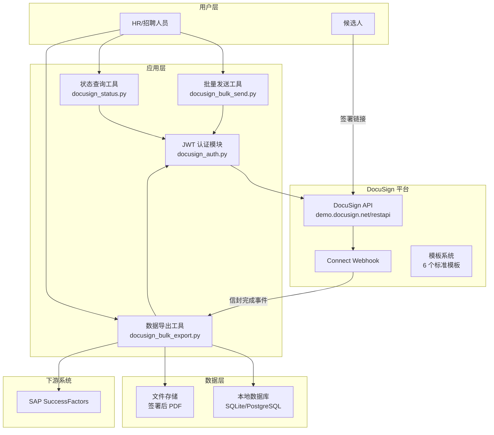
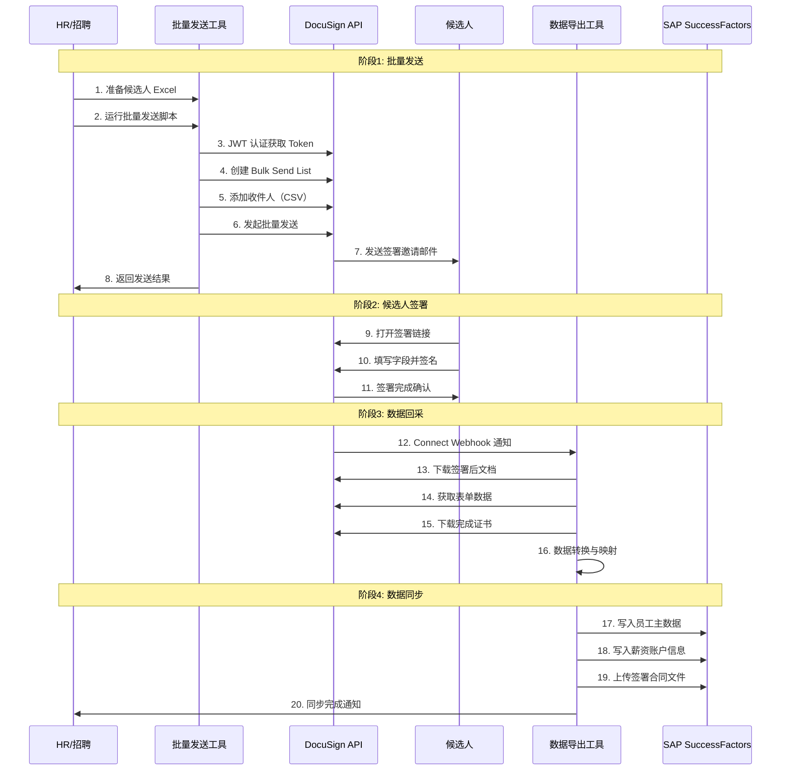
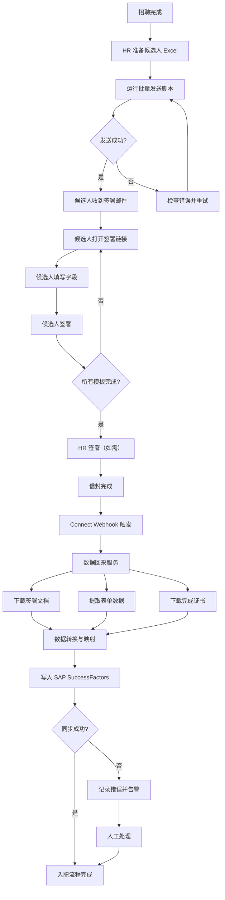

# DocuSign 落地实施报告

**报告日期：2026年06月06日**

---

## 1. 项目概述

### 1.1 项目目标

本项目旨在为蓝领招聘公司搭建 DocuSign 电子签名平台，实现批量入职文件在线签署、数据自动回采、与 SAP SuccessFactors 系统对接的全链路自动化。

### 1.2 项目范围

| 范围项 | 包含 | 不包含 |
|---|---|---|
| 模板设计 | 6 个标准模板 | 自定义模板样式设计 |
| 批量发送 | 基于 Bulk Send API 的批量发送工具 | 实时单发场景 |
| 数据回采 | 签署后表单数据、文档、证书下载 | 实时数据同步 |
| 系统集成 | 与 SAP SuccessFactors 对接 | 其他 HR 系统对接 |
| 账号配置 | Demo 环境搭建、API 凭证配置 | 生产环境上线 |

### 1.3 利益相关方

| 角色 | 职责 |
|---|---|
| 项目负责人 | 整体协调、进度管理、决策 |
| HR 团队 | 模板需求确认、操作手册审核、验收测试 |
| IT 团队 | API 集成、系统部署、运维支持 |
| 法务团队 | 模板内容审核、合规性确认 |
| 招聘团队 | 批量发送操作、异常处理 |

---

## 2. 账号与 API 凭证

### 2.1 环境信息

| 环境 | 登录地址 | API 基础 URL | 认证 URL |
|---|---|---|---|
| Demo 沙箱 | `https://apps-d.docusign.com` | `https://demo.docusign.net/restapi` | `https://account-d.docusign.com` |
| Admin 管理 | `https://admindemo.docusign.com` | - | - |

### 2.2 账号信息

| 项目 | 值 |
|---|---|
| 账号邮箱 | `ross.wang@te.com` |
| 初始密码 | `[请联系 IT 部门获取]` |
| 历史账号 | `289631530@qq.com`（已切换） |
| 手机尾号 | 0160（2FA 短信接收） |

### 2.3 创建应用与获取凭证

**步骤 1：登录 Admin 控制台**
1. 访问 `https://admindemo.docusign.com`
2. 使用 `ross.wang@te.com` 登录
3. 进入 Settings → Apps and Keys

**步骤 2：创建应用**
1. 点击 "Add App" 或 "Create App"
2. 填写应用名称：`BlueCollarRecruit-BulkSend`
3. 认证方式选择：**Authorization Code Grant**（用于获取 consent）
4. 设置 Redirect URI：`https://localhost/redirect`（开发阶段可用任意 HTTPS URI）

**步骤 3：获取 Integration Key**
- 创建完成后，复制 **Integration Key**（即 Client ID）
- 保存到安全位置

**步骤 4：生成 RSA 密钥对**
1. 在应用详情页，点击 "Generate RSA" 或上传已有公钥
2. 系统生成 RSA 密钥对，**立即下载私钥**（仅显示一次）
3. 私钥保存到：`/home/wang/wk/code/docusign/private.key`
4. 权限设置：`chmod 600 private.key`

**步骤 5：JWT Consent 授权**

> **当前状态**：Consent 尚未完成。由于手机尾号 0160 的 2FA SMS 验证问题，暂时无法完成授权。

授权 URL（Demo 环境）：
```
https://account-d.docusign.com/oauth/auth?
  response_type=code&
  scope=signature%20impersonation&
  client_id={INTEGRATION_KEY}&
  redirect_uri={REDIRECT_URI}
```

**解决方法**：
1. 联系 DocuSign 支持，请求关闭 2FA 或切换验证方式
2. 使用管理员账号在 Org Admin 中授予 blanket consent（需要 Access Management with SSO 功能）[citation:12]
3. 申请将 Demo 账号升级以包含 SSO 功能，发送邮件至 `go-live@docusign.com`

### 2.4 凭证管理

```bash
# 配置文件结构
/home/wang/wk/code/docusign/
├── config/
│   ├── config.yaml          # 环境配置
│   ├── private.key          # RSA 私钥（chmod 600）
│   └── .env                 # 环境变量（不提交到 Git）
├── scripts/
│   ├── docusign_auth.py     # JWT 认证模块
│   ├── docusign_bulk_send.py # 批量发送工具
│   ├── docusign_status.py   # 状态查询工具
│   └── docusign_bulk_export.py # 数据导出工具
└── logs/
    └── docusign.log         # 运行日志
```

**config.yaml 示例：**
```yaml
docusign:
  environment: demo  # demo | production
  integration_key: "YOUR_INTEGRATION_KEY"
  user_id: "YOUR_USER_ID"  # API Username
  account_id: "YOUR_ACCOUNT_ID"
  private_key_file: "config/private.key"
  auth_server: "https://account-d.docusign.com"
  api_base: "https://demo.docusign.net/restapi"
  redirect_uri: "https://localhost/redirect"
```

---

## 3. 模板设计

### 3.1 模板总览

| 编号 | 模板名称 | 文档数量 | 签署角色 | 字段数 | 用途 |
|---|---|---|---|---|---|
| T1 | Offer Letter | 1 | 候选人、HR | 8 | 正式录用通知 |
| T2 | 个人信息授权书 | 1 | 候选人 | 4 | 个保法合规 |
| T3 | NDA 保密协议 | 1 | 候选人、HR | 3 | 商业秘密保护 |
| T4 | 个人信息采集表 | 1 | 候选人 | 12 | 员工档案 |
| T5 | 银行账户采集表 | 1 | 候选人 | 5 | 薪资发放 |
| T6 | 证件采集表 | 1 | 候选人 | 3 | 入职审核 |

### 3.2 模板详细规格

#### T1: Offer Letter

**文档内容：** 录用通知书（含职位、薪资、入职日期等）

**角色定义：**

| 角色 | 签署顺序 | 权限 |
|---|---|---|
| 候选人 | 1 | 签名、填写确认信息 |
| HR 代表 | 2 | 签名确认 |

**字段映射：**

| 字段标签 | 字段类型 | 角色 | 必填 | 说明 |
|---|---|---|---|---|
| `candidate_name` | Text | 候选人 | 是 | 候选人姓名（预填） |
| `position` | Text | 候选人 | 是 | 职位名称（预填） |
| `salary` | Text | 候选人 | 是 | 薪资（预填） |
| `start_date` | DateSigned | 候选人 | 是 | 入职日期（预填） |
| `department` | Text | 候选人 | 是 | 部门（预填） |
| `candidate_sign` | SignHere | 候选人 | 是 | 候选人签名 |
| `hr_name` | Text | HR | 是 | HR 姓名（预填） |
| `hr_sign` | SignHere | HR | 是 | HR 签名 |

#### T2: 个人信息授权书

**文档内容：** 根据《个人信息保护法》要求的授权声明

**角色定义：**

| 角色 | 签署顺序 | 权限 |
|---|---|---|
| 候选人 | 1 | 签名确认 |

**字段映射：**

| 字段标签 | 字段类型 | 角色 | 必填 | 说明 |
|---|---|---|---|---|
| `name` | Text | 候选人 | 是 | 姓名（预填） |
| `id_number` | Text | 候选人 | 是 | 身份证号（预填） |
| `agree_check` | Checkbox | 候选人 | 是 | 同意授权 |
| `candidate_sign` | SignHere | 候选人 | 是 | 签名 |

#### T3: NDA 保密协议

**文档内容：** 标准保密协议

**角色定义：**

| 角色 | 签署顺序 | 权限 |
|---|---|---|
| 候选人 | 1 | 签名 |
| HR 代表 | 2 | 签名 |

**字段映射：**

| 字段标签 | 字段类型 | 角色 | 必填 | 说明 |
|---|---|---|---|---|
| `candidate_name` | Text | 候选人 | 是 | 姓名（预填） |
| `candidate_sign` | SignHere | 候选人 | 是 | 签名 |
| `hr_sign` | SignHere | HR | 是 | HR 签名 |

#### T4: 个人信息采集表

**文档内容：** 员工个人信息登记表

**角色定义：**

| 角色 | 签署顺序 | 权限 |
|---|---|---|
| 候选人 | 1 | 填写并签名 |

**字段映射：**

| 字段标签 | 字段类型 | 角色 | 必填 | 说明 |
|---|---|---|---|---|
| `full_name` | Text | 候选人 | 是 | 姓名 |
| `gender` | List | 候选人 | 是 | 性别（男/女） |
| `birth_date` | Text | 候选人 | 是 | 出生日期 |
| `nationality` | Text | 候选人 | 是 | 民族 |
| `marital_status` | List | 候选人 | 是 | 婚姻状况 |
| `education` | List | 候选人 | 是 | 学历 |
| `phone` | Text | 候选人 | 是 | 手机号 |
| `email` | Email | 候选人 | 是 | 邮箱 |
| `emergency_contact` | Text | 候选人 | 是 | 紧急联系人 |
| `emergency_phone` | Text | 候选人 | 是 | 紧急联系电话 |
| `address` | Text | 候选人 | 否 | 家庭住址 |
| `candidate_sign` | SignHere | 候选人 | 是 | 确认签名 |

#### T5: 银行账户采集表

**文档内容：** 薪资发放银行账户信息登记

**角色定义：**

| 角色 | 签署顺序 | 权限 |
|---|---|---|
| 候选人 | 1 | 填写并签名 |

**字段映射：**

| 字段标签 | 字段类型 | 角色 | 必填 | 说明 |
|---|---|---|---|---|
| `bank_name` | Text | 候选人 | 是 | 开户行名称 |
| `bank_account` | Text | 候选人 | 是 | 银行卡号 |
| `account_name` | Text | 候选人 | 是 | 开户人姓名 |
| `id_number` | Text | 候选人 | 是 | 身份证号（验证用） |
| `candidate_sign` | SignHere | 候选人 | 是 | 确认签名 |

#### T6: 证件采集表

**文档内容：** 身份证及资质证件上传

**角色定义：**

| 角色 | 签署顺序 | 权限 |
|---|---|---|
| 候选人 | 1 | 上传文件并签名 |

**字段映射：**

| 字段标签 | 字段类型 | 角色 | 必填 | 说明 |
|---|---|---|---|---|
| `id_front` | FileAttachment | 候选人 | 是 | 身份证正面 |
| `id_back` | FileAttachment | 候选人 | 是 | 身份证反面 |
| `certificate` | FileAttachment | 候选人 | 否 | 资格证书 |
| `candidate_sign` | SignHere | 候选人 | 是 | 确认签名 |

### 3.3 模板创建步骤

**通过 Web 界面创建：**
1. 登录 `https://admindemo.docusign.com`
2. 进入 Templates → Create Template
3. 上传文档 PDF（文档中需包含 Anchor Strings）
4. 添加角色（Recipients/Roles）
5. 拖拽字段到文档对应位置
6. 配置字段属性（必填、预填值、数据标签）
7. 保存模板，记录 Template ID

**通过 API 创建：**
```python
import requests

def create_template(access_token, account_id, template_name, document_path):
    """通过 API 创建模板"""
    url = f"https://demo.docusign.net/restapi/v2.1/accounts/{account_id}/templates"
    
    with open(document_path, "rb") as f:
        doc_bytes = f.read()
    
    # 先上传文档
    files = {
        "file": ("document.pdf", doc_bytes, "application/pdf")
    }
    headers = {
        "Authorization": f"Bearer {access_token}"
    }
    
    # 创建模板
    template_data = {
        "name": template_name,
        "emailSubject": "请签署您的入职文件",
        "recipients": {
            "signers": [
                {
                    "roleName": "候选人",
                    "recipientId": "1",
                    "routingOrder": "1"
                },
                {
                    "roleName": "HR",
                    "recipientId": "2",
                    "routingOrder": "2"
                }
            ]
        }
    }
    
    response = requests.post(url, headers=headers, 
                            data={"templateDefinition": str(template_data)},
                            files=files)
    return response.json()
```

---

## 4. 系统架构

### 4.1 整体架构



### 4.2 数据流



---

## 5. 核心 Python 工具

### 5.1 工具总览

| 脚本 | 功能 | 依赖 | 输出 |
|---|---|---|---|
| `docusign_auth.py` | JWT 认证模块 | PyJWT, requests | access_token |
| `docusign_bulk_send.py` | 批量发送 | docusign_auth, pandas | 发送结果 CSV |
| `docusign_status.py` | 状态查询 | docusign_auth | 状态报告 |
| `docusign_bulk_export.py` | 数据导出 | docusign_auth | 数据文件 |

### 5.2 docusign_auth.py

```python
#!/usr/bin/env python3
"""DocuSign JWT 认证模块"""

import json
import time
import jwt
import requests
from pathlib import Path
from typing import Optional


class DocusignAuth:
    """DocuSign JWT 认证"""
    
    def __init__(self, config: dict):
        self.config = config
        self._token: Optional[str] = None
        self._expiry: int = 0
        
        # 读取私钥
        key_path = Path(config["private_key_file"])
        self._private_key = key_path.read_text()
    
    def get_access_token(self) -> str:
        """获取 access_token，自动处理刷新"""
        if self._token and time.time() < self._expiry - 300:
            return self._token
        
        return self._request_token()
    
    def _request_token(self) -> str:
        """请求新的 access_token"""
        now = int(time.time())
        
        # 构造 JWT
        jwt_payload = {
            "iss": self.config["integration_key"],
            "sub": self.config["user_id"],
            "iat": now,
            "exp": now + 3600,
            "aud": self.config["auth_server"],
            "scope": "signature impersonation"
        }
        
        assertion = jwt.encode(
            jwt_payload,
            self._private_key,
            algorithm="RS256"
        )
        
        # 请求 token
        url = f"{self.config['auth_server']}/oauth/token"
        data = {
            "grant_type": "urn:ietf:params:oauth:grant-type:jwt-bearer",
            "assertion": assertion
        }
        
        response = requests.post(url, data=data)
        response.raise_for_status()
        
        result = response.json()
        self._token = result["access_token"]
        self._expiry = now + result["expires_in"]
        
        return self._token
    
    def get_api_client(self) -> dict:
        """获取 API 客户端配置"""
        return {
            "base_url": self.config["api_base"],
            "account_id": self.config["account_id"],
            "headers": {
                "Authorization": f"Bearer {self.get_access_token()}",
                "Content-Type": "application/json"
            }
        }
```

### 5.3 docusign_bulk_send.py

```python
#!/usr/bin/env python3
"""DocuSign 批量发送工具"""

import csv
import json
import sys
import time
import requests
from pathlib import Path
from typing import List, Dict

from docusign_auth import DocusignAuth


class BulkSendTool:
    """批量发送工具"""
    
    def __init__(self, auth: DocusignAuth):
        self.auth = auth
        self.client = auth.get_api_client()
    
    def send_bulk(self, template_id: str, recipients_csv: str) -> Dict:
        """执行批量发送"""
        api = self.client
        
        # 步骤1: 创建批量发送列表
        list_url = f"{api['base_url']}/v2.1/accounts/{api['account_id']}/bulk_send_lists"
        list_data = {
            "name": f"批量发送-{time.strftime('%Y%m%d-%H%M%S')}"
        }
        
        resp = requests.post(list_url, headers=api['headers'], json=list_data)
        resp.raise_for_status()
        list_id = resp.json()["bulkSendListId"]
        
        # 步骤2: 添加收件人
        recipients = self._load_recipients(recipients_csv)
        recipients_url = f"{list_url}/{list_id}/recipients"
        
        resp = requests.post(recipients_url, headers=api['headers'], json={
            "recipients": recipients
        })
        resp.raise_for_status()
        
        # 步骤3: 发起批量发送
        send_url = f"{list_url}/{list_id}"
        resp = requests.put(send_url, headers=api['headers'], json={
            "bulkSendListId": list_id,
            "envelopeOrTemplateId": template_id
        })
        resp.raise_for_status()
        
        return {
            "list_id": list_id,
            "total": len(recipients),
            "status": resp.json().get("state", "queued")
        }
    
    def _load_recipients(self, csv_path: str) -> List[Dict]:
        """从 CSV 加载收件人列表"""
        recipients = []
        with open(csv_path, "r", encoding="utf-8-sig") as f:
            reader = csv.DictReader(f)
            for row in reader:
                recipient = {
                    "name": row["name"],
                    "email": row["email"],
                    "roleName": row.get("role", "候选人"),
                    "tabs": []
                }
                
                # 添加预填字段
                for key, value in row.items():
                    if key not in ("name", "email", "role"):
                        recipient["tabs"].append({
                            "tabLabel": key,
                            "value": value
                        })
                
                recipients.append(recipient)
        
        return recipients


def main():
    """主入口"""
    import yaml
    
    # 加载配置
    config = yaml.safe_load(Path("config/config.yaml").read_text())
    auth = DocusignAuth(config["docusign"])
    
    # 解析参数
    template_id = sys.argv[1]
    csv_file = sys.argv[2]
    
    # 执行批量发送
    tool = BulkSendTool(auth)
    result = tool.send_bulk(template_id, csv_file)
    
    print(json.dumps(result, indent=2, ensure_ascii=False))


if __name__ == "__main__":
    main()
```

### 5.4 docusign_status.py

```python
#!/usr/bin/env python3
"""DocuSign 状态查询工具"""

import json
import sys
import requests
from docusign_auth import DocusignAuth


def check_bulk_status(auth: DocusignAuth, list_id: str):
    """查询批量发送状态"""
    api = auth.get_api_client()
    url = f"{api['base_url']}/v2.1/accounts/{api['account_id']}/bulk_send_lists/{list_id}"
    
    resp = requests.get(url, headers=api['headers'])
    resp.raise_for_status()
    
    data = resp.json()
    print(f"批量发送列表: {data.get('name', 'N/A')}")
    print(f"状态: {data.get('state', 'N/A')}")
    print(f"总数: {data.get('totalRecipients', 0)}")
    print(f"成功: {data.get('successfulRecipients', 0)}")
    print(f"失败: {data.get('failedRecipients', 0)}")
    
    return data


def check_envelope_status(auth: DocusignAuth, envelope_id: str):
    """查询单个信封状态"""
    api = auth.get_api_client()
    url = f"{api['base_url']}/v2.1/accounts/{api['account_id']}/envelopes/{envelope_id}"
    
    resp = requests.get(url, headers=api['headers'])
    resp.raise_for_status()
    
    data = resp.json()
    print(f"信封 ID: {envelope_id}")
    print(f"状态: {data.get('status', 'N/A')}")
    print(f"发送时间: {data.get('sentDateTime', 'N/A')}")
    print(f"完成时间: {data.get('completedDateTime', 'N/A')}")
    
    return data


if __name__ == "__main__":
    import yaml
    from pathlib import Path
    
    config = yaml.safe_load(Path("config/config.yaml").read_text())
    auth = DocusignAuth(config["docusign"])
    
    if len(sys.argv) < 2:
        print("用法: python docusign_status.py <list_id|envelope_id>")
        sys.exit(1)
    
    id_value = sys.argv[1]
    
    if id_value.startswith("bulk_"):
        check_bulk_status(auth, id_value)
    else:
        check_envelope_status(auth, id_value)
```

### 5.5 docusign_bulk_export.py

```python
#!/usr/bin/env python3
"""DocuSign 批量导出工具"""

import csv
import json
import sys
from pathlib import Path
import requests
from docusign_auth import DocusignAuth


class BulkExportTool:
    """批量导出工具"""
    
    def __init__(self, auth: DocusignAuth):
        self.auth = auth
        self.client = auth.get_api_client()
    
    def export_form_data(self, envelope_ids: list, output_dir: str):
        """导出表单数据"""
        api = self.client
        results = []
        
        for env_id in envelope_ids:
            url = f"{api['base_url']}/v2.1/accounts/{api['account_id']}/envelopes/{env_id}/form_data"
            resp = requests.get(url, headers=api['headers'])
            
            if resp.status_code == 200:
                data = resp.json()
                results.append({
                    "envelope_id": env_id,
                    "form_data": data.get("formData", [])
                })
        
        # 保存为 CSV
        output_path = Path(output_dir) / "form_data_export.csv"
        with open(output_path, "w", newline="", encoding="utf-8-sig") as f:
            writer = csv.writer(f)
            writer.writerow(["envelope_id", "field_name", "field_value"])
            for result in results:
                for field in result["form_data"]:
                    writer.writerow([
                        result["envelope_id"],
                        field.get("name", ""),
                        field.get("value", "")
                    ])
        
        print(f"表单数据已导出到: {output_path}")
        return results
    
    def export_documents(self, envelope_ids: list, output_dir: str):
        """导出签署后文档"""
        api = self.client
        output_path = Path(output_dir)
        output_path.mkdir(parents=True, exist_ok=True)
        
        for env_id in envelope_ids:
            # 下载合并文档
            url = f"{api['base_url']}/v2.1/accounts/{api['account_id']}/envelopes/{env_id}/documents/combined"
            resp = requests.get(url, headers=api['headers'])
            
            if resp.status_code == 200:
                file_path = output_path / f"{env_id}_combined.pdf"
                file_path.write_bytes(resp.content)
                print(f"文档已保存: {file_path}")
            
            # 下载完成证书
            cert_url = f"{api['base_url']}/v2.1/accounts/{api['account_id']}/envelopes/{env_id}/documents/certificate"
            resp = requests.get(cert_url, headers=api['headers'])
            
            if resp.status_code == 200:
                file_path = output_path / f"{env_id}_certificate.pdf"
                file_path.write_bytes(resp.content)
                print(f"证书已保存: {file_path}")


if __name__ == "__main__":
    import yaml
    
    config = yaml.safe_load(Path("config/config.yaml").read_text())
    auth = DocusignAuth(config["docusign"])
    tool = BulkExportTool(auth)
    
    if len(sys.argv) < 3:
        print("用法: python docusign_bulk_export.py <envelope_ids_file> <output_dir>")
        sys.exit(1)
    
    # 读取信封 ID 列表
    with open(sys.argv[1]) as f:
        envelope_ids = [line.strip() for line in f if line.strip()]
    
    tool.export_form_data(envelope_ids, sys.argv[2])
    tool.export_documents(envelope_ids, sys.argv[2])
```

---

## 6. 业务流程

### 6.1 完整流程图



### 6.2 异常处理流程

| 异常场景 | 处理方式 | 责任人 |
|---|---|---|
| 候选人邮箱错误 | 邮件退回通知，HR 修正后重新发送 | HR |
| 候选人拒绝签署 | 电话沟通原因，重新发送或取消 | 招聘 |
| 信封过期（30天） | 重新发送签署邀请 | 系统自动 |
| API 调用失败 | 自动重试 3 次，仍失败则告警 | IT |
| Connect 通知丢失 | 定时轮询兜底（每小时） | 系统自动 |
| SuccessFactors 写入失败 | 记录失败队列，人工介入 | IT |

---

## 7. 部署与运行

### 7.1 环境要求

| 组件 | 版本要求 | 说明 |
|---|---|---|
| Python | 3.9+ | 运行脚本 |
| pip | 21+ | 包管理 |
| 操作系统 | Linux/macOS/Windows | 跨平台 |
| 网络 | 可访问 `*.docusign.com` | 需出站 HTTPS |

### 7.2 安装步骤

```bash
# 1. 创建项目目录
mkdir -p /home/wang/wk/code/docusign/{config,scripts,logs,output}

# 2. 安装 Python 依赖
pip install requests pyjwt pyyaml pandas

# 3. 配置私钥权限
chmod 600 /home/wang/wk/code/docusign/config/private.key

# 4. 创建配置文件
cp config.yaml.template config/config.yaml
# 编辑 config.yaml 填入实际凭证

# 5. 验证认证
python scripts/docusign_auth.py --test
```

### 7.3 配置项说明

| 配置项 | 说明 | 示例 |
|---|---|---|
| `environment` | 环境标识 | `demo` 或 `production` |
| `integration_key` | 应用集成密钥 | `abc123-...` |
| `user_id` | API 用户 ID | `def456-...` |
| `account_id` | 账号 ID | `ghi789-...` |
| `private_key_file` | RSA 私钥路径 | `config/private.key` |
| `auth_server` | 认证服务器 | `https://account-d.docusign.com` |
| `api_base` | API 基础 URL | `https://demo.docusign.net/restapi` |

### 7.4 启动命令

```bash
# 批量发送
python scripts/docusign_bulk_send.py \
    <template_id> \
    data/candidates_20260606.csv

# 查询批量发送状态
python scripts/docusign_status.py \
    bulk_<list_id>

# 查询单个信封状态
python scripts/docusign_status.py \
    <envelope_id>

# 导出数据
python scripts/docusign_bulk_export.py \
    data/envelope_ids.txt \
    output/20260606/
```

### 7.5 候选人 Excel 格式

| name | email | role | candidate_name | position | salary | start_date |
|---|---|---|---|---|---|---|
| 张三 | zhangsan@example.com | 候选人 | 张三 | 装配工 | 8000 | 2026-07-01 |
| 李四 | lisi@example.com | 候选人 | 李四 | 焊工 | 10000 | 2026-07-01 |
| 王五 | wangwu@example.com | 候选人 | 王五 | 质检员 | 9000 | 2026-07-15 |

---

## 8. 监控与运维

### 8.1 信封状态轮询

```python
def poll_envelope_status(auth, envelope_ids: list, interval: int = 300):
    """定期轮询信封状态"""
    api = auth.get_api_client()
    
    while True:
        pending = []
        for env_id in envelope_ids:
            url = f"{api['base_url']}/v2.1/accounts/{api['account_id']}/envelopes/{env_id}"
            resp = requests.get(url, headers=api['headers'])
            
            if resp.status_code == 200:
                status = resp.json().get("status")
                print(f"{env_id}: {status}")
                
                if status == "completed":
                    # 触发数据导出
                    export_envelope_data(auth, env_id)
                elif status in ("sent", "delivered"):
                    pending.append(env_id)
        
        if not pending:
            break
        
        time.sleep(interval)
```

### 8.2 Connect 接收服务

```python
from flask import Flask, request
import hmac
import hashlib

app = Flask(__name__)
CONNECT_SECRET = "your-hmac-secret"

@app.route("/webhooks/docusign", methods=["POST"])
def handle_connect():
    """处理 DocuSign Connect 通知"""
    # 验证 HMAC 签名
    signature = request.headers.get("X-DocuSign-Signature-1", "")
    payload = request.get_data()
    
    expected = hmac.new(
        CONNECT_SECRET.encode("utf-8"),
        payload,
        hashlib.sha256
    ).hexdigest()
    
    if not hmac.compare_digest(expected, signature):
        return "Invalid signature", 403
    
    # 处理事件
    data = request.json or {}
    event_type = data.get("event", "")
    envelope_id = data.get("envelopeId", "")
    
    if event_type == "envelope-completed":
        # 异步处理数据导出
        process_completed_envelope(envelope_id)
    
    return "OK", 200
```

### 8.3 告警规则

| 告警条件 | 告警方式 | 处理时限 |
|---|---|---|
| 批量发送失败率 > 5% | 邮件 + 企业微信 | 2 小时 |
| Connect 接收中断 > 30 分钟 | 电话告警 | 1 小时 |
| Token 刷新失败 | 邮件告警 | 30 分钟 |
| 信封过期率 > 10% | 周报统计 | 每周 |
| SuccessFactors 同步失败 | 邮件 + 工单 | 4 小时 |

---

## 9. 安全与合规

### 9.1 个人信息保护法合规

根据《中华人民共和国个人信息保护法》，候选人个人信息处理需满足以下要求：

| 要求 | 实现方式 |
|---|---|
| 明示同意 | 个人信息授权书模板，候选人签署确认 |
| 最小必要 | 仅采集入职必需信息 |
| 目的限制 | 明确告知信息用途（入职管理、薪资发放） |
| 安全保障 | 传输加密（TLS 1.2+）、存储加密（AES-256） |
| 删除权 | 候选人离职后可申请删除个人信息 |
| 跨境传输 | 数据存储在中国境内服务器 |

### 9.2 数据加密

| 环节 | 加密方式 | 说明 |
|---|---|---|
| API 传输 | TLS 1.2+ | HTTPS 加密传输 |
| 文档存储 | AES-256 | DocuSign 平台加密存储 |
| 本地存储 | AES-256-GCM | 下载后文件加密存储 |
| 敏感字段 | 应用层加密 | 身份证号、银行账号等 |
| 私钥存储 | 文件权限 600 | 仅应用进程可读 |

### 9.3 审计日志

```python
import logging
import json
from datetime import datetime

# 配置审计日志
audit_logger = logging.getLogger("docusign_audit")
handler = logging.FileHandler("logs/audit.log")
handler.setFormatter(logging.Formatter(
    "%(asctime)s | %(levelname)s | %(message)s"
))
audit_logger.addHandler(handler)
audit_logger.setLevel(logging.INFO)

def log_audit(action: str, user: str, details: dict):
    """记录审计日志"""
    audit_logger.info(json.dumps({
        "action": action,
        "user": user,
        "timestamp": datetime.utcnow().isoformat(),
        "details": details
    }, ensure_ascii=False))

# 使用示例
log_audit("bulk_send", "hr_zhang", {
    "template": "Offer Letter",
    "count": 50,
    "batch_id": "bulk_20260606_001"
})
```

### 9.4 数据保留策略

| 数据类型 | 保留期限 | 处理方式 |
|---|---|---|
| 签署后文档 | 员工在职期间 + 3 年 | 加密存储 |
| 表单数据 | 员工在职期间 + 3 年 | 数据库存储 |
| 完成证书 | 永久 | 法律要求 |
| 审计日志 | 5 年 | 日志归档 |
| API 调用日志 | 1 年 | 日志轮转 |

---

## 10. 测试用例

### 10.1 E2E 测试场景

| 编号 | 测试场景 | 前置条件 | 预期结果 |
|---|---|---|---|
| TC1 | 单候选人发送 Offer Letter | 模板已创建、JWT 已授权 | 候选人收到签署邮件 |
| TC2 | 批量 10 人发送 | Excel 包含 10 条记录 | 10 人全部收到邮件 |
| TC3 | 候选人完成签署 | 候选人打开链接并签名 | 信封状态变为 completed |
| TC4 | HR 签署 | 候选人已完成 | HR 收到签署通知 |
| TC5 | 表单数据回采 | 信封已完成 | 表单数据正确导出 |
| TC6 | 文档下载 | 信封已完成 | PDF 文件可正常打开 |
| TC7 | 完成证书下载 | 信封已完成 | 证书包含完整审计信息 |
| TC8 | 邮箱错误处理 | 邮箱格式错误 | 发送失败，错误提示明确 |
| TC9 | 候选人拒绝签署 | 候选人点击拒绝 | 信封状态变为 declined |
| TC10 | 信封过期 | 超过 30 天未签署 | 信封状态变为 expired |

### 10.2 测试数据

```csv
name,email,role,candidate_name,position,salary,start_date
测试用户A,test_a@example.com,候选人,测试用户A,装配工,8000,2026-07-01
测试用户B,test_b@example.com,候选人,测试用户B,焊工,10000,2026-07-01
测试用户C,test_c@example.com,候选人,测试用户C,质检员,9000,2026-07-15
```

### 10.3 验收标准

| 验收项 | 标准 | 验证方式 |
|---|---|---|
| 批量发送成功率 | >= 99% | 统计成功/总数 |
| 签署完成率 | >= 90%（7天内） | 统计完成/发送 |
| 数据回采准确率 | 100% | 对比原始数据 |
| 系统响应时间 | API 调用 < 5 秒 | 性能测试 |
| 异常处理覆盖率 | 100% 已知异常 | 测试用例覆盖 |

---

## 11. 后续规划

### 11.1 短期（1-3 个月）

| 任务 | 优先级 | 说明 |
|---|---|---|
| 完成 JWT Consent 授权 | P0 | 解决 2FA 问题 |
| 创建 6 个标准模板 | P0 | 通过 Web 界面创建 |
| 开发批量发送脚本 | P0 | 基于 Bulk Send API |
| 开发数据导出脚本 | P1 | 表单数据 + 文档下载 |
| 搭建 Connect 接收服务 | P1 | Webhook 接收端 |
| 编写操作手册 | P1 | 面向 HR 团队 |

### 11.2 中期（3-6 个月）

| 任务 | 优先级 | 说明 |
|---|---|---|
| SAP SuccessFactors 集成 | P0 | 数据自动同步 |
| 生产环境上线 | P0 | 申请 Go-Live |
| 监控告警系统 | P1 | 状态监控 + 告警 |
| 操作培训 | P1 | HR 团队培训 |
| 模板优化 | P2 | 根据反馈调整 |

### 11.3 长期（6-12 个月）

| 任务 | 说明 |
|---|---|
| IAM 升级评估 | 评估从 eSignature 升级到 IAM 的可行性 [citation:7][citation:8] |
| AI 自动审查 | 利用 Iris AI 自动审查合同条款 [citation:10][citation:11] |
| 离线场景支持 | 评估移动端离线签署方案 |
| 多语言支持 | 外籍员工英文模板 |
| Workflow Builder 自动化 | 实现签署后自动归档、自动通知等流程 |

---

## 12. 引用源（Sources Inventory）

1. [DocuSign Bulk Send Concept](https://developers.docusign.com/docs/esign-rest-api/esign101/concepts/envelopes/bulk-send/)
2. [DocuSign Bulk Send How-To](https://developers.docusign.com/docs/esign-rest-api/how-to/bulk-send-envelopes)
3. [DocuSign Bulk Send 2B](https://docusign.sfsu.edu/bulk-send-2b)
4. [DocuSign Support - Bulk Send](https://support.docusign.com/s/document-item?language=en_US&bundleId=wtn1643071711000&topicId=lao1578456383175.html)
5. [DocuSign eSignature REST API Reference](https://developers.docusign.com/docs/esign-rest-api/reference)
6. [DocuSign AI Contract Review Assistant](https://www.nasdaq.com/press-release/docusign-introduces-ai-contract-review-assistant-streamline-agreements-workflows-2026)
7. [DocuSign IAM Core](https://www.docusign.com/en-gb/solutions/iam-core)
8. [Fluidlabs - Complete DocuSign IAM Implementation Guide 2026](https://fluidlabs.com/resources/complete-docusign-iam-implementation-guide)
9. [DocuSign Connect Webhook 文档](http://support.docusign.com/s/document-item?bundleId=yks1643320936212&topicId=jrd1687963287611.html)
10. [DocuSign Iris Agreement AI](https://www.docusign.com/blog/docusign-iris-agreement-ai)
11. [PRNewswire - DocuSign AI Contract Review Assistant](https://www.prnewswire.com/news-releases/docusign-introduces-ai-contract-review-assistant-to-streamline-agreements-workflows-302724073.html)
12. [DocuSign Blog - OAuth JWT Granting Consent](https://www.docusign.com/blog/developers/oauth-jwt-granting-consent)
13. [DocuSign JWT Grant Authentication](https://developers.docusign.com/platform/auth/jwt/)
14. [DocuSign JWT Get Token](https://developers.docusign.com/platform/auth/jwt-get-token/)
15. [APIScout - DocuSign API Document Signing Integration 2026](https://apiscout.dev/guides/how-to-build-document-signing-docusign-2026)
16. [DocuSign eSignature Product Page](https://www.docusign.com/products/electronic-signature)
17. [DocuSign REST API Authentication](https://developers.docusign.com/docs/esign-rest-api/esign101/auth)
18. [DocuSign Community - JWT Integration Setup](https://community.docusign.com/esignature-api-63/i-am-trying-to-create-a-api-intergration-jwt-intergration-26544)

---

*本报告由 AI 辅助生成，基于 DocuSign 官方文档及 2026 年公开资料。所有技术细节以 DocuSign 官方最新文档为准。*
