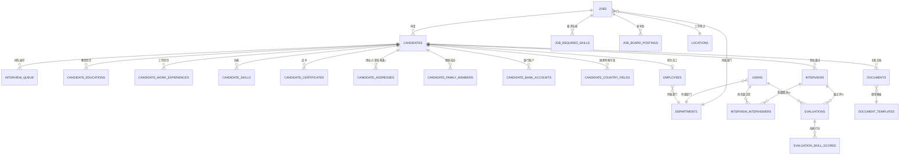
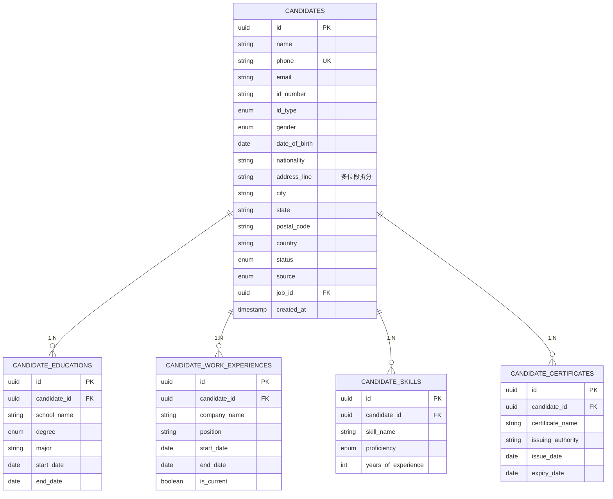
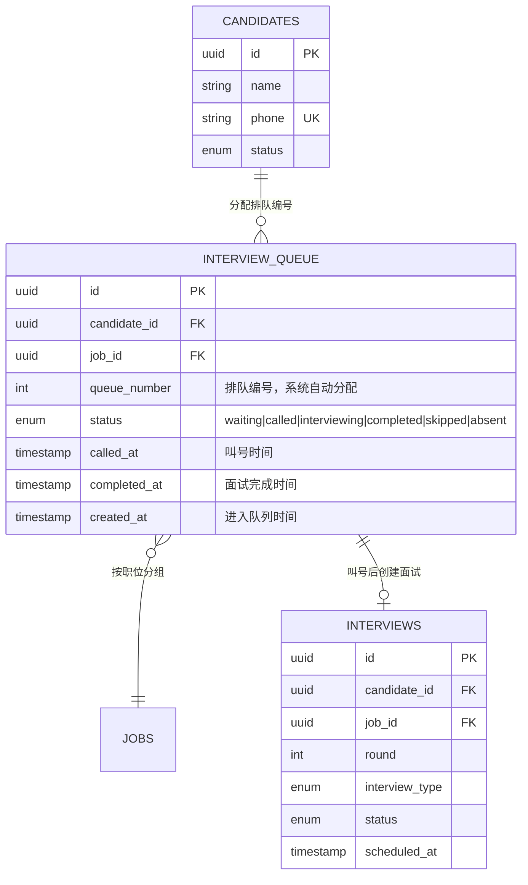
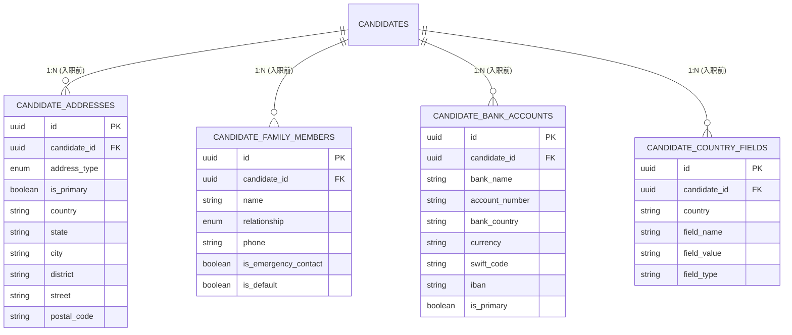
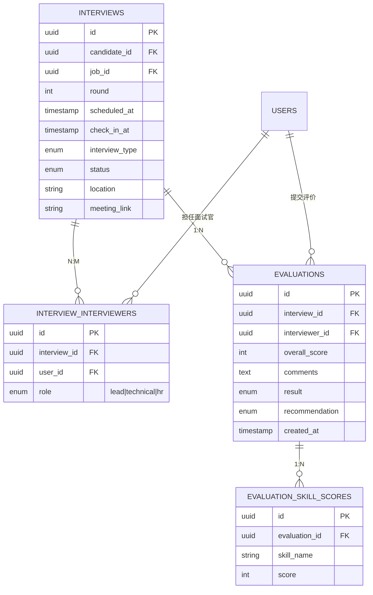

# Easy Hire 招聘管理系统设计需求文档

**文档版本：v2.0**
**日期：2026年5月19日（更新于2026年5月24日）**
**项目代号：Easy Hire**
**文档性质：设计需求文档（含界面设计描述、数据模型、实体关联图谱、下拉字段映射）**

---

## 目录

1. [执行摘要](#1-执行摘要)
2. [术语与主数据字典](#2-术语与主数据字典)
3. [全流程设计](#3-全流程设计)
4. [候选人简历与叫号机制](#4-候选人简历与叫号机制)
5. [实体关联关系图谱（ER）](#5-实体关联关系图谱er)
6. [界面下拉字段映射](#6-界面下拉字段映射)
7. [数据模型详设计](#7-数据模型详设计)
8. [产品综合对比分析](#8-产品综合对比分析)
9. [集成对接方案](#9-集成对接方案)
10. [实施路线图](#10-实施路线图)
11. [附录：参考来源](#11-附录参考来源)

---

## 1. 执行摘要

### 1.1 项目背景

Easy Hire 是一套面向现场招聘会场景的招聘管理系统，覆盖从职位发布、现场简历采集、叫号面试、多面试官评价、综合录用、批量电子签、入职数据同步到员工档案形成的端到端流程。

**核心流程**：

```
员工现场查看发布的岗位 → 候选人现场填写简历 → 申请职位
  → 系统分配面试排队编号 → 叫号面试 → 多面试官面试 → 面试反馈
  → 综合评分输出 → 录用审批 → 数据导出(筛选通过面试者)
  → 批量发起 DocuSign 电子签 → 完成签署
  → 收集入职前数据(多地址/家庭成员/银行/国家特殊字段)
  → 导出入职数据 → API 更新 → SuccessFactors 入职操作 → 形成员工数据
```

**数据采集三阶段**：

| 阶段 | 数据内容 | 录入方 | 时机 |
|------|----------|--------|------|
| **候选人申请阶段** | 个人基本信息、教育经历(多条)、工作经历(多条)、技能(多条)、证书(多条)、地址(多个表单字段拆分为 country/city/street 等独立字段) | 候选人现场填写 | 提交职位申请时 |
| **入职前补充阶段** | 多地址(含主地址)、家庭成员(含默认紧急联系人)、银行账户、国家特殊字段 | HR 引导候选人或自行录入 | 签署完成后、入职前 |
| **HR 核心同步阶段** | 员工编号、部门、职位、入职日期 → SuccessFactors 同步 | 系统自动 + HR 确认 | 入职前数据采集完成后 |

- **个人能力信息**（教育经历、工作经历、技能、证书）均支持多条记录，面试阶段即开始采集
- **地址信息**：候选人简历阶段以多个表单字段录入（国家、省/州、城市、街道、邮编），仅一条地址记录；入职前阶段通过 `candidate_addresses` 子表允许多条地址，其中一条标记为主地址
- **紧急联系人**：源自家庭成员表，可标记默认联系人
- **面试排队编号**：候选人提交简历后，系统自动分配一个排队编号，面试经理按编号叫号，候选人凭编号面试

### 1.2 研究范围

| 类别 | 研究对象 |
|------|----------|
| 全球 ATS | Greenhouse, Lever, Workable, BambooHR, iCIMS, Ashby |
| 中国 ATS | Moka, 北森, 飞书招聘, 牛客, 谷露, 用友大易 |
| 协同平台 | 飞书/Lark, 钉钉, 企业微信, Teams |
| 电子签 | DocuSign, 法大大, e签宝, 腾讯电子签 |
| HR 系统 | SAP SuccessFactors, Workday, BambooHR |

### 1.3 核心结论

**推荐产品组合**：
- **协同底座**：飞书招聘 —— 三合一工作台、深度 IM/日历/邮件打通
- **ATS 核心**：Moka 或自建 ATS 模块
- **电子签**：DocuSign（全球）+ 法大大（中国）
- **HR 核心**：SAP SuccessFactors —— OData API 入职同步

---

## 2. 术语与主数据字典

### 2.1 核心术语

| 术语 | 英文 | 说明 |
|------|------|------|
| 职位 | Job | HR 创建的招聘岗位 |
| 候选人 | Candidate | 填写简历并申请职位的人，贯穿全流程 |
| 排队编号 | Queue Number | 候选人提交简历后系统自动分配的面试顺序号，也是叫号的依据 |
| 叫号 | Call Number | 面试经理按排队编号呼叫下一位候选人进入面试 |
| 面试队列 | Interview Queue | 现场招聘会的叫号等待队列 |
| 面试官 | Interviewer | 参与面试并提交评价的系统用户 |
| Hiring Manager | Hiring Manager | 部门负责人，拥有录用审批权 |
| 评价 | Evaluation | 面试官对候选人单次面试的结构化评分 |
| 电子签信封 | Envelope | DocuSign 中的一份签署文件包裹 |
| 入职前数据 | Pre-Onboarding Data | 签署合同后、入职前需收集的补充信息 |
| 员工 | Employee | 入职同步完成后在 HR 系统中形成的记录 |

### 2.2 主数据 / 枚举字典

以下为系统中下拉字段的主要数据来源，独立维护，不作为业务流水表：

| 主数据类型 | 存储方式 | 典型值 |
|------------|----------|--------|
| 国家/地区 | `countries` 表 | 中国、美国、新加坡… |
| 币种 | `currencies` 表 | CNY, USD, EUR, JPY, GBP, SGD… |
| 部门 | `departments` 表 | 技术部、产品部、市场部… |
| 办公地点 | `locations` 表 | 深圳、北京、新加坡… |
| 职位类别 | `job_categories` 表 | 技术、销售、运营、职能… |
| 合同模板 | `document_templates` 表 | 劳动合同(中文版)、Employment Contract(English)… |
| 招聘渠道/Board | `job_boards` 表 | LinkedIn, Indeed, 猎聘, BOSS直聘… |
| 用户 | `users` 表 | 含角色(admin/hr/interviewer/manager) |

**枚举常量**（代码中定义，不入主数据表）：

| 枚举名 | 值 |
|--------|-----|
| 候选人状态 | `new`, `screening`, `queue_waiting`, `interviewing`, `evaluated`, `offered`, `document_signing`, `signed`, `pre_onboarding`, `ready_to_sync`, `synced`, `hired`, `rejected` |
| 证件类型 | `id_card`, `passport`, `other` |
| 性别 | `male`, `female`, `other` |
| 学历 | `high_school`, `associate`, `bachelor`, `master`, `phd`, `other` |
| 技能熟练度 | `beginner`, `intermediate`, `advanced`, `expert` |
| 面试方式 | `in_person`, `video`, `phone` |
| 面试结果 | `pass`, `fail`, `pending` |
| 录用建议 | `strongly_hire`, `hire`, `neutral`, `no_hire`, `strongly_no_hire` |
| 地址类型 | `home`, `work`, `registered`(户籍), `hukou`(户口), `mailing` |
| 家庭成员关系 | `spouse`, `parent`, `child`, `sibling`, `other` |
| 银行账户类型 | `savings`, `checking` |
| 签署服务商 | `docusign`, `fadada` |
| 雇佣类型 | `full_time`, `part_time`, `contract`, `intern` |
| 同步状态 | `pending`, `synced`, `failed` |
| 席位状态 | `waiting`, `called`, `interviewing`, `completed`, `skipped`, `absent` |

---

## 3. 全流程设计

### 3.1 招聘全流程（含叫号机制与入职前数据采集）

```
┌─────────────────┐   ┌─────────────────┐   ┌─────────────────┐   ┌─────────────────┐
│  1.职位发布       │ → │ 2.现场查看职位    │ → │ 3.填写简历        │ → │ 4.提交申请       │
│  (HR 创建/发布)  │   │ (候选人扫码浏览)  │   │ (候选人现场填写)   │   │ (分配排队编号)    │
│  → job_boards    │   │ → 职位广场        │   │ 含：教育/工作/技能 │   │ 状态: queue_waiting │
│    同步发布      │   │                   │   │ /证书/地址(多字段) │   │                  │
└─────────────────┘   └─────────────────┘   └─────────────────┘   └───────┬─────────┘
                                                                           │
        ┌──────────────────────────────────────────────────────────────────┘
        ↓
┌─────────────────┐   ┌─────────────────────┐   ┌─────────────────┐   ┌─────────────────┐
│  5.AI 简历筛选   │ → │ 6.叫号 -- 进入面试队列  │ → │ 7.多面试官面试    │ → │ 8.面试反馈       │
│  (自动提取+匹配) │   │ (HR/经理按编号叫候选人) │   │ (并行安排多面试官)│   │ (结构化评价汇总) │
│  筛选通过后进入  │   │ 大屏显示当前叫号       │   │ 面试官查看简历    │   │                  │
│  排队等待状态    │   │ 候选人凭编号参加面试   │   │ 提交结构化评分    │   │                  │
└─────────────────┘   └─────────────────────┘   └─────────────────┘   └─────────────────┘
        ↓
┌─────────────────┐   ┌─────────────────┐   ┌─────────────────┐   ┌─────────────────┐
│  9.综合评分      │ → │ 10.录用审批       │ → │ 11.批量电子签    │ → │ 12.签署完成       │
│  (加权汇总)      │   │ (Manager 移动审批)│   │ (DocuSign/法大大)│   │ (合同归档)        │
└─────────────────┘   └─────────────────┘   └─────────────────┘   └─────────────────┘
        ↓
┌─────────────────┐   ┌─────────────────┐   ┌─────────────────┐
│ 13.入职前数据采集 │ → │ 14.导出入职数据   │ → │ 15.SF 入职同步    │
│ 多地址/家庭成员   │   │ (入职数据包)      │   │ (OData API)      │
│ /银行/国家特殊   │   │                   │   │                  │
└─────────────────┘   └─────────────────┘   └─────────────────┘
        ↓
┌─────────────────┐
│ 16.形成员工数据   │
│ (employees 表)   │
└─────────────────┘
```

### 3.2 候选人生状态流转

```
                                                    ┌──────────────┐
                                                    │   rejected   │ ← 任意阶段可拒绝
                                                    └──────────────┘
                                                          ▲
  ┌─────┐    ┌──────────┐    ┌──────────────┐    ┌──────┴───────┐
  │ new │ → │ screening │ → │queue_waiting │ → │ interviewing  │
  └─────┘    └──────────┘    └──────────────┘    └───────┬───────┘
   (填写简历)  (AI筛选通过)    (分配排队编号，    (叫号后面试中)
                              等待经理叫号)
                                                          │ (面试完成)
                                                          ↓
                                                   ┌──────────────┐
                                                   │  evaluated   │
                                                   └──────┬───────┘
                                                          │ (综合评分+审批)
                                                          ↓
                                                   ┌──────────────┐    ┌──────────────────┐
                                                   │   offered    │ →  │ document_signing │
                                                   └──────────────┘    └────────┬─────────┘
                                                                               │
                                                                               ↓
                                                                        ┌──────────────┐
                                                                        │    signed    │
                                                                        └──────┬───────┘
                                                                               │
                                                                               ↓
                                                                        ┌───────────────┐
                                                                        │ pre_onboarding│ ← 入职前数据采集
                                                                        └───────┬───────┘
                                                                                │
                                                                                ↓
                                                                        ┌───────────────┐
                                                                        │ ready_to_sync │
                                                                        └───────┬───────┘
                                                                                │ (SF API 推送)
                                                                                ↓
                                                                        ┌───────────────┐    ┌──────────────┐
                                                                        │    synced     │ →  │    hired     │
                                                                        └───────────────┘    └──────────────┘
```

### 3.3 用户角色定义

| 角色 | 职责 | 核心操作 | 设备 |
|------|------|----------|------|
| **HR 管理员** | 系统配置、数据导出、流程管理 | 创建职位、管理候选人、导出数据、配置流程、处理入职前数据 | 桌面端 |
| **招聘专员** | 日常招聘操作 | 筛选简历、管理面试队列、叫号、安排面试、批量发起签署、收集入职前数据 | 桌面端+平板 |
| **Hiring Manager** | 部门招聘决策 | 查看候选人、参与面试、移动审批录用 | 移动端 |
| **面试官** | 参与面试并提交评价 | 查看简历、提交结构化评价 | 移动端/桌面端 |
| **候选人** | 申请职位、参加面试、签署合同 | 现场填表、获取排队编号、凭号面试、电子签署、提交入职前信息 | 移动端(平板/手机) |
| **系统管理员** | 权限管理、系统集成 | 配置角色、API 集成、审计日志 | 桌面端 |

---

## 4. 候选人简历与叫号机制

### 4.1 简历填写与排队编号

候选人提交简历的完整流程：

1. **进入职位广场**：候选人扫码或点击链接进入职位广场，浏览开放职位
2. **填写简历**：点击"申请"后进入简历表单，包含以下信息区：
   - **个人基本信息**：姓名、手机号、邮箱、证件类型、证件号、性别、出生日期、国籍
   - **地址信息**（多个表单字段）：国家(下拉)、省/州、城市、区/县、街道地址、邮编
   - **教育经历**（可添加多条）：学校名称、学历(下拉)、专业、起止时间、GPA
   - **工作经历**（可添加多条）：公司名称、职位、起止时间、是否在职、描述
   - **技能**（可添加多条）：技能名称、熟练度(下拉)、使用年限
   - **证书/资质**（可添加多条）：证书名称、颁发机构、颁发日期、有效期、证书编号
3. **提交申请**：选择目标职位，提交申请
4. **AI 自动筛选**：系统校验必填项、手机号去重、AI 解析简历关键信息
5. **分配排队编号**：筛选通过后，系统自动为该候选人分配一个排队编号

> 📌 **关键设计决策**：排队编号在提交简历时由系统自动分配（而非到现场后由 HR 手动分配）。编号按职位+时间顺序自动递增，确保公平性和可追溯性。

### 4.2 叫号机制详设计

叫号是 Easy Hire 现场招聘场景的核心交互模式：

```
┌──────────────────────────────────────────────────────┐
│                  叫号大屏 / 平板上显示                  │
│  ┌──────────────────────────────────────────────┐   │
│  │     当前叫号:  #0038    请#0038 候选人到面试区  │   │
│  └──────────────────────────────────────────────┘   │
│                                                      │
│  ┌──────────────────────────────────────────────┐   │
│  │  等待队列:                                     │   │
│  │  #0039 · #0040 · #0041 · #0042 · ...          │   │
│  │                                               │   │
│  │  已完成:                                       │   │
│  │  #0035(# ✓) #0036(✗ 缺席) #0037(# ✓)          │   │
│  └──────────────────────────────────────────────┘   │
└──────────────────────────────────────────────────────┘
```

**叫号操作流程**：

1. **HR/招聘专员打开叫号面板**：显示当前队列状态（等待中、已叫号、面试中、已完成、缺席）
2. **点击"叫号"**：系统弹出队列中排序最靠前的候选人信息预览（姓名、申请职位、排队编号）
3. **确认叫号**：
   - 系统通过大屏显示当前叫号编号
   - 候选人的 `interview_queue.status` 变为 `called`，`called_at` 记录时间戳
   - 系统自动推送通知给候选人和面试官
4. **候选人凭编号面试**：候选人携带排队编号通知进入面试区
5. **面试完成**：面试结束后，招聘专员操作"完成"，队列状态变为 `completed`
6. **叫下一个**：重复步骤 2-5

**异常处理**：

| 操作 | 说明 | 状态变化 |
|------|------|----------|
| 跳号 | 候选人长期未响应，手动跳过 | `status = skipped` |
| 缺席 | 候选人已离开或放弃 | `status = absent` |
| 重新排队 | 跳过的候选人重新排入队尾 | 分配新的 `queue_number` |

### 4.3 用户故事

#### 故事 A：现场招聘会完整入职

1. HR 创建"现场招聘会"活动，关联多个职位，同步发布到 job boards
2. 候选人扫码进入职位广场，浏览职位并发起申请
3. 候选人现场填写完整简历（基本信息 + 教育/工作/技能/证书多条记录 + 多字段地址）
4. 提交后系统 AI 自动筛选，符合条件的进入排队等待 → **分配排队编号 `#0042`**
5. 大屏实时显示当前叫号状态
6. 招聘专员叫号 → 大屏显示 "#0042" → 系统通知候选人
7. 候选人凭编号进入面试区，多位面试官依次面试并提交结构化评价
8. 评价自动汇总，综合评分 → Hiring Manager 移动审批
9. 录用通过 → HR 批量发起 DocuSign 电子签
10. 候选人手机签署 → 系统进入入职前数据采集阶段
11. 补充多地址、家庭成员、银行信息、国家特殊字段
12. 系统导出入职数据包 → API 同步 SuccessFactors → 形成员工档案

#### 故事 B：排队编号全生命周期

| 阶段 | 编号状态 | 操作 |
|------|----------|------|
| 简历提交后 | `#0042` 进入队列 `waiting` | 显示在等待队列列表中 |
| 招聘专员叫号 | `#0042` 变为 `called` | 大屏突出显示、候选人收到通知 |
| 候选人到达面试区 | `#0042` 变为 `interviewing` | 面试官准备开始 |
| 面试完成 | `#0042` 变为 `completed` | 从等待队列移除，进入评价流程 |
| 候选人未响应 | `#0042` 变为 `skipped` 或 `absent` | 记录异常，叫下一个 |

---

## 5. 实体关联关系图谱（ER）

### 5.1 高层级实体关系总图



### 5.2 候选人能力信息子图（简历阶段，1:N 关系）

> 这些信息在候选人提交简历时即开始采集，均在 `candidates` 表下以子表形式存在。



### 5.3 叫号/排队子图



**队列编号规则**：
- `queue_number` 按每天 + 每个职位独立递增，从 0001 开始
- 编号分配发生在 `candidates.status` 从 `screening` 变为 `queue_waiting` 时
- 同一职位的候选人按 `queue_number` 升序排列等待叫号

### 5.4 入职前数据子图（签署完成后使用）



### 5.5 面试与评价子图



---

## 6. 界面下拉字段映射

以下表格覆盖每个界面表单中的下拉选择字段，标注数据来源。这是 UI 设计时下拉字段绑定的直接参考。

### 6.1 职位管理（HR 桌面端）

| 表单/页面 | 下拉字段 | 数据来源 | 过滤条件 | 必填 |
|-----------|----------|----------|----------|------|
| 创建/编辑职位 | 所属部门 | `departments` 表 | `is_active=true` | ✅ |
| 创建/编辑职位 | 工作地点(国家) | `countries` 表 | — | ✅ |
| 创建/编辑职位 | 薪资币种 | `currencies` 表 | — | ✅ |
| 创建/编辑职位 | 职位类别 | `job_categories` 表 | `is_active=true` | ✅ |
| 创建/编辑职位 | 雇佣类型 | ENUM `employment_type` | — | ✅ |
| 创建/编辑职位 | Hiring Manager | `users` 表 | `role=manager` | ✅ |
| 创建/编辑职位 | 发布到 Job Board | `job_boards` 表(多选) | `is_active=true` | — |
| 职位列表筛选 | 部门 | `departments` 表 | — | — |
| 职位列表筛选 | 状态 | ENUM `job_status` | — | — |
| 职位列表筛选 | 类别 | `job_categories` 表 | — | — |

**关联说明**：职位创建后 → `job_board_postings` 生成记录；要求技能 → `job_required_skills` 表，面试评价时动态加载为评分维度。

### 6.2 候选人简历填写（移动端/平板）

| 表单/页面 | 下拉字段 | 数据来源 | 过滤条件 | 必填 |
|-----------|----------|----------|----------|------|
| 基本信息 | 证件类型 | ENUM `id_type` | — | ✅ |
| 基本信息 | 性别 | ENUM `gender` | — | ✅ |
| 基本信息 | 国籍 | `countries` 表 | — | ✅ |
| 地址(多字段) | 国家 | `countries` 表 | — | ✅ |
| 教育经历(多条) | 学历 | ENUM `degree` | — | ✅ |
| 技能(多条) | 熟练度 | ENUM `proficiency` | — | ✅ |
| 职位申请 | 选择职位 | `jobs` 表 | `status=published` | ✅ |
| 职位申请 | 渠道来源 | ENUM `source` | — | — |

**关联说明**：
- 简历提交 → `candidates` 创建 + 子表批量写入。`phone` 全局去重
- 地址在面试阶段以多字段形式录入（country/city/street 等），存储在 `candidates` 表自身字段中
- 入职前再通过 `candidate_addresses` 子表补充多个地址

### 6.3 叫号管理（HR 平板/桌面端）

| 表单/页面 | 下拉字段 | 数据来源 | 过滤条件 | 必填 |
|-----------|----------|----------|----------|------|
| 叫号面板 | 筛选-职位 | `jobs` 表 | 有待叫号候选人 | — |
| 叫号面板 | 叫号操作 | `interview_queue` 表 | `status=waiting`，按 `queue_number` 升序 | ✅ |
| 叫号异常 | 跳号/缺席原因 | ENUM `skip_reason` | — | 异常时必填 |

**关联说明**：
- `queue_number` 由系统自动分配（提交简历时），HR/经理不可手动修改
- 叫号确认 → `interview_queue.status=called` + `called_at=now()` → 大屏刷新

### 6.4 面试安排（HR 桌面端/平板）

| 表单/页面 | 下拉字段 | 数据来源 | 过滤条件 | 必填 |
|-----------|----------|----------|----------|------|
| 安排面试 | 选择候选人 | `candidates` 表 | `status IN (queue_waiting,called)` | ✅ |
| 安排面试 | 关联职位 | `jobs` 表 | 有候选人在 pipeline 中 | ✅ |
| 安排面试 | 面试官 | `users` 表(多选) | `role=interviewer` | ✅ |
| 安排面试 | 面试官角色(每位) | ENUM `interviewer_role` | `lead/technical/hr` | ✅ |
| 安排面试 | 面试方式 | ENUM `interview_type` | — | ✅ |
| 安排面试 | 面试地点 | `locations` 表 | `is_active=true` | 当面面试必填 |

**关联说明**：创建面试 → `interviews` + `interview_interviewers` 写入。

### 6.5 面试评价（面试官端）

| 表单/页面 | 下拉字段 | 数据来源 | 过滤条件 | 必填 |
|-----------|----------|----------|----------|------|
| 结构化评价 | 技能维度(自动加载) | `job_required_skills` 表 | 从申请职位关联 | ✅ |
| 结构化评价 | 各技能评分 | 评分控件(1-5) | — | ✅ |
| 结构化评价 | 综合评分 | 评分控件(0-100) | — | ✅ |
| 结构化评价 | 面试结果 | ENUM `evaluation_result` | — | ✅ |
| 结构化评价 | 录用建议 | ENUM `recommendation` | — | ✅ |

**关联说明**：提交评价 → `evaluations` + `evaluation_skill_scores` 写入。评价维度来自职位设置的 `job_required_skills`。

### 6.6 录用审批（Manager 移动端）

| 表单/页面 | 下拉字段 | 数据来源 | 过滤条件 | 必填 |
|-----------|----------|----------|----------|------|
| 审批详情 | 审批决定 | ENUM `approval_decision` | `approve/reject/need_more_info` | ✅ |

### 6.7 批量电子签（HR 桌面端）

| 表单/页面 | 下拉字段 | 数据来源 | 过滤条件 | 必填 |
|-----------|----------|----------|----------|------|
| 批量发起 | 选择候选人 | `candidates` 表(多选) | `status=offered` | ✅ |
| 批量发起 | 合同模板 | `document_templates` 表 | `type=contract AND is_active=true` | ✅ |
| 批量发起 | 模板语言 | 模板关联的语言列表 | — | ✅ |
| 批量发起 | 适用国家/法域 | `countries` 表 | — | ✅ |
| 批量发起 | 签署服务商 | ENUM `signing_provider` | `docusign/fadada` | ✅ |
| 签署跟踪 | 筛选-签署状态 | ENUM `document_status` | — | — |

### 6.8 入职前数据采集（HR 桌面端/候选人自助）

| 表单/页面 | 下拉字段 | 数据来源 | 过滤条件 | 必填 |
|-----------|----------|----------|----------|------|
| 地址管理(多条) | 地址类型 | ENUM `address_type` | — | ✅ |
| 地址管理(多条) | 国家 | `countries` 表 | — | ✅ |
| 家庭成员(多条) | 关系 | ENUM `family_relationship` | — | ✅ |
| 家庭成员(多条) | 是否紧急联系人 | Boolean | — | — |
| 家庭成员(多条) | 设为默认联系人 | Boolean | — | — |
| 银行账户(多条) | 账户类型 | ENUM `account_type` | — | ✅ |
| 银行账户(多条) | 开户国家 | `countries` 表 | — | ✅ |
| 银行账户(多条) | 币种 | `currencies` 表 | — | ✅ |
| 国家特殊字段 | 适用国家 | `countries` 表 | `has_special_fields=true` 的国家 | ✅ |
| 国家特殊字段 | 字段名 | 按选定国家动态加载 | — | ✅ |

### 6.9 数据导出（HR 桌面端）

| 表单/页面 | 下拉字段 | 数据来源 | 过滤条件 | 必填 |
|-----------|----------|----------|----------|------|
| 导出配置 | 选择职位 | `jobs` 表(多选) | — | — |
| 导出配置 | 候选人状态 | ENUM `candidate_status`(多选) | — | — |
| 导出配置 | 导出字段 | 字段选择器 | candidates + 子表字段 | ✅ |
| 导出配置 | 导出格式 | ENUM `export_format` | `csv/excel/pdf` | ✅ |

### 6.10 报表仪表盘（HR 桌面端）

| 表单/页面 | 下拉字段 | 数据来源 | 过滤条件 |
|-----------|----------|----------|----------|
| 全局筛选 | 时间范围 | ENUM `report_period` | — |
| 全局筛选 | 部门 | `departments` 表 | — |
| 全局筛选 | 职位 | `jobs` 表 | — |
| 全局筛选 | 渠道来源 | ENUM `source` | — |
| 全局筛选 | 面试官 | `users` 表 | `role=interviewer` |

### 6.11 系统配置（管理员）

| 表单/页面 | 下拉字段 | 数据来源 | 过滤条件 |
|-----------|----------|----------|----------|
| 用户管理 | 角色 | ENUM `user_role` | — |
| 用户管理 | 所属部门 | `departments` 表 | — |
| 主数据-国家 | 是否有特殊字段 | Boolean | — |
| 主数据-办公地点 | 所属国家 | `countries` 表 | — |
| 主数据-Job Board | 是否激活 | Boolean | — |
| 合同模板 | 关联法域/国家 | `countries` 表 | — |
| 合同模板 | 关联签署服务商 | ENUM `signing_provider` | — |

---

## 7. 数据模型详设计

### 7.1 主数据表

```sql
-- 国家/地区
CREATE TABLE countries (
    id UUID PRIMARY KEY DEFAULT gen_random_uuid(),
    code VARCHAR(3) NOT NULL UNIQUE,          -- ISO 3166-1 alpha-2 (CN, US, SG)
    name VARCHAR(100) NOT NULL,
    phone_code VARCHAR(10),
    has_special_fields BOOLEAN DEFAULT false,  -- 是否有入职特殊字段
    is_active BOOLEAN DEFAULT true
);

-- 币种
CREATE TABLE currencies (
    id UUID PRIMARY KEY DEFAULT gen_random_uuid(),
    code VARCHAR(3) NOT NULL UNIQUE,          -- CNY, USD, EUR, JPY, GBP, SGD...
    name VARCHAR(50) NOT NULL,
    symbol VARCHAR(5)
);

-- 部门
CREATE TABLE departments (
    id UUID PRIMARY KEY DEFAULT gen_random_uuid(),
    name VARCHAR(100) NOT NULL,
    parent_id UUID REFERENCES departments(id),
    is_active BOOLEAN DEFAULT true
);

-- 办公地点/面试地点
CREATE TABLE locations (
    id UUID PRIMARY KEY DEFAULT gen_random_uuid(),
    name VARCHAR(100) NOT NULL,
    country_id UUID REFERENCES countries(id),
    city VARCHAR(100),
    address VARCHAR(200),
    is_active BOOLEAN DEFAULT true
);

-- 职位类别
CREATE TABLE job_categories (
    id UUID PRIMARY KEY DEFAULT gen_random_uuid(),
    name VARCHAR(100) NOT NULL,
    is_active BOOLEAN DEFAULT true
);

-- 招聘渠道/Job Board
CREATE TABLE job_boards (
    id UUID PRIMARY KEY DEFAULT gen_random_uuid(),
    name VARCHAR(100) NOT NULL,               -- LinkedIn, Indeed, 猎聘, BOSS直聘
    board_type VARCHAR(50),                   -- global, china, campus
    api_integrated BOOLEAN DEFAULT false,
    is_active BOOLEAN DEFAULT true
);

-- 用户
CREATE TABLE users (
    id UUID PRIMARY KEY DEFAULT gen_random_uuid(),
    name VARCHAR(100) NOT NULL,
    email VARCHAR(100) NOT NULL UNIQUE,
    phone VARCHAR(20),
    role VARCHAR(20) NOT NULL,                -- admin, hr, interviewer, manager
    department_id UUID REFERENCES departments(id),
    is_active BOOLEAN DEFAULT true,
    created_at TIMESTAMP DEFAULT now()
);

-- 合同/文档模板
CREATE TABLE document_templates (
    id UUID PRIMARY KEY DEFAULT gen_random_uuid(),
    name VARCHAR(200) NOT NULL,
    type VARCHAR(50) NOT NULL,                -- contract, offer_letter, nda
    language VARCHAR(10),                     -- zh-CN, en-US
    country_id UUID REFERENCES countries(id),
    signing_provider VARCHAR(20),             -- docusign, fadada
    template_provider_id VARCHAR(100),        -- DocuSign templateId / 法大大 templateId
    is_active BOOLEAN DEFAULT true,
    created_at TIMESTAMP DEFAULT now()
);
```

### 7.2 业务核心表

```sql
-- 职位
CREATE TABLE jobs (
    id UUID PRIMARY KEY DEFAULT gen_random_uuid(),
    title VARCHAR(200) NOT NULL,
    description TEXT,
    department_id UUID REFERENCES departments(id),
    location_id UUID REFERENCES locations(id),
    city VARCHAR(100),                        -- 手动填写城市
    category_id UUID REFERENCES job_categories(id),
    employment_type VARCHAR(20),              -- full_time, part_time, contract, intern
    salary_min DECIMAL,
    salary_max DECIMAL,
    currency_id UUID REFERENCES currencies(id),
    headcount INT DEFAULT 1,
    hiring_manager_id UUID REFERENCES users(id),
    status VARCHAR(20) DEFAULT 'draft',       -- draft, published, closed
    created_by UUID REFERENCES users(id),
    created_at TIMESTAMP DEFAULT now(),
    updated_at TIMESTAMP DEFAULT now()
);

-- 职位要求技能（面试评价维度来源）
CREATE TABLE job_required_skills (
    id UUID PRIMARY KEY DEFAULT gen_random_uuid(),
    job_id UUID NOT NULL REFERENCES jobs(id) ON DELETE CASCADE,
    skill_name VARCHAR(100) NOT NULL,
    weight DECIMAL DEFAULT 1.0,               -- 综合评价权重
    UNIQUE(job_id, skill_name)
);

-- 职位-Job Board 发布关联
CREATE TABLE job_board_postings (
    id UUID PRIMARY KEY DEFAULT gen_random_uuid(),
    job_id UUID NOT NULL REFERENCES jobs(id) ON DELETE CASCADE,
    board_id UUID NOT NULL REFERENCES job_boards(id),
    external_posting_id VARCHAR(200),
    posted_at TIMESTAMP DEFAULT now(),
    status VARCHAR(20) DEFAULT 'active'
);

-- 候选人（核心贯穿表）
CREATE TABLE candidates (
    id UUID PRIMARY KEY DEFAULT gen_random_uuid(),
    name VARCHAR(100) NOT NULL,
    phone VARCHAR(20) NOT NULL,
    email VARCHAR(100),
    id_type VARCHAR(20),                      -- id_card, passport, other
    id_number VARCHAR(50),
    gender VARCHAR(10),
    date_of_birth DATE,
    nationality VARCHAR(50),
    -- 面试阶段地址（多个表单字段，仅一条记录）
    address_line VARCHAR(200),
    city VARCHAR(100),
    state VARCHAR(100),
    postal_code VARCHAR(20),
    country VARCHAR(50),
    -- 简历源文件
    resume_file_url VARCHAR(500),
    resume_data JSONB,                        -- AI 解析后的结构化数据
    -- 状态与关联
    status VARCHAR(20) DEFAULT 'new',         -- §3.2 状态机
    source VARCHAR(20),                       -- direct, agency, referral, campus
    job_id UUID REFERENCES jobs(id),
    created_at TIMESTAMP DEFAULT now(),
    updated_at TIMESTAMP DEFAULT now(),
    UNIQUE(phone)
);

-- 教育经历（1:N）
CREATE TABLE candidate_educations (
    id UUID PRIMARY KEY DEFAULT gen_random_uuid(),
    candidate_id UUID NOT NULL REFERENCES candidates(id) ON DELETE CASCADE,
    school_name VARCHAR(200) NOT NULL,
    degree VARCHAR(50) NOT NULL,              -- high_school, associate, bachelor, master, phd, other
    major VARCHAR(100),
    start_date DATE,
    end_date DATE,
    gpa VARCHAR(10),
    description TEXT,
    sort_order INT DEFAULT 0
);

-- 工作经历（1:N）
CREATE TABLE candidate_work_experiences (
    id UUID PRIMARY KEY DEFAULT gen_random_uuid(),
    candidate_id UUID NOT NULL REFERENCES candidates(id) ON DELETE CASCADE,
    company_name VARCHAR(200) NOT NULL,
    position VARCHAR(100) NOT NULL,
    start_date DATE,
    end_date DATE,
    is_current BOOLEAN DEFAULT false,
    description TEXT,
    sort_order INT DEFAULT 0
);

-- 技能（1:N）
CREATE TABLE candidate_skills (
    id UUID PRIMARY KEY DEFAULT gen_random_uuid(),
    candidate_id UUID NOT NULL REFERENCES candidates(id) ON DELETE CASCADE,
    skill_name VARCHAR(100) NOT NULL,
    proficiency VARCHAR(20),                  -- beginner, intermediate, advanced, expert
    years_of_experience DECIMAL(4,1),
    UNIQUE(candidate_id, skill_name)
);

-- 证书/资质（1:N）
CREATE TABLE candidate_certificates (
    id UUID PRIMARY KEY DEFAULT gen_random_uuid(),
    candidate_id UUID NOT NULL REFERENCES candidates(id) ON DELETE CASCADE,
    certificate_name VARCHAR(200) NOT NULL,
    issuing_authority VARCHAR(200),
    issue_date DATE,
    expiry_date DATE,
    certificate_number VARCHAR(100)
);

-- 面试
CREATE TABLE interviews (
    id UUID PRIMARY KEY DEFAULT gen_random_uuid(),
    candidate_id UUID NOT NULL REFERENCES candidates(id),
    job_id UUID NOT NULL REFERENCES jobs(id),
    round INT DEFAULT 1,
    interview_type VARCHAR(20) DEFAULT 'in_person',
    scheduled_at TIMESTAMP,
    check_in_at TIMESTAMP,
    status VARCHAR(20) DEFAULT 'scheduled',   -- scheduled, in_progress, completed, cancelled, no_show
    location VARCHAR(200),
    meeting_link VARCHAR(500),
    created_at TIMESTAMP DEFAULT now()
);

-- 面试队列 / 叫号（候选人提交简历后自动创建）
CREATE TABLE interview_queue (
    id UUID PRIMARY KEY DEFAULT gen_random_uuid(),
    candidate_id UUID NOT NULL REFERENCES candidates(id),
    job_id UUID REFERENCES jobs(id),
    queue_number INT NOT NULL,                -- 排队编号，系统自动分配（每日+每职位递增）
    status VARCHAR(20) DEFAULT 'waiting',     -- waiting, called, interviewing, completed, skipped, absent
    called_at TIMESTAMP,                      -- 叫号时间
    completed_at TIMESTAMP,                   -- 面试完成时间
    created_at TIMESTAMP DEFAULT now()
);

-- 面试-面试官 关联（N:M）
CREATE TABLE interview_interviewers (
    id UUID PRIMARY KEY DEFAULT gen_random_uuid(),
    interview_id UUID NOT NULL REFERENCES interviews(id) ON DELETE CASCADE,
    user_id UUID NOT NULL REFERENCES users(id),
    role VARCHAR(20) DEFAULT 'technical',     -- lead, technical, hr
    UNIQUE(interview_id, user_id)
);

-- 面试评价
CREATE TABLE evaluations (
    id UUID PRIMARY KEY DEFAULT gen_random_uuid(),
    interview_id UUID NOT NULL REFERENCES interviews(id),
    interviewer_id UUID NOT NULL REFERENCES users(id),
    overall_score INT CHECK (overall_score >= 0 AND overall_score <= 100),
    comments TEXT,
    result VARCHAR(20),                       -- pass, fail, pending
    recommendation VARCHAR(30),               -- strongly_hire, hire, neutral, no_hire, strongly_no_hire
    created_at TIMESTAMP DEFAULT now(),
    UNIQUE(interview_id, interviewer_id)
);

-- 评价-技能评分（1:N）
CREATE TABLE evaluation_skill_scores (
    id UUID PRIMARY KEY DEFAULT gen_random_uuid(),
    evaluation_id UUID NOT NULL REFERENCES evaluations(id) ON DELETE CASCADE,
    skill_name VARCHAR(100) NOT NULL,
    score INT NOT NULL CHECK (score >= 0 AND score <= 100),
    UNIQUE(evaluation_id, skill_name)
);

-- 文档/合同
CREATE TABLE documents (
    id UUID PRIMARY KEY DEFAULT gen_random_uuid(),
    candidate_id UUID NOT NULL REFERENCES candidates(id),
    template_id UUID REFERENCES document_templates(id),
    type VARCHAR(50) NOT NULL,
    file_url VARCHAR(500),
    signing_provider VARCHAR(20),
    envelope_id VARCHAR(100),                 -- DocuSign envelopeId / 法大大 transactionId
    status VARCHAR(20) DEFAULT 'pending',     -- pending, sent, signed, completed, expired, rejected
    signed_at TIMESTAMP,
    created_at TIMESTAMP DEFAULT now()
);
```

### 7.3 入职前数据表（签署完成后采集）

```sql
-- 地址（多条，标记主地址）
CREATE TABLE candidate_addresses (
    id UUID PRIMARY KEY DEFAULT gen_random_uuid(),
    candidate_id UUID NOT NULL REFERENCES candidates(id) ON DELETE CASCADE,
    address_type VARCHAR(20) NOT NULL,        -- home, work, registered, hukou, mailing
    is_primary BOOLEAN DEFAULT false,
    country VARCHAR(100),
    state VARCHAR(100),
    city VARCHAR(100),
    district VARCHAR(100),
    street VARCHAR(200),
    postal_code VARCHAR(20),
    sort_order INT DEFAULT 0
);

-- 家庭成员（标记默认紧急联系人）
CREATE TABLE candidate_family_members (
    id UUID PRIMARY KEY DEFAULT gen_random_uuid(),
    candidate_id UUID NOT NULL REFERENCES candidates(id) ON DELETE CASCADE,
    name VARCHAR(100) NOT NULL,
    relationship VARCHAR(20) NOT NULL,        -- spouse, parent, child, sibling, other
    phone VARCHAR(20),
    email VARCHAR(100),
    is_emergency_contact BOOLEAN DEFAULT false,
    is_default BOOLEAN DEFAULT false,
    address VARCHAR(200),
    sort_order INT DEFAULT 0
);

-- 银行账户
CREATE TABLE candidate_bank_accounts (
    id UUID PRIMARY KEY DEFAULT gen_random_uuid(),
    candidate_id UUID NOT NULL REFERENCES candidates(id) ON DELETE CASCADE,
    bank_name VARCHAR(200) NOT NULL,
    account_number VARCHAR(100) NOT NULL,
    account_holder VARCHAR(100) NOT NULL,
    account_type VARCHAR(20),                 -- savings, checking
    bank_country VARCHAR(100),
    currency VARCHAR(10),
    swift_code VARCHAR(20),
    iban VARCHAR(50),
    is_primary BOOLEAN DEFAULT false,
    sort_order INT DEFAULT 0
);

-- 国家特殊字段（如新加坡 NRIC/Work Pass、各国税务 ID 等）
CREATE TABLE candidate_country_fields (
    id UUID PRIMARY KEY DEFAULT gen_random_uuid(),
    candidate_id UUID NOT NULL REFERENCES candidates(id) ON DELETE CASCADE,
    country VARCHAR(100) NOT NULL,
    field_name VARCHAR(100) NOT NULL,         -- NRIC, Work_Pass_Type, Tax_ID, Social_Security_No
    field_value TEXT,
    field_type VARCHAR(20) DEFAULT 'text',    -- text, number, date, file
    sort_order INT DEFAULT 0
);

-- 员工（同步入 SuccessFactors 后生成）
CREATE TABLE employees (
    id UUID PRIMARY KEY DEFAULT gen_random_uuid(),
    candidate_id UUID NOT NULL REFERENCES candidates(id),
    employee_code VARCHAR(50),
    department_id UUID REFERENCES departments(id),
    position VARCHAR(100),
    hired_at DATE,
    sf_sync_status VARCHAR(20) DEFAULT 'pending',  -- pending, synced, failed
    sf_employee_id VARCHAR(50),
    sync_error TEXT,
    created_at TIMESTAMP DEFAULT now()
);
```

---

## 8. 产品综合对比分析

> 以下保留原文档中的产品调研内容。

### 8.1 全球 ATS 产品对比

| 维度 | Greenhouse | Lever | Workable | Ashby | iCIMS |
|------|-----------|-------|----------|-------|-------|
| **定位** | 结构化招聘领导者 | ATS+CRM一体化 | SMB快速部署 | 现代招聘OS | 企业级高容量 |
| **核心优势** | 数据分析、结构化面试 | 被动人才管理 | 易用性、快速上线 | 顶级分析能力 | 全球合规 |
| **AI能力** | 日程+匹配 | AI匹配+面试摘要 | AI sourcing | Copilot助手 | 预测分析 |
| **集成数** | 500+ | 300+ | 290+ | 150+ | 400+ |
| **定价** | ~$10/人/月（企业） | ~$6-8/人/月 | $189/月起 | 定制 | 定制 |
| **多面试官** | ⭐⭐⭐⭐⭐ | ⭐⭐⭐⭐⭐ | ⭐⭐⭐⭐ | ⭐⭐⭐⭐ | ⭐⭐⭐⭐ |
| **移动体验** | ⭐⭐⭐⭐ | ⭐⭐⭐⭐ | ⭐⭐⭐⭐⭐ | ⭐⭐⭐⭐ | ⭐⭐⭐ |
| **API开放度** | ⭐⭐⭐⭐⭐ | ⭐⭐⭐⭐⭐ | ⭐⭐⭐⭐ | ⭐⭐⭐⭐ | ⭐⭐⭐⭐ |
| **适合场景** | 中大型企业 | 增长型公司 | 中小企业 | 技术团队 | 跨国企业 |

### 8.2 中国 ATS 产品对比

| 维度 | Moka | 北森 | 飞书招聘 | 牛客 | 谷露 |
|------|------|------|----------|------|------|
| **市场份额** | #1（IDC连续第一） | 一体化龙头 | 飞书生态核心 | 校招技术岗第一 | 猎头管理专家 |
| **AI深度** | ⭐⭐⭐⭐⭐ Moka Eva | ⭐⭐⭐☆ | ⭐⭐⭐⭐ | ⭐⭐⭐☆ | ⭐⭐⭐☆ |
| **全流程覆盖** | ⭐⭐⭐⭐⭐ | ⭐⭐⭐⭐⭐ | ⭐⭐⭐⭐☆ | ⭐⭐⭐☆ | ⭐⭐⭐⭐ |
| **渠道整合** | ⭐⭐⭐⭐⭐ | ⭐⭐⭐⭐ | ⭐⭐⭐☆ | ⭐⭐⭐☆ | ⭐⭐⭐⭐ |
| **易用性** | ⭐⭐⭐⭐⭐ | ⭐⭐⭐☆ | ⭐⭐⭐⭐⭐ | ⭐⭐⭐⭐ | ⭐⭐⭐⭐ |
| **生态协同** | 独立SaaS | 北森全家桶 | 飞书IM/日历/文档 | 独立 | 独立 |
| **适合规模** | 200人+中大型 | 1000人+大型 | 已用飞书的企业 | 技术岗校招 | 猎头密集型 |

### 8.3 协同办公平台对比

| 维度 | 飞书 (Lark) | 钉钉 (DingTalk) | 企业微信 (WeCom) |
|------|-------------|-----------------|------------------|
| **产品基因** | 协作效率+信息流动 | 管理驱动+流程管控 | 社交连接+微信生态 |
| **文档协作** | ⭐⭐⭐⭐⭐ 最强 | ⭐⭐⭐⭐ 良好 | ⭐⭐⭐☆ 一般 |
| **招聘模块** | 飞书招聘（原生） | 第三方应用 | 第三方应用 |
| **审批流** | ⭐⭐⭐⭐⭐ | ⭐⭐⭐⭐⭐ | ⭐⭐⭐⭐ |
| **移动端体验** | ⭐⭐⭐⭐⭐ | ⭐⭐⭐⭐ | ⭐⭐⭐⭐⭐ |
| **开放API** | ⭐⭐⭐⭐⭐ | ⭐⭐⭐⭐⭐ | ⭐⭐⭐⭐ |
| **价格** | 高（¥1000+/人/年） | 中（¥9800/年企业版） | 低-中 |
| **最佳场景** | 知识型团队 | 制造业/传统企业管理 | 销售/客户-facing |

### 8.4 电子签解决方案对比

| 维度 | DocuSign | 法大大 | e签宝 | 腾讯电子签 |
|------|----------|--------|-------|------------|
| **SuccessFactors集成** | ⭐⭐⭐⭐⭐ 原生 | ⭐⭐⭐⭐⭐ SAP Store认证 | ⭐⭐⭐☆ | ⭐⭐⭐☆ |
| **批量签署** | ⭐⭐⭐⭐⭐ | ⭐⭐⭐⭐⭐ | ⭐⭐⭐⭐ | ⭐⭐⭐⭐ |
| **API成熟度** | ⭐⭐⭐⭐⭐ | ⭐⭐⭐⭐⭐ | ⭐⭐⭐⭐ | ⭐⭐⭐⭐ |
| **合规认证** | SOC2/ISO27001 | 等保三级/ISO27001 | 等保三级/ISO27001 | 等保三级 |
| **移动签署** | ⭐⭐⭐⭐⭐ | ⭐⭐⭐⭐⭐ | ⭐⭐⭐⭐ | ⭐⭐⭐⭐⭐ |
| **适用场景** | 跨国企业/全球部署 | 中国企业/SAP环境 | 政府/国央企 | 微信生态企业 |

### 8.5 场景适配能力矩阵

| 场景需求 | 飞书招聘 | Moka | Greenhouse | DocuSign | 法大大 |
|----------|----------|------|------------|----------|--------|
| 现场岗位查看 | ⭐⭐⭐⭐⭐ | ⭐⭐⭐⭐ | ⭐⭐⭐ | - | - |
| 现场简历填写 | ⭐⭐⭐⭐⭐ | ⭐⭐⭐⭐ | ⭐⭐⭐⭐ | - | - |
| 叫号面试管理 | ⭐⭐⭐☆ | ⭐⭐⭐⭐ | ⭐⭐⭐ | - | - |
| 多面试官协同 | ⭐⭐⭐⭐⭐ | ⭐⭐⭐⭐⭐ | ⭐⭐⭐⭐⭐ | - | - |
| 面试反馈收集 | ⭐⭐⭐⭐⭐ | ⭐⭐⭐⭐⭐ | ⭐⭐⭐⭐⭐ | - | - |
| 数据导出 | ⭐⭐⭐⭐ | ⭐⭐⭐⭐⭐ | ⭐⭐⭐⭐⭐ | - | - |
| 批量电子签 | - | - | - | ⭐⭐⭐⭐⭐ | ⭐⭐⭐⭐⭐ |
| SuccessFactors对接 | ⭐⭐⭐ | ⭐⭐⭐⭐ | ⭐⭐⭐⭐ | ⭐⭐⭐⭐⭐ | ⭐⭐⭐⭐⭐ |

---

## 9. 集成对接方案

### 9.1 DocuSign 集成

```
1. HR选择候选人 → 系统生成合同PDF
2. 调用 DocuSign eSignature REST API v2.1
   POST /restapi/v2.1/accounts/{accountId}/envelopes
   {
     "emailSubject": "劳动合同签署",
     "templateId": "{templateId}",
     "templateRoles": [{
       "email": "candidate@email.com",
       "name": "候选人姓名",
       "roleName": "Signer",
       "tabs": {
         "textTabs": [{"tabLabel": "name", "value": "张三"}]
       }
     }]
   }
3. DocuSign返回 envelopeId
4. 候选人收到签署邮件/通知
5. 签署完成后，DocuSign回调 webhook
   POST /api/webhooks/docusign
   { "event": "envelope-completed", "envelopeId": "..." }
6. 系统更新 documents.status = signed + candidates.status = signed
7. 触发入职前数据采集阶段
```

### 9.2 SAP SuccessFactors 集成（含入职前数据同步）

```
前提：candidate.status = ready_to_sync（签署完成 + 入职前数据采集完成）

1. 系统从以下表汇总数据构建 SF 数据包：
   - candidates（基本信息 + 面试阶段地址）
   - candidate_addresses（同步 is_primary=true 的主地址）
   - candidate_family_members（同步 is_default=true AND is_emergency_contact=true 的紧急联系人）
   - candidate_bank_accounts（同步 is_primary=true 的主账户）
   - candidate_country_fields（按国家映射到 SF 自定义字段）

2. 调用 SuccessFactors OData API：

   POST /odata/v2/PerPersonal              -- 个人信息
   POST /odata/v2/PerAddressDEFLT          -- 主地址
   POST /odata/v2/PerEmergencyContact      -- 紧急联系人
   POST /odata/v2/PerPaymentInformationV3  -- 银行信息
   POST /odata/v2/EmpJob                   -- 职位/雇佣信息

3. SuccessFactors返回 employeeId
4. 系统更新 employees.sf_employee_id, sf_sync_status = 'synced'
5. candidates.status → synced → HR 确认入职后 → hired
```

### 9.3 飞书集成（可选）

| 集成内容 | API/方式 | 用途 |
|----------|----------|------|
| 面试日程同步 | 飞书日历 API | 自动创建面试日程 |
| 消息通知 | 飞书机器人 Webhook | 面试提醒、**叫号通知**、审批提醒 |
| 审批流 | 飞书审批 API | 录用审批走飞书审批 |
| 文档协作 | 飞书文档 API | 面试评价协作 |
| 视频会议 | 飞书会议 API | 一键发起视频面试 |

---

## 10. 实施路线图

### 10.1 阶段划分

**Phase 0：基础框架**
- 后端：Node.js + Express（或 Rust + Axum）
- 前端：React 18 + Vite + Ant Design 5
- 数据库：PostgreSQL 15+ + Redis
- 基础 CRUD、JWT 认证、RBAC

**Phase 1：MVP 核心（4-6周）**
- 主数据管理（countries/currencies/departments/locations/users）
- 职位管理（创建/编辑/发布/关闭、Job Board 同步）
- 候选人管理与简历采集（教育/工作/技能/证书多条记录 + 多字段地址）
- **排队编号自动分配 + 叫号系统 + 大屏展示**
- 多面试官评价（结构化评分，维度从 `job_required_skills` 加载）
- 综合评分汇总 + 基础审批流

**Phase 2：签署与集成（4周）**
- DocuSign / 法大大集成
- 合同模板管理 + 批量签署
- 入职前数据采集（多地址/家庭成员/银行/国家特殊字段）
- SuccessFactors OData 集成 + 入职数据完整同步

**Phase 3：体验优化（4周）**
- 移动端 PWA / 飞书小程序
- 数据导出（CSV/Excel/PDF）
- 报表仪表盘
- AI 简历解析（LLM 集成）

**Phase 4：规模化（持续）**
- 多租户支持
- 开放 API 平台
- 高级分析

### 10.2 技术选型建议

| 层级 | 推荐技术 | 备选方案 |
|------|----------|----------|
| 前端框架 | React 18 + Vite | Vue 3 + Vite |
| UI 组件库 | Ant Design 5 | Chakra UI |
| 移动端 | PWA / 飞书小程序 | 微信小程序 |
| 后端框架 | Node.js + Express | Rust + Axum |
| 数据库 | PostgreSQL 15+ | MySQL 8 |
| 缓存 | Redis | — |
| 对象存储 | MinIO / AWS S3 | 阿里云 OSS |
| 电子签 | DocuSign + 法大大 | e签宝 |
| HR 系统 | SAP SuccessFactors | Workday |
| 消息推送 | 飞书 Webhook + 邮件 | 钉钉 Webhook + SMS |

### 10.3 风险与应对

| 风险 | 影响 | 缓解措施 |
|------|------|----------|
| DocuSign API 限流 | 批量签署延迟 | 队列化处理 + 分批发送 |
| SuccessFactors 字段变更 | 同步失败 | 字段映射配置化 + 错误重试队列 |
| 现场网络不稳定 | 简历填写中断 | 离线缓存 + 断点续传 |
| 叫号大屏断连 | 排队信息丢失 | WebSocket 重连 + 本地状态保留 |
| 多国合规差异 | 法律风险 | 合同模板按国家配置 + 国家特殊字段动态扩展 |
| 入职前数据不完整导致 SF 同步失败 | 入职延迟 | 必填校验 + 前置条件检查 + 缺失字段提醒 |

---

## 11. 附录：参考来源

| # | 来源 | 内容 |
|---|------|------|
| 1 | Greenhouse/Lever/Workable 官方文档 | ATS 功能对比 |
| 2 | Moka 2026年产品报告 | 中国 ATS 市场分析 |
| 3 | 飞书招聘官网 | 飞书招聘功能详情 |
| 4 | DocuSign Developer Center | 电子签 API 文档 |
| 5 | SAP SuccessFactors Integration Guide | OData API 集成 |
| 6 | 法大大开放平台 | 中国电子签方案 |
| 7 | 2026年协同办公市场报告 | 飞书 vs 钉钉 vs 企微对比 |
| 8 | DL Hire 现有项目文档 | 技术架构参考 |

---

*文档结束 — Easy Hire 招聘管理系统设计需求文档 v2.0*
