# 全球最具影响力书籍与计算机技术演进图谱

**报告日期：2026年5月14日**

---

## 第一部分：全球前100本最具影响力书籍知识图谱

基于 Martin Seymour-Smith《The 100 Most Influential Books Ever Written》（1998）及多项权威书目汇编，将100本最具影响力书籍按思想传统分为六大谱系，展示其核心思想关键词与历史渊源关系。

---

### 1.1 六大思想传统总览图

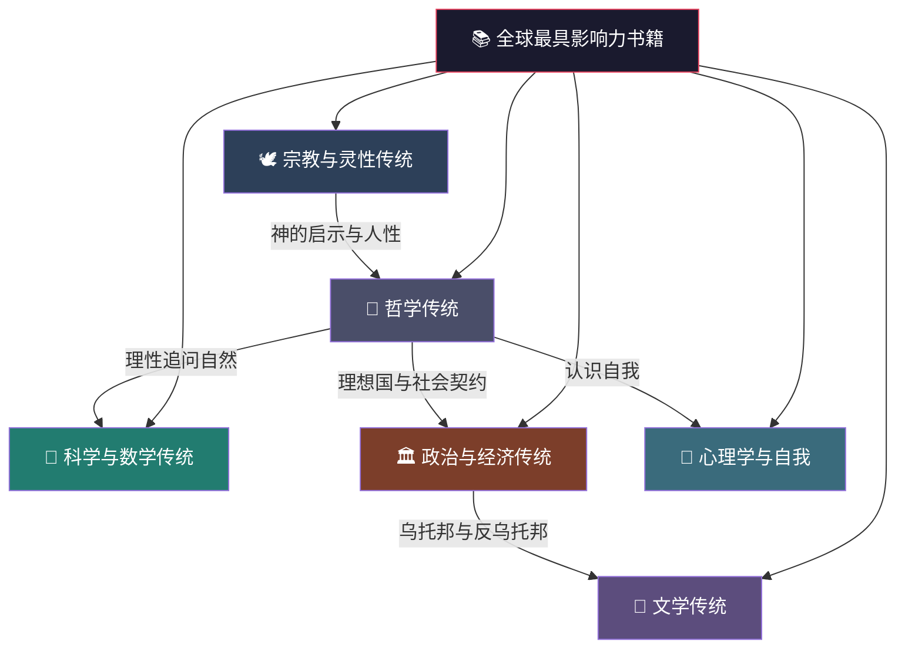

---

### 1.2 宗教与灵性传统

核心思想：宇宙秩序、道德律法、解脱之道、天人合一

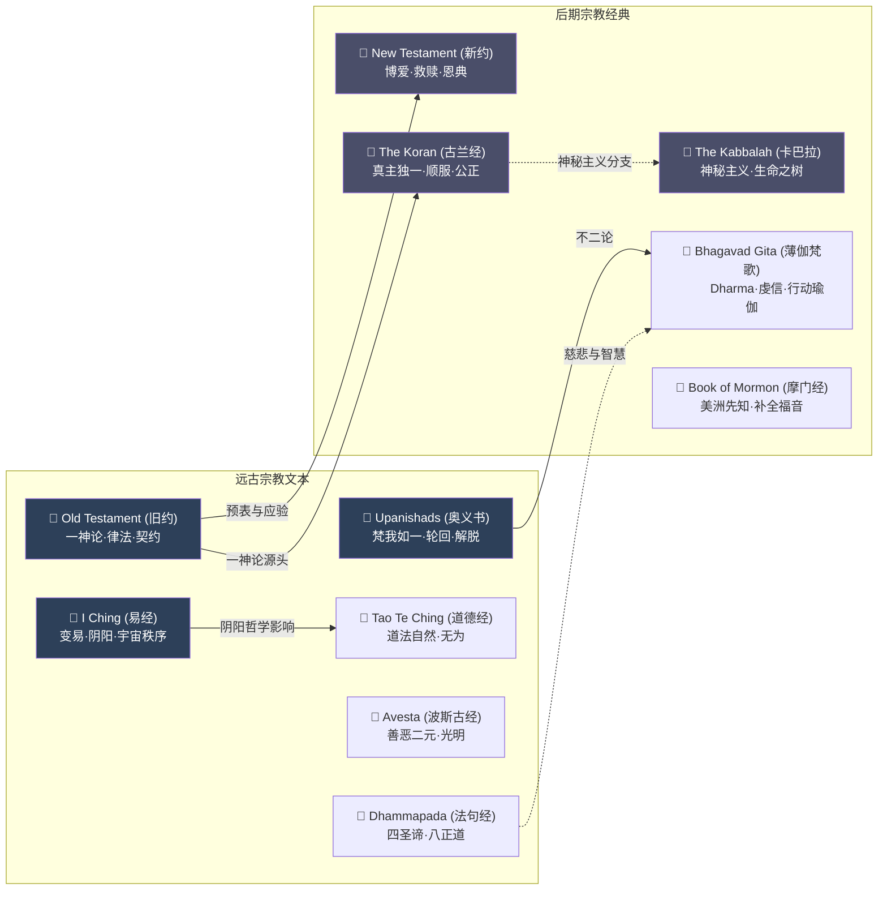

---

### 1.3 哲学传统

核心思想：正义、真理、存在、知识、伦理

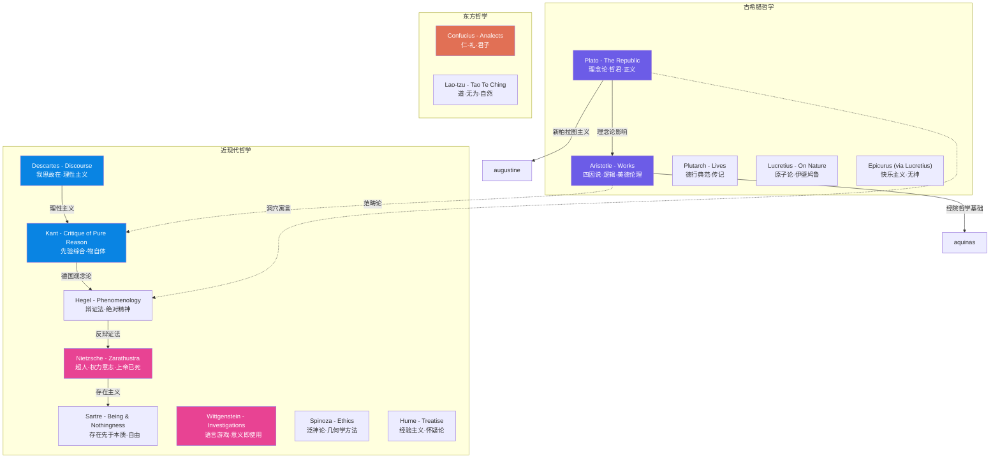

---

### 1.4 科学与数学传统

核心思想：理性探索自然、数学描述宇宙、实验方法

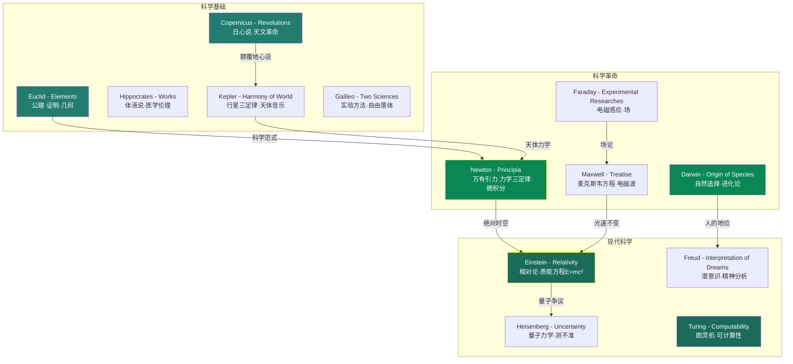

---

### 1.5 政治与经济传统

核心思想：权力、正义、自由、平等、财富分配

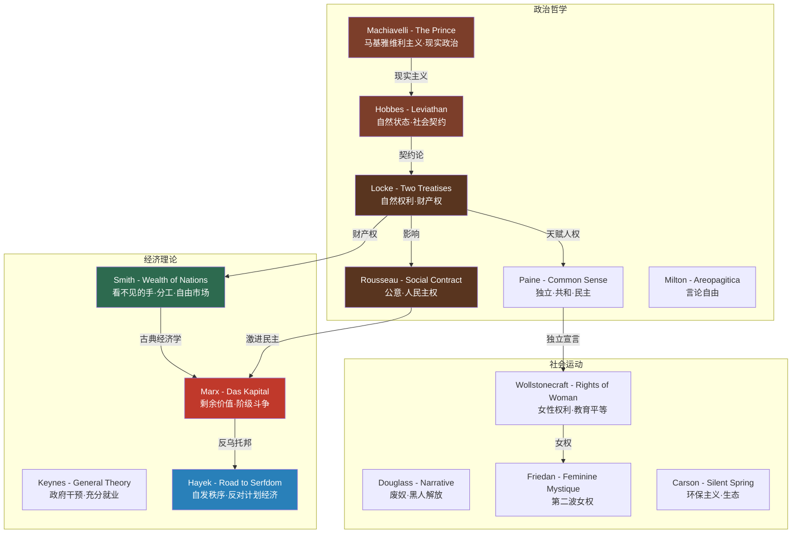

---

### 1.6 文学传统

核心思想：人性洞察、叙事艺术、社会批判、审美超越

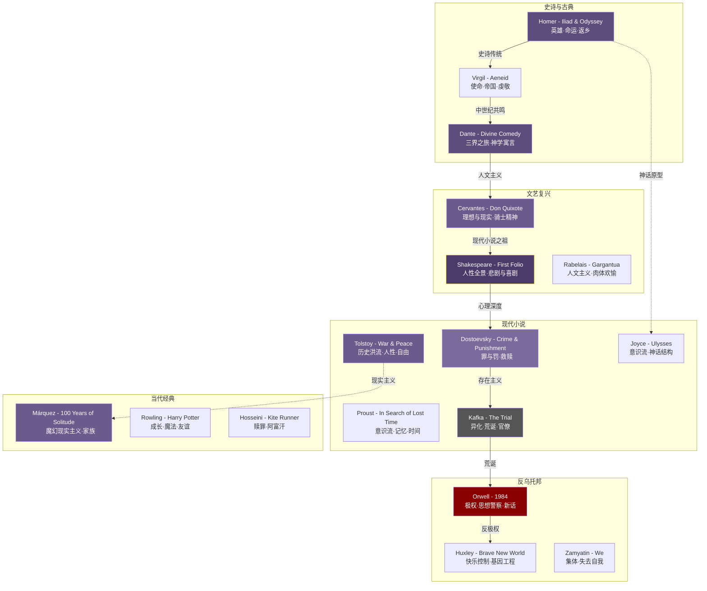

---

### 1.7 心理学与自我认知传统

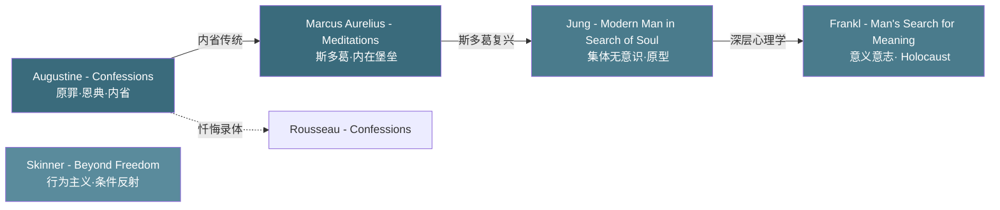

---

## 第二部分：计算机技术演进图谱 - 前80项最具影响力技术

基于计算机历史博物馆（Computer History Museum）、IEEE计算机协会、Wikipedia等权威来源整理。节点大小表示影响力权重（⭐=基础，⭐⭐=重要，⭐⭐⭐=革命性）。

---

### 2.1 技术演进全景图

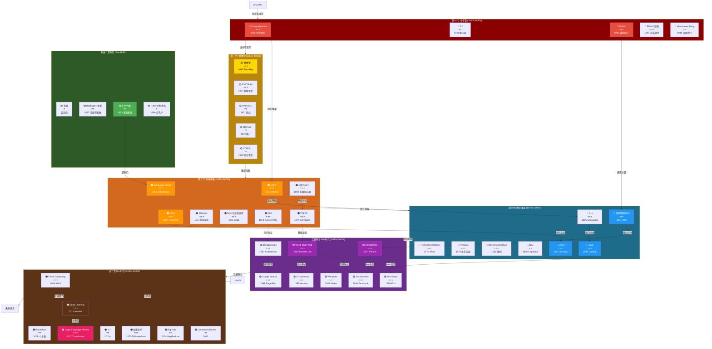

---

### 2.2 编程语言演进树

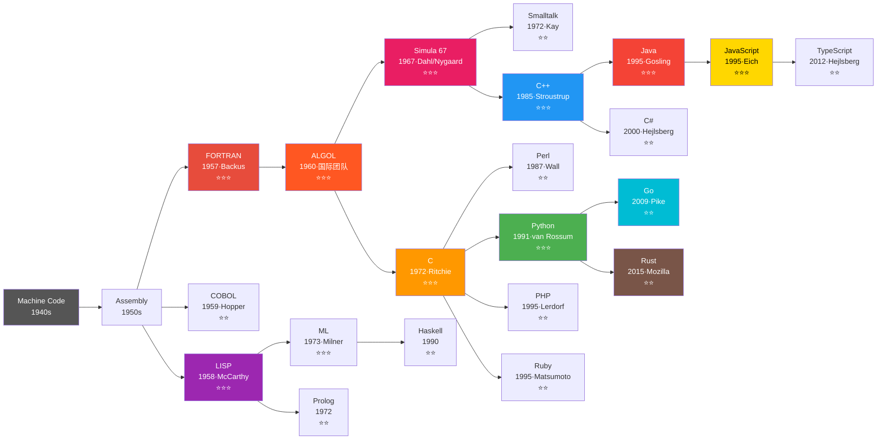

---

### 2.3 操作系统与网络演进

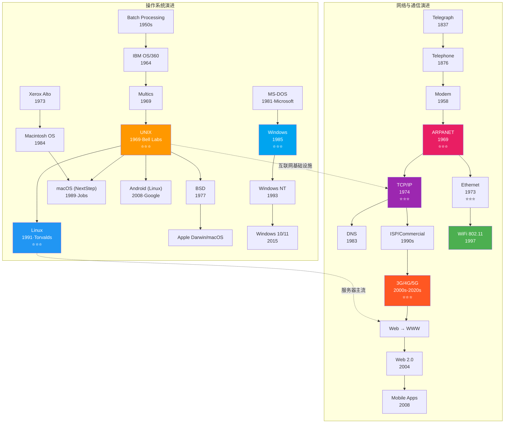

---

### 2.4 存储技术与硬件演进

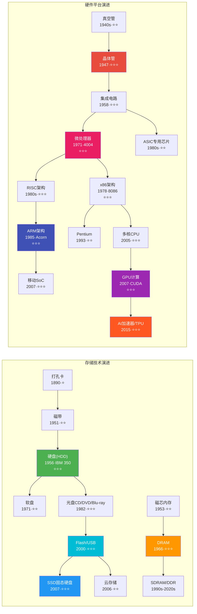

---

### 2.5 关键人物关联图

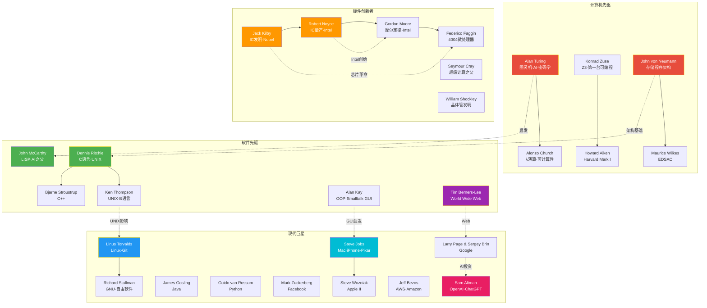

---

### 2.6 未来10项关键技术演进趋势

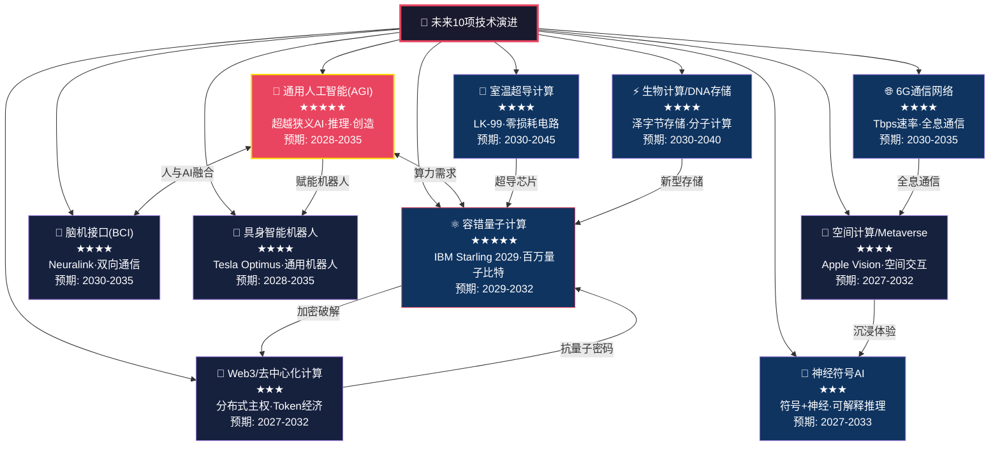

---

### 2.7 技术世代影响权重

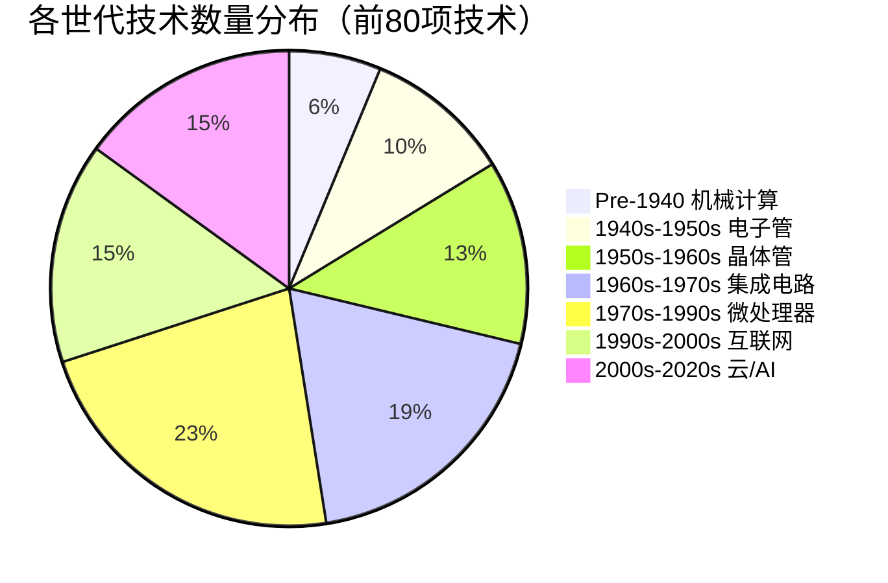

---

## 附录：核心参考来源

| 来源 | 说明 |
|---|---|
| Martin Seymour-Smith (1998) | 《The 100 Most Influential Books Ever Written》核心书单 |
| Computer History Museum | 计算机历史时间线 https://computerhistory.org/timeline |
| IEEE Computer Society | 计算历史时间线 https://history.computer.org |
| Wikipedia - History of Computing | 计算机硬件与软件历史综合资料 |
| Britannica | 最具影响力编程语言专题 |
| OEDb - 50 Books That Changed World | 50本改变世界的书 |

---

*本报告由AI辅助生成，基于多家权威来源交叉验证。书籍列表主要依据Martin Seymour-Smith的1998年著作，技术列表综合计算机历史博物馆、IEEE、Wikipedia等来源。*

*保存路径：`Reports/书籍与计算机技术关系图谱-2026-05-14.md`*
