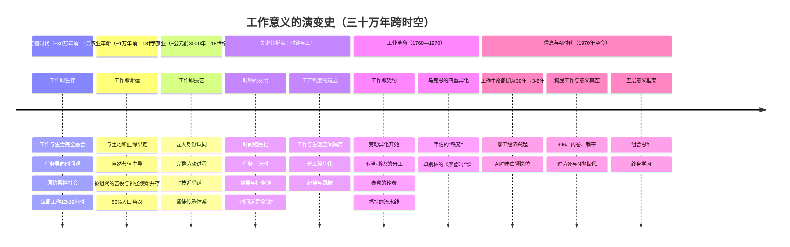

# 工作的意义——跨时空研究报告

**报告日期：2026年6月21日**

---

## 执行摘要

工作是什么？这个问题看似简单，却贯穿了人类三十万年的历史。从采集狩猎者每周工作15小时的"原始富裕社会"，到工业革命时期童工在织机旁劳作14小时的黑暗岁月，再到今天AI冲击下白领岗位的雪崩——工作从未停止变化，但人类对"为什么工作"的追问从未像今天这样迫切。

本报告跨越采集狩猎、农业文明、工业革命、信息时代和AI时代五个历史阶段，系统梳理工作意义的演变规律。核心发现：工作意义经历了从"与生命的合一"到"与意义的分离"的漫长弧线。在当代，三重趋势——工作生命周期从30年压缩至3-5年、AI将在1-5年内消灭大量入门级白领岗位、37-40%的劳动者认为自己的工作毫无意义——正在瓦解"工作等同于意义"这一现代社会契约。

报告提出五层意义框架（生存、成长、关系、创造、意义）和七个方向指引，旨在帮助个体在结构性不确定性中重建工作与生活的意义坐标。这不是一份乐观的宣言，而是一份诚实的诊断和可操作的行动指南。

---

## 一、农业文明之前：工作即生存

### 1.1 采集狩猎时代的"原始富裕社会"

在人类历史的漫长画卷中，农业文明不过是最近一万年的事。若以智人约30万年的历史为尺度，我们有95%以上的时间是以采集狩猎为生的。这意味着，"工作"在人类大部分历史中所呈现的形态，与我们今天所理解的截然不同。

1966年，人类学家马歇尔·萨林斯在"Man the Hunter"研讨会上提出了"原始富裕社会"的概念。他的论点直击现代经济学的根基：富裕不在于拥有得多，而在于需求少。采集狩猎者通过"限制欲望"而非"增加产出"来达到满足，他们是最早的富裕社会。[citation:1]萨林斯引用了理查德·李对非洲喀拉哈里沙漠朱/霍安西人的研究：成年人每周用于获取食物的时间仅为12至19小时，平均每天约2小时9分钟。[citation:2]《时代》杂志在报道这一发现时惊叹道："在这个社会中，周工作时间很少超过19小时，物质财富被视为负担，没有人比其他人富裕多少。"[citation:3]

剑桥大学人类学家詹姆斯·苏兹曼在朱/霍安西人中进行了长达30年的田野工作，在其著作《工作的意义：从石器时代到机器人时代》中提出：采集狩猎者的工作与生活是完全融合的——觅食、烹饪、修理工具、社交、讲故事、育儿，所有这些活动交织在一起，不存在现代意义上的"工作"与"闲暇"的截然区分。[citation:4]苏兹曼描述了一种"旧石器时代的节奏"：一天劳作，一两天休息。人们在营地中度过大量闲暇时光，聊天、唱歌、跳舞、睡觉。这不是懒惰，而是一种精心校准的生存策略——采集狩猎者对自己的环境了如指掌，他们自信地知道自己可以在几小时内获得所需的食物。[citation:5]

值得注意的是，苏兹曼也指出，当把食物加工、工具制作和家务劳动都计算在内时，朱/霍安西人的总工作时间上升至男性每周44.5小时、女性每周40.1小时。即便如此，这仍然低于许多现代西方家庭的总工作时长。[citation:6]更重要的是，采集狩猎者从未感受到"时间贫困"——他们没有日历，没有截止日期，没有"浪费时间"的概念。

凯恩斯曾在1930年的著名论文《我们后代的经济前景》中预言，到2030年，技术进步将使人们每周只需工作15小时。苏兹曼指出，凯恩斯的愿景与其说是对未来乌托邦的想象，不如说是对人类远古生活状态的回忆——因为在他写下这篇文章的二十年前，人类学家就已经发现采集狩猎者确实只需工作15小时就能满足所有基本需求。[citation:7]

在这个时代，"工作"这个词本身可能毫无意义——因为没有与"非工作"的对立。采集狩猎者没有"工作"的概念，因为他们没有从生活中划出一个叫做"工作"的独立领域。他们不需要闹钟，不需要打卡，不需要绩效评估，不需要职业规划。他们的时间观是任务导向的：饿了就去觅食，饱了就休息，需要工具就制作。这种"活在当下"的生存哲学，塑造了人类历史上最漫长也是最自洽的工作意义——工作即生存，生存即生活。

### 1.2 农业革命：工作的诞生

大约一万年前，人类开始驯化植物和动物，农业革命悄然改变了这颗星球上最聪明的物种与工作的关系。《圣经·创世记》中记载了上帝对亚当的宣判："你必终身劳苦，才能从地里得吃的……你必汗流满面才得糊口，直到你归了土。"[citation:8]这段叙事集中体现了农业文明对工作的新理解：工作不再是自由自在的觅食，而成了被诅咒的苦役。土地不再慷慨地提供一切，人类必须用汗水去换取生存。

但农业革命带来的更深层变革在于时间观念的重构。苏兹曼敏锐地指出："采集者不会花太多心思考虑下周或下个月的事，但农民却会想象和预测着未来几年甚至几十年的事。农民不仅时时刻刻都得想着未来，还几乎可以说是为了未来在服务。"[citation:10]农民必须等待种子发芽、庄稼生长、季节更替。他们必须储备粮食以应对可能的歉收。这种对未来的持续关注形成了一种全新的生存焦虑：稀缺不再是一种偶然，而是一种常态。

在中世纪的欧洲，约85%的人口是农民。[citation:11]他们的生活围绕着农业历法旋转，形成了一年四季不断重复的劳作周期：冬末春初修理农具、积肥施肥；春季翻耕休耕地、播种春作物；夏季收割干草、除草、剪羊毛；秋季打谷、扬场、储存谷物；冬季屠宰牲畜、编织篮子、纺织羊毛。乔治·杜比在其经典著作《西方中世纪的农村经济与乡村生活》中强调，农业社区中存在着丰富的互助传统——共同犁地、联合收割、修建谷仓——这些集体劳动不仅是经济需要，也是社会纽带的黏合剂。[citation:13]

### 1.3 传统中国的工作伦理：士农工商

如果说欧洲中世纪的工作伦理深受基督教影响，那么在中国，儒家思想则为农业文明的工作意义提供了独特的诠释框架。中国传统的"士农工商"四民等级结构中，"农"排在第二位，仅次于"士"，高于"工"和"商"。[citation:14]《管子》曰："一农不耕，民有饥者；一女不织，民有寒者。"农业生产被视为国家存亡和个人生存的基础。

"耕读传家"是中国传统社会中一种独特的文化理想。宋代是耕读文化的鼎盛时期。宋仁宗颁布了"劝耕劝读"政策，鼓励农家子弟参加科举考试。"朝为田舍郎，暮登天子堂"成为无数农家子弟的人生梦想。[citation:17]清代学者王永彬在《围炉夜话》中精辟地概括了耕读的本质："耕所以养生，读所以明道，此耕读之本原也。"

中国传统文化中的"敬业"理念源自儒家思想。《礼记·学记》最早提出"敬业乐群"的概念。宋代以来，"敬"被理学提升到了本体论的高度——程朱理学认为"敬"是一种贯通形而上与形而下的修养工夫。"敬"既可以在静坐时"存心养性"，也可以是日常工作中"执事敬"的行动原则。[citation:18]儒家所说的"敬业"本质上是一种全神贯注的做事态度，具有类似于西方新教"天职观"的神圣性。

对于工匠而言，工作的尊严来源于手艺的传承。中国传统文化中的"工匠精神"包含了匠心（求知欲与专注力）、匠术（规范与创新）、匠德（责任与诚信）三维合一。[citation:19]"良田百顷，不如薄艺在身"这一民间谚语反映了技艺对个人尊严的支撑。庖丁解牛、匠石运斤——这些《庄子》中的寓言展现了工匠将技艺提升至"道"的境界的追求。"技近乎道"意味着：工作不仅是谋生手段，更是通向精神超越的道路。[citation:20]

> **故事一：一位中国农夫的四季**
>
> 距今三千年前，在陕西豳地，一个农夫的生活是这样的：正月里寒风凛冽，他修补农具，准备迎接春耕。二月，他带着妻子下田，孩子们跟在后面送饭。三月修剪桑枝，四月开始缝制衣服。五月蟋蟀鸣叫，六月吃李子和葡萄，七月煮葵菜和豆子度日。八月打枣，九月筑打谷场。十月将黍稷稻粱收进谷仓，但粮食刚刚入仓，又要给领主修建宫室。白天割茅草，夜里搓绳索。十一月猎取貉狐，给领主做皮裘。十二月全体出动大猎。严冬腊月，他凿开冰河，将冰块储藏起来以备领主夏季享用。
>
> 一年到头，他自己吃什么？"六月食郁及薁，七月亨葵及菽，八月剥枣，十月获稻……七月食瓜，八月断壶，九月叔苴，采荼薪樗，食我农夫。"[citation:21]——那些最好的食物都献给了领主，留给自己的是苦菜和柴火。
>
> 这位农夫从未思考过"工作的意义"。他的工作就是他的生活，他的苦难就是他的命运。

---

## 二、工业时代：工作的异化

### 2.1 分工与工厂制度

1776年，亚当·斯密在《国富论》开篇用了一个看似不起眼的例子来阐述他最重要的理论洞见。在18世纪英国的制针作坊中，一个未经训练的工人"纵使竭力工作，也许一天也造不出一枚针，当然更造不出二十枚"。但通过将制针过程分解为约十八道工序——抽丝、拉直、切断、削尖、打磨顶部、制头、装头、漂白、在纸上排列——十名工人协作每天可制造出约四万八千枚针，人均四千八百枚。分工使效率提高了数百倍。[citation:22]

斯密的制针工厂案例不仅成为经济学史上最著名的段落之一，也标志着一个根本性转变的开始：工作不再是一个完整的人与完整的世界之间的对话，而是被拆解为碎片化的操作。法国思想家弗格森在斯密之前就预感到了这种变化的代价："在制造一枚针的细小工序中各司其职的人，比那些试图完整制造一枚针的人能生产更多……但这是以工人全面能力的丧失为代价的。"[citation:23]

工业革命最深刻的文化后果之一，是改变了人类对时间的体验。E.P.汤普森在其经典论文《时间、工作纪律与工业资本主义》中详细阐述了这一转变。[citation:24]18世纪末到19世纪初，工厂主面临的最大挑战不是技术，而是人。从村庄招募来的工人不习惯在固定时间起床、工作、休息。他们仍然保留着"神圣星期一"的传统——周一饮酒狂欢，周二才开始工作。为了改造这些"不守时"的劳动者，工厂主们建造了钟楼，雇佣了计时员，建立了罚款制度。

陶瓷大亨约书亚·韦奇伍德的工厂规程堪称早期时间纪律的缩影："工厂管理员必须第一个到厂，安排工人就位开始工作……对迟到者给予'提醒'，并记录其损失的时间。"[citation:25]到19世纪初，几乎所有工厂都采用了计时工作制。打卡钟的发明——工人将卡片插入机器，"咚"地一声在卡片上印下时间——使时间管理达到了新的精确度。这个机械动作在语言中留下了"punching the clock"的短语，在工人心中留下了异化的印记。

> **故事二：罗伯特·布林科的童年**
>
> 罗伯特·布林科的故事或许是工业革命时期最触目惊心的童工案例。1792年出生的布林科，4岁就被送入伦敦圣潘克拉斯济贫院，7岁被作为"学徒"送到诺丁汉郡的洛德姆棉纺厂。实际上，他成为了实质上的白奴——工作从早上5点到晚上8点，经常遭受监工的殴打。他的脚趾在一次事故中被碾碎，但由于得不到适当医治，终身残疾。布林科的经历在1828年被连载于激进报纸《狮子》，1832年以书的形式出版，成为轰动一时的社会丑闻。他的面孔出现在政治海报上，标语借用废奴运动的口号——"我不是一个人、一个兄弟吗？"
>
> 评论家认为查尔斯·狄更斯的《雾都孤儿》的创作受到布林科回忆录的影响。然而，布林科不是虚构人物，他是工业革命中数以万计的童工之一。据估计，1784年英国乡村棉纺厂中约三分之一的工人是济贫院学徒，在某些工厂高达80-90%。[citation:26]

### 2.2 泰勒制与科学管理

如果说斯密把工作分解为工序，那么弗雷德里克·温斯洛·泰勒则将这种分解推进到了荒谬的极致。1911年出版的《科学管理原理》中，泰勒宣称要对每个工人的每一个动作进行"时间-动作研究"，找到"唯一最佳方法"。[citation:27]

泰勒在伯利恒钢铁公司的著名实验包括：研究一个工人用铲子铲煤的最优动作——铲子的角度、行进距离、身体姿势，都被精确计算和标准化。通过重新设计工作流程，他成功将每人每天搬运的生铁量从12.5吨提升到47.5吨。泰勒的四项原则至今深刻影响着组织设计：第一，用科学方法取代经验法则；第二，科学地选择和培训工人；第三，管理者和工人"真诚合作"；第四，管理者和工人"均分工作和责任"。

但这一"科学"有一个致命的视角问题——正如布雷弗曼后来批判的那样，科学管理"不是从人的角度出发，而是从资本的角度出发"。[citation:28]它的本质不是提高效率，而是控制。通过将脑力劳动与体力劳动分离——管理者负责思考和计划，工人只负责执行——泰勒从根本上剥夺了工人对工作的理解。

亨利·福特将泰勒的原则推向极致。1913年，福特汽车公司在高地公园工厂引入了第一条移动装配线。此前，制造一辆Model T需要约12小时；流水线将其压缩到93分钟。[citation:29]福特将复杂的汽车制造分解为7882个操作，其中多数操作只需简单的重复动作。

代价是毁灭性的。流水线工作的单调导致工人极度不满。到1913年底，福特的年劳工流动率达到370%——为了维持10000人的岗位，公司每年要雇佣超过37000人。[citation:30]旷工率也极高，周一旷工率一度达到10%。

福特的回应是1914年1月5日震惊世界的五美元日——将工人日薪从2.34美元提升至5美元，同时将工时从9小时降至8小时。这不是纯粹的慈善。福特说得很清楚："更高的工资是为了让工人更能忍受生产线的单调。"五美元日有一个秘密：工人只能拿到约2.40美元的基本工资，剩下的2.60美元是"利润分享"——要拿到全额，工人必须通过公司"社会学部"的审查。审查官会不请自来地探访工人的家，检查其是否酗酒、是否虐待家人、是否收留房客、是否保持房屋清洁、是否定期储蓄。[citation:31]

1936年，查理·卓别林的《摩登时代》以黑色幽默的方式将泰勒制的荒谬呈现在银幕上。流浪汉夏尔洛在流水线上不停地拧螺丝，节奏越来越快，最终精神崩溃——他拿着扳手追着任何看起来像螺丝的东西拧，包括同事的鼻子和女性裙摆上的纽扣。最著名的场景中，夏尔洛被送入一台"自动喂食机"进行测试——这台机器在他吃饭时自动喂食，展示管理者如何将"浪费时间"的进食也纳入科学管理。机器失控，玉米棒疯狂敲打他的脸、汤泼洒在他身上。这是泰勒主义最极致的寓言：在追求效率的狂热中，人被机器吞噬。

### 2.3 马克思的异化理论与韦伯的天职观

如果说斯密和泰勒是从管理层的视角看待工作，那么年轻的卡尔·马克思在1844年《经济学哲学手稿》中，第一次从工人的视角系统分析了工业资本主义下工作的本质。

马克思提出了影响深远的异化劳动四重维度：[citation:32]

**第一，劳动者与劳动产品的异化。** 工人生产的产品越多，他所拥有的就越少。他"把自己的生命投入到对象中，但这个生命不再属于他，而是属于对象。"他生产了汽车，但买不起；他建造了宫殿，但住在贫民窟。

**第二，劳动者与劳动活动本身的异化。** 工作不是自愿的、创造性的自我实现，而是"被迫的强制劳动"。马克思用的措辞令人印象深刻："只要肉体的强制或其他强制一停止，人们就会像逃避瘟疫一样逃避劳动。"工人在工作中"不是感到幸福，而是感到不幸；不是自由地发挥自己的体力和智力，而是使自己的肉体受折磨、精神遭摧残。"

**第三，劳动者与类本质的异化。** 马克思认为，人的类本质是自由自觉的活动。在资本主义下，劳动被降低为仅仅是维持肉体生存的手段。一个人只有在家中和休闲时才是"人"，在工作时不过是一个"动物"。

**第四，人与人之间的异化。** 当工人和资本家处于对抗关系时，人与人之间的社会关系变成了物与物之间的关系（商品关系）。

与马克思从经济基础出发分析不同，马克斯·韦伯从文化精神的角度解释了资本主义工作伦理的起源。他的《新教伦理与资本主义精神》（1904-05）试图回答一个关键问题：为什么现代资本主义率先在西方兴起？[citation:33]

韦伯发现，加尔文派的预定论催生了一种全新的工作态度——"入世的禁欲主义"：勤奋工作、积累财富，但拒绝享乐。路德翻译的"Beruf"（天职/呼召）既表示"职业"又表示"上帝的召唤"，意味着最平凡的日常工作也被赋予了宗教意义。这种观念赋予单调、枯燥、重复的工业劳动以超越性的意义。

但韦伯的著名结语充满了悲凉的洞见：清教徒想为天职而工作，而我们现代人被迫如此。[citation:33]"这种禁欲主义走出修道院，进入了世俗生活的市场，开始支配世俗的道德……今天，这种精神——谁知道是不是最终？——已经逃出了这个铁笼。胜利的资本主义不再需要这种宗教支柱。"

### 2.4 20世纪的职业体系

20世纪上半叶，工人们用长期艰苦的斗争换来了工作时间的缩短。1830年代英国的"短时委员会"运动，1886年美国芝加哥干草市场事件（五一国际劳动节的起源），以及20世纪初工会的不懈抗争，逐步将工作日从12-14小时压缩到8小时。1938年美国的《公平劳动标准法》确立了44小时最高工作周，1940年降至40小时。这成为现代工作制度的基石：五天、八小时、周末休息。

20世纪中叶见证了工作形态的又一次巨变：白领阶层的大规模崛起。从1910年到2000年，"专业、管理、文员、销售和服务工作者"在美国就业人口中的比例从四分之一增长到四分之三。[citation:34]工厂流水线的蓝领工作大量消失，代之以办公室中的文书、管理、销售和服务岗位。与蓝领工作不同，白领工作提供了"职业阶梯"的神话——从初级职员到中层管理者再到高管，理论上每个人都有向上的可能。终身雇佣制在日本和美国大企业中成为标配，公司开始像家庭一样向员工承诺终身安全。

但这种承诺在1980年代之后开始瓦解。全球化、去监管、股东资本主义的兴起导致企业大规模裁员、扁平化、外包。"朝九晚五"的制度仍在，但终身雇佣的承诺已经破灭。

> **故事三：高地公园流水线上的工人**
>
> 1913年，一位无名工人在福特高地公园工厂的流水线上负责安装后轮。每个工作日，他重复着一个动作——拿起螺栓、对准螺孔、拧紧——几千次。之前他是一个马车工匠，能独立打造一辆完整的马车轮子，熟悉木材纹理、金属锻造，能从轮毂到轮圈独立完成。在流水线上，他只需要在汽车经过他工位的37秒内完成四个螺栓的安装。
>
> 有一天，他向监工抱怨："我觉得自己不像人了。"监工回答："那你就拿五美元的日薪吧。"他继续拧螺栓。
>
> 五美元确实能买很多东西——付房租、养家、偶尔喝一杯。但它买不回那种看着自己亲手完成一件完整作品时的满足感。这就是工业时代工作的核心悖论：效率的提高以意义的丧失为代价，物质的丰裕以精神的贫瘠为代价。

---

## 三、信息与AI时代：工作意义的危机

### 3.1 工作生命周期的加速缩短

当代劳动市场最深刻的变化不在于薪资或技能要求的变化，而在于一个更为根本的前提假设的瓦解：一份工作不再能够支撑一段完整的职业生涯。

在20世纪中叶的"黄金时代"，一个大学毕业生进入一家大型企业，可以预期在同一家公司工作30年直至退休。到21世纪初，这一数字已缩短至10年左右。而在今天的信息技术和互联网行业，平均任职时间已降至2-3年。

更深刻的变革在于：不仅在一家公司内的任期缩短，整个职业路径的生命周期也在缩短。一个软件工程师在2020年掌握的技能栈，到2025年可能已经过时。世界经济论坛《未来就业报告2025》揭示：到2030年，结构性劳动力市场转型将创造1.7亿个新岗位，同时淘汰9200万个现有岗位，净增7800万个岗位。但表面上的"净增"掩盖了一个残酷事实——22%的岗位更替率意味着每5个现有工作岗位中就有超过1个将消失或被彻底重塑。[citation:35]

技术变革（AI、大数据、自动化）是推动这一变革的最核心驱动力。增长最快的岗位集中在技术、数据和AI领域，而行政文员、会计、数据录入等传统白领岗位正加速萎缩。Revelio Labs的数据显示，自2023年1月以来，美国的入门级岗位发布量下降了约35%，其中AI高暴露度的入门级职位下降超过40%，在最极端的科技和数据分析领域，初级岗位的发布量下降了67%。[citation:36]

这意味着什么？职业发展的"学徒模式"正在断裂。当一个初级律师不再需要通过审阅数千页文件来学习法律逻辑，当一个初级程序员不再需要通过写基础代码来建立工程直觉——职业阶梯底层的台阶正在被AI拆除。LinkedIn首席经济机会官Aneesh Raman一针见血地指出：AI正在"打破职业阶梯的最底层台阶"。[citation:37]

### 3.2 零工经济与不稳定劳动

零工经济的爆发式增长是工作生命周期缩短的另一面。NBER的研究论文《平台零工工作的演化，2012-2021》追踪了90多个在线劳动平台的数据，发现2020年有近210万新工作者进入零工经济，是2019年的两倍；2021年又有310万人进入。到2021年，至少有500万美国人通过在线平台获得零工收入。[citation:38]

然而，零工经济的本质是用灵活性换取保障。大多数平台工作者年收入低于2万美元，且缺乏医疗保险、退休金、带薪休假等传统就业的福利保障。中国社会科学院学者孙萍在其2024年著作《过渡劳动：平台经济下的外卖骑手》中提出"过渡劳动"概念——描述骑手悬浮于正式与非正式劳动之间的不稳定状态。她追问："为什么日趋精进的技术未让劳动变得轻松愉快，反而增加了劳动的繁重艰辛？为什么平台经济如此精细的组织和管理没有减少参与者的劳动时间，反而让他们黏在平台上？"[citation:39]

### 3.3 AI冲击：岗位消失与任务重构

2025年5月，Anthropic CEO Dario Amodei在接受Axios采访时发出了迄今最直接的警告：AI可能在1-5年内消灭50%的入门级白领岗位，将美国失业率推高至10-20%。[citation:40]"癌症被治好了，经济以每年10%增长，预算平衡了——但20%的人没有工作。"Amodei描述了一个令人不安的场景。他透露，他与多位CEO的私下交流表明，许多企业高管将AI视为削减人力成本的工具，而不仅仅是"增强"员工能力的手段。

哈佛大学一项涵盖6200万工人、28.5万家美国企业的研究证实：自2023年以来，"在整合AI的企业中，初级岗位正在萎缩"。[citation:36]研究人员警告，人工智能正在"侵蚀职业阶梯的底部台阶"，有效消除了曾经作为早期职业培训基地的岗位。

理解AI对就业影响的关键框架是：AI并非取代整个职业，而是取代构成职业的具体任务。McKinsey的研究发现，只有不到5%的岗位可以被完全自动化。绝大多数岗位中，AI将自动化部分任务，由此改变工作内容、技能需求和组织结构。然而，这一框架的乐观版本——"AI将解放人类从事更有创造性的工作"——面临一个根本挑战：入门级岗位恰恰是最依赖执行"AI能完成的任务"的。当人类在职业生涯初期失去"做无聊工作"的机会，也就失去了通过这些工作建立行业直觉和隐性知识的路径。

> **故事四：被AI替代的插画师**
>
> Sarah是一名有十年经验的自由插画师，主要为广告公司和出版社创作插图。2023年，她注意到一个令人不安的变化——过去她每月都会收到3-5个新项目邀约，但突然之间"好像一夜之间，所有这些工作都消失了"。
>
> 在她接到的最后一个插画项目中，客户要求她"根据AI生成的图像做一个插图版本"。完成后，对方再无音讯。她最终通过一位合作多年的艺术总监朋友得知了真相："创意部门正在疯狂使用AI，在公司内部展示AI生成的插图没有任何羞耻感，而且这比雇佣插画师便宜太多了。"
>
> 更讽刺的是，Sarah开始收到来自Upwork等自由职业平台的新请求——不是请她创作插图，而是"修复"AI生成的艺术作品中的错误。这些客户通常认为花几个小时就能修好，但实际上需要的工时和从头画一幅几乎一样多。
>
> "我的收入急剧下降，"Sarah说，"与此同时，AI生成的垃圾从互联网的每个角落向我涌来，每一家大公司都在推广他们的AI助手。而我清楚地知道，这些AI模型正是用我们这些在职插画师的作品训练的——包括我的。"[citation:41]

### 3.4 狗屁工作与意义真空

如果说工作生命周期缩短和AI冲击是外部的结构性压力，那么"狗屁工作"现象揭示的则是工作意义危机的内在维度。

人类学家大卫·格雷伯在其2018年的著作《狗屁工作》中定义了"狗屁工作"：从事该工作的人自己都认为其工作毫无意义、不必要甚至有害，如果这些岗位消失，世界不会有任何变化。[citation:42]

格雷伯将其分为五大类：**随从**（存在的唯一目的是让上级感到自己很重要）、**打手**（具有攻击性元素，但因对手也在做而存在）、**补丁工**（修复由粗心或无能的上级造成的损害）、**任务大师**（让组织可以声称自己在做某事）、**工头**（分派工作给他人或创造新的狗屁工作）。[citation:42]

这一分类之所以令人不安，是因为它揭示了一个系统性的荒谬：大量劳动者的时间和精力被消耗在连他们自己都认为毫无价值的事情上。2015年YouGov的民调显示，37%的英国人认为自己的工作"对世界没有做出有意义的贡献"，在荷兰这一比例高达40%。[citation:43]格雷伯指出，考虑到护士、公交车司机、消防员等职业几乎不可能报告自己的工作毫无意义，这意味着在白领办公室工作者中，认为自己工作毫无意义的比例远高于40%。

狗屁工作的心理伤害是双重的：它既不需要你付出真正的努力，又要求你假装自己很忙。这种认知失调——知道自己所做之事毫无意义，却被要求每天花40小时以上假装并非如此——导致抑郁、焦虑、自我价值感丧失。格雷伯称之为"我们集体灵魂上的一道伤疤"。

更讽刺的是，狗屁工作的泛滥与技术进步之间存在深刻关联。自动化并未减少工作时间，反而催生了大量无意义的岗位——因为资本和管理的逻辑不是"如何用最少的工作时间完成必要任务"，而是"如何让所有人都有工作"。技术效率的提升被转化为无意义的"繁忙工作"——一个永不停歇的行政仓鼠轮。

---

## 四、东亚社会的特殊挑战

### 4.1 996、内卷与躺平

在中国语境下，工作意义危机呈现出独特的本土化表达。996工作制——早9点到晚9点，每周6天，合计72小时——是中国互联网产业最具标志性的劳动制度。2019年，程序员在GitHub上发起的"996.ICU"运动曝光了超过200家实施996的企业。[citation:44]

阿里巴巴创始人马云曾公开称996是"巨大的福气"。"如果你不年轻的时候996，你什么时候能996？"他说，"很多公司、很多人没有机会996。"[citation:45]尽管中国劳动法规定标准工时为每日8小时、每周40小时，月加班上限为36小时，但2025年前五个月的官方数据显示，中国人均周工时仍高达48.5小时。[citation:46]

2021年，中国最高人民法院与人社部联合宣布996违法。[citation:47]字节跳动、快手、vivo等企业相继宣布取消"大小周"制度。然而，取消加班也意味着实际收入的下降——字节跳动员工月薪"普降"了四个日薪。[citation:48]制度的执行力度依然薄弱。

996的后果触目惊心。一项针对35家中国互联网公司的研究显示，约80%的员工存在睡眠质量问题，71.3%遭遇失眠，996工作制与抑郁症状之间存在显著关联。[citation:49]《金融时报》2024年的报道描绘了一幅疲惫的图景：一位腾讯游戏的开发者形容："表面上我很平静，但压力巨大，我们就像齿轮一样，因缺乏润滑而磨损直至断裂。"[citation:50]

在这一背景下，"内卷"与"躺平"成为理解当代中国青年精神状态的密码。牛津大学人类学教授项飙分析认为："内卷在中国语义中与竞争白热化高度联系在一起。年轻人不断感受到竞争的压力，一直在同一个水平上旋转，像一个陀螺被敲打，却没有突破。"[citation:51]

"躺平"则是这一困境的另一面。项飙认为躺平是年轻人对内卷的反抗，"以放弃他们认为无意义的努力来退出竞争"。[citation:51]学术研究将"躺平"细分为"消极躺平"与"积极躺平"两种状态——前者是行动和心理的双重退缩，后者则是"在躺平中获得正面影响，认清自我定位，找到人生目标"。[citation:52]关键在于，躺平不是懒惰——而是"努力→回报"链条断裂后的理性反应。一项针对成都青年的调查显示，仅有23.4%的人认为"努力就能获得相应回报"，相比五年前的42.1%显著下降。[citation:53]

2025年的数据显示，中国16-24岁青年失业率（不含在校生）攀升至18.9%，NEET族比例从2018年的11.5%上升至2022年的16.1%。[citation:54]当"奋斗"不再带来向上流动，"不奋斗"则意味着被社会淘汰，年轻人在夹缝中承受着双重的意义真空。

> **故事五：从拼多多"毕业"的程序员**
>
> 2020年，一位化名"zimu"的程序员在离职后写下三万字的回忆录《我在拼多多的三年》。他记录了从入职时的期待到最终离开的心路历程：每日9-10点到岗、21-22点离开；同事中更有人从14点工作到次日凌晨。大促期间，连续工作13天、每天12小时。公司提供的"员工宿舍"是1990年的老房，两室零厅，与两名室友合住。
>
> 他对公司的评价令人心寒："这个地方没有把你当做一个人。员工是一个电池、奴隶、包身工。这里是血汗工厂、监狱、集中营。"但与此同时，他又矛盾地表示："我并没有后悔加入拼多多。每个时代都有其局限性。如果是2020年找工作，我是绝对不会考虑这个地方的。"[citation:55]
>
> 这个案例揭示了互联网高薪背后的代价——以及劳动者在"理性选择"与"人性损耗"之间的痛苦博弈。

### 4.2 日本的过劳死与蛰居族

日本是东亚过度劳动文化的先驱。1980年代，"过劳死"一词诞生，特指因过度劳动导致的心脑血管疾病死亡。2024财年，日本政府认定了1304起过劳相关的死亡和健康损害案件——其中247例为脑卒中或心脏病，1057例为精神障碍（首次突破千例），包括89例自杀或自杀未遂。[citation:56][citation:57]

2015年，24岁的高桥茉莉从东芝公司总部大楼跳下身亡。她入职仅8个月，在日记中记录了连续数月的超负荷加班——月加班时长超过100小时。她的自杀成为日本社会对过劳文化进行系统性反思的转折点，直接推动了《过劳死等防止对策推进法》的制定。[citation:58]

与此同时，日本的"蛰居族"问题同样严重。内阁府估计约有70万蛰居族，而流行病学调查显示终身患病率约1.2%，即超过150万人。[citation:59]这些长期与外界隔绝的年轻人，是工作意义危机最极端的表达——当工作不再提供意义，而社会又没有提供替代方案时，"退出"成为唯一的选择。

### 4.3 韩国的N抛世代

韩国的"N抛世代"始于"三抛世代"——放弃恋爱、结婚、生育——随后扩展至"N抛"：放弃社交、买房、健康管理等一切"非必要"的人生追求。[citation:60][citation:61]

韩国拥有发达国家中最低的生育率——2024年仅为0.75，同时保持着最长的劳动时间之一。2026年的数据显示，约47万韩国年轻人被归类为"休息中"——既未就业也非求职状态。20多岁的就业人数连续41个月下降。[citation:62]2024年，仅7.9%的青年对薪资、职业、工作地点三项核心条件均表示满意，较2022年的10.5%进一步下滑。[citation:63]

"从龙潭里飞出龙的时代已经结束了"（개천에서 용 나는 시대는 끝났다）——这句韩国流行语，精准概括了年轻一代对社会流动预期的彻底瓦解。[citation:61]

### 4.4 压缩现代性的代价

东亚社会的工作意义危机呈现出显著的结构性共性——都面临"经济增速放缓+人口老龄化+高强度劳动文化+代际价值观断裂"的多重叠加。中国人口于2022年达到峰值14亿后开始下降，2024年已连续第三年负增长。[citation:64]劳动年龄人口（15-59岁）在2023年为8.58亿，较2013年减少7702万。[citation:65]RAND公司的研究报告指出，到2050年，中国每一名65岁以上老年人对应的劳动年龄人口将不足两人。[citation:66]

新一代劳动者的工作意愿也在发生结构性转变。正如经济学家所指出的，"中国作为世界工厂，主要由1960-1980年间出生的那代人支撑。那些人非常愿意从事制造业和工厂工作。但现在，年轻一代根本不愿意进工厂。"[citation:67]这种态度转变结合人口萎缩，意味着中国制造业劳动力的结构性短缺将是长期的。

美国的"大辞职潮"则呈现出另一种形态：2022年全年约5050万劳动者自愿离职。皮尤研究中心的调查揭示了离职的核心驱动因素——低薪（63%）、缺乏晋升机会（63%）、感觉不被尊重（57%）。40%的离职者将"职业倦怠"列为首要原因。[citation:68][citation:69]随后兴起的"安静辞职"——劳动者不再将工作视为人生中心——进一步反映了工作意义感的普遍消退。[citation:70]

北欧模式则提供了一个极有价值的对照。丹麦法定周工作时间为37小时，绝大多数员工下午4点左右下班。仅2%的丹麦员工从事超长劳动（OECD平均11%），而丹麦的生产效率却位居欧洲第三。[citation:71][citation:72]丹麦的"弹性安全"模式——允许企业灵活雇佣和解雇，同时政府提供高水平的失业保障——创造了"既有效率又有人性"的工作生态。北欧经验表明，减少工作时间并非必然以牺牲效率为代价。

---

## 五、工作意义的演变规律

### 跨时代对比表

| 维度 | 采集狩猎时代 | 农业时代 | 手工业时代 | 工业时代 | 信息/AI时代 |
|------|------------|---------|-----------|---------|------------|
| **时间跨度** | 约30万年前—1万年前 | 约1万年前—18世纪 | 约公元前3000年—18世纪 | 约1760—1970年 | 约1970年至今 |
| **工作形态** | 分散的、即时的觅食活动 | 围绕农业历法的季节性劳作 | 作坊式、师徒制的技艺生产 | 工厂流水线、办公室白领 | 零工、远程、AI协作 |
| **时间观念** | 任务导向、无计时概念 | 自然节律主导 | 按订单节奏 | 时钟时间、秒表精度 | 24/7随时在线 |
| **工作与生活边界** | 完全融合 | 部分融合 | 紧密联系 | 显著分离 | 模糊（数字技术消解边界） |
| **核心意义来源** | 即时生存满足、社群归属 | 土地绑定、宇宙秩序 | 技艺尊严、完整产出 | 薪酬、职业身份 | 自我实现？意义真空？ |
| **社会身份来源** | 年龄、性别、技艺 | 土地占有量、血缘 | 行会身份、师承 | 雇佣关系、职业标签 | 个人品牌、多重身份 |
| **核心态度** | 自然而然、充足即满足 | 命运接受、勤劳是美德 | 职业自豪、"技近乎道" | 被迫适应、道德化工作 | 焦虑、倦怠、寻找意义 |
| **典型生命周期** | 无"职业生涯"概念 | 出生即定、终身为农 | 学徒—工匠—师傅 | 入职—晋升—退休 | 3-5年换工作、终身学习 |
| **人的主体性** | 高（自由自主） | 低（被土地绑定） | 中高（技能赋予自主） | 极低（被系统定义） | 中低（被算法和AI定义） |

### Mermaid时间线图

### 关键洞察

**洞察一：工作意义的"黄金时代"是一个神话。** 每一个时代的工作都有其独特的痛苦和满足。采集狩猎者有饥荒和部落冲突的焦虑，农民有歉收和领主压迫的苦难，手工业者有市场波动的风险，工人有异化和单调的煎熬。没有一个时代的工作是完美的。

**洞察二：意义的来源从内在转向外在。** 一个清晰的趋势是：工作的意义来源从内在（生存满足、技艺自豪、完整产出）逐渐转向外在（薪酬、消费、社会身份）。这种"意义外化"的过程是工业革命的必然产物。当工人无法从工作本身获得满足时，工资成为唯一的意义锚点。

**洞察三：人对工作的主体性整体下降。** 从采集狩猎者到流水线工人，人在工作中的主体性呈现"U型"曲线：采集狩猎时代最高（完全自主），农业和手工业时代中等，工业时代早期到泰勒-福特时代降至最低（被机器和系统完全控制）。这一趋势在信息时代开始部分反转——知识工作者和创意工作的兴起重新提升了主体性——但AI的崛起又带来了新的不确定性。

**洞察四：每一波"科学管理"都以提升效率之名深化意义危机。** 从斯密的分工到泰勒的秒表，从福特的流水线到当代的KPI和OKR，每一次"科学地"重组劳动过程，都在提高效率的同时进一步割裂了人与工作之间的意义联结。这构成了一种"现代性的悖论"：效率的提升以意义的丧失为代价。

---

## 六、在变短的生命周期内寻找工作意义

如果说前五部分是诊断，那么这一部分试图提出一个回答。但需要开宗明义：本文的目的不是提供"乐观的谎言"，而是提供一个诚实的、可操作的思考框架。

### 6.1 五层意义模型

在当代环境下，不太可能在同一份工作中获得所有层次的意义满足。因此，策略不是"找到一份完美的工作"，而是在不同层次上主动构建意义的组合。

**第一层：生存层——收入、安全、稳定。** 核心问题：这份工作能否让我活下去？能否让我有尊严地活下去？在零工经济和工作生命周期缩短的背景下，生存层面临两个新挑战：收入的不稳定性和社会保障的缺失。应对策略：将"安全"的概念从"终身雇佣"转移到"终身可雇佣"；建立个人财务缓冲（6-12个月生活费）；主动管理收入来源的多元化。

**第二层：成长层——技能、成就、价值。** 核心问题：这段工作经历能否让我变得更强？在职业生命周期缩短的背景下，成长层的意义变得尤为关键——因为只有持续成长的能力能确保你的"终身可雇佣性"。应对策略：将每份工作视为"训练营"而非"家"；选择"高学习曲线"而非"高初始薪资"；将AI视为"加速器"而非"替代者"；每6-12个月进行一次能力审计。

**第三层：关系层——连接、归属、社群。** 核心问题：在这段工作中，我是否与他人建立了真实的连接？当工作越来越不稳定、任期越来越短时，关系层的意义建设面临严峻挑战。应对策略：区分"交易型关系"与"意义型关系"；建立跨组织的社群网络；主动构建"导师网络"而非依赖单一导师。

**第四层：创造层——创新、表达、贡献。** 核心问题：我是否在工作中留下了属于我的印记？创造层的意义来自于：你不仅是在执行任务，而是在创造某种有价值的东西。应对策略：在任何一个岗位中寻找"可创造的空间"；将个人项目作为意义的重要补充；理解"创造"的复利效应——每一段工作中创造的东西都应该是有积累性的。

**第五层：意义层——使命、传承、超越。** 核心问题：我的工作是否属于某个比自身更大的叙事？传统的意义层实现方式——将整个人生奉献给一个组织——在当代已经不再普遍可行。应对策略：将"使命"从"终身事业"转变为"贯穿线索"；建立"意义叙事"的自我框架；在传承中寻找超越；接受"意义不是找到的，而是构建的"。

### 6.2 从职业到组合思维

如果一份工作不再足以支撑一生的职业生涯，那么替代方案不是"找到更稳定的工作"，而是构建一个"工作组合"——将收入来源、技能发展、意义实现分散到多个并行或交替的活动上。

组合思维的挑战在于，没有任何一个部分能提供传统工作提供的"全部"——没有一份收入能覆盖所有需求，没有任何一个活动能提供全部的意义。组合的智慧在于整体大于部分之和：一个低薪但有意义的工作+一个高薪但无聊的工作+一个既无薪但有趣的爱好——这三者的组合可能比任何一个单一的"完美工作"更可持续。

### 6.3 持续学习的投资策略

在工作生命周期从30年缩短到3-5年的背景下，"学习"的定位需要从"职业生涯早期的投入"转变为"贯穿整个职业生涯的持续投资"。它不是准备工作，而是工作本身的一部分。

建议将年收入的5-10%和年工作时间的5-10%作为"学习预算"。采用"T型"学习策略：纵向深度（在当前领域做到前25%）+ 横向广度（了解2-3个相邻领域的基本知识）。从"课程消费"转为"项目驱动"——最有效的学习不是上课，而是用实际项目来倒逼学习。

### 6.4 工作之外的"意义支点"

如果工作不再承诺意义，那就不应该将所有的意义需求寄托于工作。工作之外的"意义支点"——家庭、社群、创造、精神生活——需要从"业余生活的补充"提升为"意义体系的自主支柱"。

主动设计离线身份：你的身份不应只有"职场身份"。有意识地投资于2-3个与工作无关的身份——比如社区志愿者、马拉松跑者、读书会组织者。这些身份提供了"即使失去工作也不会崩塌"的意义底座。建立"创造性的出口"：研究表明，从事创造性活动的人，其整体幸福感高于纯消费性娱乐的人。区别在于：创造留下了看得见的成果，而消费只留下了记忆。

---

## 七、方向指引

### 7.1 七个长期原则

**原则一：从"职业"到"组合"。** 将收入来源、技能发展、意义实现分散到多个并行或交替的活动上。逐步构建"25%探索"的空间——在当下工作之外，每周投入约10小时尝试一个与你主业相关但不相同的方向。

**原则二：持续学习是新的安全保障。** 将学习预算从"奢侈品"提升为"必需品"。采用"T型"学习策略——纵向深度确保可雇佣性，横向广度确保适应性。从课程消费转为项目驱动。

**原则三：投资可迁移能力。** 三类核心可迁移能力值得终身投资：元认知能力（如何学习、如何决策）、人际能力（沟通、协作、共情）、系统思维（理解复杂系统、跨领域类比）。避免"能力陷阱"——每年选择一个你完全不擅长的领域进行刻意练习。

**原则四：建立工作之外的"意义支点"。** 主动设计2-3个与工作无关的身份。建立"创造性的出口"——绘画、写作、音乐、手工、编程。警惕"替代成瘾"——被动消费（刷短视频、追剧）消耗了构建真实意义支点的时间和精力。

**原则五：定期进行"意义审计"。** 每3-6个月，对照五层意义框架审视工作在自己生命中的意义供给情况。设置"红色警报"指标：连续两个审计周期在"成长层"没有任何正向变化；生存层出现稳定性危机；工作对身心健康造成了持续可见的损害。

**原则六：投资社群连接。** 投资"弱连接"——维护一个广泛的行业社交网络。参与"意义社群"——围绕共同价值观和兴趣形成的社群比围绕雇主的社群更有韧性。在社群中成为"给予者"而非"索取者"。

**原则七：接受不确定性。** 区分"可控"和"不可控"——将所有精力放在可控的部分。建立"反脆弱"的思维习惯——不是试图避免变化，而是主动构建"从变化中获益"的结构。重新定义长期主义——不是"在同一家公司工作30年"，而是"在30年中持续建立一个有意义的生命"。

### 7.2 分阶段行动方案

**短期（未来3-6个月）：**
- 进行一次完整的"意义审计"，评估当前工作在五层框架中的表现
- 建立6-12个月生活费的财务缓冲
- 确定一个"25%探索"方向，每周投入10小时
- 加入一个与工作无关的社群

**中期（未来1-3年）：**
- 构建至少2个收入来源
- 完成一次"T型"学习——在核心领域达到前25%，同时掌握2个相邻领域的基础知识
- 建立"导师网络"——5-10个不同领域的指导者
- 完成一个"创造性的个人项目"——开源项目、电子书、数据分析报告等

**长期（未来3-10年）：**
- 形成稳定的"工作组合"模式
- 建立个人品牌和行业影响力
- 在传承中找到超越——知识传递、价值观传递
- 持续调整"意义叙事"——你的生命故事是什么？

### 7.3 结语

这篇报告试图诚实面对一个深刻的结构性困境：当工作不再是意义的可靠来源，一个人如何活出有意义的人生？

答案不是找到"更好的工作"——这是一个注定会让人失望的追逐。答案在于：将意义的主动建构权从组织和市场的默认设定中夺回来，交还到个体手中。

北欧的经验提供了一个重要参照——丹麦的"弹性安全"模式、瑞典的工作文化表明，高效率、高福利和高生活满意度并非不可兼得。[citation:71][citation:72][citation:73]但这些模式建立在强大的社会福利和制度保障基础之上，对东亚社会的直接复制是困难的。

因此，本文提出的策略本质上是一种"个体化的回应"——承认制度变革滞后于技术变革的现实，在此基础上给出个体可以操作的行动框架。这不是完美的方案，也不是最终的方案——制度层面的变革仍然是必要的（劳动法的执行、社会保障体系的完善、UBI的讨论，都是不可或缺的长期议题）。但在制度赶上技术之前，个体需要找到前进的方向。

正如孙萍在《过渡劳动》中所追问的——"为什么日趋精进的技术未让劳动变得轻松愉快，反而增加了劳动的繁重艰辛？"[citation:39]这个问题没有简单的答案。但也许，答案的起点就在于：不再把"工作"等同于"人生"，不再把"稳定"等同于"安全"，不再把"意义"等同于"组织赋予的使命"——而是开始一项更艰难的、也更真实的任务：自己成为自己生命意义的作者。

当下就是行动的时刻。不是因为未来很确定，而是因为未来不确定——所以现在做的每一个选择，都有机会塑造它。

---

## 参考来源

[citation:1] Marshall Sahlins, "The Original Affluent Society," presented at the *Man the Hunter* symposium, University of Chicago, 1966. 后收录于 *Stone Age Economics* (Aldine, 1972).

[citation:2] Richard B. Lee, "What Hunters Do for a Living, or, How to Make Out on Scarce Resources," in *Man the Hunter*, ed. Richard B. Lee and Irven DeVore (Aldine, 1968), pp. 30-48.

[citation:3] "Anthropology: The Original Affluent Society," *Time* magazine, 1966.

[citation:4] James Suzman, *Work: A Deep History, from the Stone Age to the Age of Robots* (Penguin, 2020).

[citation:5] James Suzman, interview with Ezra Klein, *The New York Times*, "Why Do We Work So Damn Much?" June 29, 2021.

[citation:6] Richard B. Lee, *The Dobe Ju/'hoansi*, 3rd ed. (Wadsworth, 2002).

[citation:7] John Maynard Keynes, "Economic Possibilities for Our Grandchildren" (1930); Suzman 对 Keynes 的分析见 *Work* 一书.

[citation:8] 《圣经·创世记》3:17-19.

[citation:10] James Suzman, *Work*, 中文版. 关于农业革命与"未来"意识的讨论.

[citation:11] "What Was Life Like for Medieval Peasants?", *History Hit*, February 10, 2022.

[citation:13] Georges Duby, *Rural Economy and Country Life in the Medieval West* (Edward Arnold, 1968).

[citation:14] 刘康德, "论中国哲学中的'农夫'与'工匠'", 哲学中国网, 2015.

[citation:17] 河南农业大学三农网站, "出而负耒，入而横经——耕读文化的内涵与传承", 2024年6月5日.

[citation:18] 张霄, "中国传统职业道德的现代转化", 全国哲学社会科学工作办公室, 2023年10月16日.

[citation:19] "中国古代工匠精神三维体系探析", *国际人文社科研究*, 2025年.

[citation:20] 中国非物质文化遗产网, "中国工匠的人文精神".

[citation:21] 《诗经·豳风·七月》.

[citation:22] 亚当·斯密，《国富论》（1776），第一卷第一章"论分工".

[citation:23] 亚当·弗格森，《文明社会史论》（1767）.

[citation:24] E.P. Thompson, "Time, Work-Discipline, and Industrial Capitalism", *Past & Present*, No. 38 (1967), pp. 56-97.

[citation:25] Neil McKendrick, "Josiah Wedgwood and Factory Discipline", *The Historical Journal*, Vol. 4, No. 1 (1961), pp. 30-55.

[citation:26] Carolyn Tuttle, "Child Labor during the British Industrial Revolution", EH.Net Encyclopedia.

[citation:27] Frederick Winslow Taylor, *The Principles of Scientific Management* (1911).

[citation:28] Harry Braverman, *Labor and Monopoly Capital: The Degradation of Work in the Twentieth Century* (1974).

[citation:29] Britannica, "Frederick W. Taylor & Scientific Management".

[citation:30] The Henry Ford, "Ford's Five Dollar Day Revolution".

[citation:31] Stephen Meyer, *The Five Dollar Day: Labor Management and Social Control in the Ford Motor Company, 1908-1921* (SUNY Press, 1981).

[citation:32] Karl Marx, *Economic and Philosophic Manuscripts of 1844* ——"异化劳动"篇.

[citation:33] Max Weber, *The Protestant Ethic and the Spirit of Capitalism* (1904-05).

[citation:34] David Graeber, "On the Phenomenon of Bullshit Jobs", *Strike! Magazine* (2013).

[citation:35] World Economic Forum. "The Future of Jobs Report 2025." January 2025.

[citation:36] Revelio Labs. "Is AI responsible for the rise in entry-level unemployment?" August 4, 2025.

[citation:37] CNBC. "AI isn't just ending entry-level jobs. It's ending the career ladder." September 7, 2025.

[citation:38] Garin, A., Jackson, E., Koustas, D., & Miller, A. "The Evolution of Platform Gig Work, 2012-2021." NBER Working Paper 31273, May 2023.

[citation:39] 中国社会科学院, "孙萍著作《过渡劳动》入选中国社科院重大成果" (2024-10-15).

[citation:40] Axios. "AI jobs danger: Sleepwalking into a white-collar bloodbath." May 28, 2025.

[citation:41] Blood in the Machine. "Artists are losing work, wages, and hope as bosses and clients embrace AI." September 16, 2025.

[citation:42] David Graeber, *Bullshit Jobs: A Theory* (Simon & Schuster, 2018).

[citation:43] YouGov. "37% of British workers think their jobs are meaningless." August 12, 2015. Cited in Graeber (2018).

[citation:44] Wikipedia, "996 working hour system".

[citation:45] Reuters, "Alibaba founder defends overtime work culture as 'huge blessing'" (2019-04-12).

[citation:46] Reuters. "China tries to call time on its '996' culture of long hours." September 1, 2025.

[citation:47] BBC News, "China steps in to regulate brutal '996' work culture" (2021-09-01).

[citation:48] 36氪, "字节：取消大小周更焦虑了，拼多多：你礼貌吗？" (2026-06-18).

[citation:49] Liu, X. et al. "Effect of long working hours and insomnia on depressive symptoms among employees of Chinese internet companies." BMC Public Health, 2021.

[citation:50] Financial Times. "'We're like gears grinding until they break': Chinese tech companies push staff to the limit." June 24, 2024.

[citation:51] BBC News中文, "内卷与躺平之间挣扎的中国年轻人" (2021-06-02).

[citation:52] 牛荦菲, "基于扎根理论的青年'躺平'现象的系统性解析" (2022).

[citation:53] Brilliance Publishing, "躺平现象中的青年人口结构转变与社会认同危机研究" (2025).

[citation:54] Caixin Global, "Youth Unemployment Surge Exposes Cracks in China's Economic Transition" (2025-09-19).

[citation:55] 程序员zimu自述, "我在拼多多的三年".

[citation:56] Nippon.com, "Japan Recognizes Record Number of Overwork-Related Deaths in FY2024" (2025-08-04).

[citation:57] JILPT, "Karoshi and Overwork-Related Health Problems in Japan" (2026).

[citation:58] World Economic Forum, "How Japan is healing from its overwork crisis through innovation" (2024-10-01).

[citation:59] Frontiers in Psychology, "The NEET and Hikikomori spectrum" (2015).

[citation:60] BBC Worklife, "The young Koreans pushing back on a culture of endurance" (2020-01-09).

[citation:61] Asia Society, "N-Po Generation: The Current System Does Not Work for the Young People" (2023-01-25).

[citation:62] The Diplomat, "The 'Resting' Generation and South Korea's Youth Recession" (2026-02-24).

[citation:63] Korea JoongAng Daily, "3 in 10 young people feel burned out" (2025-12-16).

[citation:64] AP News, "China's population falls for a third straight year" (2025-01-17).

[citation:65] China Briefing, "Navigating China's Evolving Labor Market in 2025" (2025-04-09).

[citation:66] RAND Corporation, "China's Aging Population and Implications for China's Security" (2026).

[citation:67] Washington Post, "China's shrinking population could crimp global ambitions" (2025-10-11).

[citation:68] Pew Research Center, "Majority of workers who quit a job in 2021 cite low pay..." (2022-03-09).

[citation:69] Limeade, "Majority of Job-Changers in the Great Resignation Were Burned Out" (2021-09-29).

[citation:70] St. Louis Fed, "From Great Resignation to Quiet Quitting" (2023).

[citation:71] Denmark.dk, "Work life balance - The key to the most efficient workers".

[citation:72] CNBC, "Are Danish people really happy? Nordic work-life balance secrets" (2020-01-09).

[citation:73] Sweden.se, "Work-life balance in Sweden" (2025-10-30).
