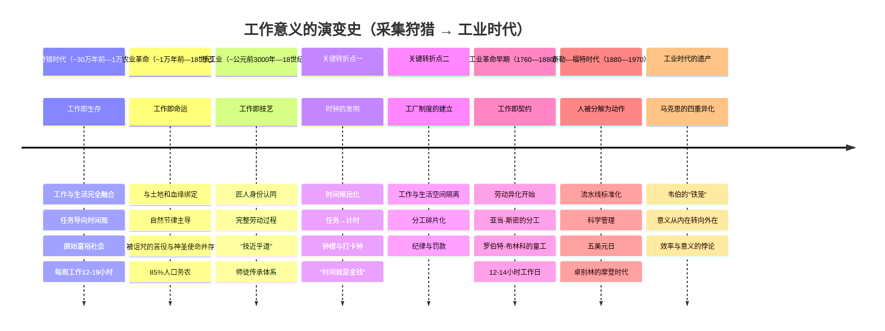

# 综合报告：从农业到工业——工作意义的演变史

**报告日期：2026年06月21日**

---

## 目录

1. [第一部分：叙事弧线——工作意义的演变](#第一部分叙事弧线工作意义的演变)
2. [第二部分：跨时代比较框架](#第二部分跨时代比较框架)
3. [第三部分：故事素材](#第三部分故事素材)
4. [参考来源](#参考来源)

---

## 第一部分：叙事弧线——工作意义的演变

> *工作从来不是"什么"，而是一个不断被重新定义的"为什么"。*

### 1.1 采集狩猎：工作即生存，工作与生活不分

在人类历史的漫长画卷中，农业文明不过是最近一万年的事。若以智人（*Homo sapiens*）约30万年的历史为尺度，我们有95%以上的时间是以采集狩猎为生的。这意味着，"工作"在人类大部分历史中所呈现的形态，与我们今天所理解的截然不同。

1966年，人类学家马歇尔·萨林斯在"Man the Hunter"研讨会上提出了"原始富裕社会"（Original Affluent Society）的概念。他的论点直击现代经济学的根基：富裕不在于拥有得多，而在于需求少。采集狩猎者通过"限制欲望"而非"增加产出"来达到满足，他们是最早的富裕社会[citation:1]。萨林斯引用了理查德·李对非洲喀拉哈里沙漠朱/霍安西人的研究：成年人每周用于获取食物的时间仅为12至19小时，平均每天约2小时9分钟[citation:2]。这意味着每个劳动力每周只工作约2.5天，其余时间可用于社交、游戏、休息。

剑桥大学人类学家詹姆斯·苏兹曼在朱/霍安西人中进行了长达30年的田野工作，在其著作《工作的意义》中提出：采集狩猎者的工作与生活是完全融合的——觅食、烹饪、修理工具、社交、讲故事、育儿，所有这些活动交织在一起，不存在现代意义上的"工作"与"闲暇"的截然区分[citation:4]。苏兹曼描述了一种"旧石器时代的节奏"：一天劳作，一两天休息。人们在营地中度过大量闲暇时光，聊天、唱歌、跳舞、睡觉。这不是懒惰，而是一种精心校准的生存策略——采集狩猎者对自己的环境了如指掌，他们自信地知道自己可以在几小时内获得所需的食物[citation:5]。

在这个时代，**"工作"这个词本身可能毫无意义**——因为没有与"非工作"的对立。采集狩猎者没有"工作"的概念，因为他们没有从生活中划出一个叫做"工作"的独立领域。他们不需要闹钟，不需要打卡，不需要绩效评估，不需要职业规划。他们的时间观是任务导向的：饿了就去觅食，饱了就休息，需要工具就制作。这种"活在当下"的生存哲学，塑造了人类历史上最漫长也是最自洽的工作意义——**工作即生存，生存即生活**。

### 1.2 农业革命：工作即命运，与土地和血缘绑定

大约一万年前，人类开始驯化植物和动物，农业革命悄然改变了这颗星球上最聪明的物种与工作的关系。《圣经·创世记》中记载了上帝对亚当的宣判："你必终身劳苦，才能从地里得吃的……你必汗流满面才得糊口"[citation:8]。这段叙事集中体现了农业文明对工作的新理解：工作不再是自由自在的觅食，而成了被诅咒的苦役。

但农业革命带来的更深层变革在于**时间观念的重构**。苏兹曼敏锐地指出：农民不仅时时刻刻都得想着未来，还几乎可以说是为了未来在服务[citation:10]。农民必须等待种子发芽、庄稼生长、季节更替。他们必须储备粮食以应对可能的歉收。这种对未来的持续关注形成了一种全新的生存焦虑：**稀缺不再是一种偶然，而是一种常态**。与采集狩猎者"信靠自然"的态度不同，农民必须"驯服自然"——开垦土地、修建水利、除草施肥，所有这些活动都在宣告：生存需要持续不断的、艰苦的、有组织的劳动。

在农业社会中，一个人的职业几乎完全由出身决定——你生而为农，便终身为农。这种身份绑定与采集狩猎者的自由流动形成了鲜明对比。在中世纪的欧洲，约85%的人口是农民[citation:11]，他们的生活围绕着农业历法旋转。农夫的劳作既是生存手段，也是宇宙秩序的一部分。在中国的天象观念中，"天象示人"与"农时"紧密相连；在中世纪的欧洲，农夫的劳作也被视为上帝为人类设定的秩序。

中国传统社会的"士农工商"四民等级结构，将"农"排在第二位，仅次于"士"，高于"工"和"商"[citation:14]。《管子》曰："一农不耕，民有饥者；一女不织，民有寒者。"农业生产被视为国家存亡和个人生存的基础。儒家虽然重视农业，却鄙视士人亲自务农。孟子区分了"大人之事"与"小人之事"，认为"劳心者治人，劳力者治于人"[citation:15]。这种区分在后世形成了复杂的文化张力——读书人向往"耕读传家"的理想，却又以"汗滴禾下土"为耻。

然而，工作意义的重要来源在农业时代并未消失：**技艺的尊严**。对于工匠而言，工作的尊严来源于手艺的传承。中国传统文化中的"工匠精神"包含了匠心（求知欲与专注力）、匠术（规范与创新）、匠德（责任与诚信）三维合一[citation:19]。"良田百顷，不如薄艺在身"这一民间谚语反映了技艺对个人尊严的支撑。庖丁解牛、匠石运斤——这些《庄子》中的寓言展现了工匠将技艺提升至"道"的境界的追求。"技近乎道"意味着：工作不仅是谋生手段，更是通向精神超越的道路[citation:20]。

农业文明时代的工作意义可以概括为三重结构：**劳作即命运**（身份绑定）、**勤劳是美德**（顺应自然节律的勤勉）、**技艺赋予尊严**（通过手艺获得社会认同）。这三重结构在数千年间保持稳定，直到工业革命的来临。

### 1.3 手工业：工作即技艺，匠人身份认同

在农业社会的缝隙中，手工业者构成了一个特殊的群体。他们是城市的手艺人、乡村的铁匠、宫廷的工匠——他们的工作意义既不同于农民的"命运服从"，也不同于后来工人的"劳动异化"。

手工业的工作意义建立在三个支柱之上：

**第一，完整的劳动过程。** 一个鞋匠从选皮到裁切到缝合到底成型到上光，全程参与一双鞋的诞生。他能看到自己的劳动转化为一个完整的、有用的物品。这种"完整性"带给匠人的满足感，是流水线工人永远无法体验的。亚当·弗格森早在1767年就预感到了这种完整性的丧失：当一个人终其一生只重复一个简单的操作时，他全面能力的丧失是效率提升的代价[citation:2]。

**第二，代际传承的尊严。** 手艺不仅仅是技能，更是一种身份认同。铁匠的儿子继承的不仅是一把铁锤，更是一种"铁匠世家"的社会身份。《诗经·豳风·七月》中那位三千年前的农夫，将自己视为土地的一部分——这种人与物之间的相互归属，构建了前工业时代最深刻的工作意义。

**第三，"技近乎道"的精神追求。** 在中国传统中，匠人的目标不仅是制造器物，而是达到"技近乎道"的境界。每一个铁匠、木匠、石匠，都是通过日复一日的劳作，在自己的职分上修行[citation:22]。这种修行不需要寺庙和经文——工作本身就是修行的场所。无论东方还是西方，匠人都将工作理解为一种精神实践。

手工业的黄金时代并非只是一个浪漫化的怀旧想象——它是人类历史上工作意义最为充实的时期之一。然而，这个时期被工业革命终结了。

### 1.4 关键转折点一：时钟的发明——时间的殖民化

工业革命最深刻的文化后果之一，是改变了人类对时间的体验。在传统农业社会中，时间是任务导向的——工作持续到任务完成，而非持续到钟点指针指向某个数字。E.P.汤普森在其经典论文《时间、工作纪律与工业资本主义》中详细阐述了这一转变[citation:3]。

18世纪末到19世纪初，工厂主面临的最大挑战不是技术，而是人。从村庄招募来的工人不习惯在固定时间起床、工作、休息。他们仍然保留着"神圣星期一"的传统——周一饮酒狂欢，周二才开始工作。为了改造这些"不守时"的劳动者，工厂主们建造了钟楼，雇佣了计时员，建立了罚款制度。

陶瓷大亨约书亚·韦奇伍德的工厂规程堪称早期时间纪律的缩影："工厂管理员必须第一个到厂，安排工人就位开始工作……对迟到者给予'提醒'，并记录其损失的时间。"[citation:4]到19世纪初，几乎所有工厂都采用了计时工作制。打卡钟（punch clock）的发明——工人将卡片插入机器，"咚"地一声在卡片上印下时间——使时间管理达到了新的精确度。这个机械动作在语言中留下了"punching the clock"的短语，在工人心中留下了异化的印记。

19世纪30年代，一位名叫伊丽莎白·霍奇茨的12岁女孩在刺绣作品中写下了这样的诗句[citation:5]：

> 在深沉的夜晚，当你们甜蜜入眠，
> 我穿过黑暗阴郁的街道，爬向我的苦役，
> 在织机的喧嚣中，直到我可怜的头脑似乎发狂，
> 我回来了，一个不幸的工厂童工。

一个12岁的孩子在凌晨就要穿过漆黑的街道去工厂，在织机旁劳作12小时后才能在同样漆黑的夜晚回家。工作不再与自然节律同步，而是与机器的节奏同步。

### 1.5 关键转折点二：工厂制度的建立——空间上的隔离

如果说时钟将时间从自然中剥离出来，那么工厂则将工作从生活空间中剥离出来。工业革命的关键制度创新——工厂——是一个前所未有的空间：它把大量工人集中在一个屋顶下，按照统一的纪律和节奏进行生产。

亚当·斯密在《国富论》中用制针工厂的例子展示了分工的效率[citation:1]。将制针过程分解为约十八道工序，十名工人协作每天可制造出约四万八千枚针，人均四千八百枚。分工使效率提高了数百倍。但斯密未能充分预见的是：当一个人终其一生只重复一个简单的操作时，那四千八百枚针中，还有哪一枚真正属于他自己？

法国思想家弗格森在斯密之前就预感到了这种变化的代价："在制造一枚针的细小工序中各司其职的人，比那些试图完整制造一枚针的人能生产更多……但这是以工人全面能力的丧失为代价的。"[citation:2]

### 1.6 工业时代：工作即契约，劳动异化

**泰勒制：人被分解为动作**

如果说斯密把工作分解为工序，那么弗雷德里克·温斯洛·泰勒则将这种分解推进到了荒谬的极致。1911年出版的《科学管理原理》中，泰勒宣称要对每个工人的每一个动作进行"时间-动作研究"，找到"唯一最佳方法"[citation:8]。

泰勒在伯利恒钢铁公司研究了一个工人用铲子铲煤的最优动作——铲子的角度、行进距离、身体姿势，都被精确计算和标准化。通过重新设计工作流程，他成功将每人每天搬运的生铁量从12.5吨提升到47.5吨。但正如布雷弗曼后来批判的那样，科学管理"不是从人的角度出发，而是从资本的角度出发"[citation:9]。它的本质不是提高效率，而是控制。通过将脑力劳动与体力劳动分离——管理者负责思考和计划，工人只负责执行——泰勒从根本上剥夺了工人对工作的理解。

**福特流水线：人在成为机器的附件**

亨利·福特将泰勒的原则推向极致。1913年，福特汽车公司在高地公园工厂引入了第一条移动装配线。此前，制造一辆Model T需要约12小时；流水线将其压缩到93分钟[citation:10]。福特将复杂的汽车制造分解为7882个操作，其中多数操作只需简单的重复动作。

代价是毁灭性的。流水线工作的单调导致工人极度不满。到1913年底，福特的年劳工流动率达到370%——为了维持10000人的岗位，公司每年要雇佣超过37000人[citation:11]。旷工率也极高，周一旷工率一度达到10%。

福特的回应是1914年1月5日震惊世界的五美元日——将工人日薪从2.34美元提升至5美元，同时将工时从9小时降至8小时。这不是纯粹的慈善。福特说得很清楚："更高的工资是为了让工人更能忍受生产线的单调。"五美元日有一个秘密：工人只能拿到约2.40美元的基本工资，剩下的2.60美元是"利润分享"——要拿到全额，工人必须通过公司"社会学部"的审查[citation:12]。

**马克思的异化理论：四重维度**

如果说斯密和泰勒是从管理层的视角看待工作，那么年轻的卡尔·马克思在1844年《经济学哲学手稿》中，第一次从工人的视角系统分析了工业资本主义下工作的本质[citation:14]。

马克思提出了影响深远的异化劳动四重维度：

- **第一，劳动者与劳动产品的异化**：工人生产的产品越多，他所拥有的就越少。他生产了汽车，但买不起；他建造了宫殿，但住在贫民窟。
- **第二，劳动者与劳动活动本身的异化**：工作不是自愿的、创造性的自我实现，而是"被迫的强制劳动"。马克思用的措辞令人印象深刻——"只要肉体的强制或其他强制一停止，人们就会像逃避瘟疫一样逃避劳动。"
- **第三，劳动者与类本质的异化**：人的类本质是自由自觉的活动。在资本主义下，劳动被降低为仅仅是维持肉体生存的手段。一个人只有在家中和休闲时才是"人"，在工作时不过是一个"动物"。
- **第四，人与人之间的异化**：当工人和资本家处于对抗关系时，人与人之间的社会关系变成了物与物之间的关系。

**韦伯的悖论：天职观的兴起与陨落**

与马克思从经济基础出发分析不同，马克斯·韦伯从文化精神的角度解释了资本主义工作伦理的起源。他的《新教伦理与资本主义精神》试图回答一个关键问题：为什么现代资本主义率先在西方兴起[citation:15]？

韦伯发现，加尔文派的预定论催生了一种全新的工作态度——"入世的禁欲主义"：勤奋工作、积累财富，但拒绝享乐。路德翻译的"Beruf"（天职／呼召）既表示"职业"又表示"上帝的召唤"，意味着最平凡的日常工作也被赋予了宗教意义。这种观念赋予单调、枯燥、重复的工业劳动以超越性的意义。

但韦伯的著名结语充满了悲凉的洞见：清教徒想为天职而工作，而我们现代人被迫如此。胜利的资本主义不再需要这种宗教支柱，留下了那个著名的"铁笼"——工作仍在继续，意义已经逃逸。

### 1.7 叙事弧线总结：从"与生命的合一"到"与意义的分离"

回顾从采集狩猎到工业时代的漫长演变，我们可以发现一条清晰的弧线：

| 时代 | 工作与生活的关系 | 工作意义的核心 | 人对工作的态度 |
|------|-----------------|---------------|--------------|
| 采集狩猎 | 完全融合 | 生存本身，无需追问 | 自然而然 |
| 农业 | 部分融合（与土地绑定） | 命运／天意／修行 | 接受与忍耐 |
| 手工业 | 与身份认同融合 | 技艺的尊严 | 自豪 |
| 工业 | 完全分离 | 契约／薪酬 | 被迫与疏离 |

这条弧线的方向是清晰的：**工作从"与生命的合一"走向了"与意义的分离"**。在采集狩猎时代，工作不是一个独立的范畴，它是生活本身。在工业时代，工作成了一个需要被"激励"和"管理"的问题——这本身就暴露了意义的断裂。

---

## 第二部分：跨时代比较框架

> *构建一个分析框架，不是为了把复杂的历史简化为几格表格，而是为了在不同时代的镜像中看清我们所处的时代。*

### 2.1 框架设计：四维比较法

结合前述研究笔记，我构建了一个四维分析框架，用于比较不同时代的工作意义：

1. **工作形态**：工作的组织形式、技术基础和空间安排
2. **意义来源**：工作赋予个体"为什么做"的答案从何而来
3. **核心态度**：社会主流对工作的情感和道德评价
4. **生命周期**：工作如何定义一个人的生命轨迹

### 2.2 跨时代对比表

| 维度 | 采集狩猎时代 | 农业时代 | 手工业时代 | 工业时代（早期） | 工业时代（泰勒—福特） |
|------|------------|---------|-----------|----------------|-------------------|
| **时间跨度** | 约30万年前—1万年前 | 约1万年前—18世纪 | 约公元前3000年—18世纪 | 约1760—1880年 | 约1880—1970年 |
| **工作形态** | 分散的、即时的觅食活动 | 围绕农业历法的季节性劳作 | 作坊式、师徒制的技艺生产 | 工厂集中、分工细化、计时制 | 流水线标准化、秒表管理 |
| **技术基础** | 石制工具、弓箭、火 | 犁、锄、灌溉系统、畜力 | 手工具、熔炉、作坊 | 蒸汽机、纺织机、铁器 | 电力、流水线、泰勒制 |
| **时间观念** | 任务导向、无计时概念 | 自然节律主导（日出而作、日落而息） | 按订单节奏、工匠经验 | 时钟时间开始主导 | 秒表精度、标准化时间 |
| **空间安排** | 无固定工作场所 | 田地、家庭院落 | 作坊与家庭合一 | 工厂建筑、工作与生活分离 | 大规模单一工厂 |
| **工作与生活边界** | 完全融合 | 部分融合（但农忙时主导一切） | 紧密联系（家庭作坊） | 显著分离 | 剧烈分离 |
| **核心意义来源** | 即时生存满足、社群归属 | 土地绑定、宇宙秩序、命运 | 技艺尊严、完整产出、代际传承 | 薪酬、纪律、道德责任（新教伦理） | 金钱激励、消费主义 |
| **社会身份来源** | 年龄、性别、技艺 | 土地占有量、血缘 | 行会身份、师承 | 雇佣关系、工种 | 劳动力商品化 |
| **核心态度** | 自然而然、充足即满足 | 命运接受、勤劳是美德 | 职业自豪、"技近乎道" | 被迫适应、道德化工作 | 承受与消极抵抗（怠工） |
| **社会评价** | 无独立"工作"评价 | "民以食为天"，农为邦本 | "良田百顷不如薄艺在身" | "不工作就是罪恶" | "效率就是一切" |
| **典型话语** | "饿了就去找吃的" | "汗流满面才得糊口" | "匠心独运" | "时间就是金钱" | "科学管理" |
| **劳动控制方式** | 自然环境约束 | 自然力量+领主/地主控制 | 行会、师傅权威 | 计时+罚款+监工 | 科学动作分析+薪酬激励 |
| **工作的痛苦来源** | 偶尔的饥荒、极端天气 | 歉收、领主剥削、繁重体力 | 订单不稳定、市场波动 | 漫长工时、恶劣环境、童工 | 极度单调、速度压迫 |
| **工作的满足来源** | 食物、社群、自由 | 丰收、土地安全感 | 完成作品、徒弟成才 | 薪能给家庭带来的改善 | 消费者身份的获得 |
| **典型生命周期** | 无"职业生涯"概念 | 出生即定、终身为农 | 学徒—工匠—师傅 | 童工—工人—衰老—被淘汰 | 流水线工人—退休—消费者 |
| **关键制度** | 血缘群体、分享规范 | 封建庄园、地主制度 | 行会、师徒制 | 工厂制度、雇佣劳动 | 科学管理、社会学部 |
| **意义危机的表现** | 无（工作概念尚未独立） | 无（意义自洽） | 机器替代手艺的恐惧（卢德主义先声） | "我不想死在工厂里" | "我拧螺栓时在想什么？" |
| **人的主体性** | 高（自由自主） | 低（被土地绑定） | 中高（技能赋予自主） | 低—中（受雇于人但有手艺） | 极低（被系统定义） |
| **代表性思辨人物** | — | 孟子、许行 | 老子（技近乎道） | 斯密、马克思、韦伯 | 泰勒、福特、卓别林 |

### 2.3 框架应用——关键洞察

**洞察一：工作意义的"黄金时代"是一个神话。**

沿着这个框架回顾历史，我们发现每一个时代的工作都有其独特的痛苦和满足。采集狩猎者有饥荒和部落冲突的焦虑，农民有歉收和领主压迫的苦难，手工业者有市场波动的风险，工人有异化和单调的煎熬。没有一个时代的工作是完美的。我们怀念"工匠精神"时，往往忘记了中世纪手工业学徒的漫长剥削；我们赞美采集狩猎者的自由时，往往忽略了高死亡率和对自然的脆弱性。

**洞察二：意义的来源从内在转向外在。**

一个清晰的趋势是：工作的意义来源从**内在**（生存满足、技艺自豪、完整产出）逐渐转向**外在**（薪酬、消费、社会身份）。这种"意义外化"的过程是工业革命的必然产物。当工人无法从工作本身获得满足时，工资成为唯一的意义锚点。这解释了为什么对"高薪但无意义的工作"的抱怨在当代社会如此普遍——因为薪酬作为意义替代品的有效性是有上限的。

**洞察三：人对工作的主体性整体下降。**

从采集狩猎者到流水线工人，人在工作中的主体性呈现"U型"曲线：采集狩猎时代最高（完全自主），农业和手工业时代中等（受自然和社会结构约束但仍有一定自主），工业时代早期到泰勒—福特时代降至最低（被机器和系统完全控制）。这一趋势在20世纪末的后工业时代开始反转——知识工作者和创意工作的兴起重新提升了主体性——但这已经是另一个阶段的叙事。

**洞察四："异化"是一个连续谱，而非二元对立。**

马克思所描述的异化并非工业时代的专利，而是贯穿于整个工作演变史的一个连续变量。采集狩猎者的异化程度最低，流水线工人的异化程度最高。但即便在农业社会中，农民与土地的关系也带有一定程度的"物化"——当人被视为土地的附属物时，异化已经开始了。工业革命只是将这一过程加速并推至极端。

**洞察五：每一波"科学管理"都以提升效率之名深化意义危机。**

从斯密的分工到泰勒的秒表，从福特的流水线到当代的KPI和OKR，每一次"科学地"重组劳动过程，都在提高效率的同时进一步割裂了人与工作之间的意义联结。这构成了一种"现代性的悖论"：效率的提升以意义的丧失为代价。这不是一种暂时的、可以克服的矛盾，而是一种结构性的、内在于现代工作制度的核心张力。

### 2.4 跨时代的关键变量：时间、空间、主体性

为了更深刻地理解工作意义的变迁，我提取三个关键变量：

**时间**：从任务导向到自然节律到时钟时间到秒表精度。时间从"生活的容器"变成了"被管理的资源"。一个人对时间的掌控程度，直接决定了他工作的意义感。采集狩猎者完全掌控自己的时间，流水线工人的时间则完全属于机器。

**空间**：从无固定场所到田野到作坊到工厂到办公室。空间的变化反映了工作从生活中被抽离的过程。当"去上班"意味着离开家到一个专门的地方做专门的事，工作与生活的物理隔离就完成了。

**主体性**：从完全自主到被自然约束到被系统决定。主体性的下降是工业革命最深刻的代价，也是当代工作意义危机的根源。当"为什么工作"的答案从"因为我选择"变成"因为我必须"时，意义已经逃逸。

---

## 第三部分：故事素材

> *每一个时代的工作意义，最终都凝结在普通人的故事中。以下四个故事种子，将在正式报告中展开叙述。*

### 故事一：一位中国农夫的四季——《诗经·豳风·七月》的见证

距今三千年前，在陕西豳地（今旬邑、彬县一带），一个农夫的生活是这样的：

正月里寒风凛冽，他修补农具，准备迎接春耕。二月，他带着妻子下田，孩子们跟在后面送饭。三月修剪桑枝，四月开始用葫芦瓢缝制衣服。五月蟋蟀鸣叫，六月吃李子和葡萄，七月煮葵菜和豆子度日。八月打枣，九月筑打谷场。十月将黍稷稻粱收进谷仓，但粮食刚刚入仓，又要给领主修建宫室。白天割茅草，夜里搓绳索，赶着修缮屋顶。十一月猎取貉狐，给领主做皮裘。十二月全体出动大猎，训练武备。严冬腊月，他凿开冰河，将冰块储藏起来以备领主夏季享用。

一年到头，他自己吃什么？"六月食郁及薁，七月亨葵及菽，八月剥枣，十月获稻……七月食瓜，八月断壶，九月叔苴，采荼薪樗，食我农夫。"[citation:21]——那些最好的食物都献给了领主，留给自己的是苦菜和柴火。

这位农夫从未思考过"工作的意义"。他的工作就是他的生活，他的苦难就是他的命运。他的故事是农业时代工作意义的缩影：劳作不是选择，而是存在本身。工作与生活的边界不存在，因为没有必要存在。他的生命周期——出生、劳作、繁衍、老去——与土地的节律同步，与岁月的轮回同频。

**叙事价值**：这个故事代表了农业时代工作意义的典型——沉默的、无需质问的、被命运接受的劳作。《诗经·豳风·七月》是中国乃至世界文学史上最完整、最古老的农业劳作记录，它提供了一个没有经过文人修饰的"原生"工作叙事。

**展开方向**：农夫的沉默本身是一种意义——当语言不需要表达"为什么工作"时，工作与社会秩序、宇宙节律、家族延续完全合一。这种沉默在工业时代被打破，因为"为什么工作"成了一个问题。

### 故事二：一个铁匠的传承——技艺之道的尊严

北宋年间，汴京城外有一家铁匠铺，三代传承。祖父在五代乱世中学得一手淬火绝活，父亲在太平年间把手艺传给了儿子。

炉火映红了十五岁少年的脸。父亲站在身旁，手把手教他判断铁水的温度——"看颜色，从暗红到亮白，每一点变化都要记住。"打铁不需要文字记录，靠的是身体的记忆：手腕的角度、锤击的力度、淬火的时机。

三年后，儿子打出了第一把合格的犁铧。父亲没有说话，只是把祖传的铁锤递给了他。这把锤子已经传了三代，木柄被汗水浸染成了黝黑的颜色，磨出了五个深深的指印。

儿子不知道，他所传承的不只是一门手艺——他传承的是一种将物质转化为文化的**技艺之道**。在中国传统文化中，匠人的目标不仅是制造器物，而是达到"技近乎道"的境界。每一个铁匠、木匠、石匠，都是通过日复一日的劳作，在自己的职分上修行[citation:22]。

**叙事价值**：这个故事展示了手工业时代工作的核心意义——技艺赋予身份尊严。与农民的沉默接受不同，铁匠的工作意义通过师徒传承、身体记忆和作品完整性来构建。铁匠锤子上的指印不只是磨损，而是三代人工作意义的物理凝结。

**展开方向**：可以对比铁匠与流水线工人的劳动体验差异——同是重复性的体力劳动，前者因为"全流程掌控"和"代际传承"而具有意义，后者则因为"碎片化"和"可替代性"而丧失意义。铁匠的故事是一个即将消失的世界，工业革命最大的"牺牲品"之一不是某个职业，而是一种完整的工作体验。

### 故事三：福特高地公园流水线上的工人——意义的断裂

1913年，一位无名工人在福特高地公园工厂的流水线上负责安装后轮。每个工作日，他重复着一个动作——拿起螺栓、对准螺孔、拧紧——几千次。之前他是一个马车工匠，能独立打造一辆完整的马车轮子，熟悉木材纹理、金属锻造，能从轮毂到轮圈独立完成。在流水线上，他只需要在汽车经过他工位的37秒内完成四个螺栓的安装。

有一天，他向监工抱怨："我觉得自己不像人了。"监工回答："那你就拿五美元的日薪吧。"他继续拧螺栓。

五美元确实能买很多东西——付房租、养家、偶尔喝一杯。但它买不回那种看着自己亲手完成一件完整作品时的满足感。这就是工业时代工作的核心悖论：效率的提高以意义的丧失为代价，物质的丰裕以精神的贫瘠为代价。

**叙事价值**：这个故事是工业时代工作意义危机的最直观呈现。一个完整的人被简化为一个"螺栓安装器"。五美元日薪不仅是经济史上的事件，更是意义交换史上的一页——金钱取代了意义，成为工作的唯一理由。

**展开方向**：从这位无名的流水线工人出发，可以串联起泰勒的科学管理（他被分解为"动作"）、马克思的异化理论（他失去了对劳动过程的控制）、福特的社会学部（连他的私生活也在被审查）、以及卓别林在《摩登时代》中对他命运的艺术再现。他的个人故事是工业时代集体命运的浓缩。

### 故事四：卓别林的《摩登时代》——工业批判的艺术巅峰

1936年，查理·卓别林的《摩登时代》以黑色幽默的方式将泰勒制的荒谬呈现在银幕上。流浪汉夏尔洛在流水线上不停地拧螺丝，节奏越来越快，最终精神崩溃——他拿着扳手追着任何看起来像螺丝的东西拧，包括同事的鼻子和女性裙摆上的纽扣。

最著名的场景中，夏尔洛被送入一台"自动喂食机"进行测试——这台机器在他吃饭时自动喂食，展示管理者如何将"浪费时间"的进食也纳入科学管理。机器失控，玉米棒疯狂敲打他的脸、汤泼洒在他身上。这是泰勒主义最极致的寓言：在追求效率的狂热中，人被机器吞噬。

《摩登时代》上映时，美国正处于大萧条的高峰，工厂里仍有数百万人失业。卓别林的讽刺之所以引发共鸣，是因为每个人都感受到了：工作不仅不能带来尊严，反而正在摧毁人的尊严。

**叙事价值**：这个故事的意义在于——它是工业时代工作意义危机的"第一人称"表达。之前的理论家（斯密、马克思、韦伯）都在用学术语言描述这种危机，而卓别林用身体和笑声让全世界都"看到"了它。从某种角度看，卓别林的夏尔洛比马克思的资本论更能让普通人理解异化是什么意思。

**展开方向**：可以从《摩登时代》中的三个意象展开——拧螺丝（工作的单调）、自动喂食机（科学管理的荒谬）、疯人院（社会的反应）。这个故事的展开可以与格雷伯的"狗屁工作"理论对话：卓别林看到的是"有意义的工作被异化"，而一个世纪后的格雷伯看到的是"连异化的工作都消失了，只剩下毫无意义的工作"。

---

## 附：Mermaid时间线设计

---

## 参考来源

[citation:1] 亚当·斯密，《国富论》（1776），第一卷第一章"论分工"——制针工厂案例。Adam Smith, *An Inquiry into the Nature and Causes of the Wealth of Nations*, 1776.

[citation:2] 亚当·弗格森，《文明社会史论》（1767）——对分工负面影响的早期预见。Panmure House: Adam Smith and the Pin Factory.

[citation:3] E.P. Thompson, "Time, Work-Discipline, and Industrial Capitalism", *Past & Present*, No. 38 (1967), pp. 56-97.——时间观念与工作纪律的经典论述。

[citation:4] Neil McKendrick, "Josiah Wedgwood and Factory Discipline", *The Historical Journal*, Vol. 4, No. 1 (1961), pp. 30-55.——韦奇伍德的工厂纪律。

[citation:5] Elizabeth Hodgates, *The Factory Child's Trouble* sampler, 1833. Salford Museum & Art Gallery.——12岁童工的刺绣证词。

[citation:6] John Brown, *A Memoir of Robert Blincoe* (1832).——布林科回忆录，工业革命童工的第一手资料。

[citation:7] Carolyn Tuttle, "Child Labor during the British Industrial Revolution", EH.Net Encyclopedia.——英国工业革命童工数据。

[citation:8] Frederick Winslow Taylor, *The Principles of Scientific Management* (1911).——科学管理的四项原则。

[citation:9] Harry Braverman, *Labor and Monopoly Capital: The Degradation of Work in the Twentieth Century* (1974).——对泰勒制的马克思主义批判。

[citation:10] Britannica, "Frederick W. Taylor & Scientific Management".——泰勒生平与时间研究。

[citation:11] The Henry Ford, "Ford's Five Dollar Day Revolution".——五美元日的背景与劳工流动率数据。

[citation:12] Stephen Meyer, *The Five Dollar Day: Labor Management and Social Control in the Ford Motor Company, 1908-1921* (SUNY Press, 1981).——福特社会学部与工人监控。

[citation:13] Karl Marx, *Economic and Philosophic Manuscripts of 1844* ——"异化劳动"篇。Marxists.org.

[citation:14] Max Weber, *The Protestant Ethic and the Spirit of Capitalism* (1904-05).——天职概念与入世禁欲主义。

[citation:15] Marshall Sahlins, "The Original Affluent Society," presented at the *Man the Hunter* symposium, University of Chicago, 1966.——原始富裕社会概念。

[citation:16] Richard B. Lee, "What Hunters Do for a Living, or, How to Make Out on Scarce Resources," in *Man the Hunter*, ed. Richard B. Lee and Irven DeVore (Aldine, 1968), pp. 30-48.

[citation:17] James Suzman, *Work: A Deep History, from the Stone Age to the Age of Robots* (Penguin, 2020).——采集狩猎者工作与生活融合的论述。

[citation:18] 《圣经·创世记》3:17-19. "你必终身劳苦，才能从地里得吃的……"

[citation:19] 张霄，"中国传统职业道德的现代转化"，全国哲学社会科学工作办公室，2023年。——儒家"敬"的思想与工作伦理。

[citation:20] "中国古代工匠精神三维体系探析"，*国际人文社科研究*，2025年。——匠心、匠术、匠德三维合一分析。

[citation:21] 《诗经·豳风·七月》——中国先秦时期最完整的农业劳作记录。

[citation:22] 中国非物质文化遗产网，"中国工匠的人文精神"。——"技近乎道"理念。

[citation:23] David Graeber, "On the Phenomenon of Bullshit Jobs", *Strike! Magazine* (2013).——狗屁工作理论的首次提出。

[citation:24] Georges Duby, *Rural Economy and Country Life in the Medieval West* (Edward Arnold, 1968).——中世纪农村经济与互助传统。

---

*本综合报告为《探寻工作的意义》研究项目的阶段成果，基于research-notes-preindustrial.md和research-notes-industrial.md两份研究笔记综合而成。*
