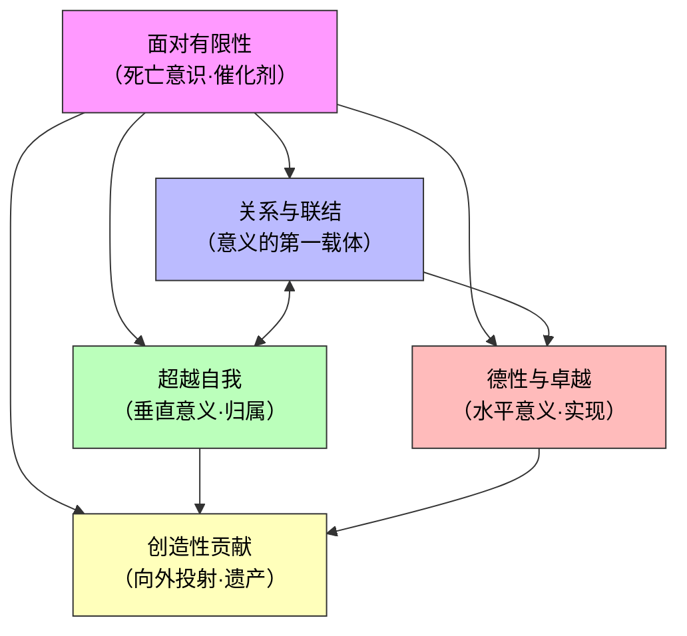
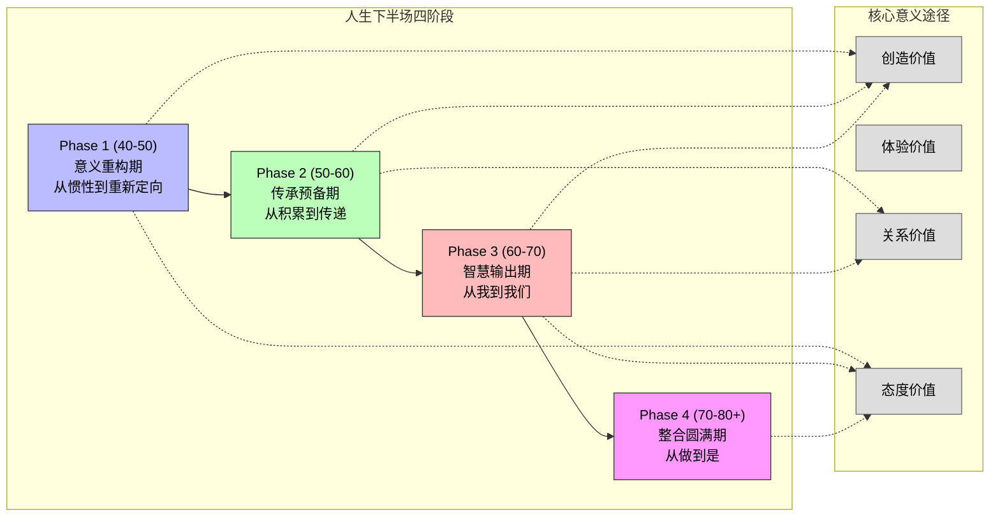

# 生命的意义——跨时空研究报告

**报告日期：2026年6月20日**

---

## 执行摘要

"生命的意义"是人类文明史上最古老、最根本的追问之一。本报告跨越两千五百年思想史，整合六大历史时期（古希腊、东方古典、中世纪、启蒙时期、19世纪转折、20世纪存在主义）与当代五大维度（世俗人文主义、存在主义回声、后现代多元化、积极心理学、东亚意义危机），提出五大跨文化意义共核——关系与联结、超越自我、德性与卓越、创造性贡献、面对有限性——并构建了一个从觉察到践行的四层引导模型。报告进一步针对40-80+岁人群，提出四阶段人生行动路线图。核心发现包括：全球约45-55%的人口处于意义感不足的不稳定区间；意义感缺失的社会总代价可能占GDP的2-5%；但"意义危机"的本质不是意义消失，而是意义框架的多元化速度超过了个人整合的能力。报告认为，人类对生命意义的认识深度在历史尺度上正在增加，但这种深化以广泛的意义不安全感为代价。

---

## 一、历史上的生命意义

### 1.1 古希腊时期

古希腊人将"生命的意义"与"卓越"（aretē）和"幸福"（eudaimonia）紧密相连。亚里士多德在《尼各马可伦理学》中系统阐述了其幸福论：一切人类行为都以某种"善"为目的，而最高的善就是eudaimonia——不是一种情绪状态，而是"合乎德性的灵魂的现实活动"[citation:1]。他的"功能论证"指出，正如笛子的功能是吹奏，人的独特功能是理性活动，因此"人的善就是灵魂合乎德性的现实活动"[citation:2]。亚里士多德强调幸福不是静止的"状态"，而是持续进行的"活动"（energeia），还需要友谊、健康等外在善作为辅助条件[citation:3]。

斯多葛学派由芝诺创立，经爱比克泰德和马可·奥勒留发扬光大。其核心主张是：唯一真正的善是美德，其他一切都是"无所谓的"[citation:4]。爱比克泰德的"控制二分法"——区分可控与不可控之事——至今仍是心理韧性的经典框架[citation:5]。马可·奥勒留在《沉思录》中写道："记住，你只是宇宙的一部分，你的存在只是时间中的一个瞬间"[citation:6]。

伊壁鸠鲁学派看似与斯多葛相反，实则存在深层共鸣。伊壁鸠鲁认为快乐是至善，但这里的快乐是"身体无痛苦、灵魂无纷扰"的状态[citation:7]。他提出"快乐计算"——选择能带来长期宁静而非短暂刺激的生活方式[citation:8]。

古希腊悲剧也深刻反映了命运观。索福克勒斯的《俄狄浦斯王》中，歌队感叹"凡人之生，莫如未曾降生"——生命的意义不在于对抗命运，而在于以尊严面对不可逃避的命运[citation:9]。

### 1.2 东方古典哲学

儒家以孔子、孟子为代表，将生命意义嵌入关系网络。《大学》开篇即定义"三纲领"——"在明明德，在亲民，在止于至善"[citation:10]。著名的"八条目"——格物、致知、诚意、正心、修身、齐家、治国、平天下——构建了一条由内而外的完整意义链条。"自天子以至于庶人，壹是皆以修身为本"[citation:11]。张载后来将这一理想精炼为"为天地立心，为生民立命，为往圣继绝学，为万世开太平"。

道家以老子和庄子为代表，提出截然不同的理解。老子在《道德经》中倡导"道法自然"——顺应宇宙的本然运行，以"无为"的方式生活[citation:12]。庄子则发展为精神自由的哲学：他的"逍遥游"描述了超越世俗局限的理想状态，"齐物论"消解了是非善恶的对立。庄周梦蝶的寓言揭示了自我与宇宙界限的虚幻性[citation:13]。

佛教由释迦牟尼创立，核心教义是四圣谛和八正道。第一圣谛"苦谛"指出生命本质上是苦的——生老病死、爱别离、怨憎会、求不得。苦的来源是欲望和执着，灭除欲望即可获得解脱[citation:14]。大乘佛教的"菩萨道"将生命意义从个人解脱扩展到"普度众生"。

在中国传统社会，儒道佛三教相互补充，形成了多维度的意义图景：儒家提供入世规范，道家提供退隐智慧，佛教提供终极安慰。这种"三教合流"使中国人能在不同人生阶段灵活调整对生命意义的理解。

### 1.3 中世纪宗教时期

奥古斯丁在《忏悔录》中写道："你为自己创造了我们，我们的心不得安宁，直到在你中找到安息"[citation:15]。他认为人类的一切追求本质上都是对上帝的渴望。在《上帝之城》中，他将历史理解为上帝救赎人类的神圣计划[citation:16]。生命的意义在于认识上帝、爱上帝、服务上帝。

托马斯·阿奎那在《神学大全》中综合了亚里士多德哲学和基督教神学，构建了目的论宇宙观。人类的终极目的是"与上帝同在的至福"[citation:17]。他区分了不完全的幸福（此世）和完美的幸福（来世），并通过"自然法"理论阐明：遵循理性认识到的道德法则，就是在实现上帝为人类设计的生命意义[citation:18]。

伊斯兰哲学同样贡献了深刻洞见。阿尔·法拉比融合亚里士多德与新柏拉图主义，认为人类的终极目标是"通过理性思辨与主动理智结合，获得至高的幸福"[citation:19]。安萨里则代表苏菲派神秘主义，认为知识的最高形式是直觉和神秘体验，生命的终极意义是消解自我、与安拉合一[citation:20]。

但丁的《神曲》是中世纪基督教世界观的文学顶峰。从"黑暗森林"到天堂上帝面前的完整旅程，象征着生命意义在于通过认识罪恶、经历净化，最终抵达神圣之爱[citation:21]。

### 1.4 启蒙时期

笛卡尔以"我思故我在"建立了近代主体哲学的基础[citation:22]。这一转变对"生命的意义"问题产生了深远影响：意义的来源从神转向了人。

康德在《回答这个问题：什么是启蒙？》中给出了启蒙运动的座右铭："Sapere aude！要有勇气运用你自己的理性！"[citation:23]。他提出了著名的"定言命令"——"要只按照你同时也能意愿它成为普遍法则的准则去行动"[citation:24]。在康德看来，人的尊严在于：人不是手段，而是目的本身[citation:25]。人的意义在于运用理性进行道德自律。

卢梭对理性乐观主义提出了深刻质疑。他提出"高贵的野蛮人"假设：在自然状态下人是善良自由的，社会文明反而腐败了人[citation:26]。生命的意义在于回归内心的自然之声[citation:27]。

伏尔泰在《老实人》的结尾给出了启蒙精神的务实回答："我们必须耕种我们的花园"[citation:28]——与其追问世界的终极意义，不如脚踏实地地工作，在有限的条件下创造自己的秩序。

### 1.5 19世纪转折

叔本华是西方哲学史上首位系统阐述悲观主义的哲学家。他在《作为意志和表象的世界》中提出，世界的本质不是理性，而是盲目的"生命意志"[citation:29]。"生命是一团欲望，欲望不能满足便痛苦，满足便无聊，人生就在痛苦和无聊之间摇摆"[citation:30]。解脱之路在于否定生命意志——通过审美、道德同情和禁欲苦修。

克尔凯郭尔被视为存在主义之父。他激烈反对黑格尔的体系哲学，认为"真理是主观的"[citation:31]。他在《非此即彼》中描绘了三种生活阶段：审美阶段（感官快乐）、伦理阶段（道德责任）、宗教阶段（信仰的跳跃）。在《恐惧与战栗》中，他以亚伯拉罕献祭以撒的故事展示了"信仰的飞跃"[citation:32]。

尼采标志着"生命意义"观念的根本断裂。他在《快乐的科学》中宣布"上帝死了"[citation:33]。在《查拉图斯特拉如是说》中，他呼吁"超人是大地的意义"——始终保持对大地的忠诚[citation:34]。他提出了权力意志、永恒轮回和价值重估三个核心概念，在《悲剧的诞生》中区分了日神精神与酒神精神[citation:35]。

陀思妥耶夫斯基的《地下室手记》展示了现代人的困境：当上帝不存在、理性不能指导生活时，人只有用非理性的任性来证明自己的自由[citation:36]。

### 1.6 20世纪存在主义

海德格尔在《存在与时间》中重新提出了"存在的意义"问题[citation:37]。他认为日常的"此在"生活在"常人"的沉沦状态中。但死亡——"向死而生"——是打破这种沉沦的关键。只有诚实地面对死亡，人才能获得"本真性存在"[citation:38]。

萨特提出了存在主义的核心命题："存在先于本质"[citation:39]。人首先被抛入存在，没有任何预定的本质，然后通过自己的选择和行动来定义自己。"人不是别的，只是他自己所造就的东西"[citation:40]。这种极端的自由既是恩赐也是诅咒——人被"判定为自由"，必须为自己的每一个选择承担全部责任[citation:41]。

加缪在《西西弗神话》中开篇写道："真正严肃的哲学问题只有一个，那就是自杀"[citation:42]。荒谬产生于人类对意义的渴求与世界的沉默之间的矛盾。面对荒谬，加缪拒绝逃避，提出不懈的反抗、自由和激情。西西弗是幸福的——"攀登山顶的拼搏本身足以充实一颗心灵"[citation:42]。在《反抗者》中，他进一步写道"我反抗，故我们存在"[citation:43]。

弗兰克尔在《活出生命的意义》中，基于集中营经历提出"意义意志"是人的基本驱动力。意义可以通过三种方式找到：创造的价值、体验的价值和态度的价值[citation:45]。

---

## 二、当代多元化的生命意义

### 2.1 世俗人文主义

世俗人文主义主张，不需要超自然信仰即可建立道德体系和生活意义。全球"无宗教人口"约16%（超过12亿人），在西欧和东亚远高于全球均值[citation:1]。德·波顿在《宗教的慰藉》中提出，无神论者可以从宗教中借鉴社区感和仪式传统[citation:2]。格雷林构建了基于理性和人权的世俗伦理框架[citation:3]。达马西奥从神经科学角度论证，意识和意义感根植于生物体的内稳态调节[citation:4]。

数据表明，在"无宗教人口"超过40%的国家（瑞典、丹麦、荷兰），生活满意度反而位居全球前10[citation:6]。中国自评"无宗教信仰"人口超过85%，但生命意义感得分在东亚中最高[citation:6]。世俗人文主义面临的核心挑战是：没有超越性框架，意义能否持久？泰勒在《世俗时代》中警告，"封闭的无神论"可能导致意义的"轻量化"[citation:10]。

### 2.2 存在主义的当代回声

如果说20世纪存在主义是对二战后"上帝已死"的回应，那么21世纪的存在主义则是对"意义过剩而结构崩塌"的后现代困境的回应。韩炳哲在《倦怠社会》中提出，21世纪人类从"规训社会"进入了"功绩社会"——不再是被外部权威命令"你应该"，而是被内部化的自我期待驱动"你能够"[citation:11]。这种"自我剥削"比外来压迫更难以抵抗。

亚隆提出的四个终极关怀——死亡、自由、孤独、无意义——仍然是当代心理治疗的基石[citation:12]。COVID-19疫情在全球范围内引发了一场"存在主义觉醒"：42%的美国成年人报告疫情"让我重新思考什么才是真正重要的"[citation:15]。恐惧管理理论的跨文化验证表明，当人们被提醒自己的必死性时，会加强对"文化世界观"的依附[citation:14]。

### 2.3 后现代与多元化

利奥塔宣告的"宏大叙事的终结"在21世纪已成为事实。法国哲学家Lipovetsky将此描述为"超现代性"的特征：没有主导性的意义框架，个人必须从碎片化的文化资源中自行拼接生活意义[citation:16]。

Pew Research Center 2024年的全球调查发现，当代人不再从单一来源获取生命意义，而是混合使用多种框架：家庭（全球平均67%）、职业（42%）、精神/宗教（41%）、创造性表达（26%）、社会贡献（24%）[citation:17]。中国社会学者孙飞宇追踪发现，2020年后中国青年的意义框架高度碎片化，"躺平""内卷""佛系""数字游民"等多重叙事并存[citation:18]。

后现代多元化的另一面是虚无主义的常态化。格雷在《稻草狗》中激进而悲观地论证：人类是"一种自以为有意义的物种"[citation:19]。伯格提出了"意义危机的社会学解释"：在前现代社会，意义是"理所当然地"嵌入日常生活的；而现代社会将意义变成了一个"需要持续工作的议题"[citation:20]。

### 2.4 积极心理学与意义

塞利格曼在2011年提出的PERMA模型将"意义"列为人类繁荣的五大支柱之一[citation:21]。意义不是快乐——它经常伴随着痛苦，但它提供了一种"值得活着"的感觉。弗兰克尔的《活出生命的意义》在21世纪迎来了惊人的复兴，引用量增长了超过300%[citation:22]。

意义中心心理治疗（MCP）被证明能有效提升晚期癌症患者的生命意义感，降低抑郁和绝望[citation:24]。Adam Grant的研究发现，当员工能直接感知自己的工作对他人产生积极影响时，工作意义感显著上升[citation:23]。日本冲绳的"Ikigai"概念——"值得活的东西"——在2010年代进入全球视野[citation:25]。

实证研究表明，高生命意义感者全因死亡率低57%，认知衰退速度慢约40%[citation:26]。中国大学生中，生命意义感与抑郁得分的负相关为r=-0.48，与生活满意度的正相关为r=0.52[citation:27]。

但积极心理学也面临深刻批评。Davies在《快乐产业》中批判，积极心理学和意义话语正在被资本收编为"情绪管理技术"[citation:28]。Sandel指出，当代"意义话语"过于个人主义化，忽视了结构的压迫[citation:29]。

### 2.5 东亚社会的意义危机

中国社会出现了"空心病"现象——高成就但低意义，内心空洞[citation:30]。这不是个体心理问题，而是多重结构性力量共同作用的结果：教育资源竞争将意义窄化为分数和排名，家庭期望压力将意义外部化，单一成功叙事缺乏多元路径[citation:31]。2023年，教育部将"生命教育"正式纳入中小学课程体系[citation:32]。

日本面临"无缘社会"——地缘、血缘、社缘三重"缘"的丧失。每年约4.2万人"孤独死"，50岁以上单身男性中约30%"没有一个可以完全信赖的朋友"[citation:33]。传统意义结构——公司、家庭、地域社区——三大支柱同时崩塌[citation:34]。

韩国提出了"N抛世代"概念——从"三抛"（抛弃恋爱、结婚、生育）发展到"全抛"。2023年总和生育率降至0.72，全球最低[citation:35]。极端教育竞争（私教支出占GDP比例约2.8%，全球平均的10倍以上）与社会阶层固化同时存在[citation:36]。

东亚三国的意义危机有着相似的结构性根源——高速现代化与传统价值之间未能有效衔接。这种"压缩现代性"产生了一个特殊后果：旧的意义框架尚未完全退出，新的意义框架尚未完全建立，个人被夹在两个世界之间的缝隙中。

### 2.6 科技时代的挑战

社交媒体对意义感的侵蚀是算法经济学的必然结果。Zuboff在《监控资本主义》中揭示了数字平台的底层逻辑：注意力、情感和行为数据被转化为利润来源[citation:37]。Twenge等人的研究发现，每天使用社交媒体超过3小时的青少年，报告"生命缺乏意义"的比例是少用者的2.3倍[citation:38]。中国数据同样显示，日均短视频使用超过3小时的群体，生命意义感得分显著低于使用1小时以下的群体[citation:39]。

AI对职业意义的冲击超越了"工作会被取代吗"的实用层面，进入了更深层的存在焦虑："如果AI能做我做得更好的事，我的存在还有什么意义？"[citation:41]韩炳哲在《非物》中警告，数字时代正在将"物"转变为"非物"，人类与世界的"亲密性"正在丧失[citation:43]。Tasioulas提出，AI时代意义建构的关键转向是从"我能做什么"转向"我选择成为什么样的人"[citation:44]。

但科技也是意义的容器。B站哲学类视频播放量超过10亿次，Reddit r/Existentialism订阅者超过150万。科技既是意义危机的加速器，也可能是意义建构的新阵地。

---

## 三、普遍的生命意义及其理解深度

### 3.1 五大意义共核

跨越六个历史时期、五个当代维度和七个世界文化区域，我们可以识别出五个反复出现的意义共核：

**共核一：关系与联结**——生命意义最普遍、最稳健的来源是与他人的积极联结。亚里士多德将友谊视为幸福不可或缺的条件[citation:1]。儒家以"仁"作为核心德性——"仁者，人也"。Pew 2024年调查显示，"家庭"在所有文化区域中都是排名第一的意义来源，全球平均67%[citation:17]。Ubuntu哲学——"我存在因为我们存在"——将关系置于意义的核心[citation:49]。

**共核二：超越自我**——人类普遍需要感到自己属于或服务于某种超越当下自我界限的事物。奥古斯丁的"不安之心"[citation:15]、佛教的"菩萨道"[citation:14]、康德的道德自律[citation:24]、弗兰克尔的"态度价值"[citation:45]——不同的语言指向同一结构：人通过走出自我的局限来获得意义感。

**共核三：德性与卓越**——意义存在于活出人的最佳状态。亚里士多德的"功能论证"[citation:1]、儒家的"止于至善"[citation:10]、尼采的"超人"哲学[citation:34]——都需要感觉自己是有能力的、有贡献的、在进步的。

**共核四：创造性贡献**——人类普遍的冲动是在世界上留下自己的痕迹。弗兰克尔的"创造的价值"[citation:45]、伏尔泰的"耕种我们的花园"[citation:28]——创造是对死亡和遗忘的对抗。恐惧管理理论证实，当死亡突显性增加时，人们更强烈地追求象征性不朽[citation:14]。

**共核五：面对有限性**——对死亡和生命有限性的意识是深层意义感的核心催化剂。海德格尔的"向死而生"[citation:38]、加缪的西西弗神话[citation:42]、佛陀的第一圣谛[citation:14]——生命的意义恰恰因为生命是有限的才成为问题，而正是因为成为问题，它才有了重量。

### 3.2 意义共核的综合框架

五大共核之间形成了一个系统结构：面对有限性处于"催化剂"位置，关系与联结是意义的最直接载体，超越自我提供"垂直"意义维度，德性与卓越提供"水平"意义维度，创造性贡献将前四个共核"外化"为可视化的遗产。



**表1：五大意义共核——跨时代跨文化比较**

| 意义共核 | 古希腊表达 | 东方古典表达 | 中世纪表达 | 启蒙/现代表达 | 当代实证证据 |
|---------|-----------|------------|-----------|-------------|------------|
| **关系与联结** | 亚里士多德论友谊；斯多葛的"宇宙公民" | 儒家"仁者爱人"；Ubuntu哲学 | 教会的基督肢体合一 | 康德：人是目的非手段 | Pew 2024：家庭为#1意义来源[citation:17] |
| **超越自我** | 柏拉图式的理型追求 | 佛教菩萨道：普度众生 | "我们的心不得安宁，直到在你中安息"[citation:15] | 弗兰克尔：态度的价值[citation:45] | 意义中心心理治疗降低晚期患者绝望感[citation:24] |
| **德性与卓越** | 亚里士多德的功能论证；arete传统 | 儒家"止于至善"；八条目 | 阿奎那的自然法：行善避恶[citation:18] | 尼采：权力意志即自我克服[citation:34] | PERMA模型的"A"因子与意义感正相关[citation:21] |
| **创造性贡献** | 赫拉克利特：性格即命运 | 立言、立功、立德（三不朽） | 但丁：《神曲》作为灵魂指南 | 伏尔泰："耕种我们的花园"[citation:28] | 任务意义感与工作投入度显著关联[citation:23] |
| **面对有限性** | 索福克勒斯悲剧：命运的尊严 | 佛陀：苦谛为解脱起点 | "记住你终将死去"（Memento mori） | 海德格尔：向死而生[citation:38] | 高意义感者全因死亡率低57%[citation:26] |

### 3.3 人们对生命意义的认识有多深刻？

Steger的MLQ将意义感分为"拥有意义"和"寻求意义"两个独立维度[citation:6]。综合全球数据，约45-55%的人口处于"低拥有-高寻求"或"中拥有-中寻求"的不稳定区间[citation:17][citation:5]。

一个关键区分是"浅层意义"与"深层意义"。浅层意义是未经独立反思而直接从社会文化环境中吸收的框架，脆弱性高。深层意义是经历反思、质疑甚至否定之后仍然选择和确认的框架，具有反脆弱性。

**表2：意义深度层级分布**

| 意义深度层级 | 特征 | 估计占比 | 典型群体 |
|------------|------|---------|---------|
| 第1层：默认接收 | 不假思索地接受社会文化给定的意义框架 | 20-30% | 深度宗教传统社群、农村社区的部分中老年人 |
| 第2层：追求外部承认 | 意义主要来源于外在成就和他人评价 | 35-45% | 城市中产、职业上升期人群、应试教育体系中的学生 |
| 第3层：自觉探索 | 认识到意义需要个人建构，处于"寻求"阶段 | 20-30% | 大学生、知识工作者、经历存在性危机后进入反思期的人 |
| 第4层：确认性深度 | 经历了质疑和重建，形成了自己确认的意义框架 | 5-10% | 成熟的意义建构者——部分宗教修行者、深度心理治疗受益者 |

大约55-75%的人口处于"浅层-中层"（第1-2层），他们的意义感是真实的但脆弱的。只有约5-10%的人口达到了"确认性深度"的水平。但深层意义不是"非有不可"的——大多数人可以在浅层意义的状态下生活得很好，只要他们的默认意义框架保持稳定。

### 3.4 意义危机的社会代价

意义感缺失有清晰、可测量的社会代价。在心理健康层面，低意义感对自杀意念的预测效力独立于抑郁本身[citation:33][citation:35]。韩国的自杀率（每10万人25.2人）和日本的同类数据（每10万人21.7人）均处于全球最高水平[citation:35][citation:33]。在成瘾行为层面，社交媒体成瘾形成了"低意义→即时满足→深度思考能力削弱→意义感进一步降低"的恶性循环[citation:39]。在社会资本层面，日本的"无缘社会"每年约4.2万人"孤独死"[citation:33]，韩国的生育率降至0.72[citation:35]。在经济层面，意义感缺失通过工作敬业度下降、职业倦怠和福利支出增加等渠道，可能产生占GDP 2-5%的隐性成本。

---

## 四、引导与确认生命意义

### 4.1 四层引导模型概述

基于弗兰克尔的意义疗法、塞利格曼的PERMA模型、亚隆的存在主义治疗、Ikigai和儒家修身传统，我们提出一个统一、可操作的四层引导模型：

```
第四层：践行层 ── 将意义转化为日常行动
    ↑                （习惯、仪式、社区、持续迭代）
第三层：确认层 ── 验证哪些意义是真实适合的
    ↑                （实验、反馈、调整、深度匹配）
第二层：探索层 ── 探索可能的意义来源
    ↑                （价值三角、Ikigai、PERMA、八正道）
第一层：觉察层 ── 识别当前的意义状态
                     （MLQ、存在空虚诊断、意义维持状态）
```

模型的核心设计原则是：从状态到行动、东西方整合、螺旋上升而非线性、通用框架加个性化适配。

### 4.2 觉察层

觉察层的核心问题不是"你的生命有意义吗？"，而是"你目前和意义的关系是怎样的？"。整合了Steger的MLQ二分法（拥有意义vs寻求意义）[citation:6]、弗兰克尔的存在空虚概念[citation:1]和Heine的意义维持模型[citation:16]。

具体操作包括：MLQ简化版自测、连续7天的"意义日记"记录、以及亚隆推荐的"灭绝体验"——想象自己死后100年的世界，然后回到现实感受"此刻我还存在"的珍贵[citation:9]。

### 4.3 探索层

探索层的核心是拓展可能性，而非找到一个"正确"答案。整合了弗兰克尔的价值三角（创造、体验、态度）[citation:1]、PERMA模型[citation:4]、Ikigai四圆模型[citation:18]、Martela和Steger的三分模型（一致性、目标、重要性）[citation:7]以及儒家的修身→齐家→治国→平天下[citation:20]。

具体操作包括：价值三角盘点、Ikigai四圆交叉探索、PERMA"意义体检"、以及亚隆推广的"假设只剩一年"的意义优先级排序[citation:8]。

### 4.4 确认层

确认层的核心假设是：意义不是通过"思考"确认的，而是通过"体验"确认的。整合了亚隆的"投入"优先原则[citation:8]、自我决定理论（SDT）[citation:15]和Martela三分模型的验证应用[citation:7]。

具体操作包括：建立"意义实验"心态（将探索从"终身决定"降级为"实验"）、"涟漪效应"验证（"我对谁重要？"）、"什么消耗我、什么滋养我"的对比清单、以及SDT三指标（自主性、胜任感、关联性）验证。

### 4.5 践行层

践行层是最难也最关键的一层——意义不是一个"找到"的答案，而是一个每天"活出来"的过程[citation:2]。整合了弗兰克尔的"去反思"技术[citation:3]、佛教的正念传统[citation:10]、儒家的"修身"日常化[citation:20]和亚里士多德的"美德习惯"理论。

具体操作包括：设计"意义的最小行动单元"（小到不可能失败）、建立"意义仪式"（晨间设定、晚间回顾、周日复盘）、创建"意义同行者"社群、以及建立"止损机制"——当意义践行变成意义劳作时，回到觉察层重新评估。

**表3：四层引导模型适配总表**

| 维度 | 觉察层 | 探索层 | 确认层 | 践行层 |
|------|--------|--------|--------|--------|
| **核心问题** | "我和意义的关系是怎样的？" | "我的意义可能来自哪里？" | "哪些意义是真正适合我的？" | "如何让意义每天发生？" |
| **主要理论** | MLQ、意义维持模型、存在空虚 | 价值三角、PERMA、Ikigai、儒家修身 | 三分模型、SDT、投入优先 | 去反思、正念、修身日常化、习惯 |
| **核心工具** | MLQ自测、意义日记、灭绝体验 | 价值三角盘点、Ikigai四圆、假设只剩一年 | 意义实验设计、涟漪效应、SDT三指标 | 最小行动单元、意义仪式、同行者社群 |
| **时间投入** | 1-3天集中+持续记录 | 2-4周探索 | 3-6周实验循环 | 持续进行，每季度复查 |
| **适合主导框架** | 西方认知评估 | 东西方探索工具 | 西方实验验证 | 东方日常实践 |

---

## 五、中年人往后的人生路径

### 5.1 Phase 1（40-50岁）：意义重构期

**阶段主题**：从"惯性奔跑"到"重新定向"。40-50岁是人生中最容易被意义危机击中的阶段。中年危机的真实本质不是开跑车或突然辞职，而是从"向前看"到"向下看"的视角转换[citation:8][citation:9]。三重触发因素：职业天花板、身体变化、父母的衰老和离世。

**核心任务**：重建一个不依赖于"无限上升"的意义框架——从"更多"转向"更深"，从"外部认可"转向"内在价值"[citation:27]。

**行动清单**：完成职业生涯意义审计、建立职业"深度"发展路径、重新定义与父母的关系、主动应对空巢重建伴侣关系、建立"家庭之外"的社交支点、进行"死亡意识的正面运用"、将身体维护从"body project"转变为"meaning project"。

### 5.2 Phase 2（50-60岁）：传承预备期

**阶段主题**：从"积累"到"传递"。核心心理挑战是从"我还有什么可以争取"到"我还有什么可以给予"的心态转变。Carstensen的社会情感选择理论为这一转变提供了理论基础：当人感知到时间有限时，目标会从"知识获取"转向"情感满足"[citation:23]。

**核心任务**：建立"传承的管道"——无论是对专业、对家庭、还是对社区的贡献管道。Erikson的"生成vs停滞"概念指出，生成不仅包括生育子女，还包含通过知识、经验和价值观的传递来影响下一代[citation:11][citation:12]。

**行动清单**：有意识地建立导师关系（包括"逆向导师"）、系统化整理人生经验、做一次工作-意义审计（使用"60%原则"）、深化夫妻关系、对父母进行"最后的传承"、投资"认知储备"。

### 5.3 Phase 3（60-70岁）：智慧输出期

**阶段主题**：从"我"到"我们"——嵌入更大的系统。60-70岁是自由最大的阶段，但也是社会角色支撑最小的阶段。Vaillant在Grant Study中发现，那些在60-70岁期间能够"把蜡烛传递下去"的人，在70岁以后报告了显著更高的幸福感和满意度[citation:21]。

**核心任务**：完成从"个人意义"到"生态意义"的跳跃——我不再是意义的中心，而是意义链条的一环。

**行动清单**：设计"渐进式退休"计划而非"开关式"、找到志愿活动的最佳切入点（使用Ikigai四圆框架）、重新定义与孙辈的关系（做"意义的传递者"而非"免费保姆"）、建立"退休后社交网络"、建立一个"每天起床的理由"、完成"健康的意义化重构"、创建一个"遗产项目"。

### 5.4 Phase 4（70-80+岁）：整合圆满期

**阶段主题**：从"做"到"是"——从行动中寻找意义到存在本身即是意义。弗兰克尔的态度价值在此达到顶点[citation:2]。Erikson将"整合vs绝望"作为人生最后阶段的冲突[citation:12]。Butler的生命回顾理论为这一阶段提供了核心框架[citation:13]。

**核心任务**：完成生命的叙事整合——将碎片化的人生经历编织成一个连贯的、可接受的叙事。

**行动清单**：进行结构化的"生命回顾"（画人生时间线、阶段回溯、主题提取、重构失败叙事、写意义陈述）、完成"未竟之事"（道歉、原谅、感谢、表达爱）、创建"我活过、爱过、写过"的意义遗产陈述、在面对死亡焦虑中练习"态度价值"、安宁疗护中的意义维持、保持"小规模但有温度"的社交连接。



---

## 结论

"生命的意义"不是一个可以被最终回答的问题，而是一个需要持续追问的过程。本报告的核心发现可以总结为五点：

**第一，意义具有跨文化普遍性。** 五大意义共核——关系与联结、超越自我、德性与卓越、创造性贡献、面对有限性——在两千五百年的思想史和全球七大文化区域中反复出现。这不是巧合，而是人类深层心理结构的反映。

**第二，"意义危机"是现代性的产物，而非人类普遍的处境。** 传统意义框架依赖的三根支柱——超越性秩序、稳固的社会结构、共享的集体叙事——在过去五百年中被逐一削弱。意义从"理所当然的生活背景"变成了"需要持续管理的资源"[citation:20]。东亚的"压缩现代性"将这一过程压缩到两代人之间，产生了"空心病""无缘社会""N抛世代"等独特的意义危机形态。

**第三，意义感是最被低估的公共卫生指标。** 大量实证数据表明，生命意义感与身心健康、认知功能、社会参与度密切相关。意义感缺失的社会总代价可能占GDP的2-5%。将意义感纳入公共健康评估体系已不是"应该不该"的问题，而是"何时实现"的问题。

**第四，意义是可以被引导和培养的。** 四层引导模型——觉察、探索、确认、践行——提供了一个从状态到行动的系统路径。中年以后的人生不是衰退，而是意义的转型期。四阶段行动路线图（意义重构期→传承预备期→智慧输出期→整合圆满期）表明，每一阶段都有其独特的核心任务和意义资源。

**第五，AI时代的到来可能倒逼人类重新发现"存在"的价值。** 当机器的能力越来越强，人类被迫回答一个古老而新鲜的问题："人被创造（或被演化出来）是为了什么？"这个问题的答案可能不是"做成什么"，而是"成为什么"。

最后，借用弗兰克尔的话作为结尾："不要问生命的意义是什么，而要认识到，生命在问你——你需要在每一天、每一刻用你的行动来回答这个问题。"[citation:45] 意义不是被"找到"的宝藏，而是在回应生活的挑战中"实现"的。它不是一道只有一个正确答案的考题，而是一场有多种组合可能的拼图。每个人都可以在自己的关系、创造、成长和面对有限性的勇气中，拼出属于自己的答案。

---

## 参考来源

[citation:1] Aristotle. *Nicomachean Ethics*. Book I, 1097a-1098a.
[citation:2] Aristotle. *Nicomachean Ethics*. Book I, 1098a16-18.
[citation:3] Aristotle. *Nicomachean Ethics*. Book I, 1099a31-b8.
[citation:4] Epictetus. *Discourses*. 2.9.15, 2.19.13.
[citation:5] Epictetus. *Enchiridion*. Chapter 1.
[citation:6] Marcus Aurelius. *Meditations*. Book II.
[citation:7] Epicurus. *Letter to Menoeceus*.
[citation:8] Epicurus. *Principal Doctrines*.
[citation:9] Sophocles. *Oedipus Rex*. Circa 429 BCE.
[citation:10] *The Great Learning* (大学). Chapter 1.
[citation:11] *The Great Learning* (大学). Chapter 1.
[citation:12] Laozi. *Dao De Jing*. Chapter 25.
[citation:13] Zhuangzi. *The Complete Works of Zhuangzi*.
[citation:14] Rahula, W. *What the Buddha Taught*. Grove Press, 1959.
[citation:15] Augustine. *Confessiones*. I, 1.
[citation:16] Augustine. *De Civitate Dei*. Books XI-XXII.
[citation:17] Thomas Aquinas. *Summa Theologica*. I-II, Q. 3, Art. 8.
[citation:18] Thomas Aquinas. *Summa Theologica*. I-II, Q. 94, Art. 2.
[citation:19] Al-Farabi. *The Attainment of Happiness*.
[citation:20] Al-Ghazali. *Al-Munqidh min al-Dalal*.
[citation:21] Dante Alighieri. *La Divina Commedia*. 1308-1320.
[citation:22] Descartes, R. *Meditationes de Prima Philosophia*. 1641.
[citation:23] Kant, I. "What Is Enlightenment?" 1784.
[citation:24] Kant, I. *Groundwork of the Metaphysics of Morals*. 1785.
[citation:25] Kant, I. *Groundwork of the Metaphysics of Morals*.
[citation:26] Rousseau, J.-J. *Du Contrat Social*. 1762.
[citation:27] Rousseau, J.-J. *Les Rêveries du promeneur solitaire*. 1782.
[citation:28] Voltaire. *Candide*. 1759. Chapter 30.
[citation:29] Schopenhauer, A. *The World as Will and Representation*. 1819.
[citation:30] Schopenhauer, A. *The World as Will and Representation*. Vol. I, §57.
[citation:31] Kierkegaard, S. *Concluding Unscientific Postscript*. 1846.
[citation:32] Kierkegaard, S. *Fear and Trembling*. 1843.
[citation:33] Nietzsche, F. *The Gay Science*. 1882. Section 125.
[citation:34] Nietzsche, F. *Thus Spoke Zarathustra*. 1883-1885.
[citation:35] Nietzsche, F. *The Birth of Tragedy*. 1872.
[citation:36] Dostoevsky, F. *Notes from Underground*. 1864.
[citation:37] Heidegger, M. *Being and Time*. 1927.
[citation:38] Heidegger, M. *Being and Time*. §46-53.
[citation:39] Sartre, J.-P. *Existentialism is a Humanism*. 1946.
[citation:40] Sartre, J.-P. *Existentialism is a Humanism*.
[citation:41] Sartre, J.-P. *Being and Nothingness*. 1943.
[citation:42] Camus, A. *The Myth of Sisyphus*. 1942.
[citation:43] Camus, A. *The Rebel*. 1951.
[citation:44] Camus, A. *The Stranger*. 1942.
[citation:45] Frankl, V. E. *Man's Search for Meaning*. 1946/2006.
[citation:46] Haerpfer, C., et al. *World Values Survey: Wave 7*. 2022.
[citation:47] Gallup. *Global Emotions Report*. 2023.
[citation:48] de Botton, A. *Religion for Atheists*. 2012.
[citation:49] Grayling, A. C. *The Meaning of Things*. 2001.
[citation:50] Damasio, A. *Self Comes to Mind*. 2010.
[citation:51] Taylor, C. *A Secular Age*. 2007.
[citation:52] Han, B.-C. *Müdigkeitsgesellschaft* [倦怠社会]. 2010.
[citation:53] Yalom, I. D. *Existential Psychotherapy*. 1980/2020.
[citation:54] Bakewell, S. *At the Existentialist Café*. 2016.
[citation:55] Greenberg, J., et al. "Terror Management Theory." 1986.
[citation:56] 中科院心理研究所. 《中国国民心理健康发展报告》. 2022.
[citation:57] Lipovetsky, G. *Les Temps Hypermodernes*. 2004.
[citation:58] Pew Research Center. *What Makes Life Meaningful?* 2024.
[citation:59] 孙飞宇. 当代中国"意义生产"模式的变迁. 《社会》, 2025(1).
[citation:60] Gray, J. *Straw Dogs*. 2002.
[citation:61] Berger, P. L. *The Many Altars of Modernity*. 2014.
[citation:62] Seligman, M. E. P. *Flourish*. 2011.
[citation:63] Grant, A. M. "The Significance of Task Significance." *J Applied Psychology*, 93(1), 2008.
[citation:64] Breitbart, W., et al. "Meaning-Centered Psychotherapy." *J Clinical Oncology*, 2012/2018.
[citation:65] Buettner, D. *The Blue Zones*. 2008.
[citation:66] Boyle, P. A., et al. "Purpose in Life and Mortality." *Psychosomatic Medicine*, 2009.
[citation:67] 张晶, 等. 中国大学生生命意义感与心理健康. 《心理学报》, 55(8), 2023.
[citation:68] Davies, W. *The Happiness Industry*. 2015.
[citation:69] Sandel, M. J. *The Tyranny of Merit*. 2020.
[citation:70] 徐凯文. "空心病"报告. 2016.
[citation:71] 项飙. 《中国人的意义世界》. 2022.
[citation:72] 教育部. 《关于加强中小学生命教育的指导意见》. 2023.
[citation:73] NHK. 《无缘社会》. 2010.
[citation:74] Allison, A. *Precarious Japan*. 2013.
[citation:75] 吳世暎. "Sampo Generation." *Korea Herald*, 2016.
[citation:76] Kim, S.-M. & Park, Y.-H. "Education Fever and Meaning Crisis in South Korea." *Compare*, 52(6), 2022.
[citation:77] Zuboff, S. *The Age of Surveillance Capitalism*. 2019.
[citation:78] Twenge, J. M., et al. "Social Media Use and Meaning in Life." *J Adolescent Health*, 70(5), 2022.
[citation:79] 中科院心理所. 《中国国民心理健康发展报告（2022-2023）》. 2023.
[citation:80] Newport, C. *Digital Minimalism*. 2019.
[citation:81] Han, B.-C. *Undinge* [非物]. 2021.
[citation:82] Tasioulas, J. "Meaning in Life in the Age of AI." *Philosophy & Public Affairs*, 52(1), 2024.
[citation:83] Floridi, L., & Cowls, J. "AI for the Meaningful Life." *AI & Society*, 37(4), 2022.
[citation:84] Markus, H. R., & Kitayama, S. "Culture and the Self." *Psychological Review*, 98(2), 1991.
[citation:85] Mbiti, J. S. *African Religions and Philosophy*. 1969/2015.
[citation:86] Steger, M. F., et al. "The Meaning in Life Questionnaire." *J Counseling Psychology*, 53(1), 2006.
[citation:87] Martela, F., & Steger, M. F. "The Three Meanings of Meaning in Life." *J Positive Psychology*, 11(5), 2016.
[citation:88] Heine, S. J., et al. "The Meaning Maintenance Model." *Personality and Social Psychology Review*, 10(2), 2006.
[citation:89] Ryan, R. M., & Deci, E. L. "Self-Determination Theory." *American Psychologist*, 55(1), 2000.
[citation:90] Erikson, E. H. *Childhood and Society*. 1950/1993.
[citation:91] Erikson, E. H. *The Life Cycle Completed*. 1982.
[citation:92] Butler, R. N. "The Life Review." *Psychiatry*, 26(1), 1963.
[citation:93] Vaillant, G. E. *Aging Well*. 2002.
[citation:94] Carstensen, L. L. "The Influence of a Sense of Time on Human Development." *Science*, 312(5782), 2006.
[citation:95] Wong, P. T. P. (Ed.). *The Human Quest for Meaning* (2nd ed.). Routledge, 2012.
