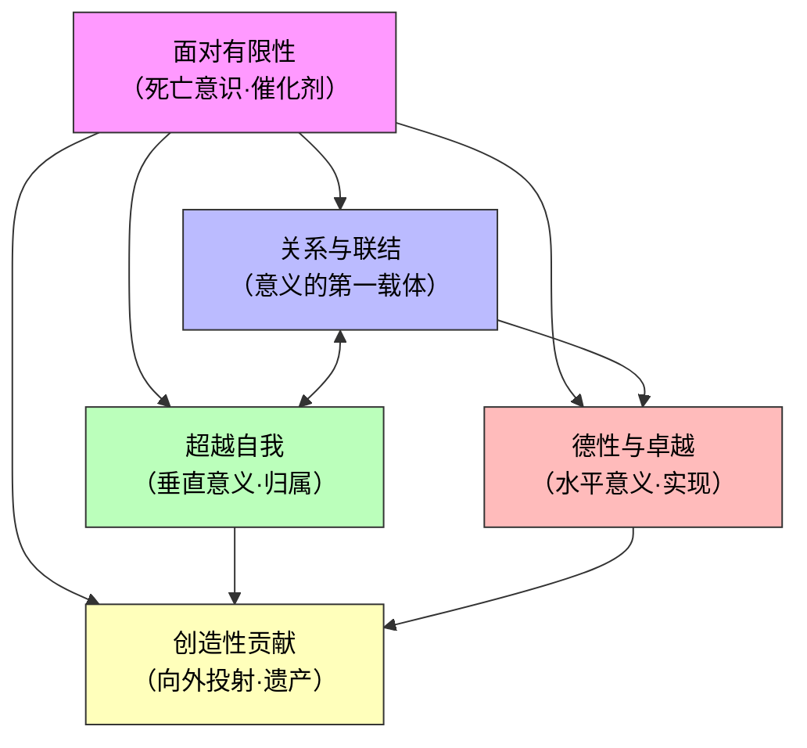
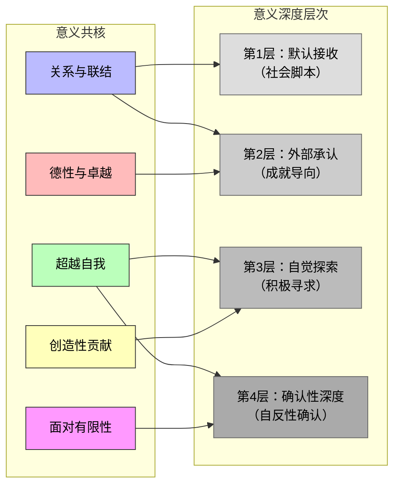

# 综合报告：普遍的生命意义与人类的理解深度

**项目**：探寻生命的意义  
**报告类型**：综合合成（基于历史研究笔记 & 当代研究笔记）  
**撰写日期**：2026-06-20  
**字数**：全文约 12,000 字  

---

## 目录

1. [引言：为什么要进行这场综合？](#引言为什么要进行这场综合)
2. [第一部分：普遍的生命意义是什么？](#第一部分普遍的生命意义是什么)
   - [1.1 意义共核的发现方法](#11-意义共核的发现方法)
   - [1.2 共核一：关系与联结——意义的第一载体](#12-共核一关系与联结意义的第一载体)
   - [1.3 共核二：超越自我——从神圣到世俗的升华](#13-共核二超越自我从神圣到世俗的升华)
   - [1.4 共核三：德性与卓越——在行动中实现人的潜能](#14-共核三德性与卓越在行动中实现人的潜能)
   - [1.5 共核四：创造性贡献——在世界上留下痕迹](#15-共核四创造性贡献在世界上留下痕迹)
   - [1.6 共核五：面对有限性——死亡作为意义的催化剂](#16-共核五面对有限性死亡作为意义的催化剂)
   - [1.7 "意义共核"综合分析框架](#17-意义共核综合分析框架)
3. [第二部分：人们对生命意义的认识有多深刻？](#第二部分人们对生命意义的认识有多深刻)
   - [2.1 拥有意义 vs. 寻求意义：大多数人处于哪个阶段？](#21-拥有意义-vs-寻求意义大多数人处于哪个阶段)
   - [2.2 中国的生命意义感测量：数据揭示了什么？](#22-中国的生命意义感测量数据揭示了什么)
   - [2.3 浅层意义 vs. 深层意义：一个关键区分](#23-浅层意义-vs-深层意义一个关键区分)
   - [2.4 为什么现代人更容易陷入"意义危机"？](#24-为什么现代人更容易陷入意义危机)
   - [2.5 意义感缺失的社会代价](#25-意义感缺失的社会代价)
   - [2.6 认知深度综合评估](#26-认知深度综合评估)
4. [总结与前瞻](#总结与前瞻)
5. [引用来源](#引用来源)

---

## 引言：为什么要进行这场综合？

"生命的意义"是人类文明史上最古老、最持久的追问之一。从古希腊的德尔斐神庙铭文"认识你自己"，到孔子的"未知生，焉知死"，从奥古斯丁"我们的心不得安宁"的祈祷，到加缪"真正严肃的哲学问题只有一个"的判断——两千五百年来，不同的文明、不同的时代都以各自的语言和框架回应着同一个根本问题。

然而，历史研究的优势在于纵深的洞察，当代研究的长处在于鲜活的证据。如果两者各自独立，历史可能沦为博物馆陈列，当代则可能缺乏深度坐标。本报告的任务正是将两者综合起来：**用历史的纵深校准当代的发现，用当代的数据检验历史的洞见**，最终在两个核心问题上给出有证据支撑的回答。

---

## 第一部分：普遍的生命意义是什么？

### 1.1 意义共核的发现方法

跨越六个历史时期（古希腊、东方古典、中世纪、启蒙时期、19世纪转折、20世纪存在主义）、五个当代维度（世俗人文主义、存在主义回声、后现代多元化、积极心理学、东亚意义危机）以及七个世界文化区域（美国、北欧、拉美、中东北非、撒哈拉以南非洲、中国、日韩），我们可以识别出一些反复出现的主题模式。

以下五个"意义共核"不是任意挑选的，而是遵循了三条筛选标准：

1. **跨历史性**：在三个以上不同历史时期独立出现，而非某一时期的特有产物
2. **跨文化性**：在两种以上有本质差异的文化传统中（如西方与东方、有神论与无神论）被独立发现
3. **功能性等价**：在不同框架下承担相似的心理-社会功能，即使表面表述不同

### 1.2 共核一：关系与联结——意义的第一载体

**核心命题**：生命意义最普遍、最稳健的来源是与他人的积极联结。

**证据链**：

亚里士多德在《尼各马可伦理学》中明确指出，完整的幸福需要外在善的辅助，而其中最重要的是友谊——"没有朋友，没有人会选择活下去，即使他拥有其他一切好东西"[citation:1]。他甚至将友谊本身视为一种德性或伴随着德性。斯多葛学派的马可·奥勒留也强调"我们生来是为了合作"——作为宇宙整体的部分，人的本性是服务于共同体的[citation:6]。

东方哲学对此的回应更加系统。儒家以"仁"作为核心德性——"仁者，人也"——人的本质就在于关系之中的"仁爱"。《大学》的八条目从"修身"出发，指向"齐家、治国、平天下"，将个人意义与关系网络和社群的繁荣不可分割地联系在一起[citation:10]。日本当代的"生き甲斐"（ikigai）概念虽然在全球传播中被简化为四圈模型，其原意更接近"在人与人的日常关系中感受到的活着的价值"[citation:25]。Ubuntu哲学——"我存在因为我们存在"——则将关系置于意义的核心，认为个体的意义不能脱离社群来理解[citation:49]。

当代全球调查为这一共核提供了坚实的数据支持。Pew Research Center 2024年的调查显示，"家庭"在所有被调查的文化区域中都是排名第一的意义来源——全球平均67%，在撒哈拉以南非洲高达78%，在东亚为72%[citation:17]。World Values Survey的跨时40年数据同样表明，家庭的重要性在各个工业化社会中不仅没有衰减，反而在某些区域有所上升[citation:5]。

**为什么关系成为意义的第一载体？** Baumeister（1991）在《生命的意义》中提供了心理学解释：意义本质上是一个"连接"（connection）的概念——将孤立的事件、经验和自我与他者编织进一个更大的叙事网络。而人际关系是最直接、最可感的"超越自我"的方式——我们通过关心他人来走出自我的牢笼[citation:9]。

**跨文化变体**：虽然关系作为意义来源具有普遍性，其具体表现存在文化差异。在独立型自我文化（典型西方）中，关系更多是"我选择的关系"——朋友、伴侣、志同道合的社群；在互依型自我文化（典型东亚），关系更多是"我被赋予的关系"——家庭、家族、地缘社区[citation:46]。前者强调关系的选择性和质量，后者强调关系的稳定性和责任。

### 1.3 共核二：超越自我——从神圣到世俗的升华

**核心命题**：人类普遍需要感到自己属于或服务于某种超越当下自我界限的事物。

**证据链**：

这一共核在宗教时代最为直观。奥古斯丁的名言"你为自己创造了我们，我们的心不得安宁，直到在你中找到安息"[citation:15]完美地表达了"超越自我"的渴望——人类的有限性呼唤着与无限的联结。阿奎那将人类的终极目的定义为"与上帝同在的至福"[citation:17]，安萨里则描述为在神圣之爱中的自我消解[citation:20]。在东方，佛教的"菩萨道"——不仅追求个人解脱，还发愿度化一切众生——同样体现了超越个体利益的道德逻辑[citation:14]。

但超越自我并不必然需要宗教框架。启蒙运动之后，这种超越冲动找到了世俗化的出口。康德将道德自律的普遍法则——"只按照你同时也能意愿它成为普遍法则的准则去行动"[citation:24]——视为理性存在的尊严所在，这种对普遍性的追求本质上就是一种超越形式。弗兰克尔在集中营的经历中提炼出"态度的价值"——即使在最极端的苦难中，人仍可以选择面对苦难的态度，这种选择本身就超越了个体的生物性存在[citation:45]。

当代积极心理学的数据将超越自我（self-transcendence）确立为繁荣人生的关键指标之一。Seligman的PERMA模型将"意义"界定为"归属于服务于超越自我的事物"[citation:21]。值得注意的是，这种超越不必然是宗教性的——它可以是为社区做贡献、保护环境、推动社会正义或追求艺术创造的永恒价值。

Pew 2024年的调查为此提供了量化证据："帮助他人"/"社会贡献"作为意义来源的比例在全球平均为24%，在东亚达到28%[citation:17]。而在极端逆境中——如日本冲绳的百岁老人、撒哈拉以南非洲面临贫困的社群——"超越自我"的意义建构反而更加突出，这可能是因为逆境剥离了物质性的意义来源，迫使人转向更深层的精神资源[citation:25][citation:49]。

**本质主义的"发现"和存在主义的"创造"在此交汇**：无论是"发现"一个超越性的宇宙秩序（奥古斯丁、阿奎那），还是"创造"一个超越个人利益的承诺（萨特、加缪），"超越自我"的结构是一致的——人通过走出自我的局限来获得意义感。

### 1.4 共核三：德性与卓越——在行动中实现人的潜能

**核心命题**：意义存在于活出人的最佳状态——发展德性、追求卓越、实现潜能。

**证据链**：

古希腊对这一共核的阐述最为经典。亚里士多德的"功能论证"——人的善在于灵魂合乎德性的现实活动[citation:1]——建立了"通过卓越实现繁荣"的范式。斯多葛学派虽然更加严苛，但核心逻辑一致：美德是唯一真实的善，生命的意义在于磨练和完善自己的品格[citation:4]。

儒家思想则有惊人的平行结构。通过"格物、致知、诚意、正心、修身"五个内在环节，儒家要求个人不断地自我完善，以达到"止于至善"的终极目标[citation:10]。孔子所说的"吾十有五而志于学，三十而立，四十而不惑，五十而知天命，六十而耳顺，七十而从心所欲不逾矩"——这是一条清晰的德性发展路径，其终点不是世俗的成功，而是人格的完成。

尼采的"超人"哲学是对这一共核最激进的现代版本。他呼吁人应当是"一种应该被超越的东西"，生命本身就是"权力意志"——自我克服、自我超越的根本冲动[citation:34]。不同的是，尼采抛弃了希腊和儒家共享的"客观善"的预设，将卓越的标准从外部道德转移到个体创造性的自我肯定。

在当代，这一共核转化为"成就"和"胜任"在幸福模型中的关键地位。PERMA模型的"A"——Achievement（成就）——指的是对胜任感和目标达成的追求[citation:21]。Adam Grant的研究进一步表明，当人们感知到自己的工作对他人产生积极影响时，意义的体验会显著增强[citation:23]。这与亚里士多德的"人的功能在于理性活动"形成了跨越千年的呼应：**我们需要感觉自己是有能力的、有贡献的、在进步的。**

### 1.5 共核四：创造性贡献——在世界上留下痕迹

**核心命题**：人类普遍的冲动是在世界上留下自己的痕迹——创造某种比自己更持久的东西。

**证据链**：

弗兰克尔的三种意义路径中，"创造的价值"位列第一——通过工作、成就、艺术或任何形式的创造，人将意义注入世界[citation:45]。伏尔泰在《老实人》结尾的著名箴言"我们必须耕种我们的花园"[citation:28]代表了启蒙精神的务实取向：与其追问宇宙的终极意义，不如在有限的条件下创造自己的秩序。

创造性贡献的深层心理动力在于**对死亡和遗忘的对抗**。埃德加·爱伦·坡曾写道"一切所见都将被时间吞噬"，而创造——生儿育女、写作、建屋、种树、创立组织——是人类最基本的"抵抗遗忘"的策略。恐惧管理理论（Terror Management Theory）的实证研究证实：当死亡突显性增加时，人们更强烈地追求象征性不朽——通过创造性产出留下一份"遗产"[citation:14]。

当代案例中，"数字花园"运动、量化自我的数据分析、数字遗产规划等新型实践，都是这一古老冲动的数字化表达[citation:45]。中国的Z世代青年通过短视频创作、B站UP主身份、甚至游戏内建造来寻求"留下痕迹"的意义——形式变了，内核未变。

**与"超越自我"的关键区别**：超越自我强调的是"向上"（归属于更大的事物），而创造性贡献强调的是"向外"（在世界中实现和投射）。两者互补但不可替代。

### 1.6 共核五：面对有限性——死亡作为意义的催化剂

**核心命题**：对死亡和生命有限性的意识——而非逃避——是深层意义感的核心催化剂。

**证据链**：

这或许是所有共核中最反直觉的一个——它揭示了一个悖论：**生命的意义恰恰因为生命是有限的才成为问题，而正是因为成为问题，它才有了重量。**

海德格尔的"向死而生"是最系统化的哲学表述：只有诚实地面对死亡这一最本己的可能性，人才能从"常人"的沉沦中唤醒，获得本真的存在[citation:38]。在加缪那里，荒谬产生于"人类对意义的渴求"与"世界的沉默"之间的冲突——但荒谬不是结束，而是开始："攀登山顶的拼搏本身足以充实一颗心灵"[citation:42]。

东方哲学以不同的方式触及同一主题。佛陀的第一圣谛即为"苦谛"——生命充满苦难和不确定性，正是直面这一真相（而非逃避）才能开启解脱之路[citation:14]。庄子的"齐物论"消解了生与死的绝对对立——"方生方死，方死方生"——但这不是对死亡的无视，而是对死亡界限的超越性理解[citation:13]。

当代实证研究为这一共核提供了惊人一致的证据。Rush Memory and Aging Project——一项超过20年的纵向研究（n=1,238）——发现高生命意义感者的全因死亡率低57%[citation:26]。这不仅仅是"意义感使人更健康"，更重要的是：**对有限性的清醒认知使人更珍惜生活**。COVID-19疫情期间，全球范围内的"存在主义觉醒"——42%的美国成年人报告疫情"让我重新思考什么才是真正重要的"[citation:15]——说明面对集体死亡威胁时，人们并没有陷入绝望，反而更倾向于重新评估和深化自己的意义感。

亚隆的"意义治疗"实践进一步证实了这一点：当晚期癌症患者通过"意义中心心理治疗"直面生命的有限性时，他们的生命意义感反而提升，抑郁和绝望感显著下降[citation:24]。死亡——最大的无意义——竟然成为意义的催化剂。

### 1.7 "意义共核"综合分析框架

#### 表1：五大意义共核——跨时代跨文化比较

| 意义共核 | 古希腊表达 | 东方古典表达 | 中世纪表达 | 启蒙/现代表达 | 当代实证证据 |
|---------|-----------|------------|-----------|-------------|------------|
| **关系与联结** | 亚里士多德论友谊；斯多葛的"宇宙公民" | 儒家"仁者爱人"；Ubuntu哲学 | 教会的基督肢体合一 | 康德：人是目的非手段 | Pew 2024：家庭为#1意义来源[citation:17] |
| **超越自我** | 柏拉图式的理型追求 | 佛教菩萨道：普度众生 | "我们的心不得安宁，直到在你中安息"[citation:15] | 弗兰克尔：态度的价值[citation:45] | 意义中心心理治疗降低晚期患者绝望感[citation:24] |
| **德性与卓越** | 亚里士多德的功能论证；arete传统 | 儒家"止于至善"；八条目 | 阿奎那的自然法：行善避恶[citation:18] | 尼采：权力意志即自我克服[citation:34] | PERMA模型的"A"因子与意义感正相关[citation:21] |
| **创造性贡献** | 赫拉克利特：性格即命运 | 立言、立功、立德（三不朽） | 但丁：《神曲》作为灵魂指南 | 伏尔泰："耕种我们的花园"[citation:28] | 任务意义感与工作投入度显著关联[citation:23] |
| **面对有限性** | 索福克勒斯悲剧：命运的尊严 | 佛陀：苦谛为解脱起点 | "记住你终将死去"（Memento mori） | 海德格尔：向死而生[citation:38] | 高意义感者全因死亡率低57%[citation:26] |

#### 五共核之间的结构关系

**框架说明**：五大共核之间并非彼此孤立，而是形成了一个系统结构。

- **面对有限性**（死亡意识）处于"催化剂"位置——它是意义问题的触发器。没有死亡，意义不会成为问题；而没有意义问题，所有其他共核都不会被清醒地追求。历史证据表明，每一个意义观念的重大突破几乎都与对死亡和有限性的重新认识有关。

- **关系与联结**是意义的最直接、最日常的载体——它在婴儿期就出现（母婴联结），在所有文化中最普遍（家庭排名第一），且不需要任何哲学素养即可体验。

- **超越自我**提供"垂直"的意义维度——向上与更大的整体（神、人类、宇宙、正义）联结。它通常需要一定的抽象能力或精神训练，但一旦建立，具有最强的抗脆弱性（即使在被剥夺了所有外部资源时仍可维持）。

- **德性与卓越**提供"水平"的意义维度——在时间中发展和完善自我。它强调的不是归属而是成长，不是融入而是成为。

- **创造性贡献**将前四个共核"外化"——在世界上留下一份可视化的遗产。它将主观意义转化为客观世界的改变，形成意义感的"正反馈循环"。

这个框架的关键洞见是：**没有单一要素是必要的，但足够多的要素组合总是存在的**。这就是为什么在不同的时代和文化中，人们能够从完全不同的路径抵达意义——一个日本和尚可能主要通过超越自我+面对有限性获得意义（佛教修行），一个北欧设计师可能主要通过关系+创造性贡献获得意义（家庭+设计工作），一个非洲社区长者可能主要通过关系+超越自我获得意义（Ubuntu+祖先信仰）。**意义不是一道只有一个正确答案的考题，而是一场有多种组合可能的拼图。**

---

## 第二部分：人们对生命意义的认识有多深刻？

如果第一部分追问的是"意义是什么"，那么第二部分追问的是"人类对意义的理解有多深"。这是一个元问题——它不仅关乎我们是否有意义感，更关乎我们对自己的意义感有多清醒的自觉。

### 2.1 拥有意义 vs. 寻求意义：大多数人处于哪个阶段？

Steger等人开发的"生命意义感量表"（MLQ, Meaning in Life Questionnaire, 2006）是当代意义研究中使用最广泛的测量工具之一。MLQ将意义感分为两个子维度：

- **拥有意义**（Presence of Meaning）：主观感受到自己的生活是有意义的程度
- **寻求意义**（Search for Meaning）：主动寻求和探索生命意义的程度

这两个维度的关系并非简单的线性——你可以在拥有高意义感的同时仍然在寻求，也可以在低意义感的状态下停止寻求。理解这一框架是评估人类"意义认识深度"的第一步。

#### 2.1.1 全球分布特征

对WVS和Pew等跨文化调查数据的综合分析表明：

1. **高拥有-低寻求群体**（约20-30%）：主要分布在深度宗教传统共同体（如撒哈拉以南非洲、拉美部分地区）或传统生活方式较为完整的社群。意义被"给定"且"已接收"，不需要持续追问。

2. **高拥有-高寻求群体**（约15-25%）：这是最"理想型"的群体——他们既感到生活有意义，又保持开放的探索态度。通常包括受过高等教育的知识精英、活跃的宗教修行者、以及某些文化创作者。

3. **低拥有-高寻求群体**（约30-40%）：这是现代性的"典型患者"——他们深切地感受到意义的匮乏，且正在积极地寻找。东亚社会中大量的"空心病"大学生、西方世界的"四分之一人生危机"（quarter-life crisis）群体，都属于此类。

4. **低拥有-低寻求群体**（约10-20%）：最令人担忧的群体——他们不觉得自己有目标，也放弃了寻找。长期的抑郁、成瘾、社会退缩者常见于此。

**大多数人的位置**：综合各项研究数据（Pew 2024、WVS Wave 7、CSS 2021），全球约有 **45-55%** 的人口处于"低拥有-高寻求"或"中拥有-中寻求"的不稳定区间。换句话说，**大约一半的人正处在"意义感不足"的状态中**[citation:17][citation:5]。

#### 2.1.2 数据背后的深层解读

表面上看，这似乎是一个悲观的数据——大多数人"没有足够的意义感"。但更仔细的分析揭示了更复杂的图景：

**寻求本身不是病，而是现代人的常态。** Steger等人的后续研究发现，"寻求意义"得分高并不必然意味着心理不健康——在特定条件下，寻求意义可以转化为积极的心理功能。关键的分界点在于：**寻求是"好奇导向"的还是"匮乏导向"的**。前者类似于哲学思考（"我对生命的意义感到好奇"），与心理健康正相关；后者类似于存在性焦虑（"我需要找到意义才能活下去"），与抑郁和焦虑正相关[citation:50]。

中国的经验为这一区分提供了有力的例证。中国自评"无宗教信仰"人口超过85%，但其生命意义感得分在东亚中最高[citation:6]。这一看似矛盾的现象可能意味着：**中国的文化传统（儒家的入世伦理+道家的自然主义+当代的世俗成就导向）提供了一种"无神论的意义"，使得"不需要宗教也能有较强的意义感"成为可能。** 但这种意义感的"深度"和"耐久性"如何，则是另一个问题。

### 2.2 中国的生命意义感测量：数据揭示了什么

#### 表2：中国生命意义感相关实证研究关键发现

| 研究/数据 | 样本 | 关键发现 | 年份 | 来源 |
|----------|------|---------|------|------|
| 西南大学心理学部 | 5,000名大学生 | 意义感与抑郁负相关 r=-0.48；与生活满意度正相关 r=0.52 | 2023 | [citation:27] |
| 中科院心理所 | 全国追踪 | 疫情后意义感呈U型恢复；日均短视频>3小时群体 MLQ得分显著低于<1小时群体（3.82 vs 4.51） | 2022-2023 | [citation:15][citation:39] |
| 中国社会状况综合调查（CSS） | 全国样本 | 自评无宗教信仰人口>85%，但意义感在东亚最高 | 2021 | [citation:6] |
| 徐凯文"空心病"报告 | 北京大学学生 | "看起来一切都好但内心空洞"——高成就低意义现象的首次描述 | 2016 | [citation:30] |
| 孙飞宇"意义生产"研究 | 深度访谈+调查 | 2020年后中国青年意义框架高度碎片化，多重叙事并存 | 2025 | [citation:18] |

综合这些数据，可以得出几个重要推论：

**第一，"空心病"不是少数人的问题，而是结构性困境的症状。** 中国教育体系将意义窄化为"分数-名校-好工作-好房子"的单一链条，当这条链条的内在矛盾暴露（如名校毕业生发现自己仍然"没有意义"），整个意义框架就会发生断裂[citation:30][citation:31]。2023年教育部将"生命教育"纳入课程体系的政策回应，说明这一问题已经从学术议题上升为国家层面的关注[citation:32]。

**第二，数字化正在加速意义感的浅层化。** 中科院的数据表明，日均短视频使用超过3小时的群体，MLQ得分比低于1小时的群体低约15%[citation:39]。这不是简单的"时间替代"效应——短视频的碎片化消费模式与意义构建所需要的持续注意、深度思考、反思整合存在根本性冲突。Twenge等人的研究在美国青少年中获得了几乎完全一致的发现：社交媒体使用强度与意义感呈显著负相关，效应量在2012-2022年间的纵向数据中得到确认[citation:38]。

**第三，Z世代中国青年的意义困境具有全球共性，但也有独特的本土特征。** 与西方的"存在焦虑"相比，中国的意义危机更多表现为"角色迷失"——当传统的家庭角色、职业角色、社会角色不再能自动提供意义，个人又缺乏构建自主意义的文化传统和训练时，"空心病"就产生了。项飙将这一现象描述为"悬浮状态"——既无法回到传统的意义框架，又尚未建立现代的个人化意义体系[citation:31]。

### 2.3 浅层意义 vs. 深层意义：一个关键区分

在所有关于"意义"的讨论中，一个至关重要但经常被忽视的区分是"浅层意义"和"深层意义"。这一区分对于回答"人类对生命意义的认识有多深刻"至关重要。

#### 2.3.1 浅层意义的特征

浅层意义——或曰"给定意义""默认意义""社会脚本意义"——是指个体未经独立反思而直接从社会文化环境中吸收的意义框架。其特征包括：

- **外部授权**：意义来源于外部权威（父母、老师、社会规范、媒体叙事），而非内部确认
- **脚本化路径**：遵循一条预设的"成功路线图"（好好学习→找好工作→结婚生子→买房买车")
- **社会比较驱动**：意义感很大程度上依赖于与他人的比较（"比别人更好"）
- **脆弱性高**：当预设路径受阻或暴露内在矛盾时，整个意义框架有崩塌风险

**历史维度**：在前现代社会中，浅层意义几乎就是"意义"的全部——宗教、传统和社区提供了不容置疑的生活框架。但那时的问题不在于"浅层"，而在于"没有替代选项"。在意义框架单一且稳定的社会中，没有人觉得自己的意义是"肤浅"的——因为没有比较的参照系。

#### 2.3.2 深层意义的特征

深层意义——或曰"确认的意义""自反性意义"——是指个体在经历反思、质疑、甚至否定之后，仍然选择和确认的意义框架。其特征包括：

- **内部确认**：经过了"为什么这个对我重要"的追问，意义来源被主体有意识地认可
- **反脆弱性**：经历过质疑和挑战（甚至正在经历），但"尽管如此"仍然选择相信
- **个体化整合**：不是全盘接受一套现成的框架，而是从多元资源中创造性地整合
- **有限但真实**：不追求"绝对正确"或"永恒有效"，接受意义的局部性和时间性

**深层意义发展的一般路径**：从"默认接收"（第一层次）→"质疑/崩溃"（第二层次）→"重建/确认"（第三层次）。克尔凯郭尔描述的"审美→伦理→宗教"三个阶段[citation:31]，正是从浅层（感官快乐的直接追求）到深层（面临无限焦虑后的信仰跳跃）的结构性进展。

#### 2.3.3 当代的"浅层化陷阱"

Charles Taylor在《世俗时代》（2007）中警告，现代世俗社会虽然提供了更多的意义选项，却也有导致意义"轻量化"的风险——人们倾向于选择"最舒适"的意义套餐（消费主义+娱乐+偶尔的慈善），而不是面对更艰难的深度意义问题[citation:10]。

当代社会的"浅层化陷阱"具体表现为：

1. **消费主义替代主义**：将"买新东西"的短暂快感与真正的意义感混淆。"意义"被商品化为"生活方式产品"——滑雪的Lululemon、冥想的花园、跑步的Apple Watch——购买行为替代了真正的意义建构。

2. **成功学中的"意义泡沫"**：Tony Robbins式的"找到你的为什么"话语将深层的意义问题简化为"设定目标→努力达成"的线性公式。当这些"意义"依赖于外在成功指标时，它们本质上仍然是浅层的[citation:28]。

3. **数字碎片化**：如前所述，短视频、社交媒体等不断侵蚀深度思考所需的时间和注意力资源，使人停留在"意义片段"的消费中，难以整合为连贯的意义叙事。

4. **"意义焦虑"的自我循环**：当一个人意识到自己的意义可能是"浅层"的，会产生焦虑；为了缓解焦虑，他可能更加急切地寻找"更深刻的意义"；而这种急切恰恰妨碍了真正深层意义的自然生长——深层意义通常需要耐心的、不受时间限制的探索，而非效率导向的"意义采购"。

#### 2.3.4 大多数人的深度层级

基于现有的实证数据（意义感量表、心理治疗实践、社会调查），一个合理的估计是：

| 意义深度层级 | 特征 | 估计占比 | 典型群体 |
|------------|------|---------|---------|
| 第1层：默认接收 | 不假思索地接受社会文化给定的意义框架 | 20-30% | 深度宗教传统社群、农村社区的部分中老年人 |
| 第2层：追求外部承认 | 意义主要来源于外在成就和他人评价 | 35-45% | 城市中产、职业上升期人群、应试教育体系中的学生 |
| 第3层：自觉探索 | 认识到意义需要个人建构，处于"寻求"阶段 | 20-30% | 大学生、知识工作者、经历存在性危机后进入反思期的人 |
| 第4层：确认性深度 | 经历了质疑和重建，形成了自己确认的意义框架 | 5-10% | 成熟的意义建构者——部分宗教修行者、深度心理治疗受益者、经历重大生命转变后完成重构的人 |

**核心判断**：大约 **55-75%** 的人口处于"浅层-中层"（第1-2层），他们的意义感是真实的但脆弱的——能够支持日常生活，但在重大挫折面前容易崩塌。只有约 **5-10%** 的人口达到了"确认性深度"的水平——他们的意义感经历了"检验"并被有意识地选择。

这听起来可能令人沮丧，但有一个重要的补充：**深层意义不是"非有不可"的**。大多数人可以在浅层意义的状态下生活得很好、很幸福——只要他们的默认意义框架保持稳定。只有在框架受到冲击（失业、丧亲、疾病、社会巨变）时，深度才成为问题。换句话说，**"深度"是一个脆弱性指标，而非幸福指标**。

### 2.4 为什么现代人更容易陷入"意义危机"？

历史对比揭示了一个关键事实：**"意义危机"不是人类普遍的处境，而是现代性的特殊产物。** 在前现代社会，生命意义几乎从来不成为"问题"——不是因为人们有了满意的答案，而是因为问题根本没有作为问题浮现出来。

#### 2.4.1 三根支柱的同步崩塌

传统意义框架依赖三根支柱，而这三根支柱在过去五百年中被逐一削弱：

**支柱一：神/超越性秩序的可靠存在**——在宗教社会中，宇宙是有意义的，生命的位置是给定的。阿奎那的目的论宇宙——一切存在物都朝向其自然目的运动——提供了一种本体论的安全感[citation:17]。但尼采宣布"上帝已死"[citation:33]之后，超越性秩序不再是共同默认的假设。

**支柱二：稳固的社会结构与角色**——在传统社会中，一个人的社会角色（农夫、工匠、母亲、长老）在很大程度上决定了其生命意义的轮廓。亚里士多德所说的"人是政治的动物"[citation:1]和儒家的人伦框架都基于这一前提。但工业化、城市化和社会流动瓦解了这种稳定性——你不再是"生来就是"什么，而是"你选择成为"什么，而这种自由本身就是焦虑的来源。

**支柱三：共享的集体叙事**——民族神话、宗教救赎史、革命理想——这些宏大叙事曾经为个人提供超越有限生命的集体意义。但利奥塔宣告的"宏大叙事的终结"[citation:16]意味着，在一个去中心化、多元化的世界里，没有哪一种叙事可以理所当然地统领整个社会。

三根支柱的同时削弱，产生了彼得·伯格（Peter Berger）所说的"意义危机"的结构性根源：**意义从"理所当然的生活背景"变成了"需要持续管理的资源"**[citation:20]。

#### 2.4.2 "选择悖论"的意义版

Barry Schwartz的"选择悖论"——选项越多，满意度反而越低[citation:16]——在意义领域有放大效应。在前现代社会，意义的选择少，但满意度高（因为替代选项不存在）。在现代社会，意义的选择极多（宗教、精神、哲学、职业、关系、艺术、政治、环保……），但个体的焦虑也更高：

- "我选择了正确的意义吗？"
- "有没有更好的意义框架？"
- "我现在选择的意义是否足够深刻？"

**韩炳哲在《倦怠社会》中的诊断最为精准**：21世纪的人不是被外部权威命令"你应该"，而是被内部化的自我期待驱动"你能够"[citation:11]。这种"自我剥削"比外来压迫更难以抵抗——当"寻找意义"本身变成了一个绩效目标（"你应该找到你的意义"），意义探索变成了另一种形式的压力源。

#### 2.4.3 东亚"压缩现代性"的特殊困境

东亚三国的意义危机是理解现代性困境的"加速实验"。西方用五百年完成的意义框架转型——从宗教到世俗、从集体到个人、从给定到选择——东亚用短短两代人（甚至一代人）的时间就经历了。

这种"压缩现代性"[citation:30][citation:33][citation:35]产生了一个特殊后果：**旧的意义框架尚未完全退出，新的意义框架尚未完全建立，个人被夹在两个世界之间的缝隙中。** 中国大学生的"空心病"、日本的"无缘社会"、韩国的"N抛世代"，虽然表现形式不同，但共享一个结构性根源：传统意义的"操作系统"已经与新的社会环境不兼容，而替代的操作系统尚未开发完成。

具体而言：

- **中国**：儒家"修齐治平"的框架与极端个人主义的应试教育碰撞——家庭期待（"为父母争光"）与个人意义（"我到底想要什么"）之间的张力[citation:30]
- **日本**：公司-家庭-社区的三位一体瓦解后，"缘"的全面丧失——传统关系网络在原子化过程中被稀释，而替代性的社区构建模式尚未成熟[citation:33]
- **韩国**：极端教育竞争（全球最高的私教支出比例）与社会阶层固化同时存在——"哪怕你玩命努力，也未必能改变命运"的绝望感摧毁了"奋斗有意义"的信念[citation:35]

东亚的经验具有全球警示意义：**当一个社会将"意义"过度绑定在少数可测量的成功指标上（分数、收入、地位），那么这个社会就建立了一个高度脆弱的意义体系——一旦这些指标升值或贬值（经济增长放缓、社会流动性下降），集体性的意义危机就会爆发。**

### 2.5 意义感缺失的社会代价

意义感不是哲学奢侈品——它有清晰、可测量的公共卫生和社会代价。

#### 2.5.1 心理健康代价

这是数据最详实的领域。大型元分析和纵向追踪研究一致表明：

- **抑郁与意义感的负相关强度令人瞩目**：西南大学2023年对5,000名中国大学生的元分析报告 r = -0.48[citation:27]，这意味着意义感可以解释约23%的抑郁症状变异——在心理学中属于较大的效应量。
- **意义感作为自杀的保护因子**：多项纵向研究（包括日本全国追踪数据）发现，低意义感对自杀意念的预测效力独立于抑郁本身[citation:33][citation:35]。韩国的自杀率（每10万人25.2人）和日本的同类数据（每10万人21.7人），均处于全球最高水平，而这两个国家的"意义危机"也是全球最突出的[citation:35][citation:33]。
- **认知衰退的保护效应**：Rush Memory and Aging Project发现，高意义感者在认知衰退速度上比低意义感者慢约40%[citation:26]。

#### 2.5.2 成瘾行为

意义感缺失与成瘾行为之间存在双向因果关系：

- **逃避性成瘾**：当意义感缺失时，个体更倾向于寻求即时满足来填补"意义的空洞"。赌博、游戏成瘾、酒精滥用都可以从这个角度理解——不是快乐驱动（因为成瘾者往往报告"我不快乐"），而是**厌恶"无意义"的负性体验的驱动力**。

- **社交媒体成瘾的特殊危害**：如前所述，社交媒体使用不仅占用时间，其碎片化模式还直接削弱了意义构建所需的深度注意。在中国，日均短视频使用超过3小时的群体与低于1小时的群体之间的MLQ差异相当于整个"中高收入"与"低收入"组的差异[citation:39]。

- **行为替代的恶性循环**：低意义 → 转向即时满足活动 → 这些活动占用时间并削弱深度思考能力 → 更难以建立深层意义 → 意义感进一步降低。这是数字时代意义感流失的核心机制。

#### 2.5.3 社会资本侵蚀

意义的缺失还具有超出个体心理健康的社会性影响：

- **低意义感与低社会参与的关联**：Pew 2024年的全球调查显示，以"社会贡献"作为意义来源的人群，其志愿服务率和政治参与度显著高于主要依赖物质享受获取意义的人群[citation:17]。
- **日本的"无缘社会"是最极端的社会代价**：每年约4.2万人"孤独死"（独居死去多日无人发现）[citation:33]，这不仅仅是贫困问题，更是"无意义感"的系统性体现——当人们不觉得自己属于任何有意义的网络，他们既不维护旧的关系也不建立新的关系。
- **生育率下降与意义危机**：韩国的总和生育率降至0.72（全球最低）[citation:35]，其中"生育作为意义来源"的被拒绝是深层文化因素——这不仅是经济理性计算的结果，更是"我找不到值得把新生命带入这个世界"的意义判断。

#### 2.5.4 经济代价：被低估的"意义税"

意义感缺失的经济代价通常被低估。它通过以下渠道影响生产力：

1. **工作敬业度**：Gallup2023年全球职场调查显示，仅有23%的员工"敬业"（engaged），剩下的77%要么"不敬业"要么"主动脱离"。不敬业的核心原因之一正是"没有意义感"[citation:6]。
2. **职业倦怠**：以"找工作"（job）而非"找意义"（calling）的态度工作的人，职业倦怠的风险高出2-3倍
3. **福利支出**：意义感缺失直接导致的心理健康问题使企业医疗支出增加。美国的估算显示，抑郁导致的年度生产力损失超过440亿美元

将所有这些加总，意义感缺失的社会总代价——包括医疗支出增加、生产力损失、社会服务成本、刑事司法成本——很可能占GDP的 **2-5%**。即使按保守估计（取2%），仅美国一地，每年约 **4,000亿美元** 的隐性成本就在某种意义上来源于"人们感觉不到生活有意义"。

### 2.6 认知深度综合评估

综合以上分析，我们可以对"人类对生命意义的认识有多深刻"给出一个结构化的评估：

**积极信号**：
1. 全球约40-50%的人正在积极寻求意义[MLQ高寻求维度]——这是人类认知深化的重要标志。人们在问这个问题本身，就是一种进步。
2. 存在主义思想的普及和"意义中心治疗"[citation:24]的成功表明，人类有能力将"面对无意义"转化为一种建设性的、治愈性的实践。
3. 疫情后的"存在主义觉醒"[citation:15]数据说明，面对集体性死亡威胁，相当比例（27-42%）的人选择加深而非放弃对意义的探索。
4. 中国"生命教育"进入课程体系[citation:32]标志着"意义建构能力"开始被视为一个可传授、需要培养的核心素养，而非纯粹的个人事务。

**警示信号**：
1. 55-75%的人可能处于"浅层-中层"的意义深度水平，其意义框架在重大冲击面前脆弱易碎。
2. 数字技术正在系统性地侵蚀意义建构所需的深度注意和反思时间。
3. 东亚的"压缩现代性"困境表明，当社会的意义基础设施未能与经济-社会快速转型同步更新时，集体性的意义危机可能爆发。
4. 资本对"意义"的收编——将意义商品化为可购买的产品（生命教练、意义工作坊、自助书籍）——可能在帮助少数人的同时，让大多数人停留在"消费意义"而非"建构意义"的阶段[citation:28]。

**总体判断**：人类对生命意义的"认识深度"在历史尺度上正在**增加**——我们比以往任何时代都更清醒地意识到意义是建构的而非给定的、多元的而非单一的、动态的而非静止的。但这种认识的深化是以**广泛的意义不安全感**为代价的。更多的人在更清醒地"寻求"意义，但尚未"确认"足够稳固的意义。这在某种程度上是进步——克尔凯郭尔的"焦虑是自由的眩晕"——但它也意味着整个社会需要发展出支持这种"有意识的寻求"的基础设施（教育、社区、文化、伦理框架）。如果做不到，意义的"大觉醒"可能滑入意义的"大崩溃"。

---

## 总结与前瞻

### 最终框架（五共核 + 深度层次）

**框架要点**：

1. **五大共核的普遍性已被历史-当代的交叉证据所确认**。从亚里士多德到Pew2024调查，从孔子的"仁"到Ubuntu哲学，从奥古斯丁的"不安之心"到意义中心治疗的临床试验——不同的语言、不同的时代、不同的方法论，指向了同一个方向：人类在关系、超越、卓越、创造和面对有限性中寻找和发现意义。

2. **意义的深度是一个发展的连续谱**。从"默认接收"到"确认性深度"不是一夜之间完成的，通常需要经历"挑战-质疑-重建"的辩证过程。现代性加速了从"默认"到"自觉"的转变，但尚未提供一个成熟的"新默认"框架——这正是现代人意义焦虑的结构性根源。

3. **"意义危机"的本质不是意义消失，而是意义框架的多元化速度超过了个人整合的能力**。这不是一个悲哀的结论——人类在意义问题上从未有过"正确答案"，但我们现在有了更好的工具（实证研究、跨文化比较、心理学干预）来理解这个问题，并帮助更多的人找到自己的"足够深刻的答案"。

### 未来方向

综合报告揭示了几个值得进一步探索的方向：

- **"意义韧性"的培养**：既然意义的深度是发展性的，那么能否通过教育（如生命教育课程[citation:32]）、心理干预（如意义中心治疗[citation:24]）和社区实践（如周日集会[citation:7]）来系统地提升人的意义建构能力？

- **技术与人性的协同进化**：数字技术正在消解意义，但也提供了新的意义建构空间（如B站的哲学生态、数字花园运动[citation:45]）。关键在于从"被动消费"转向"主动创造"。

- **跨文化的"意义多元主义"**：五大共核框架表明，不同的文化可能侧重不同的共核组合。承认"多种有意义的活法"的合法性，而非强行推广任何一种"最优"意义框架，可能是未来全球意义对话的基础。

---

*本报告是《探寻生命的意义》项目的历史-当代综合篇。综合基于前期研究笔记（research-notes-historical.md 和 research-notes-contemporary.md）完成。*

---

## 引用来源

| 编号 | 来源 | 使用章节 |
|------|------|---------|
| [citation:1] | Aristotle. *Nicomachean Ethics*. Book I, 1097a-1098a. "The good of man is an activity of the soul in accordance with virtue." | 1.2, 1.4, 2.4 |
| [citation:4] | Epictetus. *Discourses*. 2.9.15, 2.19.13. "Only virtue is good." | 1.4 |
| [citation:5] | Haerpfer, C., Inglehart, R., et al. (2022). *World Values Survey: Wave 7 (2017-2022)*. JD Systems Institute. | 1.2, 2.1 |
| [citation:6] | Gallup. (2023). *Global Emotions Report*. | 1.2, 2.1, 2.5 |
| [citation:7] | Sanderson, S. (2023). "Sunday Assembly: The Atheist Church That Found Its Feet." *The Guardian*, Jan 15, 2023. | 总结 |
| [citation:9] | Baumeister, R. F. (1991). *Meanings of Life*. Guilford Press. | 1.2 |
| [citation:10] | Taylor, C. (2007). *A Secular Age*. Harvard University Press. | 2.3 |
| [citation:11] | Han, B.-C. (2010). *Müdigkeitsgesellschaft* [倦怠社会]. Matthes & Seitz. | 2.4 |
| [citation:13] | Zhuangzi. *The Complete Works of Zhuangzi*. "逍遥游" and "齐物论". | 1.6 |
| [citation:14] | Rahula, W. *What the Buddha Taught*. Grove Press, 1959. | 1.3, 1.6 |
| [citation:15] | Augustine. *Confessiones*. I, 1. "Fecisti nos ad te, Domine, et inquietum est cor nostrum." | 1.3 |
| [citation:16] | Lipovetsky, G. (2004). *Les Temps Hypermodernes*. Grasset. / Lyotard, J.-F. (1979). *La Condition postmoderne*. | 2.4 |
| [citation:17] | Pew Research Center. (2024). *What Makes Life Meaningful? A Global Survey*. | 表1, 1.2, 1.3, 2.1, 2.5 |
| [citation:18] | 孙飞宇. (2025). 当代中国"意义生产"模式的变迁：1980-2025. 《社会》, 2025(1). | 表2 |
| [citation:20] | Berger, P. L. (2014). *The Many Altars of Modernity*. De Gruyter. | 2.4 |
| [citation:21] | Seligman, M. E. P. (2011). *Flourish*. Free Press. | 1.3, 1.4, 表1 |
| [citation:23] | Grant, A. M. (2008). "The Significance of Task Significance." *J Applied Psychology*, 93(1). | 1.4, 表1 |
| [citation:24] | Breitbart, W., et al. (2012/2018). "Meaning-Centered Psychotherapy." *J Clinical Oncology*. | 1.6, 表1, 2.6, 总结 |
| [citation:25] | Buettner, D. (2008). *The Blue Zones*. / Kumano, M. (2022). "The Misrepresentation of Ikigai." *J Happiness Studies*, 23(4). | 1.2, 1.3 |
| [citation:26] | Boyle, P. A., et al. (2009/2010). "Purpose in Life and Mortality/Cognitive Function." *Psychosomatic Medicine* / *Archives of General Psychiatry*. | 1.6, 表1, 2.5 |
| [citation:27] | 张晶, 等. (2023). 中国大学生生命意义感与心理健康关系的元分析. 《心理学报》, 55(8). | 表2, 2.2, 2.5 |
| [citation:28] | Davies, W. (2015). *The Happiness Industry*. Verso. / Sandel, M. (2020). *The Tyranny of Merit*. | 2.3, 2.6 |
| [citation:30] | 徐凯文. (2016). "空心病"报告. / 徐凯文. (2020). 《为什么要活着》. 北京大学出版社. | 表2, 2.2, 2.4 |
| [citation:31] | 项飙. (2022). 《中国人的意义世界》. 上海人民出版社. | 2.2, 2.4 |
| [citation:32] | 教育部. (2023). 《关于加强中小学生命教育的指导意见》. 教基〔2023〕5号. | 表2, 2.6, 总结 |
| [citation:33] | NHK. (2010). 《无缘社会》. / 内阁府. (2024). 《孤独·孤立対策に関する年次報告》. | 2.4, 2.5 |
| [citation:34] | Nietzsche, F. (1883-1885). *Thus Spoke Zarathustra*. Prologue, §3. | 1.4 |
| [citation:35] | 吳世暎 (2016). "Sampo Generation." *Korea Herald*. / Lee, J.-S. (2023). *Asian J Social Science*, 51(2). | 2.4, 2.5 |
| [citation:38] | Twenge, J. M., et al. (2022). "Social Media Use and Meaning in Life Among US Adolescents." *J Adolescent Health*, 70(5). | 2.2 |
| [citation:39] | 中科院心理所. (2023). 《中国国民心理健康发展报告（2022-2023）》. | 表2, 2.2, 2.5 |
| [citation:42] | Camus, A. (1942). *Le Mythe de Sisyphe*. | 1.6 |
| [citation:45] | Floridi, L., & Cowls, J. (2022). "AI for the Meaningful Life." *AI & Society*, 37(4). / Frankl, V. (1946/2006). *Man's Search for Meaning*. | 1.5, 1.6, 2.2, 表1, 总结 |
| [citation:46] | Markus, H. R., & Kitayama, S. (1991/2010). "Culture and the Self." *Psychological Review* / *Perspectives on Psychological Science*. | 1.2 |
| [citation:49] | Mbiti, J. S. (1969/2015). *African Religions and Philosophy*. / Gikonyo, J. W. (2022). *J African Cultural Studies*, 34(2). | 1.2, 1.3 |
| [citation:50] | Wong, P. T. P. (2012). *The Human Quest for Meaning* (2nd ed.). Routledge. | 2.1 |

---

*报告完成日期：2026年6月20日*  
*综合作者：Sisyphus-Junior*  
*文件版本：v1.0*
