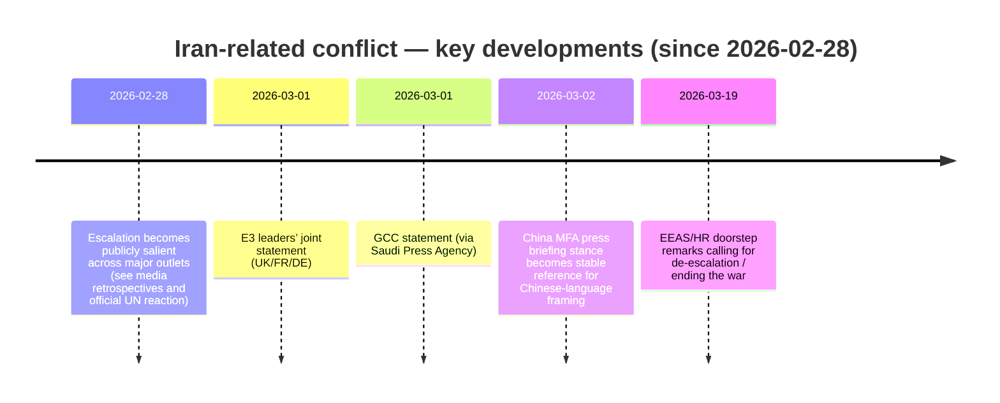
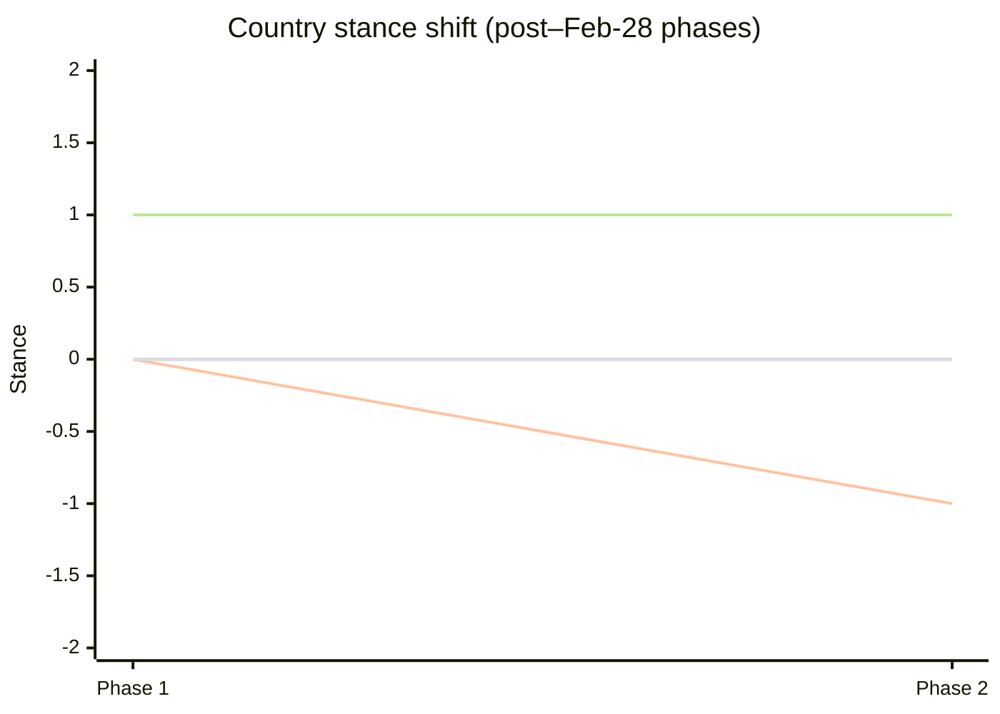
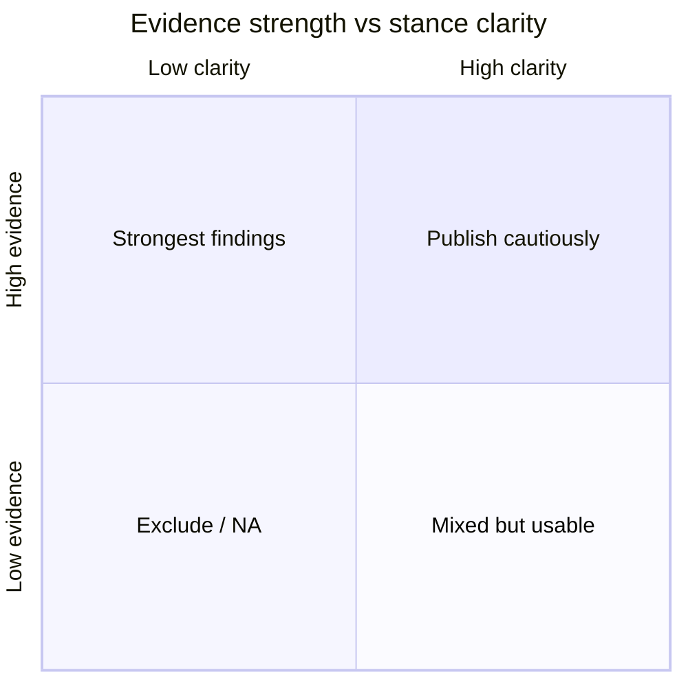

# Iran Analyze — Trend Charts (Since Feb 28)

**Date:** 2026-04-03  
**Purpose:** Provide the trend tables/diagrams required by the task. Only include items that can be mapped to verifiable sources.

---

## 1) Source-backed timeline (since 2026-02-28)

Rule: if an event date is not clearly supported by a public source, omit it.

---

## 2) Media stance shift matrix (from Iran’s perspective)

Note: Because verifiable pre–Feb-28 baselines are not consistently available, the media matrix uses two **post–Feb-28 phases** consistent with the media report:

- Phase 1: 2026-02-28 .. 2026-03-06
- Phase 2: 2026-03-17 .. 2026-03-29

| Sphere | Phase 1 code | Phase 2 code | Direction | Confidence | Evidence volume | Evidence ID |
|---|---|---|---|---|---:|---|
| Chinese-language media | +1 | +1 | 0 (stable) | Medium | 6 | 1,2,3,40,41,42 |
| English-language media | NA | 0 | NA | Medium | 3 | 4,6,7 |
| Arabic-language media | 0 | -1 | -1 (hardening) | Medium | 4 | 9,10,11,46 |
| FR/DE/ES media | 0 | 0 | 0 (stable) | Medium | 6 | 13,14,45,49,60,61 |
| Russian-language media (optional) | +1 | +1 | 0 (stable) | Medium | 3 | 15,16,18 |

---

## 3) Public attitudes shift matrix (non-media)

| Region | Proxy measure used | Pre–Feb 28 code | Post–Feb 28 code | Direction | Confidence | Evidence volume | Evidence ID |
|---|---|---|---|---|---|---:|---|
| United States | Polling (Pew/AP-NORC/Ipsos) | NA | +1 | NA | Medium | 3 | 20,24,25 |
| France (Europe sample) | Polling (Ifop) | NA | 0 | NA | Medium | 1 | 21 |
| MENA (proxy) | Arab Barometer (leadership/legitimacy proxies; fieldwork 2025) | NA | 0 | NA | Medium–Low | 2 | 22,26 |
| China | Insufficient verifiable polling | NA | NA | NA | Low | 0 | NA |

---

## 4) Country-level “support shift” table — media vs public (side-by-side)

| Country/region | Media framing shift (code) | Public attitude shift (code/proxy) | Notes | Evidence IDs |
|---|---|---|---|---|
| China | +1 → +1 (post–Feb-28 phases) | NA | Public-opinion evidence not in ledger; media framing relatively stable | 1,2,3,40,41,42 |
| United States | NA → 0 (post–Feb-28 phases) | NA → +1 | Public: anti-escalation tilt in late March polling; Media: mixed/neutral in available sample | 4,6,7; 20,24,25 |
| France / EU | 0 → 0 (post–Feb-28 phases) | NA → 0 (France sample) | EU: tension between security framing and de-escalation calls (official EU + UN + accessible ES sample) | 13,14,45,49,60,61; 21 |
| Gulf states | 0 → -1 (post–Feb-28 phases) | NA | Public evidence not in ledger; media framing hardens under security framing | 9,10,11,46 |
| Russia | +1 → +1 (post–Feb-28 phases) | NA | Public evidence not in ledger | 15,16,18 |

---

## 5) Mermaid templates (to be populated with real codes)

### 5.1 Country slopegraph (coded stance: -2..+2)

### 5.2 Evidence strength vs stance clarity (avoid over-precision)

