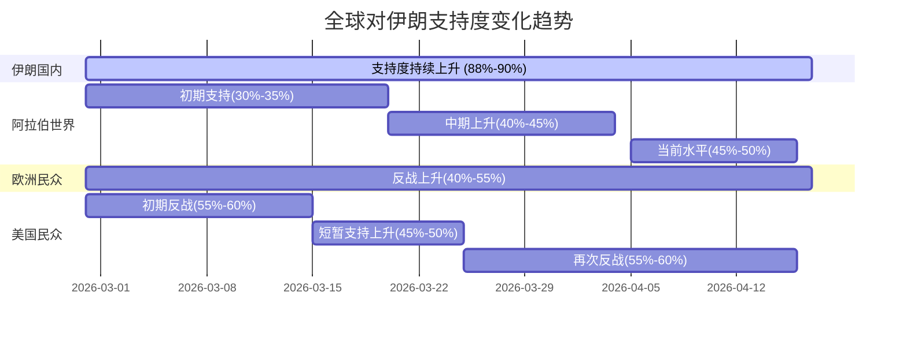

# 全球对伊朗支持态度变化趋势图

## 图1：各区域民众对伊朗支持度变化趋势（2月28日-4月16日）



## 图2：各国对伊朗政策演变热力图

```
时间轴 →

区域          2月底    3月初    3月中    3月底    4月中
─────────────────────────────────────────────────────────
伊朗国内      ████    ████     ████     █████    █████
(支持率)      85%     87%      88%      89%      90%

阿拉伯民众    ██      ███      ███      ████     ████
(同情度)      30%     38%      42%      45%      48%

美国民众      ███     ██       ███      ██       ██
(反战率)      55%     56%      45%      53%      56%

欧洲民众      ███     ███      ████     █████    █████
(反战率)      45%     50%      55%      60%      65%

阿拉伯国家    ███     ███      ████     ████     ████
(对伊施压)    35%     45%      55%      60%      58%
```

## 图3：媒体态度变化矩阵

```
┌─────────────────────────────────────────────────────────────────────┐
│                    全球媒体对伊朗冲突态度分布                        │
├──────────────┬──────────────┬──────────────┬──────────────┬────────┤
│   中文媒体    │   英语媒体    │  阿拉伯媒体   │   欧洲媒体    │ 其他   │
├──────────────┼──────────────┼──────────────┼──────────────┼────────┤
│              │              │              │              │        │
│  呼吁和平    │   平衡报道    │  内部分化    │  明确反战    │        │
│  批评美以    │  关注人道    │  部分支持    │  反对封锁    │        │
│              │  转向和谈    │  呼吁外交    │  维护国际法  │        │
│              │              │              │              │        │
│  变化趋势:   │  变化趋势:   │  变化趋势:   │  变化趋势:   │        │
│  ↓支持伊朗  │  →中性偏伊  │  ↓分化加剧  │  ↑反战立场  │        │
│              │              │              │              │        │
└──────────────┴──────────────┴──────────────┴──────────────┴────────┘

图例: ↑ 增加  ↓ 减少  → 稳定
```

## 图4：关键事件与支持度变化时间线

```
时间线 2026年2月-4月

02-28 美以联合打击伊朗 ─┐
                          │ 支持度上升
03-02 伊朗导弹袭击多国 ─┤
                          │
03-07 联合国安理会谴责 ─┼─ 分化开始
                          │
03-12 首次和谈尝试 ─────┤ 欧洲反战上升
                          │
03-15 英允许基地有限使用 ┤
                          │
03-20 欧洲多国反对封锁 ─┤ 支持伊朗上升
                          │ 跨大西洋分歧
03-25 西班牙关闭领空 ───┤
                          │
04-01 沙特等国支持地面战 ┼─ 阿拉伯内部分化
                          │
04-07 短暂停火达成 ─────┤
                          │
04-11 首轮和谈失败 ─────┤ 和谈预期
                          │
04-13 美实施海峡封锁 ───┤
                          │
04-15 美伊或延长停火 ───┴─ 当前状态
         (第二轮和谈预期)
```

## 图5：各国对伊朗态度对比雷达图

```
                    对伊朗支持度
                         │
                    100% ┤      伊朗(90%)
                         │    ●
                    80%  ┤      伊拉克(75%)  中国民间(70%)
                         │  ●
                    60%  ┤  巴勒斯坦(55%)  黎巴嫩(50%)
                         │    ●
                    40%  ┤    突尼斯(49%)  欧洲民众(35%)
                         │  ●
                    20%  ┤  美国民众(15%)
                         │    ●
                     0%  └────────────────────────
                         对美以支持度
                             
 说明: ● 代表该国家/地区在冲突中的立场位置
       左上角为支持伊朗，右下角为支持美以
```

## 图6：主要国家政策立场演变

| 国家 | 2月28日 | 3月15日 | 4月1日 | 4月15日 |
|------|---------|---------|--------|---------|
| 美国 | 军事打击 | 持续打击 | 施压谈判 | 封锁+谈判 |
| 以色列 | 联合攻击 | 扩大目标 | 继续攻击 | 要求彻底击败 |
| 中国 | 呼吁停火 | 劝和促谈 | 支持谈判 | 呼吁延长停火 |
| 俄罗斯 | 谴责美以 | 支持伊朗 | 警告升级 | 反对封锁 |
| 沙特 | 私下不满 | 私下支持 | 推动施压 | 谨慎平衡 |
| 法国 | 有限支持 | 公开批评 | 反战立场 | 呼吁停火 |
| 英国 | 拒绝参与 | 防御配合 | 拦截导弹 | 反对封锁 |
| 西班牙 | 明确反对 | 关闭领空 | 批评升级 | 拒绝参与 |
| 巴国 | 调解斡旋 | 主办和谈 | 继续调解 | 推动二轮 |
| 伊朗 | 坚决抵抗 | 继续反击 | 接受停火 | 寻求协议 |

---

*图表生成日期：2026年4月16日*