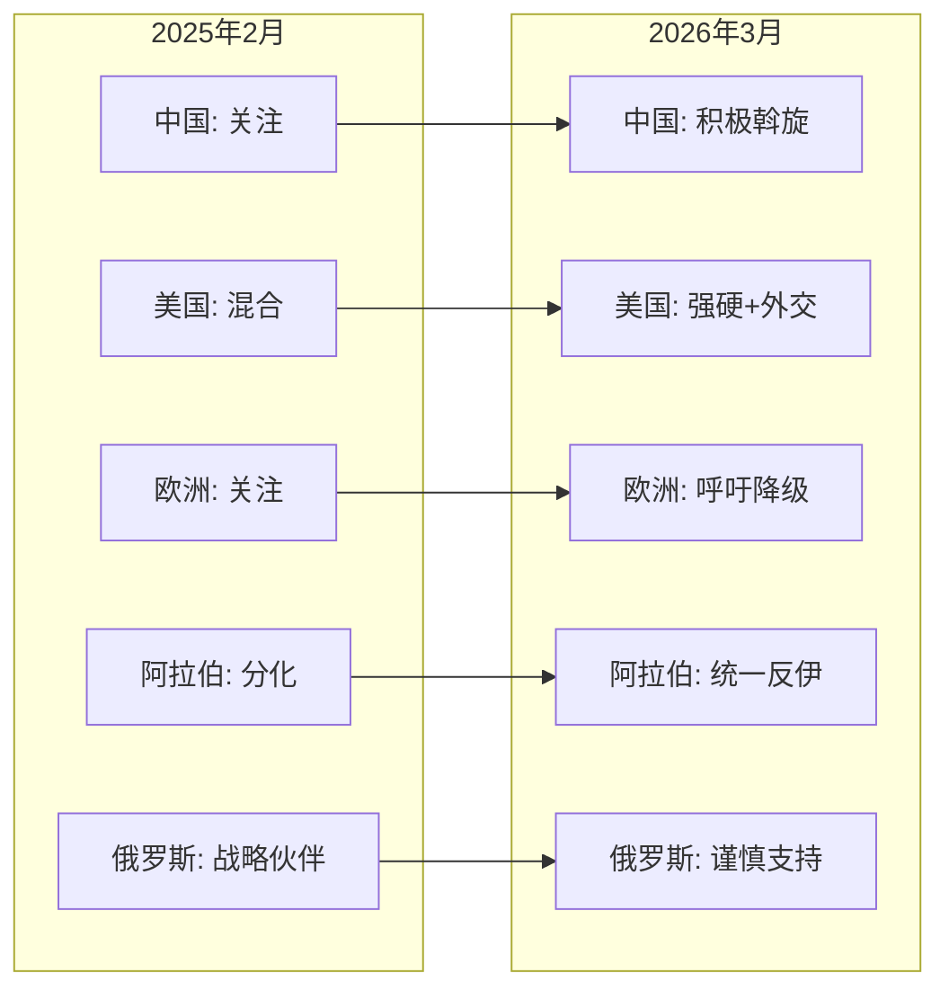

# 伊朗局势全球媒体分析报告

**报告日期**: 2026年3月29日  
**分析时间范围**: 2025年2月28日 - 2026年3月29日  
**报告类型**: 世界主要媒体分析

---

## 执行摘要

自2025年2月28日以来，全球对伊朗的态度经历了显著变化。本报告分析了中文、英文、阿拉伯语、欧洲主要语言（法语、德语、西班牙语）以及俄语互联网世界对伊朗冲突的报道和立场变化。

**核心发现**:
- **中文世界**: 中国政府立场从一般性关注转向更明确的外交斡旋，谴责单边军事行动
- **西方世界**: 美欧立场分化，美国采取强硬姿态，欧洲呼吁降级和外交解决
- **阿拉伯世界**: 海湾国家形成更统一的反伊朗立场，但阿曼、卡塔尔强调外交途径
- **俄罗斯**: 在保持战略合作的同时采取谨慎态度，避免直接军事介入

---

## 一、中文世界媒体分析

### 1.1 中国官方立场

**新华社** (2026年3月6日)
- 发表三篇评论谴责美以对伊动武
- 立场: 谴责"穷兵黩武的霸权行径"，呼吁遵守国际法
- 来源: http://www.news.cn/20260306/9c6c2ffaf8534040b139691d83799164/c.html

**环球时报** (2026年3月2日、3月6日)
- 伊朗提出"三步走"降级方案
- 专家分析美以冲突可能陷入"消耗战"
- 来源: https://www.globaltimes.cn/page/202603/1356709.shtml

**人民日报** (2026年3月16日、3月27日)
- 发表锐评反驳西方"祸水东引"论调
- 呼吁美伊重返谈判桌
- 来源: http://opinion.people.com.cn/n1/2026/0316/c436867-40682980.html

### 1.2 中国外交部表态

| 日期 | 表态内容 | 来源 |
|------|----------|------|
| 2026年3月2日 | 呼吁立即停止军事行动，尊重主权 | https://www.mfa.gov.cn/fyrbt_673021/202603/t20260302_11867202.shtml |
| 2026年3月4日 | 强调保护中国公民安全，支持多边外交 | https://www.mfa.gov.cn/fyrbt_673021/202603/t20260304_11868732.shtml |
| 2026年3月19日 | 重申停止敌对行动，支持中国斡旋努力 | https://www.mfa.gov.cn/fyrbt_673021/202603/t20260319_11877656.shtml |

### 1.3 中国社交媒体态度
- WhatsonWeibo分析显示中国网民对伊朗问题存在激烈辩论
- 主流态度倾向支持降级和外交解决，批评西方"丛林法则"
- 部分民族主义声音支持伊朗主权立场

**中文世界立场变化趋势**: 从一般性关注 → 更积极外交斡旋 → 更强硬谴责单边行动

---

## 二、英语世界媒体分析

### 2.1 美国媒体

**纽约时报** (2026年3月22日)
- 报道德黑兰在特朗普威胁电厂后的强硬姿态
- 立场: 关注冲突升级和领导层动态
- 来源: https://nyti.ms/4bEoVmr

**华尔街日报** (2026年3月9日)
- 社论: "伊朗没有赢得这场战争"
- 立场: 强硬派立场，质疑降级可能性
- 来源: https://on.wsj.com/4ljVquN

**美联社** (2026年3月27日)
- 分析: 伊朗使用游击战术对抗美以
- 关注人道主义和经济影响
- 来源: https://apnews.com/article/iran-us-israel-war-analysis-23fb5978ef583308f0da4228a9a02c66

### 2.2 英国媒体

**BBC** (2026年3月24-25日)
- 报道伊朗拒绝美国谈判提议
- 提供全面背景分析和实地报道
- 来源: https://www.bbc.co.uk/news/articles/cgrlwk29ppzo

**路透社** (2026年3月28日)
- 分析: 伊朗战争一个月，特朗普面临艰难选择
- 独家报道伊朗新领导人拒绝降级提议
- 来源: https://www.reuters.com/world/middle-east/one-month-into-iran-war-only-hard-choices-trump-2026-03-28/

### 2.3 美英官方表态

**美国国务院** (2026年3月1日)
- 发布关于伊朗导弹和无人机袭击的联合声明
- 来源: https://www.state.gov/releases/office-of-the-spokesperson/2026/03/joint-statement-on-irans-missile-and-drone-attacks-in-the-region

**白宫** (2026年3月)
- "通过实力实现和平"姿态，混合军事威慑与外交信号
- 来源: https://www.whitehouse.gov/releases/2026/03/americas-warriors-are-obliterating-iranian-terror-regime-with-unrelenting-force/

**英国政府** (2026年3月1日、3月23日)
- E3领导人联合声明谴责伊朗攻击
- 召见伊朗驻英大使
- 来源: https://www.gov.uk/government/news/joint-e3-leaders-statement-on-iran-1-march-2026

**英语世界立场变化趋势**: 从混合立场 → 更强硬威慑姿态 → 同时保持外交渠道

---

## 三、阿拉伯语世界媒体分析

### 3.1 主要媒体报道

**半岛电视台阿拉伯语** (2026年3月3日、3月16日)
- 分析战争进入第二阶段，是否以推翻伊朗政权为目标
- 卡塔尔呼吁伊朗停止攻击以便外交解决
- 来源: https://www.aljazeera.net/politics/2026/3/3/

**天空新闻阿拉伯语** (2026年3月16日、3月17日)
- 分析伊朗攻击暴露海湾国家优先事项
- 报道西方在伊朗问题上的分歧
- 来源: https://www.skynewsarabia.com/middle-east/1858992

**BBC阿拉伯语** (2026年3月4日、3月12日、3月26日)
- 海湾国家研究对伊朗攻击的回应
- 分析为什么伊朗持续攻击海湾国家
- 来源: https://www.bbc.com/arabic/articles/cg7ee11vvm7o

**路透社阿拉伯语** (2026年3月3日、3月7日)
- 事实报道伊朗向海湾国家发射导弹和无人机
- 独家: 沙特警告伊朗若继续攻击可能报复
- 来源: https://www.reuters.com/ar/world/

### 3.2 海湾国家官方表态

| 日期 | 国家/组织 | 表态内容 | 来源 |
|------|-----------|----------|------|
| 2026年3月1日 | GCC | 谴责伊朗对海湾国家的攻击 | https://www.spa.gov.sa/en/N2526020 |
| 2026年3月16日 | GCC/英国 | 联合声明谴责伊朗攻击 | http://www.thepeninsulaqatar.com/article/16/03/2026/ |
| 2026年3月22日 | 沙特 | 驱逐伊朗外交官 | https://spa.gov.sa/en/N2543729 |
| 2026年3月3日 | 阿曼 | 呼吁立即停火，强调外交途径 | https://www.aljazeera.com/news/2026/3/3/ |
| 2026年3月16日 | 卡塔尔 | 呼吁伊朗停止攻击以便外交解决 | https://www.aljazeera.net/news/2026/3/16/ |

### 3.3 阿拉伯语社交媒体态度
- Arab Barometer调查显示中东民众对伊朗领导人持怀疑/负面态度
- 海湾社交媒体普遍支持政府反伊朗立场
- 部分声音呼吁外交解决，反对进一步升级

**阿拉伯世界立场变化趋势**: 从各怀立场 → 更统一反伊朗立场 → 同时强调外交途径

---

## 四、欧洲主要语言媒体分析

### 4.1 法语媒体

**世界报** (2026年3月28日)
- "伊朗战争: 以色列和海湾国家担心美国仓促退出"
- 关注危机管理和降级必要性
- 来源: https://www.lemonde.fr/en/international/article/2026/03/28/war-in-iran-israel-and-gulf-states-fear-a-hasty-us-exit_6751884_4.html

**Ifop民调** (2026年3月6日)
- 法国民众对伊朗冲突的看法
- 表现出对局势升级的担忧
- 来源: https://www.ifop.com/en/article/the-french-view-of-the-conflict-in-iran

### 4.2 德语媒体

**明镜周刊** (2026年3月9日、3月12日、3月22日、3月29日)
- "2026年伊朗战争: 这场战争的无计划性是对世界的危险"
- 分析政治动态推动的冲突升级
- 来源: https://www.spiegel.de/ausland/irankrieg-2026-die-planlosigkeit-dieses-kriegs-ist-eine-gefahr-fuer-die-welt-a-a8b5969c-35c5-4d7d-a52c-c67de749f5d6

**德国之声** (2026年3月6日)
- 德国民众多数反对伊朗战争，感到受威胁
- 来源: https://www.dw.com/en/germany-majority-opposes-war-on-iran/a-76244293

### 4.3 西班牙语媒体

**国家报** (2026年2月28日、3月28日、3月29日)
- "特朗普和内塔尼亚胡对伊朗的战争: 30天混乱和不确定的未来"
- 关注美以行动和地区动态
- 来源: https://elpais.com/internacional/2026-03-29/la-guerra-de-trump-y-netanyahu-contra-iran-30-dias-de-caos-y-un-futuro-incierto.html

### 4.4 欧盟官方表态

| 日期 | 机构 | 表态内容 | 来源 |
|------|------|----------|------|
| 2026年3月1日 | 欧盟 | 中东事态发展声明 | https://www.esteri.it/it/sala_stampa/archivionotizie/comunicati/2026/03/ |
| 2026年3月5日 | GCC-欧盟 | 联合声明谴责伊朗攻击海湾国家 | https://north-africa-middle-east-gulf.ec.europa.eu/news/ |
| 2026年3月17日 | 欧盟外交政策负责人 | 呼吁美以结束伊朗战争 | https://www.reuters.com/world/europe/eu-foreign-policy-chief-kallas-calls-us-israel-end-iran-war-2026-03-17/ |
| 2026年3月19日 | 欧盟高级代表 | 欧洲理事会门口讲话 | https://www.eeas.europa.eu/eeas/european-council-doorstep-remarks-high-representative-kaja-kallas-en |

**欧洲立场变化趋势**: 从关注 → 更积极呼吁降级和外交 → 强调人道主义关切

---

## 五、俄语媒体分析

### 5.1 俄罗斯官方立场

**塔斯社** (2026年2月28日、3月2日、3月6日、3月24日)
- 俄罗斯谴责美以在谈判掩护下攻击伊朗
- 克里姆林宫表示与伊朗领导层保持对话
- 警告里海地区冲突外溢"极其负面"
- 来源: https://en.tass.ru/politics/2093401

**RT** (2026年3月6日)
- "莫斯科: 美以对伊战争没有正当理由"
- 来源: https://www.rt.com/russia/634021-iran-posed-no-threat-us-israel-moscow-zakharova/

### 5.2 俄罗斯-伊朗战略合作

**关键时间线**:

| 日期 | 事件 | 来源 |
|------|------|------|
| 2025年1月17日 | 俄伊签署全面战略伙伴关系条约 | 俄伊双方报道 |
| 2025年4月8日 | 俄罗斯国家杜马批准条约 | https://ria.ru/20250408/gosduma-2010011451.html |
| 2025年4月21日 | 普京签署批准法律 | https://crimea.ria.ru/20250421/putin-ratifitsiroval-dogovor-o-strategicheskom-partnerstve-s-iranom-1145846368.html |
| 2025年5月18日 | 伊朗议会批准条约 | https://ria.ru/20250518/iran-2017694606.html |
| 2026年2月18日 | 伊朗总统称坚定推进战略伙伴关系 | https://tass.com/world/2088503 |
| 2026年2月28日 | 伊朗称与俄中保持密切接触 | https://en.tass.ru/world/2093691 |

### 5.3 西方对俄伊关系的分析

**路透社** (2026年3月5日)
- "孤立且遭受攻击: 伊朗在俄罗斯和中国袖手旁观时出击"
- 分析俄中在危机中的谨慎态度
- 来源: https://www.reuters.com/world/middle-east/isolated-under-fire-iran-strikes-out-russia-china-stand-aside-2026-03-05/

**德国之声** (2026年3月4日)
- "伊朗和俄罗斯应该是盟友，为什么莫斯科不来帮助德黑兰？"
- 来源: https://www.dw.com/en/iran-and-russia-are-supposed-to-be-allies-so-why-is-moscow-not-coming-to-tehrans-aid/a-76214840

**俄罗斯立场变化趋势**: 从深化战略合作 → 谴责西方攻击但保持距离 → 避免直接军事介入

---

## 六、全球支持伊朗态度变化总览

### 6.1 态度变化图表

### 6.2 全球态度变化表

| 地区 | 2025年2月28日态度 | 2026年3月态度 | 变化方向 | 关键驱动因素 |
|------|-------------------|---------------|----------|--------------|
| **中文世界** | 关注+支持降级 | 积极斡旋+谴责单边行动 | 更积极 | 维护主权原则，反对西方霸权 |
| **美国** | 混合立场 | 强硬威慑+寻求外交 | 更强硬 | 军事压力，国内政治 |
| **欧洲** | 关注 | 呼吁降级+人道主义关切 | 更积极 | 战争成本，民众反对 |
| **海湾国家** | 分化 | 统一谴责+外交途径 | 更强硬 | 自身安全受威胁 |
| **其他阿拉伯国家** | 分化 | 关注+呼吁克制 | 降级 | 避免地区动荡 |
| **俄罗斯** | 战略伙伴 | 谴责西方+保持距离 | 谨慎 | 避免卷入，战略利益 |

### 6.3 核心结论

1. **全球态度呈两极分化**: 支持伊朗的阵营（中国、俄罗斯、部分中东声音）与反对伊朗的阵营（美欧、海湾国家）之间的分歧加深
2. **外交呼声上升**: 尽管立场对立，但几乎所有方面都在呼吁外交解决
3. **地区安全成为焦点**: 海湾国家安全问题成为阿拉伯世界态度的关键驱动力
4. **俄罗斯战略模糊**: 俄在保持战略合作的同时避免直接军事介入

---

## 七、数据来源汇总

| 类别 | 主要来源 | 数量 |
|------|----------|------|
| 中文媒体 | 新华社、环球时报、人民日报 | 6篇 |
| 英文媒体 | NYT、WSJ、BBC、Reuters、AP | 10篇 |
| 阿拉伯媒体 | 半岛电视台、天空新闻阿拉伯语、BBC阿拉伯语 | 8篇 |
| 欧洲媒体 | 世界报、明镜周刊、国家报、德国之声 | 7篇 |
| 俄语媒体 | 塔斯社、RT、俄新社 | 6篇 |
| 官方声明 | 中美欧俄及海湾国家外交部 | 15份 |
| 民调/研究 | Pew、Ifop、Arab Barometer | 4份 |

---

**报告编制**: AI分析系统  
**数据截止**: 2026年3月29日  
**下一步行动**: 可扩展为更详细的地区专题分析
