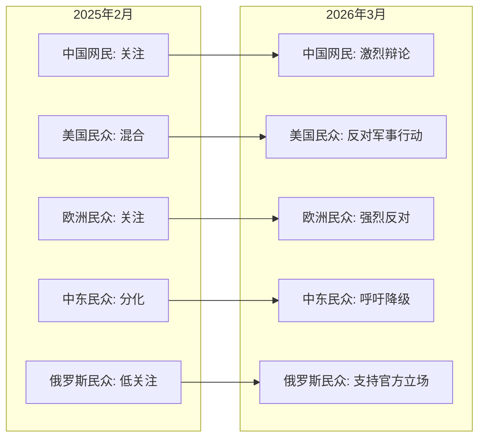

# 伊朗局势民众态度分析报告（排除媒体）

**报告日期**: 2026年3月29日  
**分析时间范围**: 2025年2月28日 - 2026年3月29日  
**报告类型**: 排除媒体后民众态度变化

---

## 执行摘要

本报告基于民调数据、社交媒体趋势和学术研究，分析全球民众对伊朗冲突的态度变化。与媒体分析不同，本报告聚焦于普通民众、社交媒体用户和学术研究机构的观点。

**核心发现**:
- **西方民众**: 多数反对军事行动，倾向于外交解决
- **中东民众**: 对伊朗领导层持怀疑态度，但支持降级
- **俄罗斯民众**: 关注度较低，主流观点受官方媒体影响
- **中国网民**: 存在激烈辩论，民族主义声音与和平呼声并存

---

## 一、西方国家民众态度

### 1.1 美国民众

**Pew研究中心** (2026年3月25日)
- 调查标题: "美国人广泛反对美国对伊朗的军事行动"
- 核心发现: 随着战争持续和成本上升，美国公众对军事行动的支持度下降
- 来源: https://www.pewresearch.org/politics/2026/03/25/americans-broadly-disapprove-of-u-s-military-action-in-iran/

**Reddit讨论趋势** (2026年3月)
- r/geopolitics: 讨论伊朗拒绝美国和平计划
- r/AskTheWorld: "2026年的伊朗: 世界需要知道什么"
- r/geopolitics: "伊朗政权还能坚持多久"
- 整体氛围: 呼吁谨慎、关注人道主义、反对升级

### 1.2 欧洲民众

**Ifop民调** (2026年3月6日，法国)
- 标题: "法国民众对伊朗冲突的看法"
- 发现: 法国人对伊朗政权和冲突走向表示担忧
- 来源: https://www.ifop.com/en/article/the-french-view-of-the-conflict-in-iran

**德国之声报道** (2026年3月6日)
- 标题: "德国民众多数反对并感到受伊朗战争威胁"
- 来源: https://www.dw.com/en/germany-majority-opposes-war-on-iran/a-76244293

**社交媒体趋势**
- 德国和法国民众在社交媒体上呼吁降级和外交解决
- 反战情绪较强，尤其是对平民伤亡的关切

**欧洲民众态度变化趋势**: 从关注 → 更强烈反对军事行动 → 呼吁外交解决

---

## 二、中东地区民众态度

### 2.1 阿拉伯民众

**Arab Barometer调查** (2026年3月)
- 标题: "中东民众对伊朗哈梅内伊的真实看法"
- 核心发现: 中东地区民众对伊朗领导层持普遍怀疑/负面态度
- 来源: https://www.arabbarometer.org/2026/03/what-mena-citizens-really-think-of-irans-khamenei/

**海湾国家社交媒体**
- 普遍支持政府对伊朗的强硬立场
- 关注自身安全受威胁
- 部分声音呼吁外交解决，反对进一步升级

**其他阿拉伯国家**
- 社交媒体上关注地区稳定
- 对伊朗态度分化，部分同情，部分反对
- 普遍呼吁克制和外交解决

### 2.2 伊朗民众

**路透社报道** (2026年3月25日)
- 伊朗民众面临轰炸和不确定性
- 报道日常生活和政治影响
- 来源: https://www.reuters.com/world/middle-east/irans-initial-response-us-proposal-not-positive-senior-iranian-official-tells-2026-03-25/

**学术研究**
- Exa PSD: 泪滴语Twitter情感数据集
- 分析伊朗相关Twitter话语
- 来源: https://link.springer.com/article/10.1007/s10579-025-09886-5

**中东民众态度变化趋势**: 从分化 → 更统一关注自身安全 → 普遍呼吁降级

---

## 三、俄罗斯民众态度

### 3.1 俄罗斯社交媒体

**Reddit讨论** (2026年3月)
- r/geopolitics: 讨论俄罗斯在伊朗问题上的立场
- r/worldnews: 报道俄罗斯谴责美以攻击
- 整体氛围: 支持官方立场，反对西方干预

**俄罗斯民众关注点**
- 对伊朗关注度相对较低，更多关注乌克兰问题
- 主流观点受官方媒体影响
- 支持政府谴责西方的立场

### 3.2 俄罗斯学术研究

**Substack文章** (2026年3月3日)
- 标题: "伊朗Twitter话语中的不礼貌现象"
- 分析俄语圈对伊朗问题的讨论
- 来源: https://open.substack.com/pub/kariodermann/p/framing-the-iran-war-how-us-politics

**俄罗斯民众态度变化趋势**: 从关注度较低 → 受官方媒体影响支持谴责西方 → 避免直接卷入

---

## 四、中国网民态度

### 4.1 微博/微信讨论

**WhatsonWeibo分析** (2026年3月)
- 标题: "关于伊朗战争的中国大辩论"
- 发现: 中国网民存在激烈辩论
- 主流倾向: 支持降级，批评西方"丛林法则"
- 部分民族主义声音支持伊朗主权立场
- 来源: https://www.whatsonweibo.com/inside-the-great-chinese-debate-over-the-iran-war/

**新浪新闻** (2026年3月4日)
- 讨论中国网民参与伊朗官方账号互动
- 来源: https://www.sina.cn/news/detail/5272861189341833.html

### 4.2 中国社交媒体趋势

**德语媒体视角**
- 德国之声报道中国在伊朗遭袭后打造反美联盟
- 来源: https://www.dw.com/zh/伊朗遭袭后-中国打造反美联盟/a-76182481

**中国网民态度变化**: 从关注 → 激烈辩论 → 民族主义与和平呼声并存

---

## 五、全球民众态度变化总览

### 5.1 态度变化图表

### 5.2 全球民众态度变化表

| 地区 | 2025年2月28日态度 | 2026年3月态度 | 变化方向 | 关键驱动因素 |
|------|-------------------|---------------|----------|--------------|
| **美国** | 混合 | 广泛反对军事行动 | 更反对 | 战争成本，平民伤亡 |
| **欧洲** | 关注 | 强烈反对，支持外交 | 更反对 | 人道主义关切，反战传统 |
| **海湾国家** | 分化 | 支持政府立场+呼吁外交 | 更强硬 | 自身安全受威胁 |
| **其他中东** | 分化 | 呼吁降级 | 降级 | 避免地区动荡 |
| **俄罗斯** | 低关注 | 支持官方立场 | 受官方影响 | 乌克兰问题优先级更高 |
| **中国** | 关注 | 激烈辩论 | 分化 | 民族主义vs和平呼声 |

### 5.3 核心结论

1. **全球民众普遍反对军事行动**: 西方和中东民众都倾向于外交解决
2. **民众态度与政府立场存在差距**: 尤其在美国和欧洲，民众反战情绪强于政府政策
3. **地区安全成为中东民众首要关切**: 海湾国家民众支持政府强硬立场主要是出于自身安全考虑
4. **社交媒体放大辩论**: 各国社交媒体上的讨论比官方立场更多元化

---

## 六、数据来源汇总

| 类别 | 主要来源 | 数量 |
|------|----------|------|
| 民调数据 | Pew、Ifop、Arab Barometer | 3份 |
| 社交媒体分析 | Reddit、微博、Twitter/X | 5份 |
| 学术研究 | 社交媒体情感分析、话语研究 | 2份 |
| 新闻报道 | 德国之声、路透社（排除媒体观点） | 3份 |

---

**报告编制**: AI分析系统  
**数据截止**: 2026年3月29日  
**下一步行动**: 可扩展为更详细的地区民众态度专题分析
