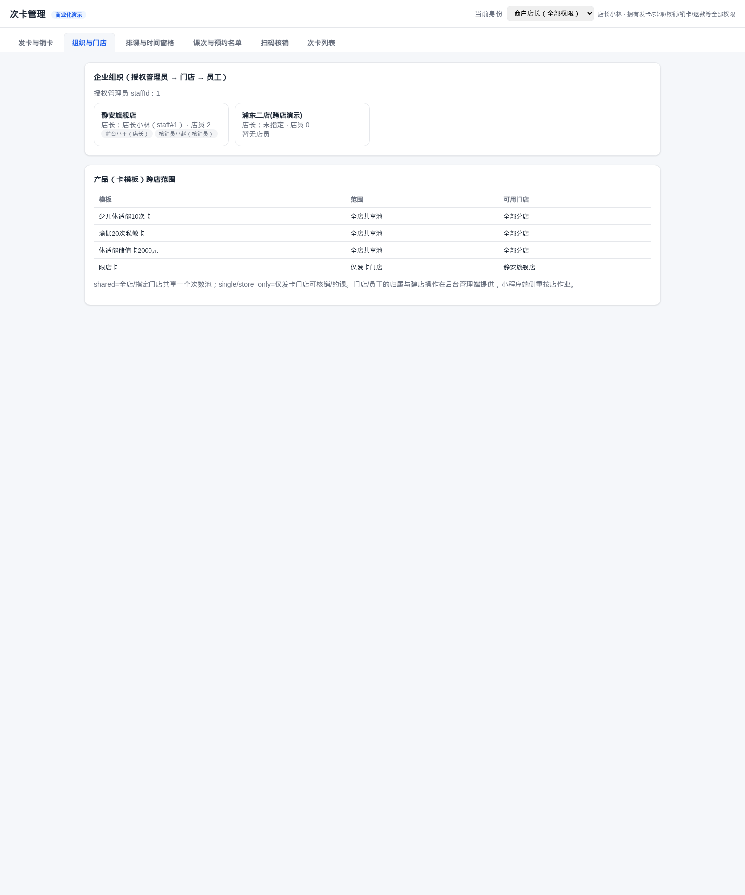

# 企业端 v3 M1 · 多门店门店层级与跨店范围 · 开发验收说明

**日期：2026-09-05** · 载体：`code/card-counter-commercial`（网页版演示仓，先行实现自验）
**结论：M1 完成，全量测试 85/85 通过（新增 8 个 v3 用例），真机冒烟通过。**
> 追加（收尾）：店员管理接口 `POST /api/merchant/staff`（kind=clerk/front/store_manager）与 `PATCH /api/merchant/staff/<id>`（调店 storeId / 设店长 managerOfStore），网页「组织与门店」加入建店员表单；越权（核销员调接口）403。

---

## 1. 本阶段交付（对照 v3 方案 D1–D4）
| 决策 | 交付 |
|---|---|
| D2 三级角色 | `Merchant.admins`(授权管理员可多个)、`MerchantStore.managerStaffId`(店长)、`Staff.storeId`(员工归属门店)；单店演示：admin=店长=staff1 |
| D3 跨店池(混合) | 模板 `storeScope`：`shared`(默认，全店/指定门店共享一池) / `single`(仅发卡门店) / `store_only`(门店专属池=门店独立计数)；`allowedStoreIds`(shared 限定门店)；`poolMode` 预留 |
| D4 按店校验 | 发卡：single/store_only 必须带门店(否则 400"需先绑定门店")；核销：`storeId`(默认员工归属店) 与卡模板范围比对，跨店 409；预约：约课门店需落在卡模板范围(跨店卡约他店课 409) |
| D1 平台层 | 本期不做（Web 后台待 M3）；本期聚焦租户内 + 顾客端可用门店 |

新增面向展示：顾客端 `/api/cards/mine` 每张卡返回 `storeScope/usableStoreIds/usableStoreNames`；新增 `GET /api/merchant/tree`（管理员视角组织树 + 模板范围）。

## 2. 改动文件
- `models.py`：Merchant.admins / MerchantStore.managerStaffId / Staff.storeId / CardTemplate.storeScope+allowedStoreIds+poolMode（均可空/默认，向后兼容）
- `seed.py`：企业1 admins=[1]、门店1 manager=owner、员工归属门店
- `services/store_scope.py`（新）：范围判定 `template_allows_store/assert_store_allowed/allowed_store_ids`
- `services/card.py`：create_template 范围字段；issue_card 带 store_id 并校验 single/store_only 绑店；redeem(_by_token/_by_card/_redeem) 带 store_id 校验
- `services/booking.py`：预约按会话门店与卡模板范围校验
- `routes/__init__.py`：redeem 传 storeId(默认员工店)；模板列表带范围字段；新增 `GET /api/merchant/tree`
- `web/app.js`：新增商户 Tab「组织与门店」（组织树+模板范围）；发卡/核销增加门店选择；学员「我的次卡」显示可用门店

## 3. 自动化验证（83/83）
新增 `TestTenantStoreScope`×6：
1. single 卡：他店核销 409（"不可在门店"）→ 本店核销 200 扣1次；
2. shared 全店跨店可核销；shared+allowedStoreIds=[店1] → 店2 409；
3. 店2 的 single 卡约店1 课次 → 409；
4. 未绑门店的 single 模板直接发卡 → 400；
5. 顾客端 mine：single 卡 usable=[店1] 含店名；全店共享卡 usable=[店1,店2]；
6. `/api/merchant/tree`：admins=[1]、门店含店长与归属员工、模板带范围字段。

原 77 用例无回归。

## 4. 演示服务冒烟（http://127.0.0.1:8090，新代码+全新库）
```
GET /api/merchant/tree          → admins [1]; 门店1 静安旗舰店 manager 店长小林; tpls 3
建店2(浦东二店)                   → ok
建模板 single(店1) + 发卡给顾客1  → active
跨店核销(storeId=店2)             → 409 卡#4不可在门店#2使用（模板范围：仅发卡门店）
本店核销(storeId=店1)             → 200 deduct 1
GET /api/cards/mine              → 该卡 usableStoreIds [1] usableStoreNames ['静安旗舰店']
```
UI 实拍：「组织与门店」Tab 展示 授权管理员/门店-店长-员工树 与 各模板范围。



## 5. 后续
- M2：正式企业端小程序按此模型接入（等你注册的新 AppID + 员工 openid 登录接口）。
- 待增强（M3/后续）：平台 Web 后台(建企业/授权/停用)、模板级门店额度拆分(poolMode=split)、门店管理员 UI 建店建店员（当前 seed/接口预置，管理动作做接口预留）、树接口分页。
