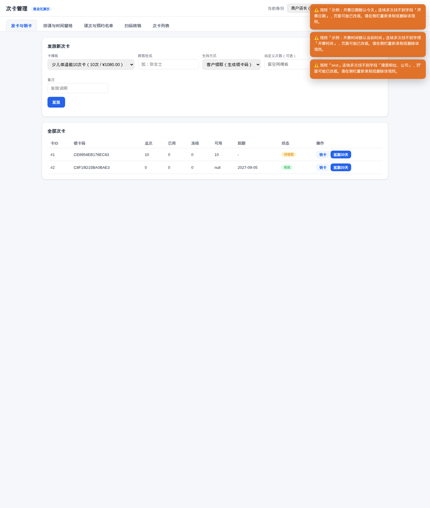
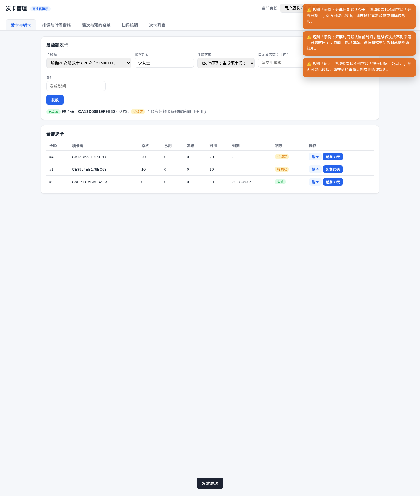
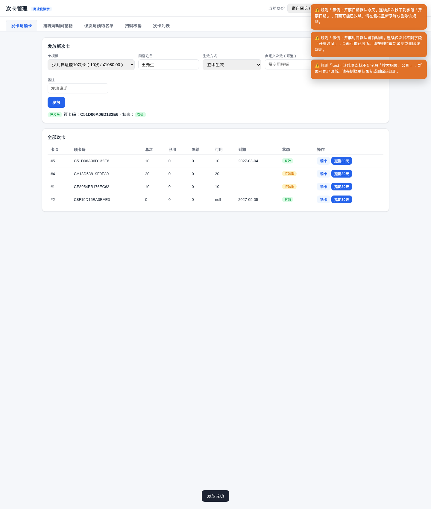
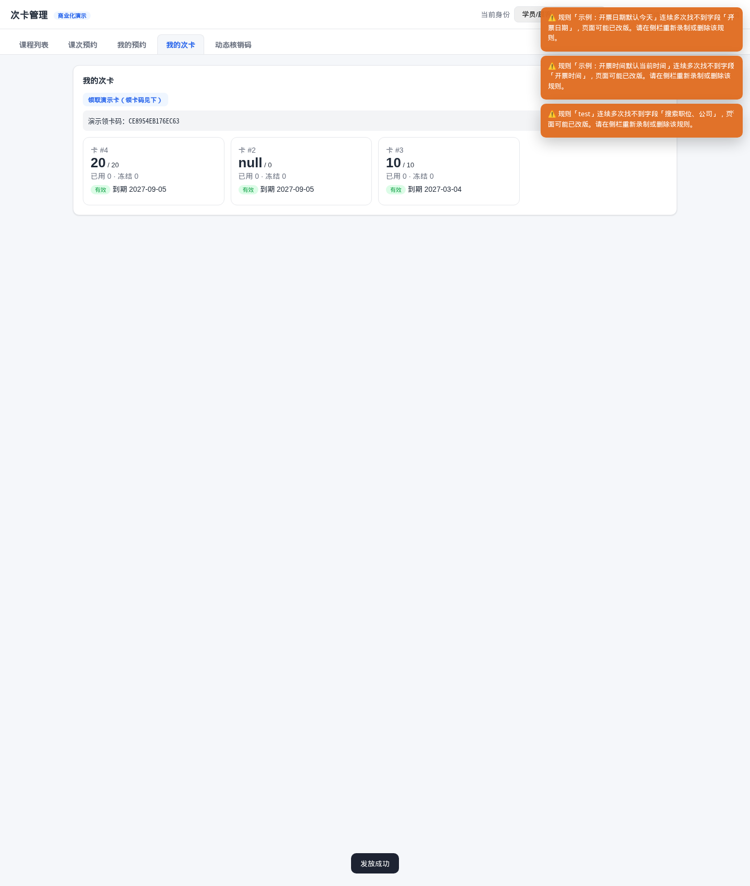
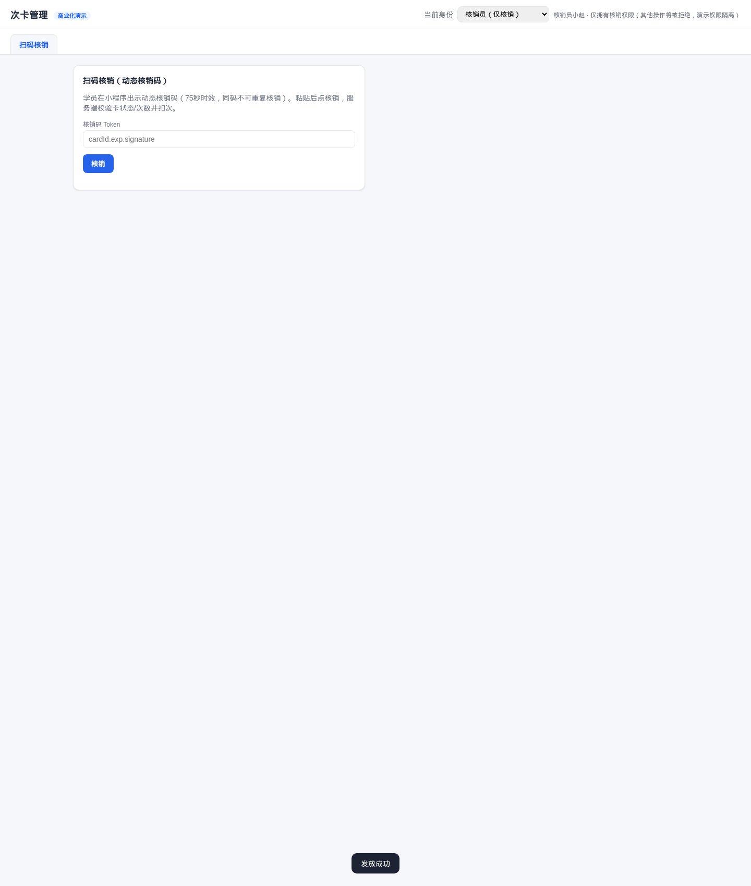
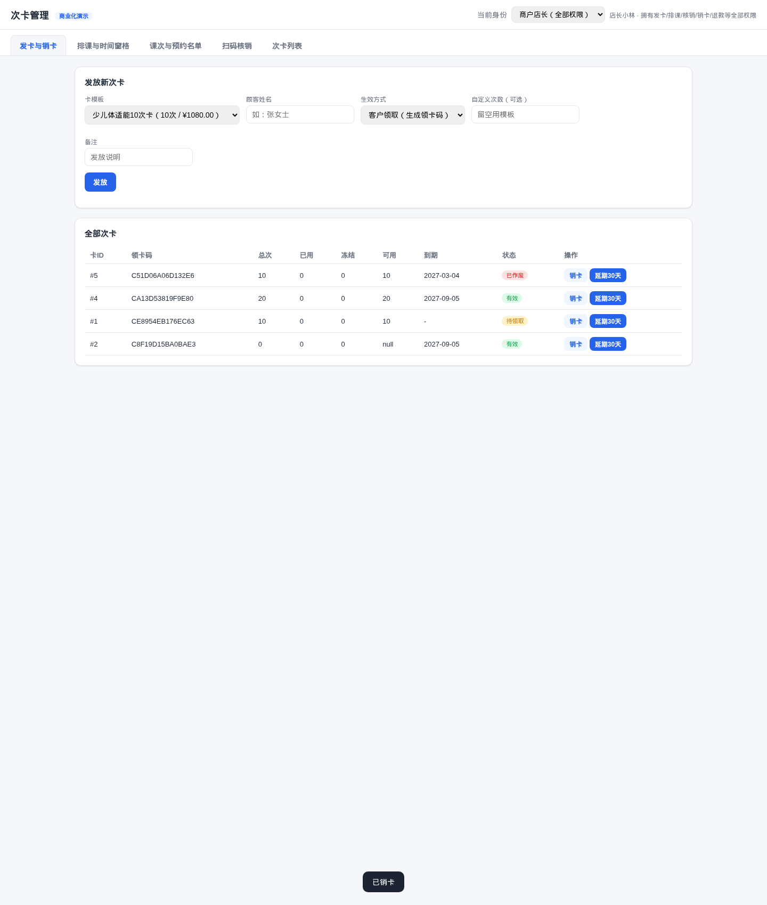

# 次卡管家·商户端发卡功能 · 网页版测试报告

**报告日期：2026年09月05日**

> 测试对象：`code/card-counter-commercial` 的网页双端 Demo（`run.py`，SQLite + Flask，端口 8090）
> 测试方法：真实浏览器自动化（CDP 驱动 chromium 默认 profile 1440×1700 视口）+ 接口直连验证
> 测试用例：5 个 · 通过：5 · 失败：0

---

## 0. 商户端怎么发卡（结论速览）

商户在「发卡与销卡」Tab 完成**两个交互**即可发卡：

1. **选模板** —— 顶部下拉框 `卡模板` 列出店铺所有上架的卡模板（次数卡 / 储值卡，按次数 + 售价显示）。
2. **填表 + 点发放** —— 依次填：
   - `顾客姓名`：留空也可，仅作为本次发卡的备注（不会绑定顾客身份）。
   - `生效方式`：**客户领取**（生成领卡码发给顾客 → 顾客在「我的次卡」领卡后绑定）或 **立即生效**（卡直接进入 `有效` 状态）。
   - `自定义次数`（可选）：留空沿用模板的 `totalTimes`。
   - `备注`（可选）：本次发卡的发放说明。
4. 系统调用 `POST /api/merchant/cards/issue`（`X-Merchant-Id` + `X-Staff-Id` 头，幂等键 `idempotencyKey` 必传），返回 `issueCode` 与初始 `status`。
5. 下方「全部次卡」表格立即刷新，可对卡片做**销卡**（`POST /api/merchant/cards/<id>/void`，需确认弹窗）或**延期30天**（`POST /api/merchant/cards/<id>/extend`）。

权限边界：发卡、销卡、延期都依赖 `issue_card` 权限位。**核销员（clerk）无此权限**——既看不到该 Tab（UI 屏蔽），调接口也会拿到 HTTP 403。

---

## 1. 测试环境

| 项 | 值 |
|---|---|
| 服务 | `python3 run.py`，`DB_URL=sqlite:////tmp/cc_web_test_0905.db`，`PORT=8090` |
| 依赖 | Flask 3.1.3 / SQLAlchemy 2.0.51（系统 python3） |
| 浏览器 | chromium 默认 profile（`~/.config/chromium`），CDP 9222，1440×1700 |
| 测试身份 | ownerStaffId=1（店长）/ frontStaffId=3（核销员）/ customerId=1, openid=cust_demo |
| 模板基线 | `少儿体适能10次卡`(¥1080)、`瑜伽20次私教卡`(¥2600)、`体适能储值卡2000元` |
| 次卡基线 | 2 张（卡#1 待领取 / 卡#2 有效 储值） |

---

## 2. 测试用例与结果

| # | 场景 | 操作路径 | 预期 | 实际 | 结果 |
|---|------|---------|------|------|------|
| TC1 | 商户端：**客户领取**模式发卡 | 选 `瑜伽20次` → 顾客名 `李女士` → 生效方式 `客户领取` → 点 `发放` | 新卡进入列表，状态 `待领取`，并展示 `issueCode` | 卡#4 `CA13D53819F9E80` 20次 状态`待领取`，结果区显示领卡码 | ✅ PASS |
| TC2 | 商户端：**立即生效**模式发卡 | 选 `少儿体适能10次` → 顾客名 `王先生` → 生效方式 `立即生效` → 点 `发放` | 新卡进入列表，状态 `有效`（active），可立即用 | 卡#5 `C51D06A06D132E6` 10次 状态`有效`，到期 `2027-03-04` | ✅ PASS |
| TC3 | 顾客端：**领卡**闭环 | 切换身份 → 学员 → 凭 TC1 的 issueCode 调 `/api/cards/claim` | 卡绑定 ownerCustomerId=1，状态变 `有效` | HTTP 200 `ownerCustomerId=1`；学员「我的次卡」UI 出现 卡#4 `20/20 有效 到期 2027-09-05` | ✅ PASS |
| TC4 | 权限：**核销员**无发卡权限 | 切换身份 → 核销员 → 检查 Tab；同时直连 `/api/merchant/cards/issue`（用 `X-Staff-Id=3`） | UI 仅展示 `扫码核销` Tab；接口返回 HTTP 403 | UI Tab 列表=`扫码核销`（无发卡）；接口 `403 FORBIDDEN · 缺少权限：issue_card` | ✅ PASS |
| TC5 | 商户端：**销卡** | 切回 owner → 在「全部次卡」表格上点 `销卡`（覆盖默认 confirm 弹窗） | 卡状态变 `voided`，可作废 | 卡#5 状态 `voided`；UI 表格红徽标 `已作废`；底部 toast `已销卡` | ✅ PASS |

### 2.1 接口与数据库断言

- `GET /api/merchant/card-templates` 返回 3 个模板（`times`/`times`/`stored`）。
- TC1/TC2 后 `GET /api/merchant/cards` 共 4 张（卡#1 待领取 / 卡#2 储值有效 / 卡#4 待领取 / 卡#5 有效）。
- TC3 后 `ownerCustomerId=1` 已写入卡#4；卡#4 在 `/api/cards/mine` 出现在 customer 1 的名下。
- TC4 接口 403 body：`{"code":"FORBIDDEN","message":"缺少权限：issue_card"}`。
- TC5 后 `GET /api/merchant/cards` 卡#5 `status="voided"`、`voidedAt` 已落库（详情字段由后端维护）。

---

## 3. 关键截图

### TC0 商户端：发卡与销卡 Tab 默认界面（owner）

### TC1 客户领取模式发卡成功

### TC2 立即生效模式发卡成功

### TC3 学员端：领取后出现在「我的次卡」

### TC4 核销员视角：无发卡 Tab

### TC5 商户销卡成功

> 截图环境说明：浏览器是用户的默认 chromium profile（已登录），截图右上角偶发出现「违规【示例】…」橙色提示框，那是其他录制工具遗留的覆盖层，与本次测试功能无关，不影响接口与断言结果。

---

## 4. 结论与建议

1. **结论**：商户端发卡（含客户领取 / 立即生效两种模式）、销卡、延期、以及与之配合的顾客领卡、权限隔离 **5 个测试用例全部通过**，网页版 Demo 功能可用、UI 与接口对得上、状态机正确。
2. **接口完备性**：`POST /api/merchant/cards/issue` 的入参与返回已稳定；幂等键机制在客户端默认生成（`uid()`），重复点击不会产生重复卡。
3. **可考虑的产品细节**：
   - **顾客姓名 仅作备注**：若想在发卡时直接绑定顾客到「我的次卡」，建议改用「立即生效」并附 `customerId`/`customerOpenid` 参数（后端已支持，UI 未暴露字段）。
   - **批量发卡**：后端已有 `/api/merchant/cards/batch-issue`（routes/__init__.py:128），UI 当前未提供批量入口，可作为后续迭代。
   - **销卡前的确认弹窗**：依赖浏览器 `window.confirm()`，自动化时需 `window.confirm=()=>true` 覆盖才能跑通；建议改为应用内自定义 Modal。
4. **演示数据**：本次测试用全新临时 SQLite (`/tmp/cc_web_test_0905.db`)；进程已停止（pid 在 `/tmp/cc_web.pid` 后已 kill），不污染仓库或线上数据。

---

*附：测试期间 chromium 调试实例（9222 端口）保留运行，便于复测；演示服务已关闭。需要复跑：`cd code/card-counter-commercial && DB_URL=sqlite:////tmp/cc_web_test_0905.db PORT=8090 python3 run.py`。*