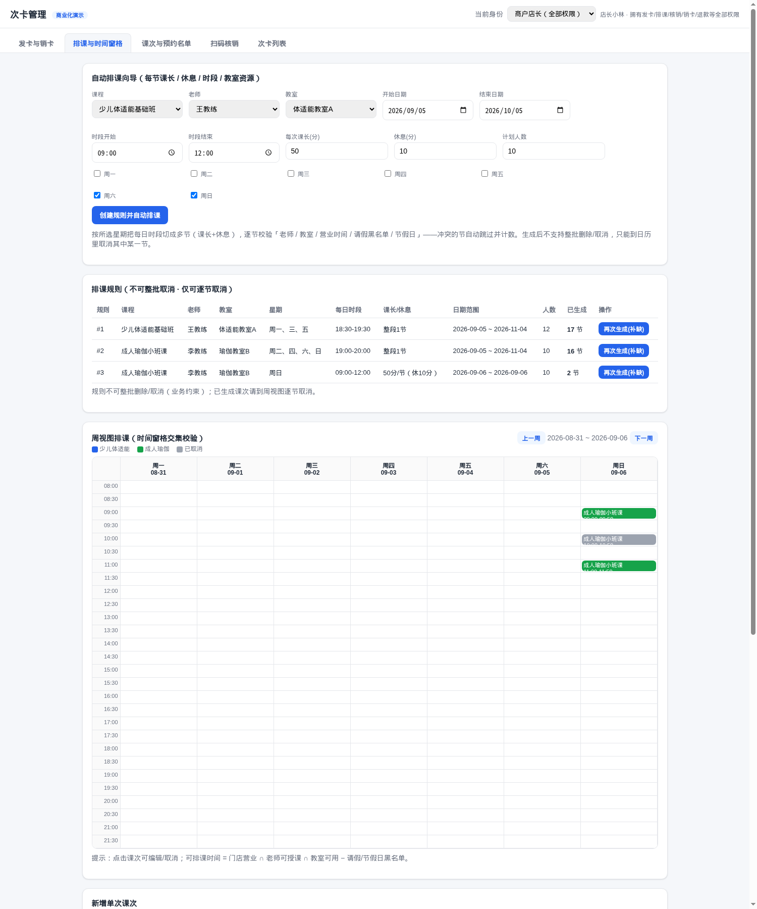
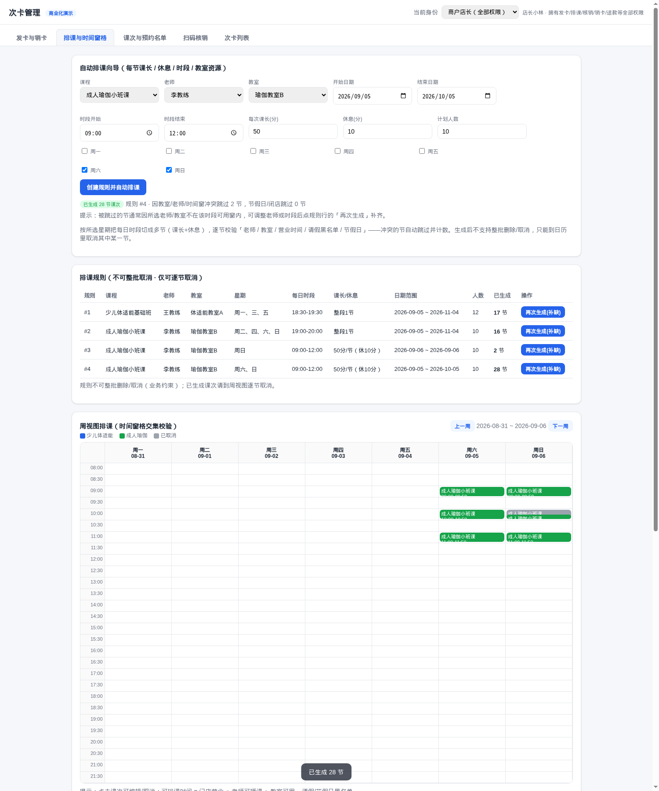

# 次卡管家·排课/预约/签到 · 功能检查与开发验证报告

**报告日期：2026年09月05日**

> 代码仓库：`code/card-counter-commercial`（网页双端 Demo，自包含可跑）
> 结论：现有主链路（单次排课、资源冲突、学员预约、候补、名单签到）已验证可用；按需求补齐了 **自动排课向导（课长/休息/多节切分）、冲突汇总、规则管理、学员日历预约增强、候补自助**。全量测试 **77/77 通过**（新增 8 个用例）。

---

## 1. 需求 → 现状 → 本次改动对照

| # | 你的需求 | 改动前 | 本次改动 | 状态 |
|---|---------|--------|----------|------|
| R1 | 老师按**日历**设 每次课长/开始/结束/休息 → **自动排课** | 仅「每周几+起止时间+起止日期」规则，**无课长/休息字段、无 UI 向导** | `ScheduleRule` 增加 `perSessionMinutes`(每节时长)/`breakMinutes`(休息)，把每日时段切成多节（`create_schedule_rule`/`generate_sessions` 重写）；Web UI 新增**自动排课向导面板** | ✅ 新增 |
| R2 | 教室/老师等**资源冲突为核心** | 冲突校验存在，但批量生成**静默跳过** | 生成改为**逐节校验并计数**：返回 `created / skippedConflicts / skippedHolidays`；UI 展示冲突/节假日跳过数与提示 | ✅ 增强 |
| R3 | 生成后**不可整批取消**，只能取消其中某一节 | 无整批删除/取消接口（天然满足）；单节取消已有 | 规则管理页明确「不可整批删除/取消」，仅保留周视图/课次弹窗逐节取消；补测试验证单节取消不影响同规则其他节 | ✅ 保持并验证 |
| R4 | 学员按**排班日历在线预约 → 确认** | 学员端按日期列表可预约、满员自动候补、预约即确认 | 新增 **候补自助**：`GET /api/my/waitlists`、`POST /api/my/waitlists/<id>/cancel`（重复候补被拦截 409）；`课次预约` 列表区分 已预约/已候补 并可退出候补；`我的预约` 增加候补分栏 | ✅ 增强 |
| R5 | 确认后**签到记录** | 商户名单页手动 签到/未到，落 `AttendanceRecord` + 核销冻结次 | 保持该闭环（预约确认=confirmed，到店签到写考勤+扣次），补自动化测试固化 | ✅ 保持并验证 |

**业务语义（经你确认）**：自动排课=多节切分；预约成功即确认、到店由商户名单签到（不新增商户逐条审核态）。

---

## 2. 后端改动清单

| 文件 | 改动 |
|------|------|
| `src/backend/models.py` | `ScheduleRule` 增加 `perSessionMinutes`(可空,None=旧整段行为)、`breakMinutes` |
| `src/backend/services/schedule.py` | `create_schedule_rule` 接受并落库课长/休息（startDate 支持字符串）；`generate_sessions` 支持多节切分（每日≤10节、逐节 `check_conflicts`、节假日/冲突跳过计数），返回 `{ruleId, created, skippedConflicts, skippedHolidays}`；新增 `list_schedule_rules`（含已生成有效课次数） |
| `src/backend/services/booking.py` | 满员候补**去重**（同人重复占候补→409）；新增 `my_waitlists`、`cancel_waitlist`（越权→403 `Forbidden`） |
| `src/backend/routes/__init__.py` | 新增 `GET /api/merchant/schedule-rules`、`GET /api/my/waitlists`、`POST /api/my/waitlists/<id>/cancel`；规则创建剔除非白名单键；generate 幂等键取 `idempotency_key` |
| `web/app.js` | 「排课与时间窗格」Tab 顶部新增 自动排课向导 + 排课规则面板；学员「课次预约/我的预约」接入候补自助 |

**接口新契约**
```
POST /api/merchant/schedule-rules        # 新增 body: perSessionMinutes, breakMinutes(可选)
GET  /api/merchant/schedule-rules        # 规则列表(含 sessionCount)
POST /api/merchant/sessions/generate     # 返回 {ruleId, created[], skippedConflicts, skippedHolidays}
GET  /api/my/waitlists                   # 我的候补（学员）
POST /api/my/waitlists/<id>/cancel       # 退出候补（学员，越权 403）
```

---

## 3. 测试验证

### 3.1 全量单测：**77/77 通过**（`python3 run_tests.py`）
新增用例：
- `TestScheduleV2Auto`：多节切分生成 3 节且时间轴正确（09:00/10:00/11:00，每节 50 分）；冲突节**跳过并计数=3**；规则列表含课长/休息/已生成数；**单节取消后同规则其余 2 节保留**；旧规则（无课长）回归为整段 1 节。
- `TestBookingWaitlistAttendance`：满员→候补、重复占候补 409、学员自助查看/退出候补；他人取消我的候补 403；商户签到写 `AttendanceRecord(present)`；商户取消整节课→该已确认预约自动取消（cancelType=merchant）。

### 3.2 本地演示服务冒烟（PORT=8090，全新 SQLite）
```
create rule(每节50/休10, 周日 09:00-12:00)   → 200 ruleId=3
generate                                    → created=3, skippedConflicts=0
课次时间                                    → 09:00-09:50 / 10:00-10:50 / 11:00-11:50
规则列表                                    → perSessionMinutes=50, breakMinutes=10, sessionCount=3
取消其中一节(sessionId=中间)                 → 200 cancelled；规则 sessionCount → 2（其余保留）
```
### 3.3 网页版 UI 真机点击（chromium CDP）
- 向导：选 成人瑜伽/李教练/瑜伽教室B、周六日、09:00-12:00、每节50分休10分 → 「创建规则并自动排课」 → **已生成 28 节，教室/老师冲突跳过 2 节**；排课规则面板完整展示 4 条规则（含 2 条新规则）与课长/休息/已生成数。




---

## 4. 网页版操作路径（给商户/学员演示用）

**商户（店长小林）**
1. Tab「排课与时间窗格」→ **自动排课向导**：选课程/老师/教室 → 勾星期 → 填开始~结束日期与每日时段 → 每节课长(分)/休息(分)/计划人数 → 「创建规则并自动排课」→ 看生成与跳过汇总。
2. 「排课规则」表可查看各规则时段/课长/已生成节数，点「再次生成(补缺)」补齐此前冲突跳过的节。
3. 周视图点任意课次 → 弹窗可**编辑**（仅本次/本次及以后/整组）或**取消课次**（仅本节，自动取消已约学员并释放冻结；无整批取消入口）。
4. Tab「课次与预约名单」→ 某课次「预约名单」→ 对已确认学员 签到/未到/取消，候补名单可 递补。

**学员（张女士）**
1. 「课次预约」按近 21 天列出可约课次（含计划/已报名/剩余/候补数）→ 预约（未满即确认、冻结1次；满员提示进入候补）。
2. 「我的预约/我的候补」可自助取消预约或退出候补。

---

## 5. 遗留说明
- 自动排课向导的默认星期为「六、日」，默认课程为列表首个——若所选老师/教室不在该时段可授课窗内，被跳过节会以计数提示，可调整后「再次生成(补缺)」。
- `generate_sessions` 返回值由列表改为 dict（含 created/跳过计数），仅被路由与 seed 消费，已同步；线上生产后端 `card-counter-flask` 未受影响（未引入本次新字段，后续如移植需走迁移）。
- 演示服务仍在 **http://127.0.0.1:8090**（新代码 + 全新演示库），可直接体验。
